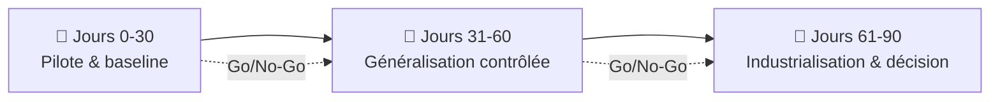

# Checklist de migration 30/60/90 jours

<span class="badge-intermediate">Intermédiaire</span> <span class="badge-expert">Expert</span> <span class="badge-cli">CLI</span>

Migrer une équipe de Copilot vers Claude Code (ou vers un mode hybride) se pilote comme un projet. Ce plan calendaire en trois phases vous évite la bascule « big-bang » risquée et vous donne des **points de décision mesurables** à 30, 60 et 90 jours.

!!! info "À adapter à votre contexte"
    Les durées sont indicatives. Une petite équipe peut compresser le calendrier ; une organisation avec gouvernance stricte l'étalera. L'important est de **respecter l'ordre** : pilote → généralisation → industrialisation.

---

## Vue d'ensemble



---

## Phase 1 — Jours 0 à 30 : pilote et baseline

**Objectif** : prouver la valeur sur **un seul flux critique** sans perturber la production.

### Semaine 1-2 — Préparer

- [ ] Installer et authentifier la [CLI Claude Code](installation.md) pour les volontaires
- [ ] Installer l'extension IDE (VS Code ou JetBrains) sur les postes pilotes
- [ ] Mesurer la **baseline Copilot** : lead time, nombre d'itérations, taux de retouches, satisfaction dev
- [ ] Choisir **un flux pilote** unique (ex. revue de PR backend, génération de tests)
- [ ] Créer un premier `CLAUDE.md` via `/init` puis l'affiner

### Semaine 3-4 — Exécuter le pilote

- [ ] Recréer les instructions du flux dans `.claude/` (1 command + 1 skill + 1 agent)
- [ ] Exécuter le flux avec Claude pendant **un sprint complet**
- [ ] Comparer qualité, temps et itérations avec la baseline
- [ ] Recueillir le ressenti de l'équipe pilote (questionnaire court)

!!! warning "Ne migrez qu'un seul flux"
    Une bascule globale masque les causes d'échec et complique le rollback. Un périmètre étroit rend les résultats lisibles.

!!! success "Point de décision Go/No-Go à J+30"
    Continuez si : gain mesurable (temps **ou** qualité), pas de blocage de sécurité, adhésion de l'équipe pilote. Sinon, restez Copilot ou ajustez le périmètre.

---

## Phase 2 — Jours 31 à 60 : généralisation contrôlée

**Objectif** : étendre à plusieurs équipes/flux, en formant et en standardisant.

- [ ] Étendre à **2-3 flux supplémentaires** (frontend, infra, data…)
- [ ] Convertir les artefacts Copilot restants ([guide pas à pas](migration-pas-a-pas.md))
- [ ] Mettre en place une **revue obligatoire** des changements de `commands/`, `skills/`, `agents/`
- [ ] Ajouter les premiers **hooks** qualité/sécurité (`PreToolUse` anti-secrets, `PostToolUse` lint)
- [ ] Former l'équipe : atelier prompt engineering Claude + bonnes pratiques `.claude/`
- [ ] Documenter les patterns qui marchent dans un guide interne
- [ ] Suivre le **coût en tokens** (`/cost`) et définir des garde-fous

!!! tip "Standardiser tôt"
    Dès que 2 équipes utilisent Claude, figez une **structure `.claude/` de référence** (conventions de nommage, front-matter type). Cela évite la divergence et facilite le partage.

!!! success "Point de décision Go/No-Go à J+60"
    Continuez vers l'industrialisation si : les gains se confirment à plus grande échelle, la gouvernance tient (revues, sécurité), le coût reste maîtrisé.

---

## Phase 3 — Jours 61 à 90 : industrialisation et décision

**Objectif** : pérenniser et trancher entre **rester Copilot, passer Claude, ou hybride**.

- [ ] Versionner toute la configuration `.claude/` dans les dépôts concernés
- [ ] Créer un **plugin d'équipe** (`.claude-plugin/plugin.json`) pour mutualiser commands/skills/agents
- [ ] Intégrer Claude dans la **CI** si pertinent (`claude -p` pour audits/notes de version)
- [ ] Finaliser la **politique de sécurité** (détection de secrets, injection, SSRF)
- [ ] Consolider les métriques sur 90 jours et comparer à la baseline
- [ ] Documenter la **décision finale** et la communiquer
- [ ] Définir le modèle cible de coûts (abonnements vs API, voir [Coûts & Gouvernance](../chapitre-12-couts-gouvernance/index.md))

!!! success "Décision finale à J+90"
    Tranchez sur des **chiffres**, pas des impressions : lead time, taux de retouches, satisfaction dev, incidents sécurité, coût total. Reportez-vous à la [grille de décision](comparaison-copilot-claude.md#recommandation-selon-le-contexte).

---

## Indicateurs de succès

| Indicateur | Comment le mesurer | Cible indicative |
|------------|--------------------|:----------------:|
| Lead time d'une tâche type | Temps ticket « en cours » → « done » | ↓ vs baseline |
| Itérations par tâche | Nb d'allers-retours IA avant validation | ↓ vs baseline |
| Taux de retouches | % de code IA modifié en revue | Stable ou ↓ |
| Incidents sécurité | Secrets/failles détectés en revue | 0 régression |
| Satisfaction dev | Enquête courte (1-5) | ↑ vs baseline |
| Coût mensuel | Abonnements + tokens API | Dans le budget |

!!! info "Mesurez avant de migrer"
    Sans **baseline Copilot** (phase 1), vous ne pourrez pas prouver le gain. Capturez ces indicateurs **avant** d'introduire Claude.

---

## Pièges fréquents et parades

| Piège | Conséquence | Parade |
|-------|-------------|--------|
| Bascule big-bang | Rollback impossible, causes d'échec opaques | Pilote sur un seul flux d'abord |
| Pas de baseline | Impossible de prouver le gain | Mesurer avant la phase 1 |
| `CLAUDE.md` fourre-tout | Coût de tokens élevé, réponses diluées | Garder court, externaliser en skills |
| Aucune revue des prompts | Dérive et incohérence | Revue obligatoire en PR |
| Secrets versionnés | Fuite de données | Hooks anti-secrets + `.gitignore` |
| Deux outils sans règle | Confusion d'équipe | Définir clairement le périmètre de chacun |

---

## Modèle de tableau de bord de suivi

```text
| Phase | Flux migré | Lead time | Itérations | Coût/sem | Décision |
|-------|------------|-----------|------------|----------|----------|
| J+30  | Revue PR   | -18%      | 3 → 2      | …        | Go       |
| J+60  | +Tests     | -22%      | …          | …        | Go       |
| J+90  | +Infra     | …         | …          | …        | Hybride  |
```

!!! tip "Rendez la décision traçable"
    Conservez ce tableau dans le dépôt (ou un wiki d'équipe). Une décision documentée et chiffrée se défend bien mieux auprès du management qu'une intuition.

---

## Chapitres suivants

**[Contexte & Personnalisation](../chapitre-4-contexte/index.md)** : approfondir les mécanismes de contexte de Copilot (`.instructions.md`, `.prompt.md`, `.agent.md`) qui se transposent directement dans l'écosystème Claude.

**[Prompt Engineering](../chapitre-5-prompt-engineering/index.md)** : maîtriser les techniques de prompt (rôle, few-shot, chain-of-thought) communes à Copilot et Claude pour des résultats reproductibles.

---

## Sources

- [Anthropic — Claude Code overview](https://docs.anthropic.com/en/docs/claude-code/overview) - consulté le 2026-06-20
- [Anthropic — Settings](https://docs.anthropic.com/en/docs/claude-code/settings) - consulté le 2026-06-20
- [Anthropic — Costs & usage](https://docs.anthropic.com/en/docs/claude-code/costs) - consulté le 2026-06-20
- [GitHub Docs — GitHub Copilot](https://docs.github.com/en/copilot) - consulté le 2026-06-20

