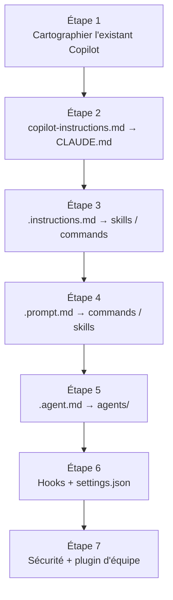

# Migration depuis Copilot — guide pas à pas

<span class="badge-intermediate">Intermédiaire</span> <span class="badge-expert">Expert</span> <span class="badge-cli">CLI</span>

Ce guide pratique convertit votre personnalisation **GitHub Copilot** existante en configuration **Claude Code**, fichier par fichier. Chaque étape suppose que la [CLI est installée et authentifiée](installation.md) et que vous avez initialisé un dossier `.claude/` dans votre dépôt.

!!! tip "Migrez progressivement, pas en big-bang"
    Ne convertissez pas tout d'un coup. Suivez les étapes dans l'ordre, validez sur un flux pilote, puis généralisez. Le plan calendaire est détaillé dans la [checklist 30/60/90 jours](migration-30-60-90.md).

---

## Vue d'ensemble de la migration



---

## Étape 1 — Cartographier l'existant Copilot

Avant de convertir, inventoriez ce que vous utilisez réellement :

| Artefact Copilot | Emplacement | À récupérer ? |
|------------------|-------------|:-------------:|
| `copilot-instructions.md` | `.github/` | ✅ |
| `.instructions.md` | `.github/instructions/` | ✅ |
| `.prompt.md` | `.github/prompts/` | ✅ |
| `.agent.md` | `.github/agents/` | ✅ |
| `SKILL.md` | workspace | ✅ |
| Réglages IDE / `.copilotignore` | `.vscode/`, racine | ⚠️ partiel |

!!! example "Commande d'inventaire"
    ```bash
    # Lister tous les artefacts Copilot du dépôt
    git ls-files | Select-String -Pattern "copilot-instructions|\.instructions\.md|\.prompt\.md|\.agent\.md|SKILL\.md"
    ```

---

## Étape 2 — `copilot-instructions.md` → `CLAUDE.md`

1. Créez `CLAUDE.md` **à la racine** du dépôt.
2. Copiez le contenu pertinent de `.github/copilot-instructions.md`. Conservez les sections **Rôle, Contexte, Contraintes, Format**, mais **supprimez le front-matter `applyTo`** (inutile pour un fichier global).
3. Ajoutez les informations du `README.md` que Claude doit voir à chaque tour (stack, commandes, pièges).
4. Archivez ou supprimez l'ancien fichier pour éviter la confusion.

=== "Avant (Copilot)"

    ```markdown
    ---
    applyTo: "**"
    ---
    Tu es un développeur senior. Utilise Spring Boot 3 et PostgreSQL.
    Toujours des DTOs en sortie d'API.
    ```

=== "Après (Claude — CLAUDE.md)"

    ```markdown
    # Projet — API de réservation

    ## Stack
    Java 21, Spring Boot 3.3, PostgreSQL 16

    ## Conventions
    - DTOs en sortie d'API, jamais d'entités JPA
    - Injection par constructeur uniquement

    ## Commandes
    - Build : `./mvnw clean install`
    - Tests : `./mvnw test`
    ```

!!! tip "Utilisez `/init`"
    `/init` génère un premier `CLAUDE.md` en analysant le dépôt. Partez de cette base et fusionnez-y vos instructions Copilot existantes.

---

## Étape 3 — `.instructions.md` → skills ou commands

Chaque `.instructions.md` ciblé par un glob (`applyTo: '**/*.java'`) devient un **skill** (expertise auto-invoquée) ou une **command** (workflow déclenché).

1. Créez `.claude/skills/<nom>/SKILL.md`.
2. Renseignez le front-matter :

    ```markdown
    ---
    name: conventions-java
    description: "Conventions Java — injection par constructeur, DTOs, nommage des services. À appliquer sur les fichiers src/**/*.java."
    ---
    ```

3. Copiez les sections du `.instructions.md` dans le corps du skill.

!!! info "Skill vs command : le bon réflexe"
    - Le fichier décrit un **savoir** appliqué en arrière-plan → **skill**.
    - Le fichier déclenche un **workflow** (scripts, génération) → **command**.

---

## Étape 4 — `.prompt.md` → commands ou skills

Pour chaque `.prompt.md` :

1. Déterminez sa nature :
    - **Workflow complet** (génération de tests, audit, plan de refactoring) → `.claude/commands/<nom>.md`.
    - **Réutilisation d'expertise** (« migration SQL Oracle → Flyway ») → `.claude/skills/<nom>/SKILL.md`.
2. Définissez un front-matter (`description`, `allowed-tools` pour les commands).
3. Réécrivez les variables :

| Copilot | Claude |
|---------|--------|
| `${selection}` | `#sélection` / sélection IDE |
| `${file}` | `@fichier:chemin` |
| (contexte dynamique manuel) | `` !`git diff` `` |

=== "Avant (`.prompt.md` Copilot)"

    ```markdown
    ---
    mode: agent
    description: "Audit de sécurité d'un endpoint"
    ---
    Audite ${selection} selon OWASP Top 10.
    ```

=== "Après (command Claude)"

    ```markdown
    ---
    description: "Audit de sécurité d'un endpoint selon OWASP Top 10"
    allowed-tools: [read, grep]
    ---
    Audite la cible ci-dessous selon OWASP Top 10.
    Retourne un JSON { globalRisk, findings[] }.

    Cible : $ARGUMENTS
    ```

---

## Étape 5 — `.agent.md` → `agents/`

Pour chaque `.agent.md` Copilot :

1. Créez `.claude/agents/<nom>.md`.
2. Renseignez un front-matter complet :

    ```markdown
    ---
    name: schema-explorer
    description: "Parcourt les migrations Flyway et les mappers MyBatis pour repérer les colonnes inutilisées ou manquantes."
    tools: [bash, read, grep]
    model: claude-haiku-4
    color: blue
    ---
    ```

3. Déplacez le contenu (rôle, comportement, exemples) dans le corps.
4. Mettez à jour les **références d'outils** selon ce que supporte Claude Code.

!!! tip "Choisir le modèle de l'agent"
    Un agent d'exploration rapide → **Haiku** (rapide, économique). Un agent de raisonnement complexe → **Opus**. Le défaut **Sonnet** convient à la plupart des cas.

---

## Étape 6 — Hooks et `settings.json`

1. Écrivez vos scripts sous `.claude/hooks/` (Bash ou Python).
2. Déclarez-les dans `.claude/settings.json` :

    ```json
    {
      "hooks": {
        "PreToolUse": [
          { "matcher": "Edit|Write", "command": ".claude/hooks/pre-tool-use.py" }
        ],
        "PostToolUse": [
          { "matcher": "Edit|Write", "command": ".claude/hooks/post-tool-use.sh" }
        ]
      }
    }
    ```

3. Respectez les **codes de sortie** : `0` laisse passer, `1` informe, `2` bloque et renvoie le message à Claude.

!!! example "Cas d'usage de hooks à reprendre depuis Copilot"
    - Pré-commit qui vérifiait le format → `PreToolUse` qui valide Prettier / google-java-format
    - Garde anti-secrets → `PreToolUse` qui bloque les patterns sensibles
    - Audit des modifications → `PostToolUse` qui journalise les diffs

---

## Étape 7 — Sécurité et partage

1. **Sécurité** : ajoutez un fichier de politiques (détection de secrets, injection, XSS, SSRF) et activez le plugin de sécurité officiel si vous l'utilisez. Déclinez en trois niveaux : utilisateur (`~/.claude/`), projet (`.claude/`), et surcharges locales.
2. **Partage multi-dépôts** : encapsulez vos `commands`, `skills` et `agents` communs dans un **plugin d'équipe** (`<plugin>/.claude-plugin/plugin.json`) référencé par chaque projet. Vous évitez la duplication entre VS Code et IntelliJ.
3. **Préférences locales** (modèle, couleurs d'agents, clés) → `~/.claude/` et `settings.local.json`. **Ne les committez pas.**

!!! warning "Ne versionnez jamais vos secrets"
    `settings.local.json` et `~/.claude/` contiennent vos données personnelles. Ajoutez `settings.local.json` au `.gitignore` du dépôt.

---

## Tableau récapitulatif de la migration

| Source Copilot | Cible Claude | Action clé |
|----------------|--------------|------------|
| `copilot-instructions.md` | `CLAUDE.md` | Fusionner, retirer `applyTo` |
| `.instructions.md` | `skills/` ou `commands/` | Selon savoir vs workflow |
| `.prompt.md` | `commands/` (ou `skills/`) | Réécrire les variables |
| `.agent.md` | `agents/` | Front-matter complet + modèle |
| Hooks / pré-commit | `hooks/` + `settings.json` | Codes de sortie 0/1/2 |
| `.copilotignore` | `permissions.deny` | Règles dans `settings.json` |
| MCP | Serveurs MCP `.claude/` | Reconnecter les sources externes |

---

## Prochaine étape

**[Checklist de migration 30/60/90 jours](migration-30-60-90.md)** : un plan calendaire concret pour piloter la bascule en équipe sans casser la production.

Concepts clés couverts :

- **Jours 0-30** — pilote, premiers `CLAUDE.md` et mesure de baseline
- **Jours 31-60** — généralisation contrôlée et formation de l'équipe
- **Jours 61-90** — industrialisation, plugin d'équipe et décision finale
- **Indicateurs de succès** — métriques pour trancher rester/passer/hybride

---

## Sources

- [Anthropic — Memory (`CLAUDE.md`)](https://docs.anthropic.com/en/docs/claude-code/memory) - consulté le 2026-06-20
- [Anthropic — Slash commands & custom commands](https://docs.anthropic.com/en/docs/claude-code/slash-commands) - consulté le 2026-06-20
- [Anthropic — Subagents](https://docs.anthropic.com/en/docs/claude-code/sub-agents) - consulté le 2026-06-20
- [Anthropic — Hooks reference](https://docs.anthropic.com/en/docs/claude-code/hooks) - consulté le 2026-06-20
- [GitHub Docs — Repository custom instructions](https://docs.github.com/en/copilot/customizing-copilot/adding-repository-custom-instructions-for-github-copilot) - consulté le 2026-06-20

