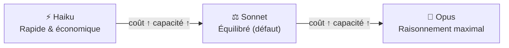
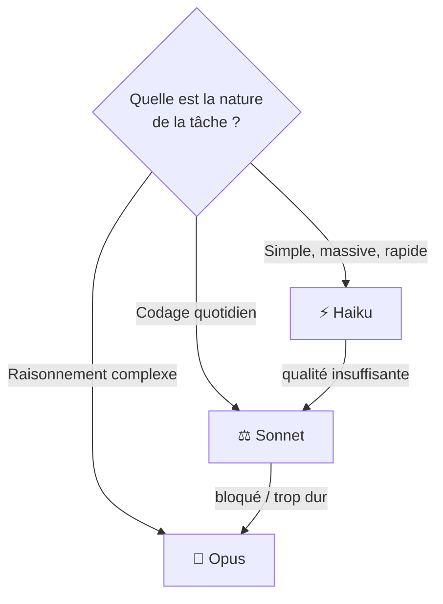

# Choisir le bon modèle Claude

<span class="badge-intermediate">Intermédiaire</span> <span class="badge-expert">Expert</span> <span class="badge-cli">CLI</span>

Claude Code ne s'appuie pas sur un modèle unique : la famille Claude propose plusieurs modèles aux profils **coût / vitesse / capacité** différents. Bien choisir — globalement et par tâche — est le levier le plus direct pour optimiser à la fois la qualité de vos réponses et votre facture de tokens.

!!! info "Les noms évoluent vite"
    Anthropic fait évoluer rapidement sa gamme (Haiku, Sonnet, Opus, et leurs numéros de version). Les **profils** décrits ici restent stables, mais vérifiez les modèles exactement disponibles avec `/model` et sur la page officielle [Models overview](https://docs.anthropic.com/en/docs/about-claude/models). Voir la section [Sources](#sources).

---

## Les trois profils de la gamme Claude



| Profil | Force principale | Coût relatif | Latence | Cas d'usage type |
|--------|------------------|:------------:|:-------:|------------------|
| **Haiku** | Vitesse, faible coût | $ | Très faible | Tâches simples, classification, exploration, hooks |
| **Sonnet** | Équilibre qualité/coût | $$ | Modérée | Codage quotidien, refactor, tests (**défaut recommandé**) |
| **Opus** | Raisonnement profond | $$$ | Plus élevée | Architecture, debug complexe, raisonnement multi-étapes |

!!! tip "La règle des 80/20"
    Pour ~80 % du travail quotidien, **Sonnet** est le bon choix. Réservez **Opus** aux problèmes vraiment difficiles et **Haiku** aux tâches massives et répétitives où la vitesse et le coût priment sur la finesse.

---

## Changer de modèle

=== "Pour la session courante"

    Dans le REPL, tapez :

    ```text
    /model
    ```

    Puis sélectionnez le modèle. Le changement s'applique aux prochains messages de la session.

=== "Par défaut (projet)"

    Dans `.claude/settings.json` :

    ```json
    {
      "model": "claude-sonnet-4"
    }
    ```

=== "Par défaut (utilisateur)"

    Dans `~/.claude/settings.json`, pour fixer votre préférence personnelle sur tous vos projets.

=== "Pour un subagent"

    Dans le front-matter de l'agent (`.claude/agents/<nom>.md`) :

    ```markdown
    ---
    name: schema-explorer
    model: claude-haiku-4
    ---
    ```

!!! info "Modèle par tâche = optimisation fine"
    Vous pouvez confier un **modèle différent à chaque subagent** : Haiku pour un explorateur de schéma (rapide, volumineux), Opus pour un architecte (raisonnement), Sonnet pour la génération de code courante.

---

## Grille de décision par type de tâche

| Tâche | Modèle conseillé | Pourquoi |
|-------|:----------------:|----------|
| Complétion / petites éditions | Sonnet | Bon rapport qualité/coût |
| Génération de tests unitaires | Sonnet | Suffisant et rapide |
| Refactoring multi-fichiers | Sonnet → Opus si complexe | Opus si dépendances enchevêtrées |
| Conception d'architecture | Opus | Raisonnement long, compromis |
| Debug d'un bug subtil | Opus | Trace multi-étapes, hypothèses |
| Exploration de gros codebase | Haiku (subagent) | Volume élevé, synthèse simple |
| Classification / tri de tickets | Haiku | Tâche simple, massive |
| Revue de sécurité OWASP | Opus ou Sonnet | Selon profondeur attendue |
| Hooks (validation, format) | Haiku ou script local | Latence minimale |
| Rédaction de doc / commits | Sonnet | Qualité de langage suffisante |



---

## Impact sur le coût

Le coût d'une requête dépend de **deux flux de tokens** facturés séparément :

- **Tokens d'entrée** (input) : votre prompt + contexte assemblé (`CLAUDE.md`, fichiers, historique).
- **Tokens de sortie** (output) : la réponse générée.

| Levier | Effet sur le coût |
|--------|-------------------|
| Passer Opus → Sonnet | Réduit fortement le coût par requête |
| Passer Sonnet → Haiku | Réduit encore davantage (tâches simples) |
| `CLAUDE.md` concis | Réduit le coût **fixe** de chaque tour |
| `/compact`, `/clear` | Réduit les tokens d'entrée accumulés |
| Subagent Haiku pour l'exploration | Évite de payer Opus/Sonnet sur du volume |

!!! warning "Le modèle le plus cher n'est pas toujours le meilleur"
    Lancer Opus sur une tâche triviale gaspille des tokens **sans gain de qualité**. À l'inverse, forcer Haiku sur un raisonnement complexe multiplie les itérations… et le coût total. Le bon modèle, c'est le **moins cher qui résout la tâche du premier coup**.

Pour le détail de la facturation et le suivi, voir la page [Coûts & quotas](couts-quotas.md).

---

## Modèles via Bedrock et Vertex

Si vous routez Claude Code via **Amazon Bedrock** ou **Google Vertex AI** (voir [Installation](installation.md#2-authentification)), les modèles disponibles et leur nommage dépendent du fournisseur cloud. Les profils Haiku/Sonnet/Opus restent les mêmes, mais :

- Les **identifiants de modèle** diffèrent (préfixes spécifiques au fournisseur).
- La **disponibilité régionale** peut varier.
- La **facturation** passe par votre compte cloud, pas par Anthropic directement.

!!! tip "Vérifier ce qui est réellement disponible"
    `/model` liste les modèles accessibles avec votre configuration d'authentification courante. C'est la source de vérité pour votre environnement.

---

## Prochaine étape

**[Prompt Engineering avec Claude Code](prompt-engineering-claude.md)** : maintenant que vous savez quel modèle choisir, apprenez à formuler des prompts qui exploitent au mieux sa capacité.

Concepts clés couverts :

- **Référencement de contexte** — `@fichier`, `@dossier` et injection dynamique
- **Role prompting durable** — dans `CLAUDE.md` et les agents
- **Workflows multi-étapes** — demander un plan avant le code
- **Économie de tokens** — `/compact`, `/clear` et chargement à la demande

---

## Sources

- [Anthropic — Models overview](https://docs.anthropic.com/en/docs/about-claude/models) - consulté le 2026-06-20
- [Anthropic — Choosing a model](https://docs.anthropic.com/en/docs/about-claude/models/choosing-a-model) - consulté le 2026-06-20
- [Anthropic — Claude Code settings (`model`)](https://docs.anthropic.com/en/docs/claude-code/settings) - consulté le 2026-06-20
- [Anthropic — Pricing](https://www.anthropic.com/pricing) - consulté le 2026-06-20

