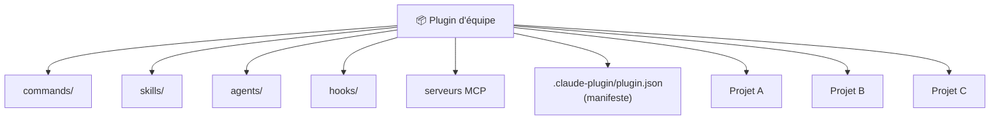
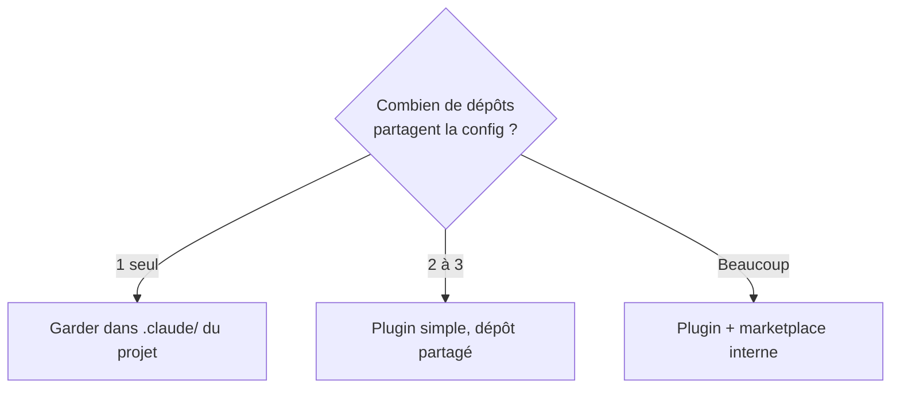

# Plugins d'équipe

<span class="badge-expert">Expert</span> <span class="badge-cli">CLI</span>

Quand plusieurs dépôts partagent les mêmes conventions, dupliquer `commands/`, `skills/`, `agents/` et `hooks/` dans chacun devient ingérable. Les **plugins Claude Code** résolvent ce problème : un paquet versionné, installable, qui regroupe toute votre configuration réutilisable et la distribue de façon cohérente.

!!! info "Le pendant Claude de `.github` partagé"
    Là où Copilot mutualise via des fichiers `.github` copiés ou des templates de dépôt, Claude offre un **mécanisme de plugin** dédié : un seul paquet, référencé par tous vos projets, avec une mise à jour centralisée.

---

## Qu'est-ce qu'un plugin ?



Un plugin est un **bundle versionné** qui peut contenir :

| Composant | Rôle |
|-----------|------|
| `commands/` | Workflows partagés (revue, tests, commit…) |
| `skills/` | Expertise commune (conventions, sécurité…) |
| `agents/` | Subagents standardisés (auditeur, explorateur…) |
| `hooks/` | Garde-fous qualité/sécurité communs |
| Serveurs MCP | Sources externes partagées |
| `.claude-plugin/plugin.json` | Le **manifeste** qui décrit le plugin |

---

## Anatomie d'un plugin

```text
mon-plugin-equipe/
├─ .claude-plugin/
│  └─ plugin.json            ← manifeste obligatoire
├─ commands/
│  ├─ review-pr.md
│  └─ commit.md
├─ skills/
│  └─ conventions-maison/
│     └─ SKILL.md
├─ agents/
│  └─ security-auditor.md
└─ hooks/
   └─ block-secrets.py
```

### Le manifeste `plugin.json`

```json
{
  "name": "mon-plugin-equipe",
  "version": "1.0.0",
  "description": "Conventions, workflows et garde-fous de l'équipe Backend",
  "author": "Équipe Plateforme",
  "commands": "./commands",
  "skills": "./skills",
  "agents": "./agents",
  "hooks": "./hooks"
}
```

!!! tip "Versionnez sémantiquement"
    Adoptez le **SemVer** (`MAJOR.MINOR.PATCH`). Une rupture de comportement d'une command ou d'un hook = bump `MAJOR`. Cela permet aux projets de monter de version en confiance.

---

## Distribuer un plugin via un marketplace

Un **marketplace** est un dépôt qui catalogue plusieurs plugins, pour que les équipes les découvrent et les installent facilement.

```json
{
  "name": "marketplace-interne",
  "plugins": [
    {
      "name": "mon-plugin-equipe",
      "source": "./plugins/mon-plugin-equipe",
      "description": "Conventions Backend"
    },
    {
      "name": "plugin-frontend",
      "source": "./plugins/plugin-frontend",
      "description": "Conventions React/TS"
    }
  ]
}
```

=== "Ajouter un marketplace"

    ```bash
    claude plugin marketplace add https://github.com/mon-org/claude-marketplace
    ```

=== "Installer un plugin"

    ```bash
    claude plugin install mon-plugin-equipe
    ```

=== "Lister / mettre à jour"

    ```bash
    claude plugin list
    claude plugin update mon-plugin-equipe
    ```

=== "Dans le REPL"

    ```text
    /plugin
    ```

!!! info "Public ou privé"
    Un marketplace peut être un dépôt GitHub **public** (communauté) ou **privé** (interne à l'entreprise). Pour un usage interne, hébergez-le sur votre forge et contrôlez l'accès par les permissions du dépôt.

---

## Workflow de mutualisation


1. L'équipe plateforme consolide les meilleures recettes (voir [Cookbook](cookbook.md)).
2. Elle les package dans un plugin versionné.
3. Elle publie le plugin sur un marketplace interne.
4. Chaque projet installe le plugin — **pas de copier-coller**.
5. Les améliorations sont diffusées par une simple montée de version.

!!! success "Cohérence VS Code ET JetBrains"
    Comme la CLI, l'extension VS Code et le plugin JetBrains lisent la **même configuration**, un plugin installé profite à **tous les points d'entrée** sans réglage supplémentaire par IDE.

---

## Bonnes pratiques de gouvernance

| Pratique | Bénéfice |
|----------|----------|
| Un propriétaire clair par plugin | Responsabilité et maintenance |
| Revue obligatoire des changements | Évite les régressions diffusées partout |
| Changelog du plugin | Traçabilité des évolutions |
| Tests des commands/hooks critiques | Confiance avant diffusion |
| SemVer strict | Montées de version sans surprise |
| Documentation dans le `README` du plugin | Onboarding rapide |

!!! warning "Un plugin diffuse aussi les erreurs"
    Un hook ou une permission mal conçus se propagent à **tous** les projets qui installent le plugin. Traitez le dépôt du plugin avec le même niveau d'exigence qu'une bibliothèque partagée critique : revue, tests, versionnement.

---

## Quand créer un plugin ?



| Situation | Recommandation |
|-----------|----------------|
| Projet unique | Pas de plugin — `.claude/` local suffit |
| Quelques projets liés | Un plugin partagé, installé manuellement |
| Organisation entière | Marketplace interne + plugins par domaine |

---

## Prochaine étape

**[Comparaison Copilot vs Claude Code](comparaison-copilot-claude.md)** : avec une vue complète des capacités de Claude (config, MCP, sécurité, plugins), confrontez-le à Copilot pour décider de votre stratégie.

Concepts clés couverts :

- **Tableau comparatif détaillé** — points d'entrée, configuration, gouvernance
- **Avantages et inconvénients** — forces et limites de chaque outil
- **Coûts et facturation** — abonnements vs API
- **Grille de décision** — rester Copilot, passer Claude, ou hybride

---

## Sources

- [Anthropic — Plugins](https://docs.anthropic.com/en/docs/claude-code/plugins) - consulté le 2026-06-20
- [Anthropic — Plugin marketplaces](https://docs.anthropic.com/en/docs/claude-code/plugin-marketplaces) - consulté le 2026-06-20
- [Anthropic — Settings](https://docs.anthropic.com/en/docs/claude-code/settings) - consulté le 2026-06-20

