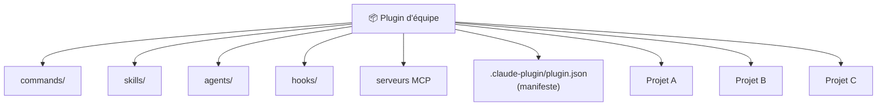
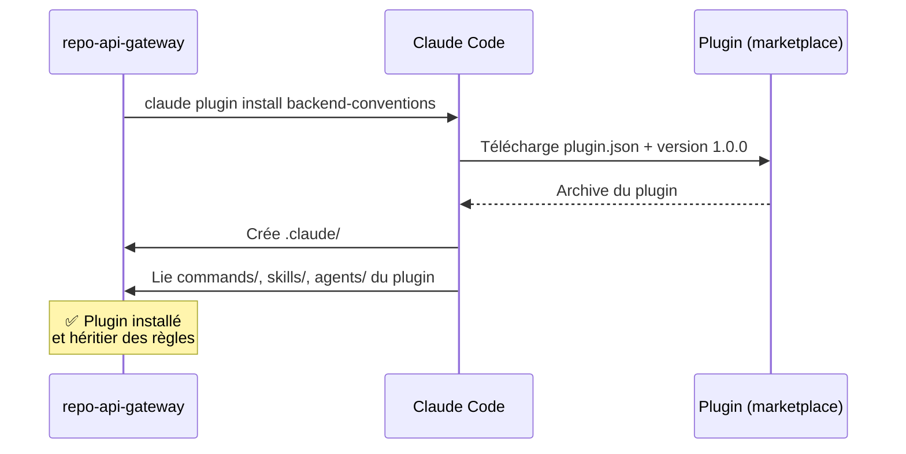
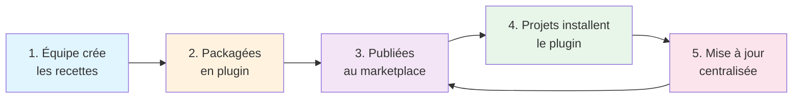
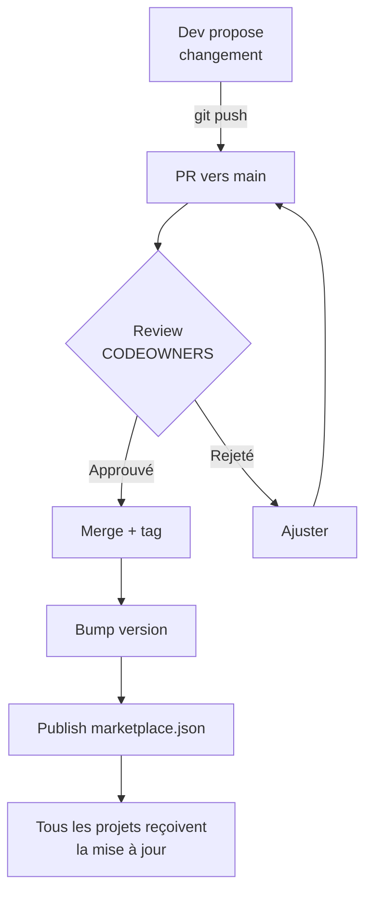
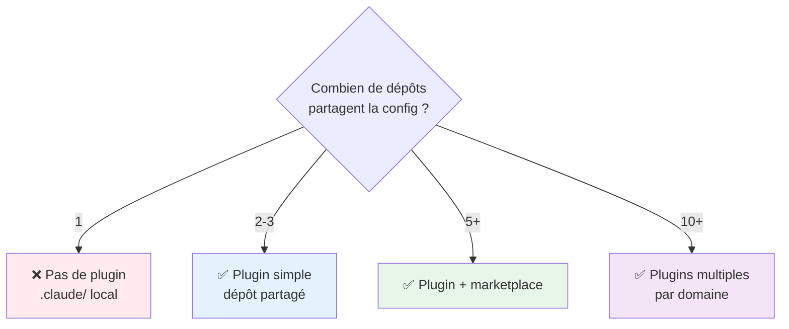

# Plugins d'équipe — Claude Code uniquement ⚠️

<span class="badge-expert">Expert</span> <span class="badge-cli">CLI</span>

!!! warning "🔴 Claude Code UNIQUEMENT — Copilot n'a pas d'équivalent"
    Les **plugins Claude Code** sont **une fonctionnalité native de Claude** qui n'existe **pas dans Copilot**. Si vous utilisez Copilot, cette page ne vous concerne pas. Les plugins sont disponibles **uniquement** pour les utilisateurs de Claude Code (CLI, VSCode, web).

Quand plusieurs dépôts partagent les mêmes conventions, dupliquer `commands/`, `skills/`, `agents/` et `hooks/` dans chacun devient ingérable. Les **plugins Claude Code** résolvent ce problème : un paquet versionné, installable, qui regroupe toute votre configuration réutilisable et la distribue de façon cohérente.

!!! success "Une vraie solution centralisée"
    Là où Copilot demande de copier-coller des fichiers `.github` ou d'utiliser des templates, Claude offre un **système de plugins** dédié : un seul paquet, référencé par tous vos projets, avec une mise à jour centralisée. **Une modification = diffusée partout automatiquement**.

---

## Pourquoi des plugins ? Les vrais problèmes qu'ils résolvent

### Le problème sans plugin : duplication et chaos

Vous êtes dans une équipe de 10 dépôts, tous avec les mêmes conventions :

```
repo-backend-users/         repo-backend-orders/        repo-api-gateway/
├── .claude/                ├── .claude/                 ├── .claude/
│   ├── commands/           │   ├── commands/            │   ├── commands/
│   ├── skills/             │   ├── skills/              │   ├── skills/
│   └── agents/             │   └── agents/              │   └── agents/
```

**Le cauchemar** :

- Une convention change (ex: format de commit) → faut la mettre à jour **dans 10 dépôts**
- Une command est améliorée → copier-coller dans les autres, espérer ne rien oublier
- Les dépôts dérivent progressivement → 10 versions légèrement différentes coexistent
- Onboarding d'un nouveau projet → 1h à copier les fichiers des autres

### La solution : un plugin centralisé

Avec un plugin, vous avez :

```
claude-plugins-equipe/ (dépôt partagé)
├── .claude-plugin/plugin.json
├── commands/
│   ├── review-pr.md
│   ├── commit-conventional.md
│   └── security-scan.md
├── skills/
│   └── conventions-typescript/SKILL.md
├── agents/
│   └── code-auditor.md
└── hooks/
    └── block-secrets.py

    ↓ installé dans tous les projets

repo-backend-users/ (.claude/ local)
├── commands/ (vide, hérité du plugin)
├── skills/ (vide, hérité du plugin)
└── agents/ (vide, hérité du plugin)
```

**Pas de duplication** — les 10 dépôts **héritent** la même config du plugin.

### Cas d'usage concrets

| Cas | Avant (sans plugin) | Après (avec plugin) |
|-----|-------------------|-------------------|
| **Nouvelle convention de commit** | Mettre à jour 10 dépôts = 10 commits | 1 commit au plugin, instantané dans tous les projets |
| **Command "revue PR"** | Copier-coller 10 fois, versions divergent | 1 version unique, gérée une fois |
| **Hook de sécurité** (bloquer les secrets) | À configurer partout | Une fois, héritée par tous |
| **Skill "conventions TypeScript"** | Dupliquer expertise partout | Centralisée, mise à jour = diffusée partout |
| **Onboarding nouveau projet** | 1h de configuration manuelle | 5 min : `claude plugin install mon-plugin-equipe` |

---

## Qu'est-ce qu'un plugin ?



Un plugin est un **bundle versionné** qui peut contenir :

| Composant | Rôle |
|-----------|------|
| `commands/` | Workflows partagés (revue, tests, commit…) |
| `skills/` | Expertise commune (conventions, sécurité…) |
| `agents/` | Subagents standardisés (auditeur, explorateur…) |
| `hooks/` | Garde-fous qualité/sécurité communs |
| Serveurs MCP | Sources externes partagées |
| `.claude-plugin/plugin.json` | Le **manifeste** qui décrit le plugin |

---

## Comment créer un plugin

### Structure et anatomie

```text
mon-plugin-equipe/
├─ .claude-plugin/
│  └─ plugin.json            ← manifeste obligatoire
├─ commands/
│  ├─ review-pr.md
│  └─ commit.md
├─ skills/
│  └─ conventions-maison/
│     └─ SKILL.md
├─ agents/
│  └─ security-auditor.md
└─ hooks/
   └─ block-secrets.py
```

### Le manifeste `plugin.json`

```json
{
  "name": "mon-plugin-equipe",
  "version": "1.0.0",
  "description": "Conventions, workflows et garde-fous de l'équipe Backend",
  "author": "Équipe Plateforme",
  "commands": "./commands",
  "skills": "./skills",
  "agents": "./agents",
  "hooks": "./hooks"
}
```

!!! tip "Versionnez sémantiquement"
    Adoptez le **SemVer** (`MAJOR.MINOR.PATCH`). Une rupture de comportement d'une command ou d'un hook = bump `MAJOR`. Cela permet aux projets de monter de version en confiance.

### Étape 1 : Initialiser le dépôt

```bash
# Créer un dépôt dédié
mkdir claude-plugins-equipe-backend
cd claude-plugins-equipe-backend
git init

# Créer l'arborescence
mkdir -p .claude-plugin commands skills agents hooks
```

### Étape 2 : Écrire le manifeste `plugin.json`

```json
{
  "name": "backend-team-conventions",
  "version": "1.0.0",
  "description": "Conventions, workflows et garde-fous de l'équipe Backend",
  "author": "Équipe Backend",
  "keywords": ["conventions", "typescript", "security"],
  "commands": "./commands",
  "skills": "./skills",
  "agents": "./agents",
  "hooks": "./hooks"
}
```

!!! info "Champs optionnels"
    - `keywords`: pour la découverte sur un marketplace
    - `license`: ex `MIT`, `Apache-2.0`
    - `homepage`: lien vers la doc du plugin
    - `repository`: URL du dépôt GitHub

### Étape 3 : Ajouter des commands réutilisables

**`commands/review-pr.md`** — une command partagée pour auditer une PR :

```text
# Command: Revue de PR (Backend)

Demander à Claude d'auditer une Pull Request avec les critères de l'équipe Backend.

--- Usage ---

Dans Claude Code :
  /run-command review-pr
  /command

--- Exécution ---

Claude audite la PR pour :
  ✅ Respect des conventions TypeScript
  ✅ Absence de secrets (clés API, tokens, mdp)
  ✅ Pas de console.log en production
  ✅ Couverture de tests > 80%
  ✅ Pas de branche long-lived (>2 semaines)
  ✅ Messages de commit au format Conventional Commits
```

**`commands/commit-conventional.md`** — standardiser les commits :

```text
# Command: Commit au format Conventional

Générer des commits respectant la norme Conventional Commits.

--- Format ---

  type(scope): sujet

  description

Exemples valides :
  feat(auth): ajouter OAuth2 support
  fix(db): corriger migration orpheline
  docs(readme): préciser les prérequis
  refactor(api): simplifier route GET users

Types : feat, fix, docs, refactor, test, chore, ci
```

### Étape 4 : Ajouter une skill réutilisable

**`skills/conventions-typescript/SKILL.md`** :

```text
# Skill: Conventions TypeScript Backend

Expertise commune sur les conventions TypeScript de l'équipe Backend.

--- Principes ---

1. Typage strict : tsconfig.json avec strict: true
2. Pas de any : utiliser unknown et narrowing
3. Interfaces explicites : tous les objets retournés typés
4. Noms expressifs : getActiveUsersByRegion > getUsers
5. Commentaires JSDoc : sur les exports publics

--- Structure d'un module ---

  /**
   * Récupère les utilisateurs actifs d'une région.
   * @param regionCode - Code ISO de la région (ex: "FR", "US")
   * @returns Liste d'utilisateurs actifs
   */
  export async function getActiveUsersByRegion(
    regionCode: string
  ): Promise<User[]> {
    // implémentation
  }

--- Patterns interdits ---

- Pas d'exports anonymes : export default { foo } 
- Pas de require() dynamique
- Pas de types object ou any

--- Quand appliquer ---

Cette skill s'applique à tous les dépôts Backend TypeScript. Pour les exceptions, 
documenter dans le README du projet.
```

### Étape 5 : Ajouter un agent réutilisable

**`agents/security-auditor.md`** :

```text
# Agent: Security Auditor

Subagent dédié à l'audit de sécurité selon les standards de l'équipe.

--- Responsabilités ---

- Détecter les secrets (clés API, tokens, credentials)
- Vérifier les dépendances pour CVEs
- Auditer les patterns d'authentification
- Vérifier les permissions (RBAC, ACL)

--- Usage ---

  @security-auditor: Audite ce code pour les vulnérabilités

--- Standards de l'équipe ---

- OWASP Top 10
- CWE critical (injections, CSRF, XXE…)
- PII masquée dans les logs
- Secrets jamais en plaintext

--- Escalade ---

Si une vulnérabilité critique est trouvée, contacter l'équipe sécu sur #security.
```

### Étape 6 : Ajouter un hook

**`hooks/block-secrets.py`** :

```python
#!/usr/bin/env python3
"""
Hook Claude : bloquer les commits avec secrets détectés.
Exécuté avant chaque save/commit dans Claude Code.
"""

import re
import sys

# Patterns de secrets dangereux
SECRETS_PATTERNS = [
    r'(api[_-]?key|apikey|token|secret|password)\s*[=:]\s*["\']([^"\']+)["\']',
    r'(PRIVATE_KEY|RSA_KEY|JWT_SECRET)\s*=\s*["\']',
    r'Bearer\s+[A-Za-z0-9\-._~+/]+=*',  # JWT Bearer tokens
]

def check_secrets(file_content: str) -> list:
    """Retourne liste des patterns detectés."""
    issues = []
    for i, line in enumerate(file_content.split('\n'), 1):
        for pattern in SECRETS_PATTERNS:
            if re.search(pattern, line, re.IGNORECASE):
                issues.append(f"Ligne {i}: Possible secret détecté")
    return issues

if __name__ == "__main__":
    with open(sys.argv[1]) as f:
        content = f.read()
    
    issues = check_secrets(content)
    if issues:
        print("⛔ Secrets détectés - commit bloqué:")
        for issue in issues:
            print(f"  {issue}")
        sys.exit(1)
    else:
        print("✅ Pas de secrets detectés")
        sys.exit(0)
```

---

## Distribuer un plugin via marketplace

Un **marketplace** centralise tous vos plugins pour que les projets les découvrent et les installent facilement.

### Structure d'un marketplace

```
claude-marketplace-interne/         # Dépôt partagé
├── marketplace.json               # Catalogue des plugins
├── plugins/
│   ├── backend-conventions/       # Le plugin lui-même
│   │   ├── .claude-plugin/
│   │   │   └── plugin.json
│   │   ├── commands/
│   │   ├── skills/
│   │   ├── agents/
│   │   └── hooks/
│   ├── frontend-conventions/
│   ├── security-standards/
│   └── infrastructure-tools/
├── docs/
│   └── README.md                  # Docs du marketplace
└── CHANGELOG.md
```

### Le fichier `marketplace.json`

```json
{
  "name": "marketplace-equipe-backend",
  "description": "Plugins partagés de l'équipe Backend",
  "version": "1.0.0",
  "url": "https://github.com/mon-org/claude-marketplace-interne",
  "plugins": [
    {
      "name": "backend-conventions",
      "version": "1.0.0",
      "source": "./plugins/backend-conventions",
      "description": "Conventions TypeScript, commits, security",
      "keywords": ["typescript", "conventions", "security"],
      "verified": true
    },
    {
      "name": "security-standards",
      "version": "2.1.0",
      "source": "./plugins/security-standards",
      "description": "Standards de sécurité (OWASP, secrets, CVE)",
      "keywords": ["security", "audit", "cves"],
      "verified": true
    },
    {
      "name": "infrastructure-tools",
      "version": "1.5.0",
      "source": "./plugins/infrastructure-tools",
      "description": "Outils IaC, Terraform, Docker",
      "keywords": ["terraform", "docker", "iac"],
      "verified": true
    }
  ]
}
```

### Utilisation du marketplace : les commandes clés

#### Ajouter et gérer un marketplace

=== "Enregistrer le marketplace"

    ```bash
    # Enregistrer un marketplace auprès de Claude
    claude plugin marketplace add \
      https://github.com/mon-org/claude-marketplace-interne
    
    # Vérifier que le marketplace est listé
    claude plugin marketplace list
    ```

=== "Depuis Claude Code (UI)"

    ```
    /plugin marketplace add https://github.com/mon-org/claude-marketplace-interne
    ```

#### Installer et utiliser les plugins

=== "Découvrir les plugins"

    ```bash
    # Lister les plugins disponibles dans le marketplace
    claude plugin browse
    ```

=== "Installer un plugin"

    ```bash
    # Installer un plugin spécifique
    claude plugin install backend-conventions
    
    # Vérifier les plugins installés
    claude plugin list
    ```

=== "Depuis Claude Code (UI)"

    ```
    /plugin list               # Voir les plugins installés
    /plugin install NAME       # Installer
    /plugin remove NAME        # Désinstaller
    /plugin update NAME        # Mettre à jour
    ```

#### Maintenir les plugins

=== "Mettre à jour"

    ```bash
    # Mettre à jour un plugin spécifique
    claude plugin update backend-conventions
    
    # Mettre à jour TOUS les plugins installés
    claude plugin update --all
    ```

=== "CLI complète"

    ```bash
    # Lister les plugins et leurs versions
    claude plugin list --verbose
    
    # Voir les détails d'un plugin
    claude plugin show backend-conventions
    
    # Vérifier les updates disponibles
    claude plugin list --check-updates
    ```

### Ce qui se passe quand vous installez un plugin



**Résultat dans votre projet** :

```
repo-api-gateway/
├── .claude/
│   ├── commands/          ← hérité du plugin
│   ├── skills/            ← hérité du plugin
│   ├── agents/            ← hérité du plugin
│   ├── local-command.md   ← spécifique au projet
│   └── README.md
```

Si le plugin est mis à jour, vous recevez la nouvelle version avec un simple :

```bash
claude plugin update backend-conventions
```

!!! info "Public ou privé"
    Un marketplace peut être un dépôt GitHub **public** (communauté) ou **privé** (interne à l'entreprise). Pour un usage interne, hébergez-le sur votre forge et contrôlez l'accès par les permissions du dépôt.

!!! success "Un projet peut combiner plugin + local"
    Les commands/skills locales **complètent** le plugin, elles ne les remplacent pas. Vous pouvez avoir des règles d'équipe (plugin) + des règles locales au projet (`.claude/`). C'est la meilleure des deux mondes !

---

## Utiliser un plugin dans votre projet

Vous venez d'installer le plugin `backend-conventions` dans votre projet. Voici ce qui change au quotidien.

### Avant (sans plugin)

```
repo-api-gateway/
├── .claude/
│   ├── commands/
│   │   ├── review-pr.md          (copié du projet A, 6 mois obsolète)
│   │   ├── commit-conventional.md (légèrement modifié localement)
│   │   └── security-scan.md       (version différente des autres repos)
│   ├── skills/
│   ├── agents/
│   └── hooks/
```

**Problèmes** :

- 🔴 Chaque project a une version légèrement différente
- 🔴 Mises à jour manuelles, lentes, incohérentes
- 🔴 Quand une convention change, tout le monde doit se coordonner

### Après (avec plugin)

```bash
# Installation (une fois)
$ claude plugin install backend-conventions

# Verification
$ claude plugin list
backend-conventions (v1.0.0) - Conventions TypeScript, commits, security
```

```
repo-api-gateway/
├── .claude/
│   ├── commands/              ← hérité du plugin (lecture seule)
│   ├── skills/                ← hérité du plugin (lecture seule)
│   ├── agents/                ← hérité du plugin (lecture seule)
│   ├── hooks/                 ← hérité du plugin (lecture seule)
│   ├── local-additions.md     ← optionnel, spécifique au projet
│   └── README.md
├── .gitignore                 # Ignore .claude/commands, .claude/skills, etc.
```

**Avantages** :

- ✅ Tous les projets utilisent la même version (v1.0.0)
- ✅ Mise à jour globale en 1 commande
- ✅ Mise à jour centralisée diffusée à tous

### Journée type : utiliser les commands du plugin

**Avant de commiter, auditer la PR** :

```bash
# Claude suggère les commands disponibles
$ /command
Available commands:
  - review-pr: Auditer une PR selon les standards Backend
  - commit-conventional: Générer un commit au format Conventional
  - security-scan: Scanne la branche pour les secrets

# Exécuter une command
$ /run-command review-pr

# Claude utilise les règles du plugin
Claude (Security Auditor):
✅ Commits au format Conventional Commits
✅ Messages de commit détaillés
❌ Fonction "parseUserData" manque JSDoc
❌ Couverture de tests: 65% (< 80% requis)

Fix needed before merge.
```

### Mise à jour du plugin : tout s'actualise

**L'équipe Backend met à jour le plugin** :

```
claude-marketplace-interne/
└── plugins/backend-conventions/
    └── commands/
        ├── review-pr.md           ← MODIFIÉ: check coverage > 70%
        ├── commit-conventional.md
        └── security-scan.md
```

Tag `v1.0.1` publié sur le marketplace.

**Tous les projets, automatiquement à jour** :

```bash
# Dans n'importe quel projet
$ claude plugin update backend-conventions
Updating backend-conventions: v1.0.0 → v1.0.1
✅ Updated successfully

# Les rules du nouveau check sont immédiatement actives
```

**Aucune duplication, aucune desynchronisation.**

---

## Workflow de mutualisation



### Étape 1 : L'équipe consolide les recettes

Tous les projets testent et affinent leurs commands/skills/agents. L'équipe plateforme identifie les **meilleures pratiques** qui méritent d'être partagées.

```
repo-backend-users/  →  Command "review-pr" bien testée
repo-backend-orders/ →  Skill "conventions-typescript" précise  
repo-api-gateway/    →  Hook "block-secrets" efficace
```

### Étape 2 : Créer un plugin avec ces recettes

L'équipe crée un dépôt central `claude-plugins-equipe-backend` et y consolide les meilleures recettes :

```
claude-plugins-equipe-backend/
├── commands/
│   ├── review-pr.md          (issu de repo-backend-users)
│   ├── commit-conventional.md
│   └── security-scan.md
├── skills/
│   └── conventions-typescript/SKILL.md  (issu de repo-backend-orders)
├── agents/
├── hooks/
│   └── block-secrets.py       (issu de repo-api-gateway)
└── .claude-plugin/plugin.json (version 1.0.0)
```

### Étape 3 : Publier sur le marketplace

Créer un dépôt `claude-marketplace-interne` qui liste tous les plugins :

```bash
git clone https://github.com/mon-org/claude-marketplace-interne
cd claude-marketplace-interne
# Ajouter le plugin au marketplace.json
git add marketplace.json
git commit -m "feat: ajouter plugin backend-conventions v1.0.0"
git push origin main
```

### Étape 4 : Tous les projets installent

Chaque projet Backend installe une fois :

```bash
# Setup initial
claude plugin marketplace add \
  https://github.com/mon-org/claude-marketplace-interne

claude plugin install backend-conventions
```

✅ **Tous les projets héritent automatiquement des mêmes rules.**

!!! success "Cohérence VS Code ET JetBrains"
    Comme la CLI, l'extension VS Code et le plugin JetBrains lisent la **même configuration**, un plugin installé profite à **tous les points d'entrée** sans réglage supplémentaire par IDE.

### Étape 5 : Maintenance centralisée

Quand une amélioration est nécessaire (ex: nouvelle convention de log, patch sécurité), l'équipe met à jour le plugin **une seule fois** :

```bash
# Dans le dépôt du plugin
# Éditer commands/review-pr.md
git add commands/review-pr.md
git commit -m "fix: check logs au format JSON structuré"
git tag v1.0.1
git push --tags
```

Tous les projets reçoivent la mise à jour :

```bash
claude plugin update backend-conventions  # v1.0.0 → v1.0.1
```

**Aucune duplication, aucune désynchronisation.**

---

## Gouvernance et maintenance du plugin

### Structurer la responsabilité

```
claude-plugins-equipe-backend/
├── CODEOWNERS          # Qui peut valider les changements
├── CHANGELOG.md        # Traçabilité des versions
├── plugin.json
├── commands/
├── skills/
├── agents/
├── hooks/
└── tests/              # Tests des hooks/commands critiques
    ├── test-review-pr.sh
    └── test-block-secrets.py
```

**Fichier `CODEOWNERS`** :

```
# Tous les changements doivent être revus
*                    @equipe-backend-lead

# Les hooks (critiques) demandent 2 approbations
/hooks/              @equipe-backend-lead @equipe-sécurité

# Les skills de sécurité doivent être auditées
/skills/security-*   @equipe-sécurité
```

### Processus de changement



### Versionnage sémantique strict

| Type de changement | Version | Exemple |
|-------------------|---------|---------|
| Nouvelle command/skill | MINOR | 1.0.0 → 1.1.0 |
| Correction sans rupture | PATCH | 1.1.0 → 1.1.1 |
| Breaking change (ex: command renommée) | MAJOR | 1.1.0 → 2.0.0 |

```bash
# Dans plugin.json
{
  "version": "1.0.0"  # À bumper avant chaque release
}

# Tagger dans git
git tag v1.0.0
git push --tags
```

### Documentation et changelog

**Fichier `CHANGELOG.md`** :

```text
[1.0.1] - 2024-06-15

Fixed
  - Command review-pr: vérification coverage maintenant > 70% (était > 80%)
  - Hook block-secrets: ajouter pattern JWT Bearer

Changed
  - Skill typescript: clarifier règle sur les any types

Added
  - Command test-coverage: analyser la couverture avec Vitest

[1.0.0] - 2024-06-01

Initial Release
  - Command: review-pr, commit-conventional, security-scan
  - Skill: conventions-typescript
  - Hook: block-secrets
```

**README du plugin** :

```text
Plugin Backend Conventions

Conventions TypeScript, commits et sécurité de l'équipe Backend.

--- Installation ---

  claude plugin install backend-conventions

--- Contenu ---

Commands (3)
  - review-pr: Auditer les PRs
  - commit-conventional: Format Conventional Commits
  - security-scan: Détecter les secrets

Skills (1)
  - conventions-typescript: Principes TypeScript

Hooks (1)
  - block-secrets: Bloquer avant commit

--- Contribuer ---

1. Fork
2. Créer une branche: git checkout -b feature/ma-feature
3. Commit: git commit -m "feat: ..."
4. Push: git push origin feature/ma-feature
5. Créer une PR
6. Obtenir l'approbation des CODEOWNERS
7. Merge + bump version + tag

--- Support ---

Questions ? Contacter @equipe-backend-lead sur Slack ou ouvrir une issue.
```

---

## Bonnes pratiques et checklist

| Pratique | Détail | Impact |
|----------|--------|--------|
| **Propriétaire clair** | 1-2 personnes responsables de la maintenance | Évite l'abandon du plugin |
| **CODEOWNERS + revue obligatoire** | Tous les PRs doivent être revues avant merge | Évite les régressions globales |
| **Changelog détaillé** | Chaque version documentée (Added, Fixed, Changed, Removed) | Traçabilité et decisions futures |
| **Tests automatisés** | Tester les hooks et commands avant release | Confiance avant diffusion |
| **SemVer strict** | MAJOR pour ruptures, MINOR pour features, PATCH pour fixes | Les projets upgradent sans crainte |
| **Documentation complète** | README, SKILL.md, exemples dans commands | Onboarding rapide pour dev |
| **Release notes** | Annonce les changements importants au team | Évite les surprises |
| **Versioning immédiat** | Bumper la version dans plugin.json **avant** de merger | Évite les mises à jour imprévues |

### Checklist avant de publier une version

- [ ] Tests validés (tests automatisés passent)
- [ ] CHANGELOG.md mis à jour avec les changements
- [ ] Version dans `plugin.json` bumpée (SemVer)
- [ ] Git tag créé (`v1.0.1`)
- [ ] Marketplace.json mis à jour si nouveau plugin
- [ ] Notification envoyée au team (Slack, mail)
- [ ] Documentation relue par au moins 2 CODEOWNERS

### Quand escalader au MAJOR

```
Situation                           Action
─────────────────────────────────────────────
Command renommée                    v1.0.0 → v2.0.0
Comportement d'un hook change       v1.0.0 → v2.0.0
Skill change drastiquement          v1.0.0 → v2.0.0
Suppression de feature              v1.0.0 → v2.0.0
```

**Les projets gardent v1.x** jusqu'à être prêts pour v2.0.0.

!!! warning "Un plugin diffuse aussi les erreurs 🔴"
    Un hook mal conçu, une command buggée, ou une skill incohérente se propagent à **TOUS** les projets qui installent le plugin **instantanément**. Traitez le dépôt du plugin comme une **bibliothèque critique partagée** : 
    
    - Revue stricte
    - Tests obligatoires (surtout les hooks)
    - SemVer religieux
    - Changelog détaillé

!!! success "Le plugin est votre force"
    C'est aussi votre super pouvoir : une amélioration de qualité, une convention mieux alignée, une sécurité renforcée = **diffusée à toute l'équipe en 5 minutes**. Pas besoin d'attendre que les devs upgradent manually ou copient les nouvelles règles.

---

## Pièges à éviter

| Piège | Conséquences | Solution |
|-------|-------------|----------|
| **Trop gros plugin** | Impossible à maintenir, changes lentes | Diviser par domaine : `backend-conventions`, `frontend-conventions`, `security-standards` |
| **Pas d'antériorité** | Devs ignorent le plugin | Documentation + annonce claire lors du rollout |
| **Hooks sans tests** | Bug diffusé partout | CI/CD : tests automatisés avant merge |
| **SemVer négligé** | Projets cassés à chaque update | Respecter SemVer religieusement |
| **CODEOWNERS absent** | N'importe qui peut merger n'importe quoi | Définir CODEOWNERS strict + approvals requises |
| **Pas de changelog** | Impossible de savoir ce qui a changé | Changelog.md obligatoire + description de PR |
| **Command incohérente** | Devs frustré, ne l'utilise plus | Tester, documenter, demander feedback |

---

## Quand créer un plugin ?



### La grille de décision

| Situation | Recommandation | Exemple |
|-----------|----------------|---------|
| **1 projet** | Pas de plugin — `.claude/` local suffit | Projet standalone, startup early stage |
| **2-3 projets** | Plugin simple, dépôt partagé | Backend-users + backend-orders |
| **5-10 projets** | Plugin + marketplace interne | Toute une équipe Backend |
| **10+ projets** | Plugins multiples par domaine | Entreprise avec Backend + Frontend + DevOps |
| **Multi-équipe** | Marketplace interne centralisée | Plusieurs équipes, cada una avec ses plugins |

### Questions à se poser

- ✓ Ces projets partagent-ils **les mêmes conventions** ? (commits, types, style)
- ✓ Les conventions changent **rarement** ? (stabilité)
- ✓ Vous avez **au moins 2-3 projets** ? (ROI de création)
- ✓ Il y a une **équipe qui peut maintenir** le plugin ?

Si toutes les réponses sont **Oui**, créer un plugin.

---

## Comparaison : Plugin vs .claude/ local

| Critère | Plugin | .claude/ local |
|---------|--------|---|
| **Centralisation** | ✅ Une source de vérité | ❌ Duplicated everywhere |
| **Mise à jour** | ✅ 1 commit, toute l'équipe à jour | ❌ Chaque projet doit updater manuellement |
| **Maintenance** | ✅ Team responsable clairement identifiée | ❌ Chaque projet responsable |
| **Cohérence** | ✅ Tous les projets à même version | ❌ Versions divergent progressivement |
| **Flexibilité locale** | ✅ Projets peuvent ajouter leurs rules locales | ✅ Pas de restrictions |
| **Découverte** | ✅ Marketplace : easy discovery + install | ❌ À trouver manuellement dans GitHub |
| **Setup temps** | ✅ 2 min : `plugin install` | ❌ 30 min : copier-coller configs |
| **Quand utiliser** | 3+ projets | 1 seul projet |

---

## Prochaine étape

**[Comparaison Copilot vs Claude Code](comparaison-copilot-claude.md)** : avec une vue complète des capacités de Claude (config, MCP, sécurité, plugins), confrontez-le à Copilot pour décider de votre stratégie.

Concepts clés couverts :

- **Tableau comparatif détaillé** — points d'entrée, configuration, gouvernance
- **Avantages et inconvénients** — forces et limites de chaque outil
- **Coûts et facturation** — abonnements vs API
- **Grille de décision** — rester Copilot, passer Claude, ou hybride

---

## Sources

- [Anthropic — Plugins](https://docs.anthropic.com/en/docs/claude-code/plugins) - consulté le 2026-06-20
- [Anthropic — Plugin marketplaces](https://docs.anthropic.com/en/docs/claude-code/plugin-marketplaces) - consulté le 2026-06-20
- [Anthropic — Settings](https://docs.anthropic.com/en/docs/claude-code/settings) - consulté le 2026-06-20

