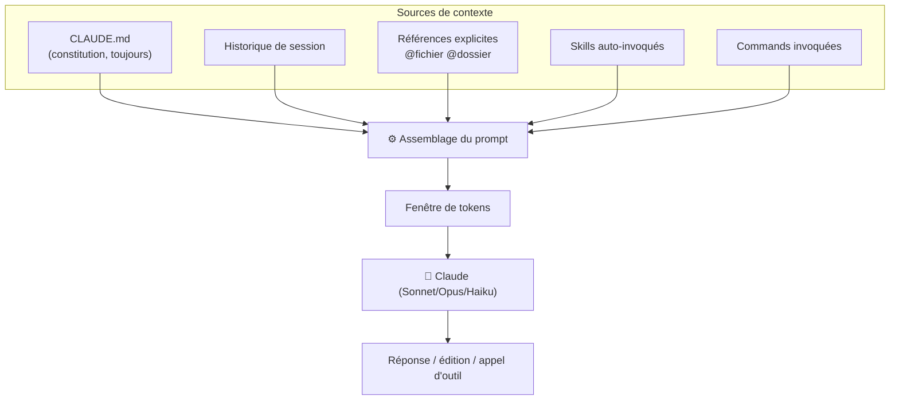
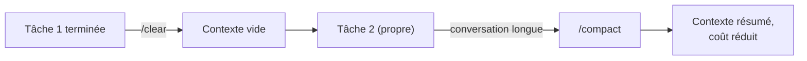

# Prompt Engineering avec Claude Code

<span class="badge-intermediate">Intermédiaire</span> <span class="badge-expert">Expert</span> <span class="badge-cli">CLI</span>

Les techniques générales de prompt engineering (rôle, few-shot, chain-of-thought, format de sortie) s'appliquent à Claude Code comme à n'importe quel LLM. Cette page se concentre sur **les spécificités de Claude Code** : comment exploiter le référencement de fichiers, les commands, les skills et les subagents pour des résultats fiables et reproductibles.

!!! info "Pré-requis"
    Cette page suppose que vous connaissez l'[architecture `.claude/`](architecture-claude.md). Pour les fondamentaux du prompt engineering, voir le chapitre [Prompt Engineering](../chapitre-5-prompt-engineering/index.md).

---

## 1. Comment Claude assemble votre contexte



!!! tip "Le principe directeur"
    Plus le contexte est **explicite et ciblé**, meilleure est la réponse. Claude n'a pas besoin de tout votre projet — il a besoin des **bons** fichiers au bon moment.

---

## 2. Référencer du contexte précisément

| Référence | Effet | Exemple |
|-----------|-------|---------|
| `@fichier` | Insère un fichier complet | `@src/services/UserService.java` |
| `@dossier` | Analyse tout un répertoire | `@src/services/` |
| Sélection | Le code sélectionné dans l'IDE | (depuis VS Code / JetBrains) |
| `` !`commande` `` | Injecte la sortie d'une commande shell (dans une command) | `` !`git diff` `` |

```text
Analyse @src/services/OrderService.java et compare son style
avec @src/services/UserService.java. Repère les incohérences
de gestion d'erreurs et propose un alignement.
```

!!! example "Contexte dynamique vs statique"
    - **Statique** : `@fichier` fige le contenu au moment de l'envoi.
    - **Dynamique** : `` !`git diff` `` dans une command ré-exécute la commande à chaque appel → toujours à jour.

---

## 3. Role prompting durable

Chez Copilot, le rôle se met souvent dans un `.instructions.md`. Chez Claude, vous avez **deux emplacements durables** :

=== "Dans CLAUDE.md (global au projet)"

    ```markdown
    ## Rôle par défaut
    Tu es un développeur senior de l'équipe backend, rigoureux sur
    la sécurité et la testabilité. Tu expliques tes choix en 3 points max.
    ```

=== "Dans un agent (rôle spécialisé)"

    ```markdown
    ---
    name: api-reviewer
    description: "Revue d'API REST selon nos standards (REST, pagination, erreurs)"
    tools: [read, grep]
    ---
    Tu es un architecte API. Tu vérifies idempotence, codes HTTP,
    pagination, gestion d'erreurs RFC 7807 et compatibilité ascendante.
    ```

!!! tip "Choisir le bon niveau"
    - Rôle **transverse** (vaut pour tout le projet) → `CLAUDE.md`.
    - Rôle **spécialisé et isolé** (revue, audit, exploration) → un **agent**.

---

## 4. Chain-of-thought et workflows multi-étapes

Claude répond particulièrement bien aux **étapes numérotées explicites**. Encapsulez les workflows récurrents dans une command.

```markdown
---
description: "Plan de refactoring sûr, étape par étape"
allowed-tools: [read, grep, bash]
---

## Cible
$ARGUMENTS

## Procédure (raisonne étape par étape)
1. Cartographie les usages de la cible (cherche les appelants).
2. Identifie les tests existants qui la couvrent.
3. Propose un découpage en petites étapes réversibles.
4. Pour chaque étape : risque, fichiers touchés, test de non-régression.
5. N'écris aucun code tant que je n'ai pas validé le plan.
```

!!! warning "Demander un plan AVANT le code"
    Pour les tâches complexes, demandez explicitement un **plan validé** avant toute modification. Cela évite les refactorings massifs non maîtrisés et facilite la revue.

---

## 5. Few-shot pour imposer un style

```text
Génère les tests de @src/services/PaymentService.java.

Suis EXACTEMENT le style de @src/services/UserServiceTest.java :
mêmes annotations, même nommage des méthodes (`should_xxx_when_yyy`),
même usage de Mockito et Testcontainers.
```

!!! tip "Le meilleur exemple est dans votre code"
    Plutôt que de décrire un style en prose, **pointez un fichier existant** qui l'incarne. Claude reproduit fidèlement les patterns observés.

---

## 6. Format de sortie contraint

```text
Audite cet endpoint et retourne UNIQUEMENT ce JSON valide :

{
  "globalRisk": "LOW|MEDIUM|HIGH|CRITICAL",
  "findings": [
    { "category": "...", "severity": "...", "remediation": "..." }
  ]
}

Cible : @src/api/PaymentController.java
```

!!! info "Pourquoi contraindre le format ?"
    Un format strict (JSON, tableau Markdown) rend la sortie **exploitable par un script** : intégration CI, génération de rapports, tickets automatiques.

---

## 7. Économiser les tokens

| Action | Effet |
|--------|-------|
| `/compact` | Résume l'historique pour libérer de la place |
| `/clear` | Repart d'un contexte vide (nouvelle tâche) |
| `@fichier` ciblé | Évite de charger tout un dossier inutilement |
| `CLAUDE.md` concis | Réduit le coût fixe de **chaque** tour |
| `/cost` | Mesure la consommation de la session |



!!! tip "Réflexe d'hygiène"
    Changez de tâche → `/clear`. Conversation qui s'allonge → `/compact`. Vous gardez des réponses pertinentes **et** une facture maîtrisée.

---

## 8. Anti-patterns à éviter

| ❌ Anti-pattern | ✅ Correctif |
|----------------|-------------|
| Tout demander dans un seul prompt géant | Découper en command + subagents |
| `CLAUDE.md` fourre-tout de 10 pages | Le garder court ; externaliser via skills |
| Laisser une session enfler sans fin | `/compact` puis `/clear` entre tâches |
| Décrire un style en prose vague | Pointer un fichier exemple avec `@` |
| Accepter le code sans relecture | Toujours reviewer le diff produit |

---

## Prochaine étape

**[Cookbook — recettes prêtes à l'emploi](cookbook.md)** : appliquer ces techniques via des commands, skills, agents et hooks prêts à copier dans votre `.claude/`.

Concepts clés couverts :

- **Recettes Git** — message de commit conventionnel, revue de PR
- **Recettes de test** — génération dans le style du projet (Java, TS, Python)
- **Recettes sécurité** — auditeur OWASP, scan de secrets
- **Recettes refactoring** — plan réversible, migration de schéma

---

## Sources

- [Anthropic — Common workflows](https://docs.anthropic.com/en/docs/claude-code/common-workflows) - consulté le 2026-06-20
- [Anthropic — Memory (`CLAUDE.md`)](https://docs.anthropic.com/en/docs/claude-code/memory) - consulté le 2026-06-20
- [Anthropic — Slash commands](https://docs.anthropic.com/en/docs/claude-code/slash-commands) - consulté le 2026-06-20
- [Anthropic — Subagents](https://docs.anthropic.com/en/docs/claude-code/sub-agents) - consulté le 2026-06-20


