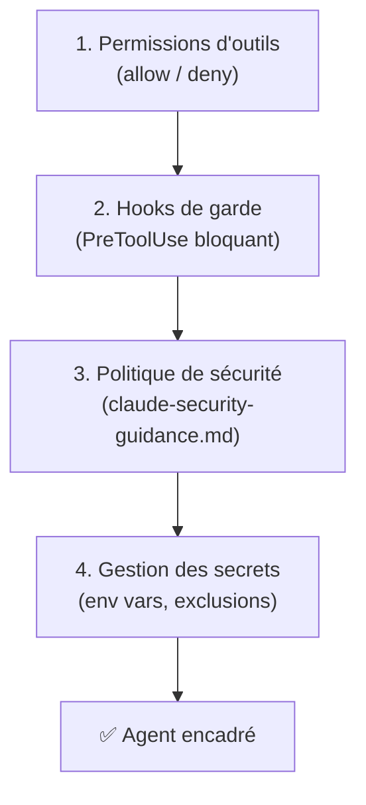
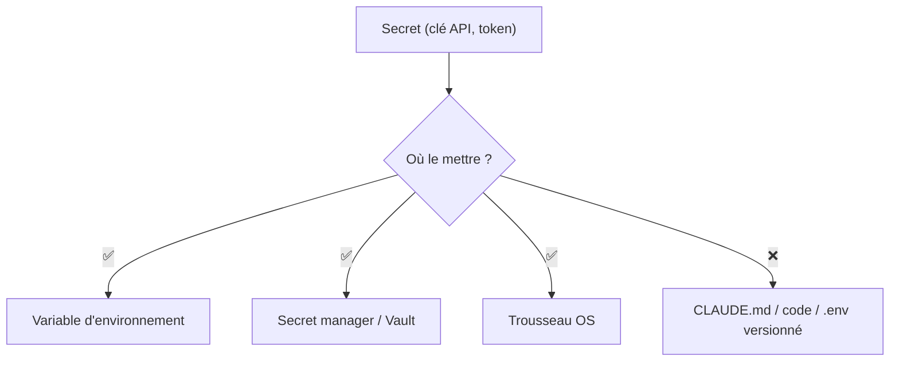

# Sécurité & gouvernance avec Claude Code

<span class="badge-expert">Expert</span> <span class="badge-cli">CLI</span>

Donner à un agent l'accès à votre code, votre terminal et vos systèmes externes exige des garde-fous. Claude Code fournit un arsenal natif : **permissions d'outils**, **hooks de garde**, **politique de sécurité versionnée** et **gestion des secrets**. Cette page détaille comment encadrer Claude sans brider la productivité.

!!! danger "Principe directeur : moindre privilège"
    Claude agit avec **vos droits**. Chaque outil autorisé, chaque serveur MCP, chaque hook est une surface d'attaque potentielle. Accordez le **minimum** nécessaire, et auditez régulièrement.

---

## Les quatre couches de défense



| Couche | Rôle | Où |
|--------|------|-----|
| Permissions d'outils | Autoriser/interdire des actions | `settings.json` |
| Hooks de garde | Bloquer dynamiquement avant exécution | `hooks/` + `settings.json` |
| Politique de sécurité | Règles d'analyse (secrets, injection…) | `claude-security-guidance.md` |
| Gestion des secrets | Empêcher les fuites | env vars, `permissions.deny` |

---

## Couche 1 — Permissions d'outils

`settings.json` contrôle finement ce que Claude peut faire, via des règles `allow`, `deny` et `ask`.

```json
{
  "permissions": {
    "allow": [
      "Read(./src/**)",
      "Bash(npm run test:*)",
      "Bash(git status)",
      "Bash(git diff:*)"
    ],
    "deny": [
      "Read(./.env)",
      "Read(./secrets/**)",
      "Bash(rm -rf:*)",
      "Bash(curl:*)"
    ],
    "ask": [
      "Bash(git push:*)"
    ]
  }
}
```

| Règle | Effet |
|-------|-------|
| `allow` | Action autorisée sans confirmation |
| `deny` | Action **toujours** refusée |
| `ask` | Demande confirmation à l'utilisateur |

!!! tip "Commencer restrictif, élargir au besoin"
    Démarrez avec un `allow` étroit (lecture du code, tests) et un `deny` large (secrets, commandes destructrices, réseau). Élargissez seulement quand un usage légitime le justifie. C'est l'inverse qui est dangereux.

!!! warning "Attention aux commandes réseau et destructrices"
    Mettez en `deny` ou `ask` : `rm -rf`, `curl`/`wget` (exfiltration possible), `git push --force`, `DROP TABLE`, et toute commande qui modifie l'infrastructure.

---

## Couche 2 — Hooks de garde

Un hook `PreToolUse` qui sort avec le **code 2** bloque l'action et renvoie le motif à Claude. C'est la défense **dynamique** : elle inspecte le contenu réel de l'action.

### Hook anti-secrets

`.claude/hooks/block-secrets.py`

```python
#!/usr/bin/env python3
import json, re, sys

PATTERNS = [
    r"sk-ant-[A-Za-z0-9-]{20,}",          # clé Anthropic
    r"AKIA[0-9A-Z]{16}",                  # clé AWS
    r"-----BEGIN (RSA|EC|OPENSSH) PRIVATE KEY-----",
    r"(?i)(password|secret|token)\s*=\s*['\"][^'\"]{6,}['\"]",
]

data = json.load(sys.stdin)
content = data.get("tool_input", {}).get("content", "")

for pat in PATTERNS:
    if re.search(pat, content):
        print(f"Secret potentiel détecté ({pat}) — édition bloquée.",
              file=sys.stderr)
        sys.exit(2)   # bloque et notifie Claude
sys.exit(0)
```

### Hook anti-fichiers sensibles

`.claude/hooks/block-sensitive-paths.py`

```python
#!/usr/bin/env python3
import json, sys

BLOCKED = (".env", "id_rsa", ".pem", "credentials", ".aws/")

data = json.load(sys.stdin)
path = data.get("tool_input", {}).get("file_path", "")

if any(b in path for b in BLOCKED):
    print(f"Accès refusé au chemin sensible : {path}", file=sys.stderr)
    sys.exit(2)
sys.exit(0)
```

### Déclaration

`.claude/settings.json`

```json
{
  "hooks": {
    "PreToolUse": [
      { "matcher": "Edit|Write", "command": ".claude/hooks/block-secrets.py" },
      { "matcher": "Read|Edit|Write", "command": ".claude/hooks/block-sensitive-paths.py" }
    ]
  }
}
```

| Code de sortie | Effet |
|:--------------:|-------|
| `0` | Action autorisée |
| `1` | Avertit l'utilisateur, action poursuivie |
| `2` | **Bloque** l'action, message renvoyé à Claude |

!!! danger "Un hook s'exécute avec vos droits"
    Relisez chaque hook en pull request comme du code de production. N'exécutez **jamais** un hook venant d'une source non vérifiée : c'est une porte d'entrée pour l'exécution de code arbitraire.

---

## Couche 3 — Politique de sécurité versionnée

Centralisez vos règles d'analyse de sécurité dans un fichier dédié, décliné en **trois niveaux** (du plus général au plus spécifique) :

| Niveau | Fichier | Portée |
|--------|---------|--------|
| Utilisateur | `~/.claude/claude-security-guidance.md` | Toutes vos sessions |
| Projet | `.claude/claude-security-guidance.md` | Le dépôt (versionné) |
| Local | `.claude/claude-security-guidance.local.md` | Surcharges perso (non versionné) |

```markdown
# Politique de sécurité — Projet

## Détection obligatoire
- Secrets en dur (clés, mots de passe, jetons)
- Injection SQL/NoSQL (requêtes concaténées)
- XSS (sorties non échappées)
- SSRF (appels HTTP vers des URL contrôlées par l'utilisateur)
- Désérialisation non sûre

## Règles de remédiation
- Secrets → variable d'environnement ou secret manager, + rotation
- Entrées → validation systématique (allow-list)
- Requêtes → requêtes paramétrées uniquement
```

!!! tip "Les trois niveaux se cumulent"
    Le niveau projet est partagé par l'équipe ; le niveau local permet à chacun d'ajouter des règles sans polluer le dépôt. Ajoutez `*.local.md` au `.gitignore`.

---

## Couche 4 — Gestion des secrets



| À faire | À ne jamais faire |
|---------|-------------------|
| `export ANTHROPIC_API_KEY=...` | Clé en dur dans `CLAUDE.md` |
| Référencer `${GITHUB_TOKEN}` dans `.mcp.json` | Token en clair dans un fichier versionné |
| `permissions.deny: ["Read(./.env)"]` | Laisser Claude lire `.env` |
| `settings.local.json` dans `.gitignore` | Committer `settings.local.json` |

!!! warning "Vérifiez votre historique Git"
    Un secret committé reste dans l'historique même après suppression. En cas de fuite : **révoquez immédiatement** la clé, puis nettoyez l'historique (`git filter-repo`) et forcez la rotation.

---

## Checklist de gouvernance d'équipe

- [ ] `permissions.deny` couvre secrets, commandes destructrices et réseau
- [ ] Hook anti-secrets actif en `PreToolUse`
- [ ] Hook anti-chemins sensibles actif
- [ ] `claude-security-guidance.md` versionné et à jour
- [ ] `settings.local.json` et `*.local.md` dans `.gitignore`
- [ ] Tous les jetons via variables d'environnement
- [ ] Serveurs MCP audités (`/mcp`), droits minimaux
- [ ] Revue obligatoire en PR des changements de `.claude/`
- [ ] Procédure de réponse à incident (révocation, rotation) documentée

!!! success "La sécurité est un processus, pas un fichier"
    Ces couches se renforcent mutuellement. Mais la mesure la plus efficace reste la **revue humaine** : faites relire tout changement de `.claude/` (hooks, permissions, MCP) comme du code critique.

---

## Prochaine étape

**[Plugins d'équipe](plugins-equipe.md)** : packager et partager une configuration `.claude/` sécurisée et cohérente entre tous vos dépôts.

Concepts clés couverts :

- **Anatomie d'un plugin** — `.claude-plugin/plugin.json` et son contenu
- **Mutualisation** — commands, skills, agents et hooks partagés
- **Distribution** — référencer un plugin dans plusieurs projets
- **Cohérence multi-IDE** — même config dans VS Code et JetBrains

---

## Sources

- [Anthropic — Hooks reference](https://docs.anthropic.com/en/docs/claude-code/hooks) - consulté le 2026-06-20
- [Anthropic — Settings & permissions](https://docs.anthropic.com/en/docs/claude-code/settings) - consulté le 2026-06-20
- [Anthropic — Security](https://docs.anthropic.com/en/docs/claude-code/security) - consulté le 2026-06-20
- [Anthropic — Identity and access management](https://docs.anthropic.com/en/docs/claude-code/iam) - consulté le 2026-06-20

