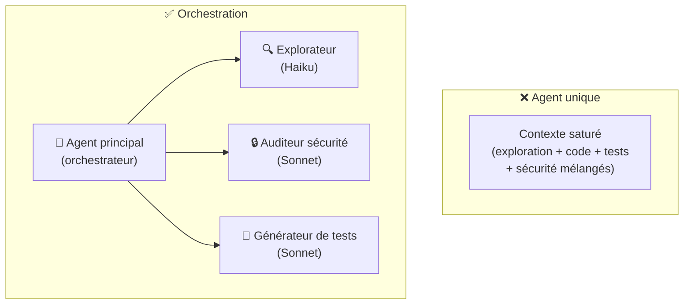
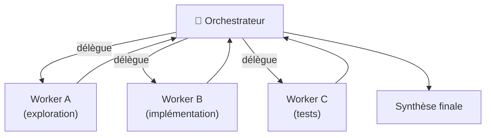
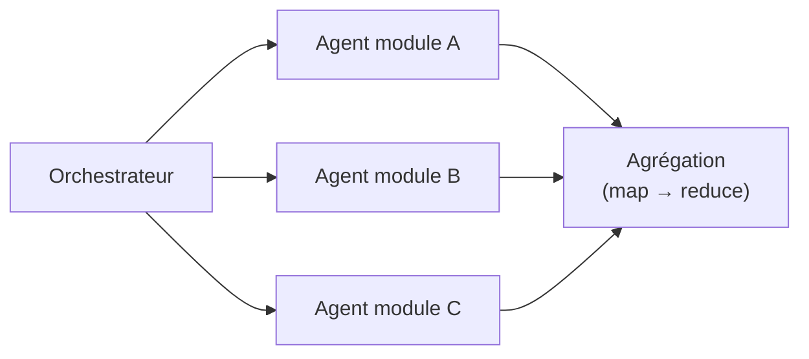
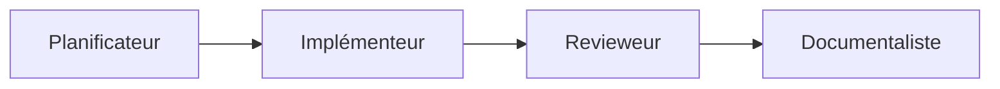
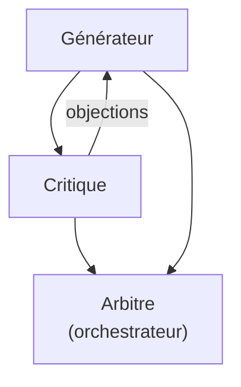
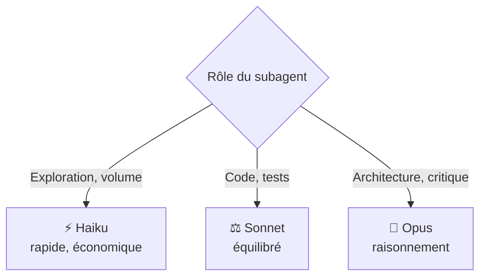

# Orchestration multi-agents avec Claude Code

<span class="badge-expert">Expert</span> <span class="badge-cli">CLI</span>

Un seul agent généraliste atteint vite ses limites sur les tâches complexes : le contexte se sature, les responsabilités se mélangent, la qualité baisse. La réponse de Claude Code est l'**orchestration multi-agents** : un agent principal qui délègue à des **subagents** spécialisés, chacun avec son propre contexte, ses outils et son modèle. Cette page détaille les patterns, la mécanique et les pièges.

!!! info "Pré-requis"
    Cette page approfondit les [subagents introduits dans l'architecture `.claude/`](architecture-claude.md#agents-subagents-isoles). Pour l'usage côté Copilot et la vue comparative, voir [Orchestration multi-agents (Copilot & Claude)](../chapitre-4-contexte/orchestration-multi-agents.md).

---

## Pourquoi orchestrer plusieurs agents ?



| Sans orchestration | Avec orchestration |
|--------------------|--------------------|
| Un contexte qui gonfle et se pollue | Chaque subagent a un **contexte propre** |
| Un seul modèle pour tout | Le **bon modèle par tâche** (coût optimisé) |
| Responsabilités mélangées | Spécialisation claire |
| Difficile à paralléliser | Exploration/audit **en parallèle** |

!!! tip "Le principe clé : l'isolation du contexte"
    Un subagent travaille dans sa **propre fenêtre de contexte**. Il peut lire des milliers de lignes sans polluer la conversation principale : seul son **résultat synthétique** remonte à l'orchestrateur. C'est ce qui rend l'orchestration à la fois plus propre et moins coûteuse.

---

## Anatomie d'un subagent

Rappel de la structure (voir [architecture](architecture-claude.md#agents-subagents-isoles)) :

```markdown
---
name: schema-explorer
description: "Explore le schéma de base et les mappers pour répondre à des questions structurelles. À invoquer pour toute analyse de modèle de données."
tools: [read, grep, bash]
model: claude-haiku-4
color: blue
---

Tu es un explorateur de schéma. Pour chaque mission :
1. Cartographie les tables, colonnes et relations concernées.
2. Repère les colonnes inutilisées ou manquantes.
3. Réponds de façon SYNTHÉTIQUE (le contexte principal est limité).
Ne modifie aucun fichier ; tu produis une analyse.
```

| Champ | Rôle dans l'orchestration |
|-------|---------------------------|
| `description` | Déclenche l'**invocation automatique** par l'orchestrateur quand la tâche correspond |
| `tools` | Liste blanche : un explorateur n'a pas besoin d'écrire |
| `model` | Modèle dédié : Haiku pour le volume, Opus pour le raisonnement |
| `color` | Repérage visuel dans le chat |

!!! warning "La `description` est le routeur"
    L'orchestrateur choisit quel subagent appeler **en lisant les `description`**. Rédigez-les comme des règles de routage explicites (« À invoquer pour… »), sinon Claude ne saura pas quand déléguer.

---

## Les patterns d'orchestration

### 1. Orchestrateur / workers

L'agent principal découpe la tâche et délègue à des spécialistes, puis synthétise.



**Usage** : feature complète (explorer → coder → tester). Le pattern le plus courant.

### 2. Exploration parallèle (map)

Plusieurs subagents explorent **en parallèle** des parties différentes, puis l'orchestrateur agrège (reduce).



**Usage** : auditer un gros monorepo, analyser plusieurs services simultanément. Gain de temps majeur.

### 3. Pipeline séquentiel

Chaque agent transforme la sortie du précédent.



**Usage** : workflow où chaque étape dépend de la précédente (plan → code → revue → doc).

### 4. Critique / débat (review-critic)

Un agent produit, un autre critique, l'orchestrateur arbitre.



**Usage** : décisions d'architecture, choix sensibles où une contradiction améliore la qualité.

| Pattern | Quand l'utiliser | Bénéfice principal |
|---------|------------------|--------------------|
| Orchestrateur/workers | Feature multi-étapes | Spécialisation + synthèse |
| Exploration parallèle | Gros codebase, audit large | Vitesse |
| Pipeline | Étapes dépendantes | Clarté du flux |
| Critique/débat | Décisions sensibles | Qualité par contradiction |

---

## Mettre en place une orchestration

### Définir les subagents

```text
.claude/agents/
├─ explorer.md          # Haiku — cartographie rapide
├─ implementer.md       # Sonnet — écrit le code
├─ test-writer.md       # Sonnet — génère les tests
└─ security-critic.md   # Opus — critique sécurité
```

### Guider l'orchestrateur depuis `CLAUDE.md`

```markdown
## Orchestration
Pour une nouvelle feature, procède ainsi :
1. Délègue l'exploration à `explorer` (ne code pas avant d'avoir le plan).
2. Confie l'implémentation à `implementer`.
3. Fais générer les tests par `test-writer`.
4. Termine par une revue de `security-critic` avant de conclure.
Synthétise chaque résultat avant de passer à l'étape suivante.
```

### Piloter dans le REPL

```text
/agents          # lister, créer, inspecter les subagents
```

```text
Implémente la feature « export CSV des réservations ».
Utilise nos subagents : explore d'abord, puis code, puis teste,
puis fais auditer la sécurité.
```

!!! info "Invocation automatique vs explicite"
    L'orchestrateur peut invoquer un subagent **automatiquement** (selon sa `description`) ou vous pouvez le **demander explicitement** (« fais auditer par `security-critic` »). Les deux fonctionnent ; l'explicite donne plus de contrôle.

---

## Choisir le modèle par agent



| Subagent | Modèle | Justification |
|----------|:------:|---------------|
| Explorateur de schéma/code | Haiku | Beaucoup de lecture, synthèse simple |
| Implémenteur | Sonnet | Génération de code quotidienne |
| Générateur de tests | Sonnet | Suffisant et rapide |
| Critique d'architecture/sécurité | Opus | Raisonnement et contradiction |

!!! tip "L'orchestration optimise le coût"
    Confier l'exploration volumineuse à **Haiku** plutôt qu'à l'orchestrateur (souvent Sonnet/Opus) réduit fortement la facture : vous ne payez le modèle cher que là où le raisonnement le justifie. Voir [Coûts & quotas](couts-quotas.md).

---

## Bonnes pratiques

| Pratique | Pourquoi |
|----------|----------|
| **Un subagent = un rôle** | Évite les agents « fourre-tout » ingérables |
| **Outils minimaux par agent** | Un explorateur ne doit pas pouvoir écrire/exécuter |
| **`description` en règle de routage** | L'orchestrateur sait quand déléguer |
| **Demander des sorties synthétiques** | Le résultat remonte sans saturer le contexte principal |
| **Modèle adapté par agent** | Qualité où il faut, économie ailleurs |
| **Versionner les agents** | Reproductibilité et partage d'équipe ([plugins](plugins-equipe.md)) |
| **Limiter la profondeur** | Un subagent qui appelle un subagent qui… devient illisible |

---

## Anti-patterns à éviter

| ❌ Anti-pattern | ✅ Correctif |
|----------------|-------------|
| Un « super-agent » qui fait tout | Décomposer en subagents spécialisés |
| Subagents aux `description` vagues | Décrire précisément quand les invoquer |
| Tous les agents en Opus | Haiku/Sonnet selon la tâche |
| Faire remonter tout le contexte d'un subagent | Exiger une synthèse |
| Chaînes d'agents trop profondes | Garder une orchestration plate et lisible |
| Outils larges « au cas où » | Liste blanche stricte par agent |

!!! danger "Plus d'agents ≠ meilleur"
    L'orchestration a un coût (latence, tokens, complexité). Pour une tâche simple, **un seul agent suffit**. N'orchestrez que lorsque la tâche le justifie réellement : multi-étapes, gros volume, ou besoin de contradiction.

---

## Prochaine étape

**[MCP — connecter des sources externes](mcp-sources-externes.md)** : donner à vos subagents l'accès à GitHub, Jira ou des bases de données pour des orchestrations encore plus puissantes.

Concepts clés couverts :

- **Protocole MCP** — comment Claude consomme des sources externes
- **Serveurs courants** — GitHub, fichiers, bases de données, outils internes
- **Configuration** — déclarer un serveur MCP dans `.claude/`
- **Sécurité** — permissions et périmètre d'accès des serveurs

---

## Sources

- [Anthropic — Subagents](https://docs.anthropic.com/en/docs/claude-code/sub-agents) - consulté le 2026-06-20
- [Anthropic — Common workflows (orchestration)](https://docs.anthropic.com/en/docs/claude-code/common-workflows) - consulté le 2026-06-20
- [Anthropic — Building effective agents (ingénierie)](https://www.anthropic.com/research/building-effective-agents) - consulté le 2026-06-20
- [Anthropic — Models overview](https://docs.anthropic.com/en/docs/about-claude/models) - consulté le 2026-06-20

