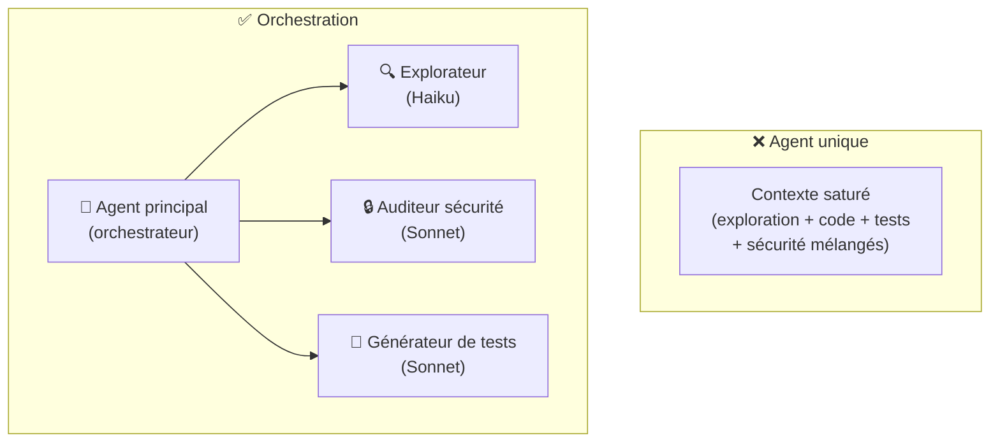
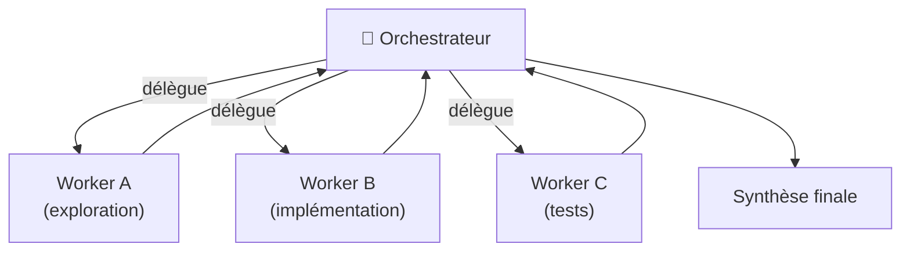
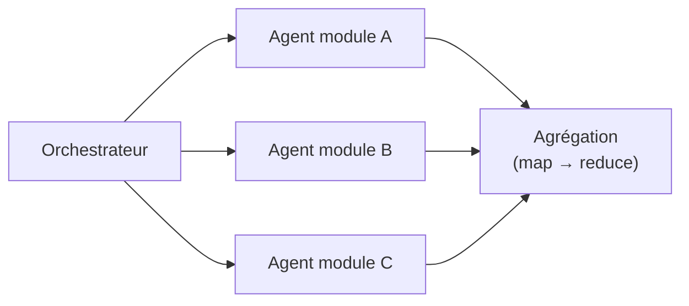
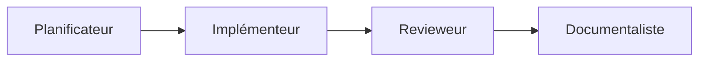
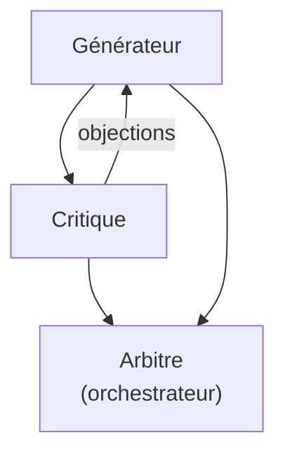
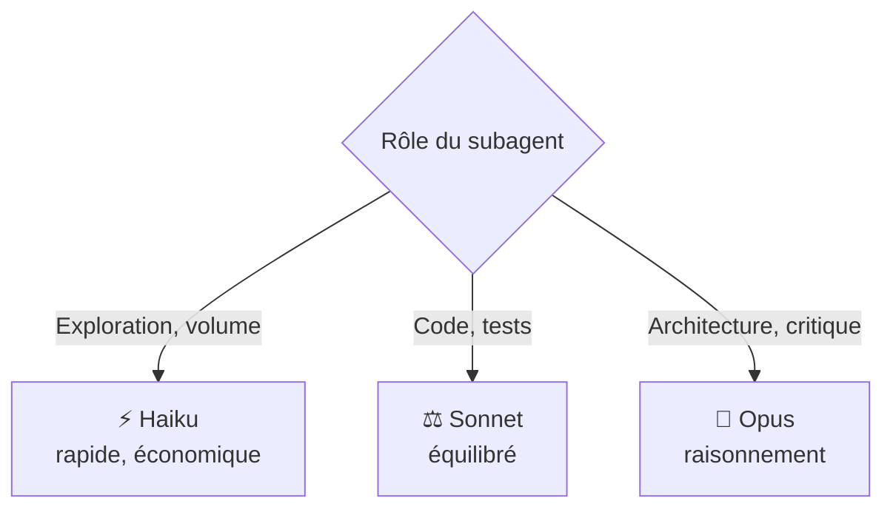

# Orchestration multi-agents avec Claude Code

<span class="badge-expert">Expert</span> <span class="badge-cli">CLI</span>

L'**orchestration multi-agents** consiste à confier des missions bornées à des assistants spécialisés, puis à vérifier et intégrer leurs résultats. L'agent principal garde la responsabilité de la tâche. Ce découpage peut aider pour une exploration volumineuse ou des vérifications indépendantes ; une correction simple reste souvent plus efficace avec un seul agent.

---

## Qu'est-ce qu'un subagent, concrètement ?

Un **subagent** est une exécution de Claude à laquelle l'agent principal délègue une mission. Le fichier `.claude/agents/<nom>.md` définit ses instructions, ses outils et éventuellement son modèle. Ce fichier est une définition réutilisable ; il ne lance pas un processus permanent lorsque vous ouvrez le dépôt.

| Mécanisme | Fonctionnement | Exemple |
|---|---|---|
| Agent principal | Suit la demande et intègre les résultats | Corriger l'export CSV de l'application |
| Subagent spécialisé | Reçoit une mission dans un contexte séparé et renvoie un résultat | Examiner les règles d'accès à l'export |
| Skill | Fournit une procédure ou des connaissances à l'agent qui l'utilise ; peut être configuré pour un contexte séparé | Appliquer les conventions CSV de l'équipe |
| Agent team | Coordonne des sessions de coéquipiers et une liste de tâches ; mécanisme distinct | Travaux coordonnés sur plusieurs composants |

### Ce qui se passe lors d'une délégation

1. **Découper** : le principal choisit une question précise, par exemple « quels contrôles empêchent un utilisateur d'exporter les données d'une autre organisation ? ».
2. **Transmettre** : il fournit les chemins utiles, contraintes, critères de réussite et format de retour. Un subagent spécialisé démarre avec sa définition et la mission, sans reprendre automatiquement tout l'historique du principal.
3. **Exécuter** : le subagent lit les fichiers, utilise ses outils autorisés et produit son analyse. Ses appels d'outils alimentent son propre contexte.
4. **Rendre compte** : son résultat revient au principal, avec preuves, limites et éventuels changements effectués.
5. **Intégrer et vérifier** : le principal compare les résultats, résout les contradictions, examine le diff et exécute les validations pertinentes avant de conclure.

Un **fork** constitue une exception : il reprend le contexte de la conversation au moment du lancement. Ne supposez donc pas que tous les types de subagents démarrent avec le même historique. Voir [les différences entre forks et subagents spécialisés](https://code.claude.com/docs/en/sub-agents#how-forks-differ-from-other-subagents).

### Contexte séparé ne signifie pas fichiers séparés

Par défaut, les subagents travaillent dans le dépôt de la session : leurs modifications peuvent être visibles par le principal et les autres agents. Deux agents qui écrivent dans le même fichier risquent de se gêner même si leurs conversations sont séparées.

Pour des implémentations indépendantes, utiliser `isolation: worktree` sur les agents concernés, ou attribuer des fichiers disjoints. Un worktree fournit une copie de travail Git distincte ; il faut ensuite examiner et intégrer ses changements. Il n'isole pas automatiquement les services externes, bases de données ou ports utilisés par les tests.

### Premier plan, arrière-plan et dépendances

Au **premier plan**, le principal attend le résultat. En **arrière-plan**, le travail peut avancer pendant que le principal traite une partie indépendante. Les demandes de permission des agents sont présentées dans la session principale : l'arrière-plan ne supprime pas les autorisations nécessaires.

Si les tests dépendent du correctif, attendre l'implémentation avant de lancer la validation de ce correctif. En revanche, l'analyse des règles d'accès et celle du format CSV peuvent commencer en parallèle si elles sont en lecture seule.

## Quand déléguer et quand rester avec un seul agent ?

| Situation | Choix utile | Pourquoi |
|---|---|---|
| Faute de texte ou petite correction dans un fichier connu | Agent principal seul | Le transfert et la synthèse coûteraient plus que le travail |
| Comprendre trois modules avant de modifier le code | Subagents de lecture par module | Les explorations sont indépendantes et leurs sorties peuvent être résumées |
| Plan → code → tests sur les mêmes fichiers | Étapes séquentielles | Chaque étape doit voir le résultat stabilisé de la précédente |
| Implémenter deux modules réellement indépendants | Agents avec périmètres distincts ou worktrees | Réduit les conflits d'écriture |
| Vérifier un changement d'authentification | Relecteur séparé avec preuves demandées | Apporte un second examen ; le nombre d'agents ne garantit pas la sécurité |
| La mission nécessite presque tout l'historique actuel | Principal ou fork, selon le besoin | Évite de perdre les décisions lors d'un transfert incomplet |

### Exemple de mission exploitable

```text
Utilise schema-explorer pour examiner l'export CSV, en lecture seule.
Périmètre : src/export/, src/auth/ et les tests correspondants.
Question : où est vérifiée l'appartenance à l'organisation ?
Ne modifie rien et ne lance pas de service.
Retour attendu : chemins et lignes, flux d'appel, contrôle absent éventuel,
test qui prouve le problème ou proposition de test, incertitudes restantes.
Attends son résultat avant de choisir le correctif.
```

La sortie doit être contrôlable : « aucun problème » sans chemins, raisonnement ni validation ne suffit pas. Pour une mission d'implémentation, demander aussi les fichiers modifiés, commandes exécutées, résultats de tests et travail restant.

---

## Pourquoi orchestrer plusieurs agents ?


```mermaid
graph TD
    subgraph "❌ Agent unique"
        A1["Contexte saturé\n(exploration + code + tests\n+ sécurité mélangés)"]
    end
    subgraph "✅ Orchestration"
        O["🎯 Agent principal\n(orchestrateur)"]
        O --> S1["🔍 Explorateur\n(Haiku)"]
        O --> S2["🔒 Auditeur sécurité\n(Sonnet)"]
        O --> S3["🧪 Générateur de tests\n(Sonnet)"]
    end
```

| Sans orchestration | Avec orchestration |
|--------------------|--------------------|
| Un contexte qui gonfle et se pollue | Chaque subagent a un **contexte propre** |
| Un seul modèle pour tout | Le **bon modèle par tâche** (coût optimisé) |
| Responsabilités mélangées | Spécialisation claire |
| Difficile à paralléliser | Exploration/audit **en parallèle** |

!!! tip "Le principe clé : l'isolation du contexte"
    Les lectures d'un subagent spécialisé restent dans sa **propre fenêtre de contexte** ; sa synthèse rejoint celle du principal. Cela réduit le bruit dans la conversation principale, mais les lectures, sorties et synthèses consomment toujours des tokens. L'économie doit être mesurée.

---

## Anatomie d'un subagent

Rappel de la structure (voir [architecture](architecture-claude.md#agents-subagents-isoles)) :

```markdown
---
name: schema-explorer
description: "Explore le schéma de base et les mappers pour répondre à des questions structurelles. À invoquer pour toute analyse de modèle de données."
tools: Read, Glob, Grep
model: haiku
color: blue
---

Tu es un explorateur de schéma. Pour chaque mission :
1. Cartographie les tables, colonnes et relations concernées.
2. Repère les colonnes inutilisées ou manquantes.
3. Réponds de façon SYNTHÉTIQUE (le contexte principal est limité).
Ne modifie aucun fichier ; tu produis une analyse.
```

| Champ | Rôle dans l'orchestration |
|-------|---------------------------|
| `description` | Aide le principal à décider quand déléguer ; ce n'est pas un déclencheur garanti |
| `tools` | Liste blanche : un explorateur n'a pas besoin d'écrire |
| `model` | Modèle dédié : Haiku pour le volume, Opus pour le raisonnement |
| `color` | Repérage visuel dans le chat |

!!! warning "La `description` est le routeur"
    L'orchestrateur choisit quel subagent appeler **en lisant les `description`**. Rédigez-les comme des règles de routage explicites (« À invoquer pour… »), sinon Claude ne saura pas quand déléguer.

---

### 1. Orchestrateur / workers

L'agent principal découpe la tâche et délègue à des spécialistes, puis synthétise.


```mermaid
graph TD
    O["🎯 Orchestrateur"] -->|délègue| W1["Worker A\n(exploration)"]
    O -->|délègue| W2["Worker B\n(implémentation)"]
    O -->|délègue| W3["Worker C\n(tests)"]
    W1 --> O
    W2 --> O
    W3 --> O
    O --> R["Synthèse finale"]
```

**Usage** : feature complète (explorer → coder → tester). Le pattern le plus courant.

### 2. Exploration parallèle (map)

Plusieurs subagents explorent **en parallèle** des parties différentes, puis l'orchestrateur agrège (reduce).


```mermaid
graph LR
    O["Orchestrateur"] --> A["Agent module A"]
    O --> B["Agent module B"]
    O --> C["Agent module C"]
    A --> M["Agrégation\n(map → reduce)"]
    B --> M
    C --> M
```

**Usage** : auditer un gros monorepo, analyser plusieurs services simultanément. Gain de temps majeur.

### 3. Pipeline séquentiel

Chaque agent transforme la sortie du précédent.


```mermaid
graph LR
    P["Planificateur"] --> I["Implémenteur"]
    I --> R["Revieweur"]
    R --> D["Documentaliste"]
```

**Usage** : workflow où chaque étape dépend de la précédente (plan → code → revue → doc).

### 4. Critique / débat (review-critic)

Un agent produit, un autre critique, l'orchestrateur arbitre.


```mermaid
graph TD
    G["Générateur"] --> C["Critique"]
    C -->|objections| G
    C --> J["Arbitre\n(orchestrateur)"]
    G --> J
```

**Usage** : décisions d'architecture, choix sensibles où une contradiction améliore la qualité.

| Pattern | Quand l'utiliser | Bénéfice principal |
|---------|------------------|--------------------|
| Orchestrateur/workers | Feature multi-étapes | Spécialisation + synthèse |
| Exploration parallèle | Gros codebase, audit large | Vitesse |
| Pipeline | Étapes dépendantes | Clarté du flux |
| Critique/débat | Décisions sensibles | Qualité par contradiction |

---

### Définir les subagents

```text
.claude/agents/
├─ explorer.md          # Haiku — cartographie rapide
├─ implementer.md       # Sonnet — écrit le code
├─ test-writer.md       # Sonnet — génère les tests
└─ security-critic.md   # Opus — critique sécurité
```

### Guider l'orchestrateur depuis `CLAUDE.md`

```markdown
## Orchestration
Pour une nouvelle feature, procède ainsi :
1. Délègue l'exploration à `explorer` (ne code pas avant d'avoir le plan).
2. Confie l'implémentation à `implementer`.
3. Fais générer les tests par `test-writer`.
4. Termine par une revue de `security-critic` avant de conclure.
Synthétise chaque résultat avant de passer à l'étape suivante.
```

### Piloter dans le REPL

```text
/agents          # lister, créer, inspecter les subagents
```

```text
Implémente la feature « export CSV des réservations ».
Utilise nos subagents : explore d'abord, puis code, puis teste,
puis fais auditer la sécurité.
```

!!! info "Invocation automatique vs explicite"
    L'orchestrateur peut invoquer un subagent **automatiquement** (selon sa `description`) ou vous pouvez le **demander explicitement** (« fais auditer par `security-critic` »). Les deux fonctionnent ; l'explicite donne plus de contrôle.

---

## Choisir le modèle par agent


```mermaid
graph TD
    Q{"Rôle du subagent"}
    Q -->|Exploration, volume| H["⚡ Haiku\nrapide, économique"]
    Q -->|Code, tests| S["⚖️ Sonnet\néquilibré"]
    Q -->|Architecture, critique| O["🧠 Opus\nraisonnement"]
```

| Subagent | Modèle | Justification |
|----------|:------:|---------------|
| Explorateur de schéma/code | Haiku | Beaucoup de lecture, synthèse simple |
| Implémenteur | Sonnet | Génération de code quotidienne |
| Générateur de tests | Sonnet | Suffisant et rapide |
| Critique d'architecture/sécurité | Opus | Raisonnement et contradiction |

!!! tip "Mesurer le coût complet"
    Un modèle moins coûteux peut convenir à une exploration bornée. Comptez aussi le transfert, les lectures répétées, les synthèses et le rework. Comparez avec un agent unique sur la même tâche avant de conclure à une économie. Voir [Coûts & quotas](couts-quotas.md).

---

## Bonnes pratiques

| Pratique | Pourquoi |
|----------|----------|
| **Un subagent = un rôle** | Évite les agents « fourre-tout » ingérables |
| **Outils minimaux par agent** | Un explorateur ne doit pas pouvoir écrire/exécuter |
| **`description` en règle de routage** | L'orchestrateur sait quand déléguer |
| **Demander des sorties synthétiques** | Le résultat remonte sans saturer le contexte principal |
| **Modèle adapté par agent** | Qualité où il faut, économie ailleurs |
| **Versionner les agents** | Reproductibilité et partage d'équipe ([plugins](plugins-equipe.md)) |
| **Limiter la profondeur** | Un subagent qui appelle un subagent qui… devient illisible |

---

## Anti-patterns à éviter

Les pièges les plus concrets sont les suivants :

- **Écritures concurrentes sur les mêmes fichiers** : utiliser un responsable unique, des étapes séquentielles ou des worktrees.
- **Mission vague ou sans contexte** : préciser le périmètre, la question, les contraintes et les preuves attendues ; le principal doit transmettre les décisions pertinentes.
- **Tests lancés trop tôt** : attendre le diff qu'ils doivent vérifier et identifier la copie de travail testée.
- **Confiance automatique dans une synthèse** : relire les fichiers cités et vérifier les affirmations importantes ; plusieurs agents peuvent partager la même erreur.
- **Agents de lecture avec outils d'écriture ou shell inutile** : limiter explicitement `tools`, comme dans `schema-explorer` ci-dessus.
- **Délégation récursive incontrôlée** : commencer avec un niveau ; chaque étage ajoute coordination et consommation. La documentation actuelle autorise par défaut jusqu'à trois niveaux sous le principal, configurables via `CLAUDE_CODE_MAX_SUBAGENT_SPAWN_DEPTH`. Définir `1` pour empêcher l'imbrication ; retirer `Agent` des outils d'un spécialiste qui ne doit pas déléguer.
- **Services et ressources partagés oubliés** : réserver les ports et jeux de données ; un worktree ne rend pas un test contre une base commune indépendant.

| ❌ Anti-pattern | ✅ Correctif |
|----------------|-------------|
| Un « super-agent » qui fait tout | Décomposer en subagents spécialisés |
| Subagents aux `description` vagues | Décrire précisément quand les invoquer |
| Tous les agents en Opus | Haiku/Sonnet selon la tâche |
| Faire remonter tout le contexte d'un subagent | Exiger une synthèse |
| Chaînes d'agents trop profondes | Garder une orchestration plate et lisible |
| Outils larges « au cas où » | Liste blanche stricte par agent |

!!! danger "Plus d'agents ≠ meilleur"
    L'orchestration a un coût (latence, tokens, complexité). Pour une tâche simple, **un seul agent suffit**. N'orchestrez que lorsque la tâche le justifie réellement : multi-étapes, gros volume, ou besoin de contradiction.

---

## Référence en annexe

[Copilot — archive de ce chapitre](../appendices/copilot/chapitre-3b-claude-code-migration-copilot.md#page-chapitre-3b-claude-code-migration-copilot-subagents-orchestration).

## Prochaine étape

Poursuivez avec **[MCP — sources externes](mcp-sources-externes.md)**, la page suivante dans le menu.

## Sources

Pour les sessions détachées et la coopération entre sessions, consultez [Background agents et agent teams](../chapitre-4-contexte/orchestration-multi-agents.md). Cette page détaille leur création, leur suivi, les restrictions actuelles et les différences avec un subagent.

Fonctionnement, exemples et limites revérifiés le **3 octobre 2026** :

- [Claude Code — Subagents, contexte, forks et imbrication](https://code.claude.com/docs/en/sub-agents)
- [Claude Code — Worktrees et isolation](https://code.claude.com/docs/en/worktrees)

- [Anthropic — Subagents](https://docs.anthropic.com/en/docs/claude-code/sub-agents) - consulté le 2026-06-20
- [Anthropic — Common workflows (orchestration)](https://docs.anthropic.com/en/docs/claude-code/common-workflows) - consulté le 2026-06-20
- [Anthropic — Building effective agents (ingénierie)](https://www.anthropic.com/research/building-effective-agents) - consulté le 2026-06-20
- [Anthropic — Models overview](https://docs.anthropic.com/en/docs/about-claude/models) - consulté le 2026-06-20
