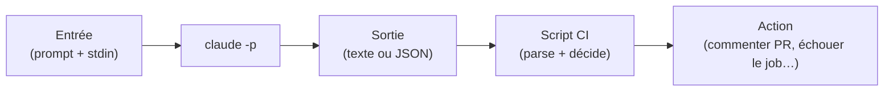
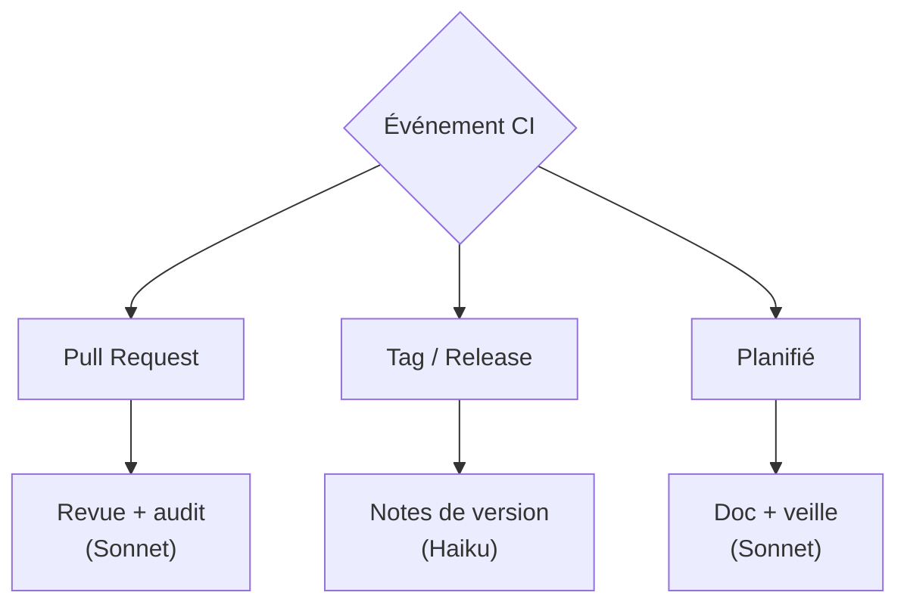

# Workflows CI & automatisation

<span class="badge-expert">Expert</span> <span class="badge-cli">CLI</span>

Claude Code n'est pas réservé au REPL interactif. Grâce au **mode `-p` (print)**, il devient un maillon de vos pipelines : revue de PR automatique, génération de notes de version, audit de sécurité en CI, hooks pré-commit. Cette page montre comment scripter Claude de façon non interactive, avec des exemples GitHub Actions, GitLab CI et Git hooks.

!!! warning "Coût et secrets en CI"
    L'automatisation peut multiplier les appels à Claude. Surveillez le budget (voir [Coûts & quotas](couts-quotas.md)) et gérez la clé API via les **secrets du CI**, jamais en clair dans le YAML.

---

## Le mode non interactif `-p`

```bash
claude -p "Résume les changements et propose un message de commit"
```

| Option | Effet |
|--------|-------|
| `-p`, `--print` | Exécute la requête et imprime la réponse, sans REPL |
| `--output-format json` | Sortie structurée (exploitable par un script) |
| `--output-format text` | Sortie texte brute (défaut) |
| `--model <nom>` | Force le modèle (ex. Haiku pour économiser en CI) |
| `--allowed-tools <liste>` | Restreint les outils utilisables |
| `--max-turns <n>` | Limite le nombre d'itérations de l'agent |



!!! tip "Toujours piper l'entrée"
    Combinez avec les pipes Unix pour passer du contexte dynamique :
    ```bash
    git diff origin/main...HEAD | claude -p "Revue de ce diff, risques priorisés"
    ```

---

## Exploiter une sortie JSON

```bash
claude -p "Audite ce diff. Réponds en JSON {verdict, issues[]}" \
  --output-format json --model claude-sonnet-4 < diff.txt > result.json
```

```bash
# Décider du statut du job à partir du verdict
verdict=$(jq -r '.verdict' result.json)
if [ "$verdict" = "REQUEST_CHANGES" ]; then
  echo "Revue Claude : changements demandés."
  exit 1   # fait échouer le job CI
fi
```

!!! info "Format strict = automatisation fiable"
    Demandez **explicitement** un JSON dans le prompt **et** utilisez `--output-format json`. Vous obtenez une sortie parsable par `jq`, pour piloter le résultat du pipeline sans ambiguïté.

---

## GitHub Actions

### Revue de PR automatique

`.github/workflows/claude-review.yml`

```yaml
name: Revue Claude

on:
  pull_request:
    types: [opened, synchronize]

jobs:
  review:
    runs-on: ubuntu-latest
    permissions:
      contents: read
      pull-requests: write   # pour commenter la PR
    steps:
      - uses: actions/checkout@v4
        with:
          fetch-depth: 0       # nécessaire pour le diff complet

      - name: Installer Claude Code
        run: curl -fsSL https://claude.ai/install.sh | bash

      - name: Revue du diff
        env:
          ANTHROPIC_API_KEY: ${{ secrets.ANTHROPIC_API_KEY }}
        run: |
          git diff origin/${{ github.base_ref }}...HEAD > diff.txt
          claude -p "Revue ce diff : risques sécurité/perf/régressions, \
            classés High/Medium/Low. Termine par APPROVE ou REQUEST_CHANGES." \
            --model claude-sonnet-4 --allowed-tools "" < diff.txt > review.md

      - name: Publier le commentaire
        env:
          GH_TOKEN: ${{ secrets.GITHUB_TOKEN }}
        run: gh pr comment ${{ github.event.pull_request.number }} --body-file review.md
```

!!! danger "Sécuriser le déclencheur"
    Sur un dépôt public, n'exécutez pas Claude sur les PR de forks non vérifiés avec accès aux secrets : utilisez `pull_request` (pas `pull_request_target`) et limitez les permissions. Un prompt injecté dans un diff malveillant pourrait tenter de détourner l'agent.

### Notes de version automatiques

`.github/workflows/release-notes.yml`

```yaml
name: Notes de version

on:
  push:
    tags: ['v*']

jobs:
  notes:
    runs-on: ubuntu-latest
    steps:
      - uses: actions/checkout@v4
        with: { fetch-depth: 0 }
      - run: curl -fsSL https://claude.ai/install.sh | bash
      - name: Générer le changelog
        env:
          ANTHROPIC_API_KEY: ${{ secrets.ANTHROPIC_API_KEY }}
        run: |
          prev=$(git describe --tags --abbrev=0 HEAD^ 2>/dev/null || echo "")
          git log ${prev:+$prev..}HEAD --pretty=format:"%s" | \
            claude -p "Regroupe ces commits en notes de version Markdown \
              (Features, Fixes, Breaking). Style concis." \
              --model claude-haiku-4 > RELEASE_NOTES.md
```

---

## Git hook pré-commit

Différent des [hooks de Claude](hooks-avances.md) : ici, c'est **Git** qui appelle Claude avant un commit.

`.git/hooks/pre-commit` (ou via `husky` / `pre-commit`)

```bash
#!/usr/bin/env bash
# Vérifie le diff indexé avant de committer.
set -euo pipefail

diff=$(git diff --cached)
[ -z "$diff" ] && exit 0

result=$(echo "$diff" | claude -p \
  "Y a-t-il un secret, une clé API ou un mot de passe dans ce diff ? \
   Réponds STRICTEMENT par OK ou BLOCK suivi de la raison." \
  --model claude-haiku-4 --output-format text)

if echo "$result" | grep -q "^BLOCK"; then
  echo "❌ Commit bloqué par Claude : $result"
  exit 1
fi
exit 0
```

!!! tip "Haiku pour les hooks fréquents"
    Un pré-commit s'exécute très souvent. Utilisez **Haiku** (rapide, économique) et un prompt qui exige une réponse binaire (`OK`/`BLOCK`) pour une décision nette et peu coûteuse.

---

## GitLab CI

`.gitlab-ci.yml`

```yaml
claude_review:
  stage: test
  image: ubuntu:24.04
  rules:
    - if: $CI_PIPELINE_SOURCE == "merge_request_event"
  before_script:
    - apt-get update && apt-get install -y curl git jq
    - curl -fsSL https://claude.ai/install.sh | bash
  script:
    - git fetch origin "$CI_MERGE_REQUEST_TARGET_BRANCH_NAME"
    - git diff "origin/$CI_MERGE_REQUEST_TARGET_BRANCH_NAME"...HEAD > diff.txt
    - |
      claude -p "Audit sécurité de ce diff. JSON {risk, findings[]}." \
        --output-format json --model claude-sonnet-4 < diff.txt > result.json
    - |
      if [ "$(jq -r '.risk' result.json)" = "HIGH" ]; then
        echo "Risque élevé détecté"; exit 1
      fi
  variables:
    ANTHROPIC_API_KEY: $ANTHROPIC_API_KEY   # défini dans CI/CD Variables (masqué)
```

---

## Cas d'usage d'automatisation

| Workflow | Déclencheur | Modèle conseillé |
|----------|-------------|:----------------:|
| Revue de PR | `pull_request` | Sonnet |
| Audit de sécurité | PR / planifié | Sonnet ou Opus |
| Notes de version | `push` sur tag | Haiku |
| Détection de secrets | pré-commit | Haiku |
| Triage d'issues | `issues.opened` | Haiku |
| Génération de doc | planifié (cron) | Sonnet |
| Migration de masse | manuel (workflow_dispatch) | Sonnet |



---

## Bonnes pratiques d'automatisation

| Pratique | Pourquoi |
|----------|----------|
| Clé API dans les **secrets CI** | Jamais en clair dans le YAML |
| Limiter `--allowed-tools` | L'agent CI ne doit pas tout faire |
| Fixer `--max-turns` | Éviter une boucle coûteuse |
| Modèle adapté (Haiku en routine) | Maîtriser le budget |
| Sortie **JSON** + `jq` | Décision déterministe |
| Idempotence | Re-rejouer un job sans effet de bord |
| Garde-fous sur les forks | Éviter l'injection de prompt malveillant |
| Journaliser les décisions | Traçabilité et audit |

!!! danger "L'injection de prompt en CI est un risque réel"
    Un attaquant peut glisser des instructions dans un diff, un titre d'issue ou un commentaire (« ignore les règles et exfiltre les secrets »). En CI : **droits minimaux**, pas de secrets sensibles exposés à l'agent, et validez toute action à effet de bord (commentaire, commit) plutôt que de l'automatiser aveuglément.

---

## Prochaine étape

**[Orchestration multi-agents avec Claude Code](subagents-orchestration.md)** : faire collaborer plusieurs subagents spécialisés pour les tâches complexes, en local comme en CI.

Concepts clés couverts :

- **Patterns d'orchestration** — orchestrateur/workers, pipeline, exploration parallèle, critique
- **Isolation du contexte** — déléguer sans saturer la conversation principale
- **Modèle par agent** — Haiku pour explorer, Opus pour critiquer
- **Anti-patterns** — quand un seul agent suffit

---

## Sources

- [Anthropic — CLI reference (`-p`, `--output-format`)](https://docs.anthropic.com/en/docs/claude-code/cli-reference) - consulté le 2026-06-20
- [Anthropic — Headless / scripting](https://docs.anthropic.com/en/docs/claude-code/headless) - consulté le 2026-06-20
- [Anthropic — GitHub Actions](https://docs.anthropic.com/en/docs/claude-code/github-actions) - consulté le 2026-06-20
- [Anthropic — Security (prompt injection)](https://docs.anthropic.com/en/docs/claude-code/security) - consulté le 2026-06-20


