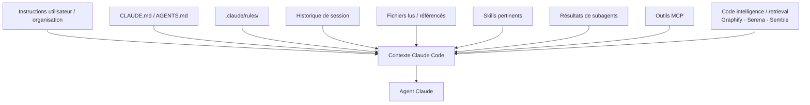

# Contexte & Personnalisation — Claude-first

La qualité d'un agent de développement dépend moins d'un « prompt magique » que de la qualité du **contexte utile** qu'il reçoit : instructions du projet, fichiers réellement pertinents, outils disponibles, historique de session et règles spécialisées.

Dans ce dépôt, ce chapitre est désormais organisé autour de **Claude Code**.

---

## Les couches de contexte Claude Code

### Règle directrice

Le contexte est une **ressource limitée**. Claude Code recommande de :

- garder `CLAUDE.md` spécifique et concis ;
- déplacer les règles ciblées dans `.claude/rules/` ;
- utiliser des skills pour les procédures ou connaissances qui n'ont pas besoin d'être chargées à chaque session ;
- déléguer les explorations volumineuses à des subagents ;
- utiliser des outils de recherche/code intelligence lorsque cela évite de charger des fichiers entiers sans nécessité ;
- lancer `/clear` entre tâches sans rapport et laisser l'auto-compaction gérer les longues sessions, avec `/compact` lorsque vous voulez la piloter explicitement.

---

## Quel mécanisme utiliser ?

| Besoin | Claude Code — recommandé |
|---|---|
| Conventions globales projet | `CLAUDE.md` ou `AGENTS.md` |
| Règles ciblées par chemins | `.claude/rules/*.md` avec `paths` |
| Procédure / expertise réutilisable | `.claude/skills/<nom>/SKILL.md` |
| Agent spécialisé | `.claude/agents/*.md` |
| Automatisation d'événements | hooks Claude configurés dans settings |
| Outils et données externes | MCP |
| Recherche rapide de snippets dans un gros dépôt | outil tiers comme Semble si les outils natifs deviennent trop verbeux |
| Navigation symbolique / références / refactoring | outil tiers comme Serena si le backend langage est pertinent |
| Cartographie relationnelle du dépôt | outil tiers comme Graphify si nécessaire |
| Réglages d'équipe | `.claude/settings.json` |
| Préférences locales | `.claude/settings.local.json`, `CLAUDE.local.md` |

---

## Code intelligence & retrieval : trois rôles différents

| Outil | Rôle principal | À privilégier quand… |
|---|---|---|
| **[Semble](semble.md)** | retrouver rapidement les snippets pertinents | l'exploration par grep/read charge trop de code |
| **[Serena](serena.md)** | symboles, références, édition et refactoring sémantiques | l'agent a besoin de capacités proches d'un IDE |
| **[Graphify](graphify.md)** | knowledge graph du dépôt | il faut comprendre les relations globales entre composants |

Ces outils sont optionnels. Commencez par les capacités natives de Claude Code et ajoutez une couche uniquement lorsqu'un problème mesurable le justifie.

---

## Contenu du chapitre

- :material-file-cog: **[Concepts fondamentaux](concepts.md)**

    Fenêtre de contexte, tokens, bruit, sélection du contexte et stratégies de réduction.

- :material-text-search: **[Semble — recherche de code pour agents](semble.md)**

    Retrieval hybride et local de snippets ciblés, intégrable via MCP, instructions ou subagent.

- :material-code-braces: **[Serena — code intelligence sémantique](serena.md)**

    Symboles, références, refactorings et édition sémantique via MCP et backend LSP/JetBrains.

- :material-graph: **[Graphify — knowledge graph du dépôt](graphify.md)**

    Cartographie des relations entre code, docs et configurations pour réduire l'exploration brute d'un grand dépôt.

- :material-file-tree: **[Tree-sitter — analyse syntaxique](tree-sitter.md)**

    Grammaires, arbres syntaxiques, parsing incrémental, queries et limites de l'analyse du code.

- :material-account-group: **[Orchestration multi-agents](orchestration-multi-agents.md)**

    Subagents, sessions en arrière-plan, agent teams, coordination et pièges du travail parallèle.

- :material-folder-cog: **[Paramètres du dépôt](parametres-depot.md)**

    Organiser `CLAUDE.md`, `.claude/` et `.mcp.json` pour partager une configuration de projet.

- :material-microsoft-visual-studio-code: **[VS Code — contexte](vscode-contexte.md)**

    Particularités de l'éditeur et coexistence des intégrations.

- :simple-intellijidea: **[IntelliJ — contexte](intellij-contexte.md)**

    Particularités JetBrains et coexistence des intégrations.

- :material-compare: **[Comparaison](comparaison-contexte.md)**

    Comparer les mécanismes sans supposer qu'une fonctionnalité existe sur toutes les surfaces.

Pour compléter les instructions du projet, consultez [le sandbox et son intégration à vos outils](sandbox.md). La [cheat sheet des commandes Claude Code](../chapitre-3b-claude-code-migration-copilot/commandes-claude.md) regroupe les commandes de session et du terminal.

---

## `CLAUDE.md`, `AGENTS.md`, rules, skill ou outil de retrieval ?

| Si l'information… | Utilisez… |
|---|---|
| doit être connue dans presque toutes les sessions | `CLAUDE.md` |
| est déjà partagée entre plusieurs agents/outils | `AGENTS.md` éventuellement importé depuis `CLAUDE.md` |
| ne concerne que certains fichiers | `.claude/rules/` avec `paths` |
| est une procédure multi-étapes ou une expertise occasionnelle | un skill |
| implique une exploration lourde et isolable | un subagent |
| nécessite des snippets pertinents sans lire beaucoup de fichiers | Semble ou un retrieval équivalent |
| nécessite symboles, références ou refactorings | Serena ou les capacités IDE/LSP équivalentes |
| nécessite de comprendre les relations entre beaucoup de composants | Graphify / knowledge graph, puis vérification dans les sources |
| doit **interdire techniquement** une action | permissions/settings ou hook, pas une simple phrase dans `CLAUDE.md` |

!!! tip "Taille de CLAUDE.md"
    La documentation Claude Code recommande de viser **moins de 200 lignes** par `CLAUDE.md`. Une règle qui grossit ou ne s'applique qu'à une partie du dépôt doit généralement être déplacée vers une rule ou un skill.

---

## Référence en annexe

[Copilot — archive de ce chapitre](../appendices/copilot/chapitre-4-contexte.md#page-chapitre-4-contexte-index).

## Prochaine étape

Poursuivez avec **[Concepts Clés](concepts.md)**, la page suivante dans le menu.

## Sources

Sources officielles consultées le **1er octobre 2026** :

- [Claude Code — Memory, CLAUDE.md, AGENTS.md et rules](https://code.claude.com/docs/en/memory)
- [Claude Code — Best practices](https://code.claude.com/docs/en/best-practices)
- [Claude Code — Skills](https://code.claude.com/docs/en/skills)
- [Claude Code — Subagents](https://code.claude.com/docs/en/sub-agents)
- [Claude Code — Hooks](https://code.claude.com/docs/en/hooks)
- [Serena — dépôt officiel](https://github.com/oraios/serena)
- [Semble — dépôt officiel](https://github.com/MinishLab/semble)
- [Graphify Labs — dépôt officiel](https://github.com/Graphify-Labs/graphify)
