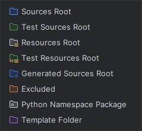

# :simple-intellijidea: IntelliJ IDEA — Configuration du Contexte Projet

<span class="badge-intellij">IntelliJ IDEA</span> <span class="badge-intermediate">Intermédiaire</span>

## Présentation

IntelliJ IDEA offre un contexte projet très riche pour GitHub Copilot grâce à son **analyse sémantique**, son **indexation du projet** et ses outils natifs pour structurer les modules, les sources et les ressources. Pour obtenir des réponses plus précises — et éviter une consommation excessive de crédits — il faut cependant distinguer :

- ce que **l'IDE comprend très bien**
- ce que **Copilot utilise de façon fiable**
- ce que vous devez **expliciter vous-même** via des fichiers d'instructions et un dépôt propre

---

## Ce qu'IntelliJ apporte naturellement au contexte

Dans un projet correctement importé, IntelliJ fournit à l'expérience de développement :

- une **analyse syntaxique et sémantique** des fichiers du projet
- une **résolution des types, imports et symboles** particulièrement forte sur l'écosystème JVM
- une compréhension de la **structure multi-module** Maven / Gradle
- une visibilité sur les **fichiers de build**, les dépendances et les ressources du projet

!!! info "Formulation volontairement prudente"
    IntelliJ comprend profondément votre code. En pratique, Copilot en bénéficie souvent très bien, surtout sur Java/Kotlin. En revanche, évitez d'affirmer que Copilot exploite à tout moment **l'intégralité** de l'index IntelliJ de manière exhaustive et identique pour chaque fonctionnalité.

---

## Les 4 leviers les plus fiables pour améliorer les réponses dans IntelliJ

### 1. Un dépôt lisible

Les réponses s'améliorent fortement si le projet contient :

- un `README.md` à jour
- un `pom.xml` ou `build.gradle(.kts)` propre
- des dossiers nommés par responsabilité
- des commentaires de haut niveau sur les composants critiques

### 2. Des instructions de dépôt courtes et maintenues

Le levier le plus rentable reste **`.github/copilot-instructions.md`**. C'est le meilleur point d'entrée pour donner à Copilot vos conventions globales, vos règles de validation et les commandes essentielles du projet.

### 3. Un périmètre de fichiers réduit

Plus vous laissez de bruit dans le projet ouvert (logs, dumps, données générées, snapshots massifs), plus le contexte utile se dilue.

### 4. Des sessions de travail bien cadrées

Dans IntelliJ, un bon résultat vient souvent d'un trio simple :

- les **bons fichiers ouverts**
- une **question précise**
- des **instructions de dépôt courtes**

---

## Structure de projet recommandée pour IntelliJ

### Projet Maven Java

```text
mon-projet-java/
├── .idea/                          ← Configuration IntelliJ
├── src/
│   ├── main/
│   │   ├── java/
│   │   │   └── com/monentreprise/monprojet/
│   │   │       ├── controller/
│   │   │       ├── service/
│   │   │       ├── repository/
│   │   │       ├── model/
│   │   │       ├── config/
│   │   │       └── exception/
│   │   └── resources/
│   └── test/
│       ├── java/
│       └── resources/
├── pom.xml
└── README.md
```

### Projet Gradle (Kotlin)

```text
mon-projet-kotlin/
├── src/
│   ├── main/
│   │   ├── kotlin/
│   │   │   └── com/monentreprise/
│   │   │       ├── api/
│   │   │       ├── domain/
│   │   │       ├── data/
│   │   │       └── model/
│   │   └── resources/
│   └── test/
│       └── kotlin/
├── build.gradle.kts
├── settings.gradle.kts
└── README.md
```

!!! tip "Pourquoi cette structure aide Copilot"
    Des dossiers explicites comme `controller`, `service`, `repository`, `model` ou `config` donnent du **contexte implicite**. Copilot comprend mieux le rôle attendu d'un fichier et évite des suggestions génériques.

---

## Marquage des dossiers source/test/ressources

IntelliJ utilise des marquages de dossiers pour mieux comprendre la structure du projet. Ils influencent directement la qualité du travail dans l'IDE, et donc indirectement la qualité des interactions Copilot.

### Comment marquer les dossiers

1. Clic droit sur le dossier dans l'arborescence du projet
2. *Mark Directory as →*
   - **Sources Root** — Code source principal
   - **Test Sources Root** — Code de tests
   - **Resources Root** — Ressources projet
   - **Test Resources Root** — Ressources de tests
   - **Excluded** — Dossier à ignorer côté indexation IntelliJ

{ .reduced-screenshot }
*Menu contextuel "Mark Directory as" — clic droit sur un dossier dans la vue Project*

!!! tip "Réflexe coût + contexte"
    Les dossiers marqués comme **Excluded** sont l'un des meilleurs leviers dans IntelliJ pour retirer du bruit : artefacts générés, exports, logs, fixtures lourdes, dumps de test, corpus documentaires massifs.

---

## Configuration des modules (projets multi-modules)

Pour les projets Maven/Gradle multi-modules, IntelliJ crée généralement un module par sous-projet :

```text
entreprise-monorepo/
├── api-gateway/
├── user-service/
├── product-service/
├── shared-lib/
└── pom.xml
```

**Avantage pratique :** l'IDE comprend les frontières entre modules, les dépendances internes et l'organisation du monorepo. Cela améliore le diagnostic, la navigation et la capacité de Copilot à raisonner sur la structure globale du code quand vous posez une question bien cadrée.

---

## Fichiers les plus importants pour le contexte dans IntelliJ

### `pom.xml` / `build.gradle(.kts)`

Ces fichiers communiquent la stack et les dépendances du projet :

```xml
<!-- pom.xml -->
<dependencies>
    <dependency>
        <groupId>org.springframework.boot</groupId>
        <artifactId>spring-boot-starter-web</artifactId>
    </dependency>
    <dependency>
        <groupId>org.projectlombok</groupId>
        <artifactId>lombok</artifactId>
    </dependency>
</dependencies>
```

### `application.yml` / `application.properties`

Ces fichiers donnent du contexte applicatif utile sans exposer les secrets si vous utilisez des variables d'environnement :

```yaml
spring:
  datasource:
    url: ${DATABASE_URL}
  jpa:
    hibernate:
      ddl-auto: validate

server:
  port: 8080
```

### `README.md`

Un `README.md` bien maintenu reste un raccourci très rentable pour :

- la stack
- les commandes build/test
- l'architecture
- les règles de contribution

### `.github/copilot-instructions.md`

C'est le socle le plus fiable pour expliciter :

- les conventions de code
- les contraintes métier
- les validations obligatoires
- les commandes à lancer
- ce qu'il faut éviter

---

## Discipline de contexte : comment être plus précis sans dépenser plus

### Ouvrez moins de fichiers, mais les bons

Pour une tâche donnée, gardez ouverts :

- le fichier courant
- l'interface ou le type principal associé
- un exemple proche déjà réussi
- éventuellement le fichier de configuration concerné

Évitez de garder ouverts en permanence :

- des logs
- des fichiers générés
- des captures de sortie massives
- des documents de référence sans lien avec la tâche active

### Séparez les demandes larges en étapes

Préférez :

1. **Comprendre**
2. **Planifier**
3. **Implémenter**
4. **Valider**

plutôt qu'une demande unique du type :

> « Analyse tout le module, corrige, refactore, ajoute les tests et documente. »

### Gardez les instructions de dépôt concises

Une instruction trop longue consomme elle-même du contexte. Mieux vaut 12 règles fortes qu'une page de prose.

### Excluez les dossiers qui n'apportent aucune valeur de raisonnement

Exemples fréquents à exclure dans IntelliJ :

- `target/`, `build/`, `dist/`
- exports CSV volumineux
- fixtures générées
- snapshots massifs
- dossiers de logs
- corpus externes copiés localement

---

## Exclusions dans IntelliJ : ce qu'il faut vraiment faire

### À privilégier

1. **Marquage `Excluded`** dans IntelliJ
2. **Structure de projet propre**
3. **Content exclusion GitHub Copilot** si votre organisation l'utilise
4. **Réduction du bruit via le dépôt** (`.gitignore`, conventions, nettoyage)

### À ne pas supposer automatiquement

Ne supposez pas que **`.gitignore` suffit à contrôler le contexte Copilot dans IntelliJ**. C'est utile pour le dépôt, mais ce n'est pas le mécanisme le plus fiable pour piloter finement ce que l'IDE indexe et ce que vous laissez visible dans votre environnement.

!!! warning "Bonne pratique"
    Si un dossier doit vraiment sortir du périmètre de travail dans IntelliJ, utilisez **`Excluded`**. Si un contenu est sensible au niveau organisationnel, utilisez en plus les mécanismes de **content exclusion** documentés par GitHub.

---

## Personnalisation Copilot dans IntelliJ : ce qui est sûr, ce qui dépend de votre build

| Mécanisme | Position recommandée |
|---|---|
| `.github/copilot-instructions.md` | ✅ Oui, c'est le socle recommandé |
| Instructions ciblées | ✅ Utiles si votre dépôt les exploite déjà |
| Prompt files / agents / artefacts avancés | ⚠️ À vérifier selon votre version, votre plan et votre workflow |
| Hooks Copilot | ❌ Référence principale côté VS Code / CLI, pas côté IntelliJ |
| MCP | ✅ Mécanisme officiel GitHub Copilot, disponibilité à confirmer selon l'environnement |

!!! info "Règle simple"
    Dans IntelliJ, partez toujours de ce qui est **portable et versionné dans le dépôt**. Ajoutez les mécanismes avancés seulement s'ils sont effectivement visibles, documentés et utiles dans votre environnement.

---

## Indexation et performance

Copilot sur IntelliJ profite d'un projet bien indexé. Pour garder une base saine :

### Forcer une re-indexation

- *File → Invalidate Caches* puis redémarrage si l'IDE se comporte de façon incohérente

### Surveiller l'état de l'indexation

- attendez la fin de l'indexation initiale avant de juger la qualité des réponses
- sur les gros projets, laissez IntelliJ stabiliser ses indices avant d'utiliser des fonctions avancées

### Optimiser les gros projets

Sur les bases volumineuses :

- excluez agressivement le bruit
- ouvrez le **module pertinent**, pas nécessairement toute la racine si ce n'est pas utile
- évitez les ressources massives non nécessaires pendant les sessions Copilot

---

## Bonnes pratiques spécifiques à IntelliJ

### 1. Laissez IntelliJ faire ce qu'il fait mieux que Copilot

- générer des implémentations ou du code répétitif simple
- gérer les imports et quick fixes
- appliquer les refactorings structurels fiables

Ensuite, utilisez Copilot pour :

- expliquer
- proposer une variante métier
- rédiger des tests
- aider sur un diagnostic ou une transformation plus large

### 2. Structurez les packages de manière expressive

```text
// ✅ Package expressif
com.monentreprise.commande.service
com.monentreprise.commande.repository
com.monentreprise.paiement.service

// ❌ Package flou
com.monentreprise.stuff
com.monentreprise.utils.helpers
```

### 3. Documentez mieux les composants centraux

Les classes de service, les points d'entrée API, les composants de configuration et les règles métier gagnent à être introduits par quelques lignes de contexte.

### 4. Préparez le dépôt avant d'activer les fonctions coûteuses

Avant d'utiliser des capacités agentiques plus poussées :

- vérifiez le `README.md`
- mettez à jour `.github/copilot-instructions.md`
- nettoyez les dossiers inutiles
- ouvrez uniquement les fichiers utiles à la tâche

---

## Sources

- GitHub Docs — *[Support for different types of custom instructions](https://docs.github.com/en/copilot/reference/custom-instructions-support)* (consulté le 2026-06-03)
- GitHub Docs — *[Adding repository custom instructions for GitHub Copilot in your IDE](https://docs.github.com/en/copilot/how-tos/configure-custom-instructions-in-your-ide/add-repository-instructions-in-your-ide)* (consulté le 2026-06-03)
- GitHub Docs — *[Exclude content from GitHub Copilot](https://docs.github.com/en/copilot/how-tos/configure-content-exclusion/exclude-content-from-copilot)* (consulté le 2026-06-03)
- GitHub Docs — *[Improving agent quality to optimize AI usage](https://docs.github.com/en/copilot/tutorials/optimize-ai-usage)* (consulté le 2026-06-03)
- GitHub Docs — *[Models and pricing for GitHub Copilot](https://docs.github.com/en/copilot/reference/copilot-billing/models-and-pricing)* (consulté le 2026-06-03)

---

## Prochaine étape

**[Comparaison — Contexte & Personnalisation entre Éditeurs](comparaison-contexte.md)** : comprendre ce qui est réellement partagé entre IntelliJ et VS Code, et où chaque IDE garde un avantage spécifique.

Concepts clés couverts :

- **Contexte natif vs contexte explicite** — ce que l'IDE apporte et ce que le dépôt doit fournir
- **Personnalisation portable** — ce qui reste stable d'un IDE à l'autre
- **Exclusions et bruit** — comment préserver un contexte utile
- **Choix par écosystème** — JVM, frontend, Python, monorepo
