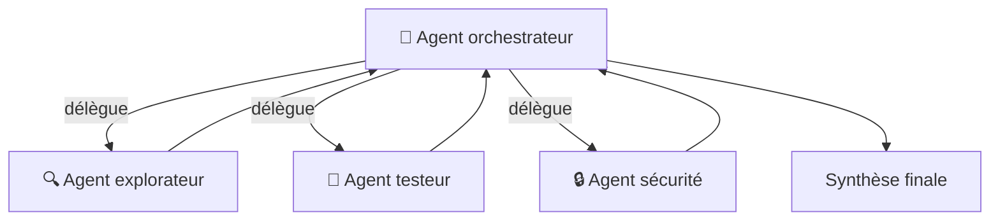
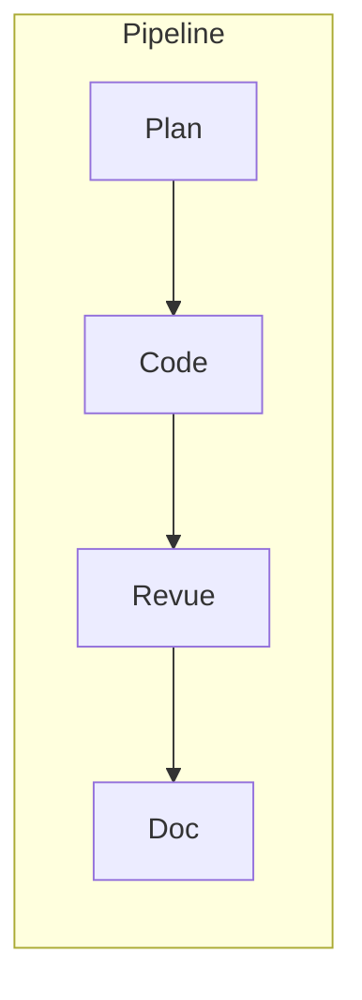

# Orchestration multi-agents (Copilot & Claude)

<span class="badge-vscode">VS Code</span> <span class="badge-intellij">IntelliJ</span> <span class="badge-expert">Expert</span>

## Présentation

Un agent unique suffit pour la plupart des tâches. Mais dès qu'un travail devient **multi-étapes** ou **volumineux** (explorer un gros code, planifier, implémenter, tester, auditer), faire collaborer **plusieurs agents spécialisés** donne de meilleurs résultats. Cette page compare l'orchestration multi-agents côté **GitHub Copilot** (`.agent.md`, handoffs, sous-agents) et côté **Claude Code** (subagents), pour que vous sachiez quoi utiliser dans chaque écosystème.

!!! info "Deux écosystèmes, un même principe"
    Copilot et Claude permettent tous deux qu'un agent en **délègue** à d'autres. Les mécanismes diffèrent, mais les **patterns** (orchestrateur/workers, pipeline, exploration parallèle, critique) sont identiques.

---

## Qu'est-ce que l'orchestration multi-agents ?



L'idée : un **orchestrateur** découpe la tâche et confie chaque morceau à un **agent spécialisé**, doté de son propre contexte, de ses outils et parfois de son modèle. Chaque spécialiste travaille **sans polluer** le contexte des autres, puis l'orchestrateur agrège les résultats.

| Sans orchestration | Avec orchestration |
|--------------------|--------------------|
| Un contexte qui se sature | Un contexte isolé par agent |
| Responsabilités mélangées | Spécialisation claire |
| Séquentiel | Exploration possible en parallèle |
| Un seul modèle | Le bon modèle par sous-tâche |

---

## Les patterns communs

| Pattern | Description | Exemple |
|---------|-------------|---------|
| **Orchestrateur / workers** | L'agent principal délègue et synthétise | Explorer → coder → tester |
| **Pipeline séquentiel** | Chaque agent transforme la sortie du précédent | Plan → implémentation → revue → doc |
| **Exploration parallèle** | Plusieurs agents analysent en parallèle, puis agrégation | Audit d'un monorepo |
| **Critique / débat** | Un agent produit, un autre critique, l'orchestrateur arbitre | Décision d'architecture |



!!! tip "Choisir le pattern selon la tâche"
    - Multi-étapes dépendantes → **pipeline**.
    - Gros volume à analyser → **exploration parallèle**.
    - Décision sensible → **critique/débat**.
    - Cas général → **orchestrateur/workers**.

---

## Côté GitHub Copilot

Copilot orchestre via les fichiers `.agent.md` (voir [Agents Copilot](guide-agents.md)) et trois mécanismes complémentaires.

### Sous-agents via le champ `agents`

Un agent peut être autorisé à **invoquer d'autres agents** comme sous-agents :

```yaml
---
name: Orchestrateur
description: Coordonne l'analyse, l'implémentation et la revue
tools:
  - codebase
  - editFiles
agents:
  - security-auditor        # sous-agents autorisés
  - test-generator
---

# Orchestrateur
Pour chaque feature : délègue l'audit à security-auditor,
puis la génération de tests à test-generator, et synthétise.
```

| Valeur de `agents` | Effet |
|--------------------|-------|
| `[agent-a, agent-b]` | Seuls ces sous-agents sont invocables |
| `*` | Tous les agents disponibles |
| `[]` | Aucun sous-agent (agent terminal) |

### Handoffs — transitions guidées

Les **handoffs** créent des workflows séquentiels avec des boutons de transition entre agents :

```yaml
---
name: Planning Agent
description: Génère un plan d'implémentation
handoffs:
  - label: Démarrer l'implémentation
    agent: implementation
    prompt: Implémente le plan ci-dessus.
  - label: Revue de sécurité
    agent: security-auditor
---
```

C'est un **pipeline semi-manuel** : l'utilisateur valide chaque transition (idéal pour garder le contrôle).

### Contrôle d'invocation

| Champ | Rôle |
|-------|------|
| `disable-model-invocation` | Empêche un agent d'être appelé comme sous-agent |
| `user-invocable` | Masque l'agent du sélecteur (agent purement délégué) |
| `target` | Cible d'exécution : `vscode` ou `github-copilot` |

!!! info "Copilot Coding Agent"
    Au-delà du chat, le **Copilot coding agent** (sur GitHub) exécute des tâches de bout en bout sur une issue/PR, en orchestrant ses propres étapes. C'est une forme d'orchestration côté plateforme, complémentaire aux `.agent.md` locaux.

---

## Côté Claude Code

Claude orchestre via les **subagents** (`.claude/agents/<nom>.md`), chacun isolé dans son propre contexte, avec son modèle et ses outils.

```markdown
---
name: security-critic
description: "Critique sécurité d'une implémentation. À invoquer après tout code sensible."
tools: [read, grep]
model: claude-opus-4
---
Tu critiques le code sous l'angle OWASP. Sois exigeant et concret.
```

L'orchestrateur invoque les subagents **automatiquement** (selon leur `description`) ou sur demande explicite. L'isolation du contexte permet une **exploration parallèle** sans saturer la conversation principale.

!!! tip "Pour aller plus loin côté Claude"
    Les patterns détaillés (map/reduce, pipeline, critique), le choix du modèle par agent et les anti-patterns sont approfondis dans **[Orchestration multi-agents avec Claude Code](../chapitre-3b-claude-code-migration-copilot/subagents-orchestration.md)**.

---

## Comparaison Copilot ↔ Claude

| Aspect | GitHub Copilot | Claude Code |
|--------|----------------|-------------|
| Définition d'agent | `.agent.md` dans `.github/agents/` | `.claude/agents/<nom>.md` |
| Délégation | Champ `agents` + handoffs | Invocation auto/explicite des subagents |
| Isolation du contexte | Par agent (session chat) | Par subagent (contexte dédié) |
| Exécution parallèle | Limitée | ✅ Native (exploration parallèle) |
| Modèle par agent | `model` (selon plan) | `model` (famille Claude) |
| Transitions guidées | ✅ Handoffs (boutons) | Via instructions de l'orchestrateur |
| Contrôle d'outils | `tools` (liste) | `tools` (liste blanche) |
| Pilotage | Sélecteur de mode, `@agent` | REPL `/agents`, délégation |

!!! warning "Ne sur-orchestrez pas"
    Des deux côtés, l'orchestration ajoute de la latence, du coût et de la complexité. Pour une tâche simple, **un seul agent** reste le bon choix. Réservez le multi-agents aux travaux réellement multi-étapes ou volumineux.

---

## Bonnes pratiques (valables des deux côtés)

1. **Un agent = un rôle** — pas d'agent « fait tout ».
2. **Outils minimaux** — un explorateur ne doit pas pouvoir écrire ni exécuter.
3. **Descriptions précises** — elles servent de règles de routage pour la délégation.
4. **Sorties synthétiques** — le résultat d'un agent ne doit pas saturer l'orchestrateur.
5. **Modèle adapté** — raisonnement coûteux seulement là où il le faut.
6. **Versionner les agents** — reproductibilité et partage d'équipe.
7. **Garder l'orchestration plate** — éviter les chaînes d'agents trop profondes.

---

## Prochaine étape

**[Guide Skills (SKILL.md)](guide-skills.md)** : packager l'expertise domaine réutilisable que vos agents — orchestrateurs comme spécialisés — peuvent invoquer à la demande.

Concepts clés couverts :

- **Qu'est-ce qu'un SKILL.md** — package de connaissance stable et réutilisable
- **Emplacement et URI** — `.github/skills/*/SKILL.md` et référençage
- **Différence Skills vs Instructions vs Agents** — tableau comparatif clair
- **Exemples de skills** — API standards, modèle de domaine, patterns d'architecture

---

## Sources

- [GitHub Docs — Custom agents](https://docs.github.com/en/copilot/customizing-copilot) - consulté le 2026-06-20
- [GitHub Docs — Copilot coding agent](https://docs.github.com/en/copilot/using-github-copilot/coding-agent) - consulté le 2026-06-20
- [Anthropic — Subagents](https://docs.anthropic.com/en/docs/claude-code/sub-agents) - consulté le 2026-06-20
- [Anthropic — Building effective agents](https://www.anthropic.com/research/building-effective-agents) - consulté le 2026-06-20

