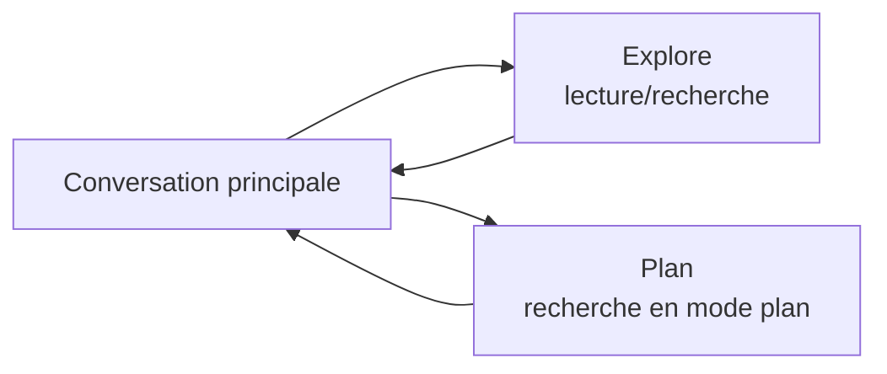
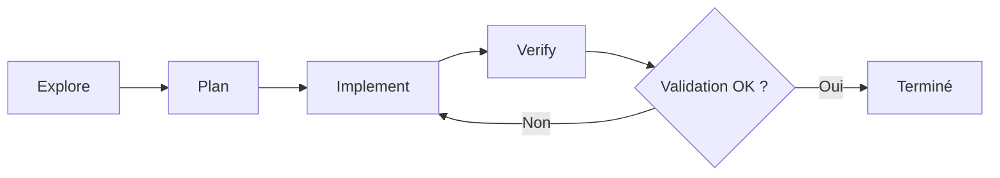
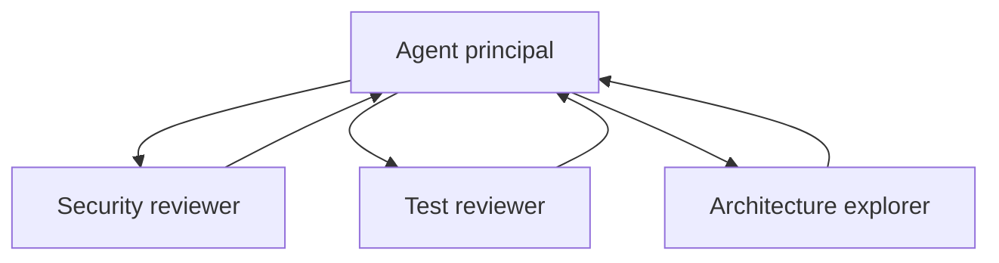

# Orchestration multi-agents — Claude Code en référence, Copilot conservé

<span class="badge-vscode">VS Code</span> <span class="badge-intellij">IntelliJ</span> <span class="badge-expert">Expert</span>

## Présentation

Un seul agent suffit pour beaucoup de tâches. L'orchestration devient utile lorsque le travail comporte des recherches volumineuses, plusieurs spécialisations ou des vérifications indépendantes.

Dans ce dépôt, **Claude Code est la référence principale** pour ces workflows. GitHub Copilot reste documenté comme alternative compatible.

!!! info "Le but n'est pas de multiplier les agents"
    Un subagent consomme lui aussi des requêtes et du contexte. Utilisez-le lorsque l'isolation ou la spécialisation apporte un gain réel : exploration lourde, audit indépendant, recherche parallèle ou rôle fortement restreint.

---

## Claude Code : les trois niveaux à distinguer

### 1. Subagents intégrés

Claude Code fournit notamment des agents intégrés pour l'exploration et la planification. Ils travaillent dans leur propre contexte afin d'éviter de remplir inutilement la conversation principale avec des recherches de fichiers et de logs.


```mermaid
graph LR
    M[Conversation principale] --> E[Explore\nlecture/recherche]
    M --> P[Plan\nrecherche en mode plan]
    E --> M
    P --> M
```

Cas d'usage :

- rechercher où une fonctionnalité est implémentée ;
- cartographier un module avant modification ;
- analyser un gros ensemble de fichiers sans polluer le contexte principal.

### 2. Subagents personnalisés

Un agent projet se place dans `.claude/agents/` :

```markdown
---
name: security-reviewer
description: Audite les changements sensibles pour détecter vulnérabilités et régressions de sécurité.
tools: Read, Grep, Glob
model: sonnet
---

Tu es un reviewer sécurité en lecture seule.
Cherche des preuves concrètes et retourne les constats classés par sévérité.
```

Claude peut déléguer automatiquement lorsqu'une tâche correspond à la `description`, ou vous pouvez demander explicitement l'agent.

Les subagents peuvent avoir leurs propres :

- outils et outils interdits ;
- modèle ;
- mode de permissions ;
- serveurs MCP ;
- hooks ;
- skills préchargés ;
- mémoire persistante selon le besoin.

### 3. Sessions/équipes d'agents

Pour des travaux réellement parallèles et plus indépendants, Claude Code distingue également les **background agents** et les **agent teams** des simples subagents. Ces mécanismes correspondent à des sessions plus autonomes et ne doivent pas être confondus avec une délégation ponctuelle dans le contexte courant.

---

## Patterns recommandés

### Explore → Plan → Implement → Verify

C'est le workflow par défaut recommandé pour les changements non triviaux.


```mermaid
graph LR
    E[Explore] --> P[Plan]
    P --> I[Implement]
    I --> V[Verify]
    V --> D{Validation OK ?}
    D -- Non --> I
    D -- Oui --> F[Terminé]
```

- **Explore** : comprendre avant d'écrire.
- **Plan** : expliciter les fichiers et validations.
- **Implement** : modifier en petites étapes.
- **Verify** : tests, build, lint, capture ou revue indépendante.

### Orchestrateur / spécialistes


```mermaid
graph TD
    O[Agent principal] --> S[Security reviewer]
    O --> T[Test reviewer]
    O --> A[Architecture explorer]
    S --> O
    T --> O
    A --> O
```

Utilisez ce pattern quand chaque branche nécessite une expertise différente.

### Investigation isolée

La documentation Claude recommande explicitement les subagents pour les recherches qui liraient beaucoup de fichiers : la synthèse revient au contexte principal, pas tout le bruit intermédiaire.

### Vérification indépendante

Un second agent peut relire une implémentation avec un contexte neuf. Cette approche est particulièrement utile pour :

- sécurité ;
- migrations ;
- logique métier critique ;
- détection de régressions.

---

## Coût et contexte

Les subagents **ne rendent pas le travail gratuit** : leurs requêtes comptent dans les mêmes limites d'usage. Leur avantage principal est l'isolation du contexte et la spécialisation.

Bon réflexe :

1. garder la conversation principale pour les décisions et l'implémentation ;
2. déléguer les recherches volumineuses ;
3. demander aux agents de retourner une synthèse courte avec preuves ;
4. réserver les modèles coûteux aux tâches qui le justifient.

---

## GitHub Copilot — référence conservée

Copilot propose lui aussi des agents personnalisés dans `.github/agents/*.agent.md`, avec outils, modèle et mécanismes d'orchestration selon l'environnement.

```text
.github/agents/
├── security-reviewer.agent.md
└── test-reviewer.agent.md
```

Selon les versions et surfaces Copilot, on trouve notamment :

- custom agents ;
- sous-agents / délégation ;
- handoffs ;
- Copilot coding agent côté GitHub ;
- MCP et skills.

!!! warning "Ne supposez pas une parité parfaite entre IDE"
    GitHub publie une matrice de fonctionnalités par version. Les fonctions avancées peuvent être en preview et leur disponibilité varie entre VS Code, Visual Studio, JetBrains et GitHub.com.

---

## Comparaison pratique

| Besoin | Claude Code | GitHub Copilot |
|---|---|---|
| Agent projet versionné | `.claude/agents/*.md` | `.github/agents/*.agent.md` |
| Recherche isolée | Subagents intégrés/personnalisés | Agents selon surface |
| Permissions par agent | Oui | Oui selon agent/surface |
| Skills | `.claude/skills/` | `.github/skills/`, `.claude/skills/` ou `.agents/skills/` selon surface |
| Exécution réellement multi-session | Background agents / agent teams | Coding agent / workflows plateforme |
| Outil principal du dépôt | **Oui** | Référence conservée |

---

## Anti-patterns

- Créer un agent différent pour chaque petite tâche.
- Donner `Bash`, écriture ou MCP à un agent qui n'en a pas besoin.
- Demander à cinq agents la même analyse sans critère d'agrégation.
- Réinjecter les sorties brutes de tous les agents dans la conversation principale.
- Utiliser un agent comme simple stockage de règles : préférez `CLAUDE.md`, `.claude/rules/` ou un skill selon la portée.

---

## Sources

- [Claude Code — Subagents](https://code.claude.com/docs/en/sub-agents) — consulté le 2026-09-28
- [Claude Code — Best practices](https://code.claude.com/docs/en/best-practices) — consulté le 2026-09-28
- [GitHub Docs — Copilot feature matrix](https://docs.github.com/en/copilot/reference/copilot-feature-matrix) — consulté le 2026-09-28
- [GitHub Docs — Custom agents](https://docs.github.com/en/copilot/how-tos/use-copilot-agents/cloud-agent/create-custom-agents-in-your-ide) — consulté le 2026-09-28

## Prochaine étape

**[Skills](guide-skills.md)** : factoriser l'expertise réutilisable sans la charger en permanence dans le contexte principal.