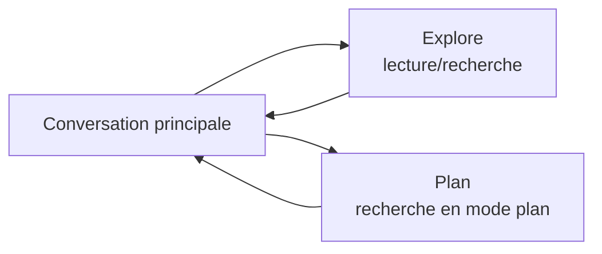
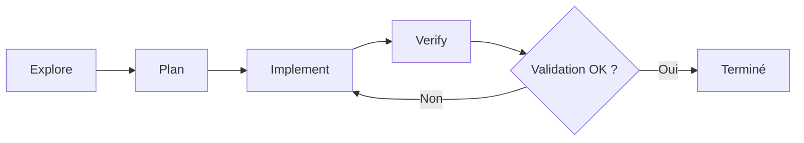
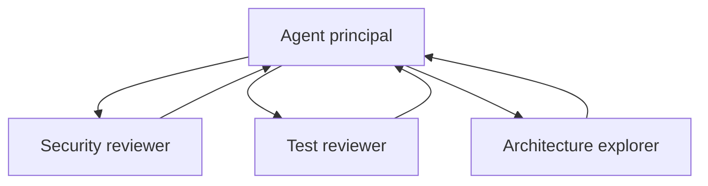

# Orchestration multi-agents — Claude Code

<span class="badge-vscode">VS Code</span> <span class="badge-intellij">IntelliJ</span> <span class="badge-expert">Expert</span>

## Présentation

Un seul agent suffit pour beaucoup de tâches. L'orchestration devient utile lorsque le travail comporte des recherches volumineuses, plusieurs spécialisations ou des vérifications indépendantes.

Dans ce dépôt, **Claude Code est la référence principale** pour ces workflows.

!!! info "Le but n'est pas de multiplier les agents"
    Un subagent consomme lui aussi des requêtes et du contexte. Utilisez-le lorsque l'isolation ou la spécialisation apporte un gain réel : exploration lourde, audit indépendant, recherche parallèle ou rôle fortement restreint.

---

### 1. Subagents intégrés

Claude Code fournit notamment des agents intégrés pour l'exploration et la planification. Ils travaillent dans leur propre contexte afin d'éviter de remplir inutilement la conversation principale avec des recherches de fichiers et de logs.


```mermaid
graph LR
    M[Conversation principale] --> E[Explore\nlecture/recherche]
    M --> P[Plan\nrecherche en mode plan]
    E --> M
    P --> M
```

Cas d'usage :

- rechercher où une fonctionnalité est implémentée ;
- cartographier un module avant modification ;
- analyser un gros ensemble de fichiers sans polluer le contexte principal.

### 2. Subagents personnalisés

Un agent projet se place dans `.claude/agents/` :

```markdown
---
name: security-reviewer
description: Audite les changements sensibles pour détecter vulnérabilités et régressions de sécurité.
tools: Read, Grep, Glob
model: sonnet
---

Tu es un reviewer sécurité en lecture seule.
Cherche des preuves concrètes et retourne les constats classés par sévérité.
```

Claude peut déléguer automatiquement lorsqu'une tâche correspond à la `description`, ou vous pouvez demander explicitement l'agent.

Les subagents peuvent avoir leurs propres :

- outils et outils interdits ;
- modèle ;
- mode de permissions ;
- serveurs MCP ;
- hooks ;
- skills préchargés ;
- mémoire persistante selon le besoin.

## 3. Distinguer subagent, background agent et agent team

Le mot « background » décrit plusieurs mécanismes. Un **subagent en arrière-plan** reste une délégation de la session principale. Un **background agent** est une session Claude Code complète, détachée du terminal et gérée par le superviseur local. Une **agent team** ajoute une coordination explicite entre plusieurs sessions : lead, coéquipiers, échanges et tâches partagées lorsqu'elles sont disponibles.

| Critère | Subagent | Background agent | Agent team |
|---|---|---|---|
| Création | Délégation à un rôle intégré ou `.claude/agents/` | `claude --bg`, `/background` ou `/fork` | Fonction expérimentale activée, puis demande explicite d'équipe |
| Contexte | Contexte propre ; résultat renvoyé au demandeur | Conversation indépendante ; `/fork` en copie une existante | Contexte propre à chaque coéquipier ; consigne de départ du lead |
| Pilotage | Conversation principale, panneau d'agents, `/tasks` | `claude agents`, attachement, logs et arrêt | Lead, messages entre coéquipiers, tâches et dépendances |
| Bon usage | Recherche ou revue bornée | Tâche autonome longue à suivre séparément | Investigation ou développement avec échanges entre spécialistes |
| Isolation des fichiers | Pas automatique ; demander un worktree si nécessaire | À vérifier ; `--worktree` permet de la demander explicitement | Pas automatique ; répartir les fichiers ou organiser des worktrees |

Créer trois sessions détachées ne crée pas automatiquement une équipe. Et exécuter un subagent en arrière-plan ne le transforme pas en session indépendante que le superviseur conservera indéfiniment.

## 4. Construire et utiliser un background agent

### Définir une tâche autonome

Une session détachée doit recevoir une cible, des limites, une vérification et un résultat attendu. Exemple :

```bash
claude --bg --worktree audit-paiement "Analyse les tests instables du module paiement. Ne modifie pas le code. Rapporte les causes possibles avec fichiers et preuves."
```

Le prompt est un argument positionnel. **Ne combinez pas `--bg` avec `-p`** : le mode print et la session interactive détachable sont deux modes différents.

Un rôle réutilisable reste un fichier d'agent, par exemple `.claude/agents/security-reviewer.md` avec `tools: Read, Grep, Glob`. Il peut devenir l'agent principal d'une session :

```bash
claude --agent security-reviewer --bg "Audite le module auth en lecture seule et rapporte les preuves."
```

Le rôle doit exister dans le périmètre chargé. Vérifiez les erreurs de lancement : un message annonçant le détachement ne suffit pas à prouver que le rôle a démarré correctement.

### Détacher une conversation existante

Dans une session qui a déjà commencé :

```text
/background
```

Cela déplace la conversation actuelle en arrière-plan. Pour conserver cette conversation et créer une copie sur une autre tâche :

```text
/fork Recherche la cause des lenteurs des tests, sans modifier les fichiers.
```

Le résultat d'un `/fork` récent vit dans une **autre session**. Pour une tâche latérale dont le résultat revient dans la conversation courante, utilisez `/subtask <tâche>` lorsque votre version le propose. Sur les anciennes versions ou lorsque l'agent view est désactivée, `/fork` peut avoir un comportement de subagent : vérifiez la fiche de commandes et votre version.

### Suivre, reprendre et arrêter

Après lancement, Claude affiche un identifiant. Remplacez `<id>` par cet identifiant :

| Commande | Usage |
|---|---|
| `claude agents` | Ouvrir la vue des sessions |
| `claude agents --json --all` | Lire les états depuis un script, y compris les sessions terminées |
| `claude attach <id>` | Revenir dans la conversation interactive |
| `claude logs <id>` | Lire la sortie récente |
| `claude stop <id>` | Arrêter la session |

Dans agent view, **chaque prompt envoyé dans la zone de lancement crée une nouvelle session**. Pour répondre à une session existante, sélectionnez sa ligne puis utilisez le panneau de réponse ou attachez-vous à elle.

Dans une session attachée, `/exit` détache et laisse le travail tourner ; `/stop` l'arrête. Ne confondez donc pas fermer la vue, arrêter le processus et supprimer une session/worktree. La suppression peut enlever du travail : préservez les changements avant de nettoyer.

Une session peut continuer quand le terminal est fermé, mais ce n'est pas un service cloud : le superviseur tourne sur votre machine. Une extinction interrompt les processus. Une session peut aussi attendre une permission, une connexion ou une réponse : **en arrière-plan ne signifie pas sans intervention possible**.

### Intégrer le suivi dans votre propre outil

Utilisez `claude agents --json --all` et les champs documentés `state`, `status` et `waitingFor`, plutôt que de parser les fichiers internes `~/.claude/jobs/`. Distinguez `working`, `blocked`, `done`, `failed` et `stopped`. Une session `blocked` exige une intervention ; `done` signifie que le tour demandé est terminé, pas que toutes vos vérifications produit ont réussi.

## 5. Construire et utiliser une agent team

### Activer la fonction expérimentale

Les agent teams sont désactivées par défaut. Exemple de réglage à fusionner dans `.claude/settings.json` :

```json
{
  "env": {
    "CLAUDE_CODE_EXPERIMENTAL_AGENT_TEAMS": "1"
  },
  "teammateMode": "in-process"
}
```

Relancez une session interactive. L'activation peut également changer les délégations ordinaires : un subagent nommé peut être lancé comme teammate. Activez cette option délibérément, et retirez-la si vous voulez revenir au comportement habituel. **Le mode `-p` et les sessions Agent SDK ne créent pas de teammates**, même avec cette variable.

Le mode **in-process** regroupe les coéquipiers dans le terminal principal et fonctionne sans tmux. Les modes à panneaux séparés exigent tmux ou iTerm2 et ont des restrictions selon le terminal ; ils ne sont pas équivalents à plusieurs fenêtres automatiquement disponibles sur Windows Terminal ou dans le terminal intégré VS Code.

### Demander une vraie équipe

```text
Crée une agent team de trois coéquipiers pour auditer le paiement :
- architecture : cartographier les dépendances, lecture seule ;
- sécurité : vérifier les frontières de confiance, lecture seule ;
- tests : identifier les scénarios manquants, lecture seule.
Chaque coéquipier doit partager les constats pertinents avec les autres.
Le lead reste chargé de comparer les preuves et de produire la synthèse.
Pas de modification, de push ou de déploiement.
```

Le lead lance les coéquipiers et transmet leur tâche. Ils chargent les instructions et ressources applicables à leur propre session ; ne supposez pas qu'ils ont lu tout votre historique. Donnez dans la consigne les décisions, fichiers, contraintes et critères d'acceptation dont ils ont besoin.

La liste de tâches, lorsque les outils Task sont présents, peut exprimer des dépendances : une tâche bloquée devient disponible après celle dont elle dépend. Les coéquipiers peuvent communiquer directement. Le lead doit néanmoins vérifier que les tâches annoncées terminées correspondent à un livrable réel.

### Versionner les rôles, pas l'état d'exécution

Vous pouvez réutiliser une définition `.claude/agents/security-reviewer.md` :

```text
Ajoute un teammate utilisant le type d'agent security-reviewer pour auditer auth.
```

Les définitions de rôles sont versionnables. **Un fichier `.claude/teams/teams.json` n'est pas une configuration d'équipe reconnue.** Claude génère l'état d'équipe sous `~/.claude/teams/` et les tâches sous `~/.claude/tasks/` : n'éditez pas ces fichiers comme un modèle de déploiement.

Une définition de subagent n'est pas appliquée intégralement à un teammate. Par exemple, ses `skills` préchargés ne sont pas repris ; le traitement de `mcpServers`, du corps de l'instruction et des outils interdits dépend du mode d'affichage. Consultez la matrice officielle avant de vous appuyer sur une restriction pour la sécurité. Le teammate reprend le mode de permissions du lead, avec les exceptions documentées, et les demandes apparaissent chez le lead.

### Superviser et terminer

Sélectionnez un coéquipier dans le panneau d'agents et ouvrez sa conversation pour le questionner. Demandez au lead un état des tâches, les preuves produites et les dépendances bloquées. À la fin, faites vérifier le résultat intégré, puis demandez au lead d'arrêter les coéquipiers.

Le passage d'un teammate du plan à l'implémentation **n'est pas une revue humaine garantie** : la documentation décrit une approbation automatique du plan dans la session du lead. Les permissions des outils continuent de s'appliquer. Pour une étape exigeant une validation humaine, imposez une séparation explicite du workflow et contrôlez les permissions.

## 6. Bonnes pratiques et pièges

| Situation | Bonne pratique | Piège |
|---|---|---|
| Petit correctif local | Une session et une validation ciblée | Ajouter une équipe pour une tâche de quelques lignes |
| Plusieurs recherches indépendantes | Rôles bornés et synthèses avec preuves | Répéter le même audit sans règle d'arbitrage |
| Modifications parallèles | Un propriétaire par fichier/module, ou des worktrees puis intégration | Plusieurs agents éditent le même fichier ou lockfile |
| Frontend dépendant d'une nouvelle API | Définir le contrat, puis les dépendances | Paralléliser des tâches qui nécessitent les résultats les unes des autres |
| Revue sécurité | Outils de lecture seulement et contexte suffisant | Donner des droits d'écriture ou de déploiement inutiles |
| Travail détaché | Vérifier `Needs input` et les journaux | Laisser une demande de permission bloquée pendant des heures |
| Fin de tâche | Relire le diff intégré et exécuter les contrôles | Assimiler « agent terminé » à « résultat correct » |

Un worktree évite les collisions de fichiers, mais les agents peuvent encore partager ports, bases de données, caches et comptes externes. Donnez des ressources distinctes aux tests et interdisez les actions de production tant qu'elles ne sont pas prévues. Pour une frontière système, consultez [le sandbox](sandbox.md).

Limitez le nombre de sessions au parallélisme réellement utile : chaque agent consomme de l'usage, et les messages de coordination ajoutent du contexte. Une équipe bavarde avec des dépendances constantes peut coûter davantage et prendre plus de temps qu'une session.

### Limites actuelles des teams

- Une équipe par session ; le lead reste fixe et les teammates ne créent pas d'équipes imbriquées.
- `/resume` et `/rewind` ne restaurent pas les teammates in-process : après reprise, recréez les coéquipiers nécessaires.
- Les statuts de tâches peuvent être en retard ; vérifiez le livrable avant de débloquer une dépendance.
- L'arrêt peut attendre la fin d'un appel d'outil en cours.
- Les subagents d'un teammate in-process ont des restrictions d'arrière-plan ; une définition `background: true` peut échouer dans ce cas.

Ces limites et commandes évoluent rapidement. Les sources ont été revérifiées le **3 octobre 2026** ; comparez-les à `claude --version` et à [la fiche mémo des commandes](../chapitre-3b-claude-code-migration-copilot/commandes-claude.md).

---

### Explore → Plan → Implement → Verify

C'est le workflow par défaut recommandé pour les changements non triviaux.


```mermaid
graph LR
    E[Explore] --> P[Plan]
    P --> I[Implement]
    I --> V[Verify]
    V --> D{Validation OK ?}
    D -- Non --> I
    D -- Oui --> F[Terminé]
```

- **Explore** : comprendre avant d'écrire.
- **Plan** : expliciter les fichiers et validations.
- **Implement** : modifier en petites étapes.
- **Verify** : tests, build, lint, capture ou revue indépendante.

### Orchestrateur / spécialistes


```mermaid
graph TD
    O[Agent principal] --> S[Security reviewer]
    O --> T[Test reviewer]
    O --> A[Architecture explorer]
    S --> O
    T --> O
    A --> O
```

Utilisez ce pattern quand chaque branche nécessite une expertise différente.

### Investigation isolée

La documentation Claude recommande explicitement les subagents pour les recherches qui liraient beaucoup de fichiers : la synthèse revient au contexte principal, pas tout le bruit intermédiaire.

### Vérification indépendante

Un second agent peut relire une implémentation avec un contexte neuf. Cette approche est particulièrement utile pour :

- sécurité ;
- migrations ;
- logique métier critique ;
- détection de régressions.

---

## Coût et contexte

Les subagents **ne rendent pas le travail gratuit** : leurs requêtes comptent dans les mêmes limites d'usage. Leur avantage principal est l'isolation du contexte et la spécialisation.

Bon réflexe :

1. garder la conversation principale pour les décisions et l'implémentation ;
2. déléguer les recherches volumineuses ;
3. demander aux agents de retourner une synthèse courte avec preuves ;
4. réserver les modèles coûteux aux tâches qui le justifient.

---

## Comparaison pratique

| Besoin | Claude Code |
|---|---|
| Agent projet versionné | `.claude/agents/*.md` |
| Recherche isolée | Subagents intégrés/personnalisés |
| Permissions par agent | Oui |
| Skills | `.claude/skills/` |
| Session autonome détachée | Background agent |
| Coordination entre coéquipiers | Agent team expérimentale |
| Outil principal du dépôt | **Oui** |

---

## Anti-patterns

- Créer un agent différent pour chaque petite tâche.
- Donner `Bash`, écriture ou MCP à un agent qui n'en a pas besoin.
- Demander à cinq agents la même analyse sans critère d'agrégation.
- Réinjecter les sorties brutes de tous les agents dans la conversation principale.
- Utiliser un agent comme simple stockage de règles : préférez `CLAUDE.md`, `.claude/rules/` ou un skill selon la portée.

---

## Sources

- [Claude Code — Subagents](https://code.claude.com/docs/en/sub-agents) — consulté le 2026-09-28
- [Claude Code — Best practices](https://code.claude.com/docs/en/best-practices) — consulté le 2026-09-28
- [Claude Code — Agent view et sessions en arrière-plan](https://code.claude.com/docs/en/agent-view) — consulté le 2026-10-03
- [Claude Code — Agent teams](https://code.claude.com/docs/en/agent-teams) — consulté le 2026-10-03
- [Claude Code — Commandes](https://code.claude.com/docs/en/commands) — consulté le 2026-10-03

---

## Référence en annexe

[Copilot — archive de ce chapitre](../appendices/copilot/chapitre-4-contexte.md#page-chapitre-4-contexte-orchestration-multi-agents).

## Prochaine étape

Poursuivez avec **[Skills Claude (SKILL.md)](guide-skills.md)**, la page suivante dans le menu.
