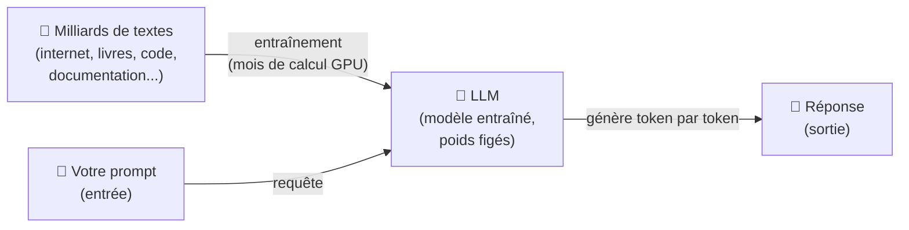
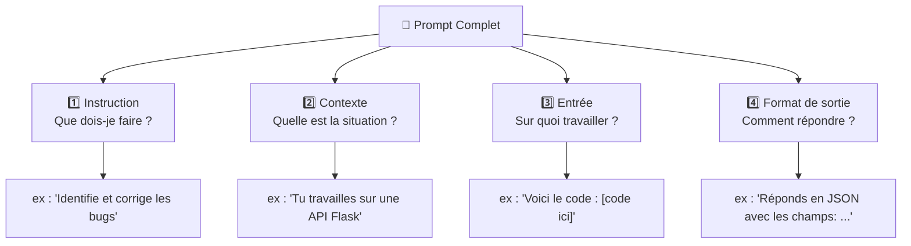
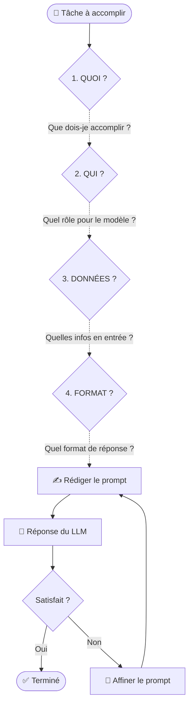
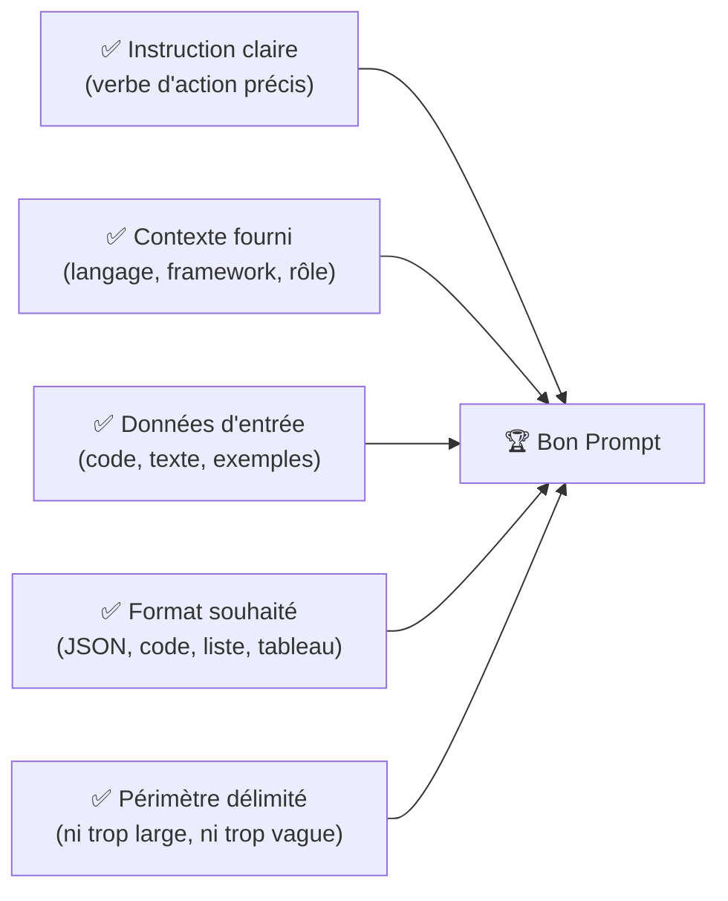

# Fondamentaux du Prompt Engineering

<span class="badge-beginner">Débutant</span>

Le prompt engineering commence par comprendre ce qu'est un LLM et comment il traite l'information. Pas besoin de mathématiques complexes — quelques analogies simples suffisent pour démarrer efficacement et améliorer immédiatement la qualité de vos interactions avec Copilot ou tout autre assistant IA.

---

## 1. Qu'est-ce qu'un LLM ?

Un **Large Language Model (LLM)** est un programme entraîné sur des milliards de textes pour prédire le texte le plus probable en fonction d'une séquence d'entrée. En pratique, il génère des réponses cohérentes en fonction du texte qu'on lui fournit — ce texte s'appelle le **prompt**.



!!! info "Analogie simple"
    Imaginez un collaborateur très cultivé ayant lu tous les livres, articles et codes source du monde. Vous lui posez une question (le prompt) et il vous répond en s'appuyant sur tout ce qu'il a mémorisé. Plus votre question est précise et contextualisée, plus sa réponse sera pertinente.

### Les LLMs courants en développement

| Modèle | Éditeur | Forces principales |
|--------|---------|-------------------|
| GPT-4o | OpenAI | Chat, code, analyse multimodale |
| Claude 3.5 / 3.7 | Anthropic | Raisonnement long, code, contexte étendu |
| Gemini 2.0 Flash | Google | Multimodal, vitesse, recherche |
| Codex / Copilot | GitHub / OpenAI | Complétion de code dans l'IDE |
| Llama 3 | Meta | Open-source, déployable localement |

---

## 2. Anatomie d'un Prompt

Un prompt bien construit contient jusqu'à **4 composants**. Vous n'avez pas besoin des quatre à chaque fois — mais les connaître vous aide à identifier ce qui manque quand une réponse est décevante.



!!! example "Prompt vague vs prompt structuré"

    **❌ Prompt vague :**
    ```
    Corrige mon code
    ```

    **✅ Prompt structuré :**
    ```
    Instruction : Identifie et corrige les bugs dans ce code Python.
    Contexte    : Il s'agit d'une API REST Flask qui gère des utilisateurs.
    Entrée      :
    ```python
    def get_user(id):
        return db.query("SELECT * FROM users WHERE id = " + id)
    ```
    Format      : Donne le code corrigé avec une explication de chaque correction.
    ```

---

## 3. La Règle Fondamentale : La Spécificité

La règle numéro un est simple : **plus vous êtes spécifique, meilleurs sont les résultats**.

### Échelle de spécificité

| Niveau | Exemple de prompt | Qualité attendue |
|--------|-------------------|-----------------|
| 1 — Vague | `Écris du code` | ❌ Inutilisable |
| 2 — Basique | `Écris une fonction Python` | ⚠️ Générique |
| 3 — Contextualisé | `Écris une fonction Python qui valide un email` | ✅ Correcte |
| 4 — Précis | `Écris une fonction Python qui valide un email avec regex, retourne un booléen, et lève une ValueError si l'entrée n'est pas une string` | ⭐ Excellente |
| 5 — Complet | Niveau 4 + exemple d'usage + type hints + docstring | 🏆 Parfaite |

---

## 4. Les 4 Questions Clés Avant d'Écrire un Prompt

Avant chaque prompt, posez-vous ces quatre questions. Elles structurent naturellement votre réflexion et évitent les oublis.



---

## 5. Votre Premier Prompt Efficace — Guide Pas à Pas

Voici comment construire progressivement un prompt de qualité, à partir d'un exemple concret avec GitHub Copilot Chat.

**Situation : vous devez écrire une fonction de tri d'objets**

### Étape 1 — Version naïve (à éviter)

```
écris une fonction de tri
```

→ Copilot génère un bubble sort générique, probablement dans le mauvais langage.

### Étape 2 — Ajouter le langage et l'objectif

```
Écris une fonction TypeScript qui trie un tableau d'objets User
par leur propriété lastName par ordre alphabétique.
```

→ Bien mieux, mais Copilot ne connaît pas votre type `User`.

### Étape 3 — Fournir le contexte de l'entrée

```typescript
// Interface existante dans le projet :
interface User {
  id: number;
  firstName: string;
  lastName: string;
  email: string;
}

// Écris une fonction TypeScript qui trie un tableau de User
// par lastName (ordre alphabétique croissant).
// La fonction doit être pure (ne pas muter le tableau original).
```

→ Résultat précis et cohérent avec votre codebase.

### Étape 4 — Préciser le format de sortie attendu

```typescript
// Interface existante :
interface User { id: number; firstName: string; lastName: string; email: string; }

// Tâche : Écris une fonction TypeScript qui :
// 1. Trie un tableau de User par lastName (ordre alphabétique, insensible à la casse)
// 2. Ne mute pas le tableau original (retourne une nouvelle copie triée)
// 3. Inclut les types TypeScript complets
// 4. Inclut un commentaire JSDoc

// Retourne uniquement le code, sans explications supplémentaires.
```

→ Résultat parfait, prêt à intégrer directement.

!!! success "Ce que cette progression illustre"
    En 4 étapes, vous êtes passé d'une réponse générique à un code prêt pour la production. Chaque étape ajoute une **information manquante** qui lève une ambiguïté. C'est l'essence du prompt engineering.

---

## 6. Erreurs Courantes à Éviter

!!! failure "Prompt ambigu"
    **❌ Problème :**
    ```
    Améliore ce code
    ```
    Le modèle ne sait pas *comment* améliorer : performance ? lisibilité ? sécurité ?

    **✅ Solution :**
    ```
    Améliore uniquement la lisibilité de ce code :
    renomme les variables avec des noms descriptifs,
    ajoute des commentaires sur la logique non évidente.
    Ne modifie pas la logique métier.
    ```

!!! failure "Manque de contexte"
    **❌ Problème :**
    ```
    Pourquoi mon test échoue ?
    ```

    **✅ Solution :**
    ```
    Voici mon test Jest (TypeScript) et le message d'erreur.
    Identifie pourquoi le test échoue et propose la correction.

    Test : [coller le test]
    Erreur : [coller le message d'erreur]
    Code de la fonction testée : [coller le code]
    ```

!!! failure "Question trop large"
    **❌ Problème :**
    ```
    Explique-moi tout sur les microservices
    ```

    **✅ Solution :**
    ```
    Explique en 5 points clés les différences entre une architecture
    monolithique et microservices, pour une équipe de 3 développeurs
    travaillant sur une application e-commerce Node.js.
    ```

!!! failure "Oublier le format de sortie"
    **❌ Problème :**
    ```
    Analyse cette PR et dis-moi ce qu'il faut revoir.
    ```

    **✅ Solution :**
    ```
    Analyse cette PR et retourne :
    - Une liste de problèmes classés par sévérité (Critical / Warning / Info)
    - Pour chaque problème : la ligne concernée et la correction suggérée
    - Une recommandation finale : Approuver / Demander des modifications
    ```

---

## 7. Récapitulatif : La Checklist du Débutant



| Critère | Question à se poser |
|---------|---------------------|
| **Clarté** | Est-ce que je comprendrais cette instruction moi-même ? |
| **Contexte** | Le modèle a-t-il toutes les informations nécessaires ? |
| **Spécificité** | Ai-je précisé le langage, le framework, le cas d'usage ? |
| **Format** | Ai-je indiqué comment je veux la réponse ? |
| **Périmètre** | Ai-je délimité ce qui est inclus et exclu ? |
| **Testabilité** | Puis-je vérifier objectivement si la réponse est correcte ? |

---

## Prochaine étape

**[Techniques Intermédiaires de Prompt Engineering](techniques-intermediaires.md)** : passer du bon prompt à l'excellent prompt avec des méthodes structurées et mesurables.

Concepts clés couverts :

- **Zero-Shot, Few-Shot, Many-Shot** — guider le modèle par l'exemple pour obtenir un format ou un style précis
- **Chain-of-Thought** — forcer le raisonnement étape par étape pour les tâches logiques complexes
- **Role Prompting** — assigner une expertise au LLM pour conditionner son angle d'approche
- **Structuration des sorties** — contrôler le format (JSON, tableau, Markdown) pour intégrer les réponses dans vos workflows
