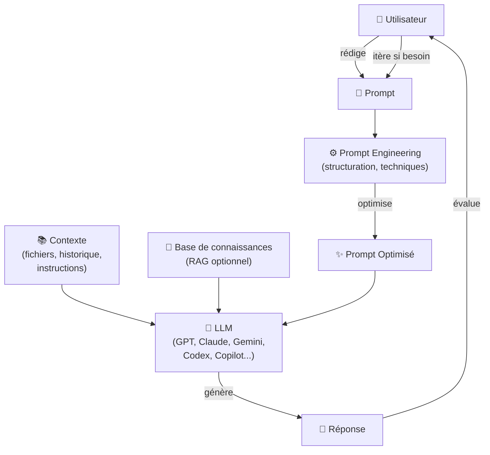
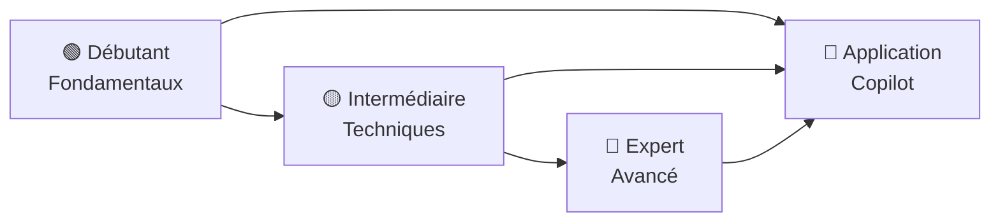

# Prompt Engineering

Débutant Intermédiaire Expert

Le **Prompt Engineering** est la discipline qui consiste à concevoir, formuler et optimiser les instructions transmises aux modèles de langage (LLMs) pour obtenir des réponses précises, utiles et reproductibles. C'est une compétence fondamentale pour tout développeur qui souhaite travailler efficacement avec des IA comme GitHub Copilot, Claude, GPT-4 ou Gemini.

Ce chapitre vous guide depuis les concepts les plus simples jusqu'aux architectures avancées utilisées en production, avec des diagrammes illustrant les mécanismes internes et des exemples concrets à chaque étape.

---

## Vue d'ensemble : Le Cycle du Prompt Engineering

---

## Contenu du Chapitre

- :material-school: **[Fondamentaux](fondamentaux.md)**

    Débutant

    Qu'est-ce qu'un LLM, anatomie d'un prompt, composants essentiels, checklist du débutant et exemples guidés pas à pas.

- :material-trending-up: **[Techniques Intermédiaires](techniques-intermediaires.md)**

    Intermédiaire

    Zero-shot, few-shot, chain-of-thought, role prompting, structuration des sorties, itération et raffinement.

- :material-atom: **[Techniques Avancées](techniques-avancees.md)**

    Expert

    Prompt chaining, RAG, Tree of Thoughts, self-consistency, meta-prompting, défense contre les injections et évaluation systématique.

- :material-github: **[Prompting avec Copilot](avec-copilot.md)**

    Débutant Intermédiaire Expert

    Appliquer le prompt engineering à GitHub Copilot : complétion inline, Chat, instructions permanentes et prompt files.

---

## Pourquoi Apprendre le Prompt Engineering ?

| Bénéfice | Sans PE | Avec PE |
|----------|---------|---------|
| Qualité des réponses | Générique, parfois hors sujet | Précise, adaptée au contexte |
| Nombre d'itérations | 5 à 10 aller-retours | 1 à 2 suffisent |
| Cohérence | Variable d'un essai à l'autre | Reproductible |
| Complexité des tâches gérées | Tâches simples | Tâches multi-étapes complexes |
| Contrôle du format de sortie | Difficile à imposer | Maîtrisé (JSON, Markdown, code…) |
| Fiabilité | Hallucinations fréquentes | Réponses ancrées dans les faits |

---

## Parcours d'Apprentissage Recommandé

!!! tip "Conseil de progression"
    Même si vous êtes développeur expérimenté, parcourez les fondamentaux. La plupart des erreurs fréquentes en prompt engineering viennent d'une incompréhension des mécanismes de base des LLMs.

---

## Prochaine étape

**[Fondamentaux du Prompt Engineering](fondamentaux.md)** : comprendre les bases avant d'appliquer les techniques avancées.

Concepts clés couverts :

- **Qu'est-ce qu'un LLM** — Analogie du collaborateur cultivé, modèles courants (GPT-4o, Claude, Gemini, Copilot...)
- **Anatomie d'un prompt** — Les 4 composants : instruction, contexte, entrée, format de sortie
- **La règle fondamentale** — Plus vous êtes spécifique, meilleurs sont les résultats
- **Prompt vague vs prompt structuré** — Exemples concrets de l'impact de la précision
