# Algorithmes Courants du Machine Learning

<span class="badge-intermediate">Intermédiaire</span>

## Choisir le Bon Algorithme

Le choix d'un algorithme dépend principalement de deux questions : quel **type d'apprentissage** utiliser, et quel **type de problème** résoudre.

```mermaid
graph TD
    Q1{"Avez-vous des\ndonnées étiquetées ?"}
    Q1 -->|Oui| SUP["✅ Apprentissage Supervisé"]
    Q1 -->|Non| NSUP["🔍 Apprentissage Non Supervisé"]
    SUP --> Q2{"Type de sortie ?"}
    Q2 -->|"Valeur numérique"| REG["📈 Régression"]
    Q2 -->|"Catégorie / Classe"| CLASS["🏷️ Classification"]
    NSUP --> Q3{"Objectif ?"}
    Q3 -->|"Trouver des groupes"| CLUST["🗂️ Clustering"]
    Q3 -->|"Réduire dimensions"| DIM["📉 Réduction dimensionnelle"]
```



---

## Algorithmes Supervisés — Régression

Les algorithmes de régression prédisent une **valeur numérique continue**.

### Régression Linéaire

L'algorithme le plus simple : il cherche la droite qui s'ajuste le mieux aux données.

```python
from sklearn.linear_model import LinearRegression
import numpy as np

X = np.array([[1], [2], [3], [4], [5]])
y = [10, 20, 30, 40, 50]

model = LinearRegression()
model.fit(X, y)

prediction = model.predict([[6]])  # → ~60
print(f"Prédiction : {prediction[0]:.1f}")
```

| Variante | Usage | Quand l'utiliser |
|----------|-------|-----------------|
| **Univariée** | 1 feature → 1 output | Relation simple |
| **Multiple (MLR)** | N features → 1 output | Plusieurs facteurs influencent le résultat |
| **Polynomiale** | Relation non-linéaire | Courbe plutôt que droite |
| **Logistique** | Classification binaire (0/1) | Prédire Oui/Non, Spam/Ham |

### Descente de Gradient

Mécanisme fondamental d'optimisation utilisé par la plupart des algorithmes ML : il ajuste les poids du modèle pas à pas pour minimiser l'erreur.

!!! info "Analogie"
    Imaginez-vous dans un brouillard sur une montagne. Pour descendre dans la vallée (minimiser l'erreur), vous faites de petits pas dans la direction qui descend le plus. C'est la descente de gradient.

---

## Algorithmes Supervisés — Classification

Les algorithmes de classification prédisent une **catégorie**.

### Arbre de Décision (Decision Tree)

Divise les données selon des règles logiques successives, comme un organigramme.

```python
from sklearn.tree import DecisionTreeClassifier
from sklearn.model_selection import train_test_split

X_train, X_test, y_train, y_test = train_test_split(X, y, test_size=0.2)

clf = DecisionTreeClassifier(max_depth=5)
clf.fit(X_train, y_train)

score = clf.score(X_test, y_test)
print(f"Précision : {score:.2%}")
```

!!! tip "Avantage"
    L'arbre de décision est facilement **interprétable** : on peut visualiser et expliquer les décisions prises.

### Forêts Aléatoires (Random Forest)

Ensemble d'arbres de décision entraînés sur des sous-échantillons différents. Le résultat final est la **décision majoritaire** de tous les arbres.

```python
from sklearn.ensemble import RandomForestClassifier

# 100 arbres — plus robuste qu'un seul arbre
clf = RandomForestClassifier(n_estimators=100, random_state=42)
clf.fit(X_train, y_train)
```

!!! success "Bonne pratique"
    Random Forest est souvent un **excellent point de départ** : robuste, peu sensible au surapprentissage, peu de réglages nécessaires.

### Boosting : Bagging, Gradient Boosting, XGBoost

| Technique | Principe | Implémentation |
|-----------|----------|----------------|
| **Bagging** | Arbres en parallèle sur sous-échantillons | `RandomForestClassifier` |
| **Boosting** | Arbres en séquence, chacun corrige les erreurs du précédent | `GradientBoostingClassifier` |
| **XGBoost** | Boosting optimisé, très performant en compétition | `xgboost.XGBClassifier` |

### SVM — Machine à Vecteurs de Support

Trouve la frontière (hyperplan) qui sépare au mieux les classes avec la marge maximale.

```python
from sklearn.svm import SVC

svm = SVC(kernel='rbf', C=1.0)
svm.fit(X_train, y_train)
```

!!! info "Quand utiliser SVM ?"
    SVM excelle sur les jeux de données avec **peu d'observations mais beaucoup de features** (données textuelles, données génomiques).

### KNN — K Plus Proches Voisins

Classe un point en regardant les **K exemples les plus proches** dans l'espace de features.

```python
from sklearn.neighbors import KNeighborsClassifier

knn = KNeighborsClassifier(n_neighbors=5)
knn.fit(X_train, y_train)
```

### Naive Bayes

Basé sur le **théorème de Bayes** — très efficace pour la classification de texte (NLP).

```python
from sklearn.naive_bayes import MultinomialNB
from sklearn.feature_extraction.text import CountVectorizer

vectorizer = CountVectorizer()
X_vec = vectorizer.fit_transform(textes)

nb = MultinomialNB()
nb.fit(X_vec, labels)
```

!!! example "Cas d'usage : analyse de sentiment"
    Naive Bayes est idéal pour classer des opinions ou des emails en spam/ham. Il calcule la probabilité qu'un message appartienne à une catégorie selon les mots qu'il contient.

---

## Algorithmes Non Supervisés — Clustering

### K-Means (K-Moyennes)

Divise les données en **K groupes** (clusters) dont on choisit le nombre à l'avance.

```python
from sklearn.cluster import KMeans
import matplotlib.pyplot as plt

kmeans = KMeans(n_clusters=3, random_state=42)
kmeans.fit(X)

labels = kmeans.labels_
centers = kmeans.cluster_centers_

plt.scatter(X[:, 0], X[:, 1], c=labels, cmap='viridis')
plt.scatter(centers[:, 0], centers[:, 1], marker='*', s=300, c='red')
plt.show()
```

!!! info "Cas concret : abricots et cerises"
    Si vous avez des données de fruits (taille, couleur, poids) sans étiquettes, K-Means va automatiquement regrouper les abricots ensemble et les cerises ensemble — sans jamais avoir vu their labels!

### DBSCAN

Trouve des groupes de **forme quelconque** et détecte automatiquement les anomalies (bruit).

```python
from sklearn.cluster import DBSCAN

dbscan = DBSCAN(eps=0.5, min_samples=5)
labels = dbscan.fit_predict(X)
# label == -1 → point de bruit (outlier)
```

### Mélanges Gaussiens (GMM)

Modèle probabiliste qui suppose que les données sont générées par plusieurs **distributions gaussiennes** mélangées.

```python
from sklearn.mixture import GaussianMixture

gmm = GaussianMixture(n_components=3)
gmm.fit(X)
probas = gmm.predict_proba(X)  # Probabilité d'appartenir à chaque cluster
```

---

## Tableau Comparatif

| Algorithme | Type | Interprétabilité | Scalabilité | Quand l'utiliser |
|-----------|------|-----------------|-------------|-----------------|
| Régression linéaire | Supervisé - Régression | ⭐⭐⭐⭐⭐ | ⭐⭐⭐⭐⭐ | Relation linéaire, données propres |
| Arbre de décision | Supervisé - Classification | ⭐⭐⭐⭐⭐ | ⭐⭐⭐ | Règles métier explicables |
| Random Forest | Supervisé - Classification | ⭐⭐⭐ | ⭐⭐⭐⭐ | Point de départ robuste |
| XGBoost | Supervisé - Classification | ⭐⭐ | ⭐⭐⭐⭐⭐ | Compétitions, haute performance |
| SVM | Supervisé - Classification | ⭐⭐ | ⭐⭐ | Peu de données, beaucoup de features |
| KNN | Supervisé - Classification | ⭐⭐⭐⭐ | ⭐ | Données peu volumineuses |
| Naive Bayes | Supervisé - Classification | ⭐⭐⭐ | ⭐⭐⭐⭐⭐ | NLP, classification de texte |
| K-Means | Non supervisé - Clustering | ⭐⭐⭐⭐ | ⭐⭐⭐⭐ | Groupes sphériques, K connu |
| DBSCAN | Non supervisé - Clustering | ⭐⭐⭐ | ⭐⭐⭐ | Groupes de forme quelconque, outliers |

!!! tip "Utiliser Copilot pour choisir"
    Décrivez votre problème à Copilot Chat : *"J'ai 10 000 observations avec 50 features numériques et je veux prédire une catégorie parmi 5. Quel algorithme sklearn recommandes-tu ?"* — Copilot suggère généralement Random Forest ou XGBoost avec justification.

---

## Prochaine étape

**[Copilot pour le Workflow ML](copilot-workflow-ml.md)** : maintenant que vous connaissez les algorithmes, découvrez comment Copilot vous assiste à chaque phase du projet ML.

Concepts clés couverts :

- **Définir le problème** — Copilot identifie le type de problème (classification, régression) et recommande un algorithme adapté
- **Préparer les données** — Suggestions pour gérer les NaN, encoder les catégories, normaliser avec sklearn
- **Entraîner et évaluer** — Pipeline complet avec `cross_val_score`, matrice de confusion, rapport de classification
- **Prompts par phase** — Bibliothèque de prompts Copilot prêts à l'emploi pour chaque étape du workflow
