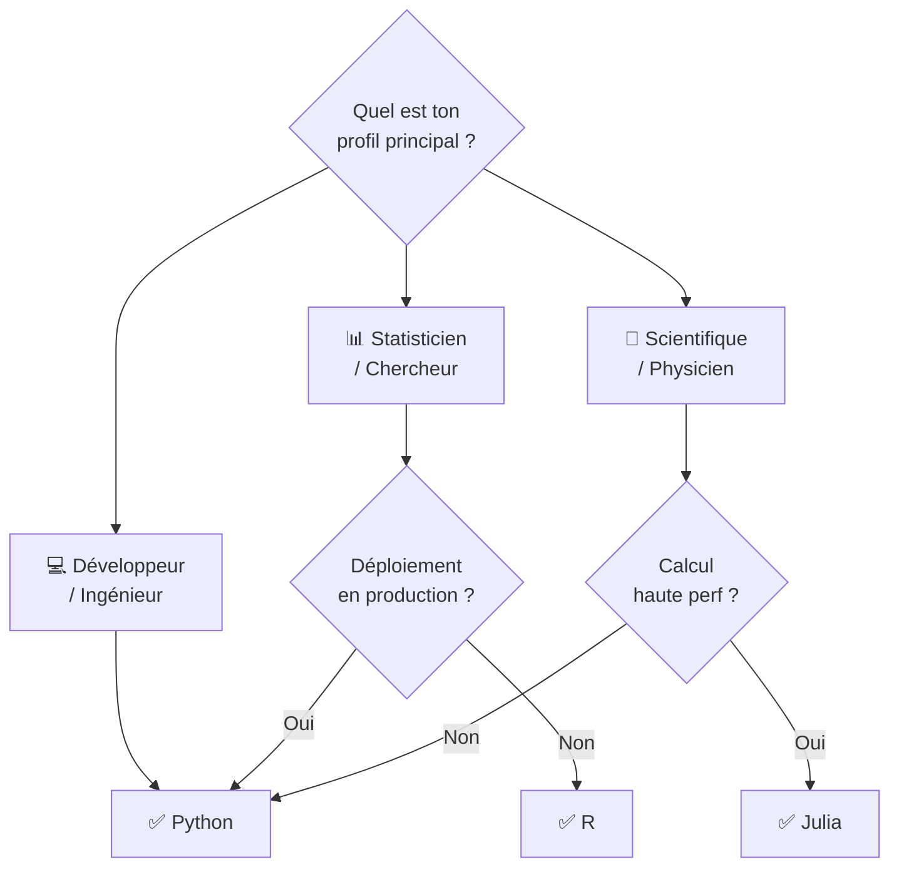

# Comparaison des Écosystèmes ML : Python vs R vs Julia

<span class="badge-intermediate">Intermédiaire</span>

Trois langages dominent le Machine Learning. Ce guide compare leurs forces, faiblesses et leur intégration avec GitHub Copilot pour vous aider à choisir le bon outil selon votre contexte.

---

## Vue d'Ensemble

| Critère | Python | R | Julia |
|---------|--------|---|-------|
| **Popularité ML** | ⭐⭐⭐⭐⭐ | ⭐⭐⭐ | ⭐⭐ |
| **Courbe d'apprentissage** | Douce | Moyenne | Raide |
| **Support Copilot** | ⭐⭐⭐⭐⭐ | ⭐⭐⭐⭐ | ⭐⭐⭐ |
| **Bibliothèques ML** | ⭐⭐⭐⭐⭐ | ⭐⭐⭐⭐ | ⭐⭐⭐ |
| **Performance brute** | ⭐⭐⭐ | ⭐⭐ | ⭐⭐⭐⭐⭐ |
| **Visualisation stats** | ⭐⭐⭐⭐ | ⭐⭐⭐⭐⭐ | ⭐⭐⭐ |
| **Communauté** | ⭐⭐⭐⭐⭐ | ⭐⭐⭐⭐ | ⭐⭐ |
| **Déploiement prod** | ⭐⭐⭐⭐⭐ | ⭐⭐ | ⭐⭐⭐ |

---

## Python — Le Standard Industriel

<span class="badge-beginner">Recommandé pour démarrer</span>

Python est le langage dominant du ML et de la Data Science, avec un écosystème incomparable.

### Points Forts

- **Écosystème complet** : pandas, numpy, scikit-learn, TensorFlow, PyTorch, FastAPI, Django
- **Intégration Copilot maximale** : le corpus d'entraînement de Copilot est riche en code Python ML
- **Polyvalent** : du notebook d'exploration à l'API en production, tout en Python
- **Communauté massive** : Stack Overflow, Hugging Face, Kaggle — toujours une solution disponible

### Points Faibles

- Performance limitée sans NumPy/Cython (GIL Python)
- Pas conçu initialement pour les statistiques académiques

### Exemple — Régression avec scikit-learn

```python
from sklearn.linear_model import LinearRegression
from sklearn.model_selection import train_test_split
from sklearn.metrics import mean_squared_error
import pandas as pd

df = pd.read_csv("data.csv")
X, y = df.drop("target", axis=1), df["target"]

X_train, X_test, y_train, y_test = train_test_split(X, y, test_size=0.2)
model = LinearRegression()
model.fit(X_train, y_train)

rmse = mean_squared_error(y_test, model.predict(X_test), squared=False)
print(f"RMSE : {rmse:.3f}")
```

### Intégration Copilot

!!! success "Copilot + Python : le meilleur combo"
    Copilot a été entraîné sur des millions de notebooks Python. Il génère des pipelines sklearn complets, suggère les visualisations seaborn adaptées et propose automatiquement des patterns comme `train_test_split` avec `random_state=42`.

---

## R — Le Roi de la Statistique

<span class="badge-intermediate">Recommandé pour la recherche académique</span>

R est le langage de référence pour les statistiques, la bio-informatique et la recherche académique.

### Points Forts

- **Statistiques avancées** : tests d'hypothèses, modèles mixtes, survie — inégalé
- **ggplot2** : la meilleure bibliothèque de visualisation statistique
- **tidyverse** : manipulation de données élégante et lisible
- **RMarkdown / Quarto** : rapports reproductibles intégrant code + prose

### Points Faibles

- Déploiement en production complexe (pas de FastAPI natif)
- Moins de bibliothèques Deep Learning (TensorFlow via `{keras}` wrapper)
- Performance inférieure à Python pour les gros volumes

### Exemple — Même régression en R

```r
library(tidyverse)
library(tidymodels)

# Chargement et split
data <- read_csv("data.csv")
split <- initial_split(data, prop = 0.8)
train_data <- training(split)
test_data <- testing(split)

# Modèle
recipe <- recipe(target ~ ., data = train_data)
model <- linear_reg() |> set_engine("lm")
workflow <- workflow() |> add_recipe(recipe) |> add_model(model)

# Fit et évaluation
fit <- workflow |> fit(data = train_data)
predictions <- fit |> predict(new_data = test_data)

rmse <- sqrt(mean((test_data$target - predictions$.pred)^2))
cat(sprintf("RMSE : %.3f\n", rmse))
```

### Intégration Copilot

!!! info "Copilot et R"
    Copilot supporte bien R, surtout pour tidyverse et tidymodels. Il connaît `ggplot2` en profondeur et suggère des geoms adaptés. Moins performant pour le Deep Learning et les architectures réseau.

---

## Julia — Le Futur des Sciences Computationnelles ?

<span class="badge-expert">Pour les besoins de haute performance</span>

Julia est conçu pour allier la facilité de Python et les performances du C/Fortran. Il excelle en simulation numérique et calcul scientifique.

### Points Forts

- **Performance native** : aussi rapide que C, sans compilation explicite (JIT)
- **Syntaxe mathématique** : `∑`, `∀`, notation matricielle naturelle
- **Flux.jl** : framework Deep Learning performant
- **Multiple dispatch** : paradigme de programmation très puissant

### Points Faibles

- **Latence de démarrage** ("time to first plot") — améliorée en Julia 1.9+
- Écosystème ML moins mature que Python
- **Support Copilot limité** — corpus Julia plus petit

### Exemple — Même régression en Julia

```julia
using DataFrames, CSV, MLJ, Statistics

# Charger les données
df = CSV.read("data.csv", DataFrame)

# Split train/test
train, test = partition(eachindex(df.target), 0.8, shuffle=true)

# Modèle
LinearRegressor = @load LinearRegressor pkg=MLJLinearModels
model = LinearRegressor()

X = select(df, Not(:target))
y = df.target

mach = machine(model, X[train, :], y[train])
fit!(mach)

ŷ = predict(mach, X[test, :])
rmse = sqrt(mean((y[test] .- ŷ).^2))
println("RMSE : $(round(rmse, digits=3))")
```

---

## Guide de Décision



| Contexte | Recommandation | Raison |
|----------|---------------|--------|
| Startup / Produit ML | **Python** | Écosystème, déploiement, Copilot |
| Recherche académique | **R** | Stats avancées, publication |
| Bio-informatique | **R ou Python** | Bioconductor (R) ou Biopython |
| Simulation physique | **Julia** | Performance, notation mathématique |
| NLP / Vision | **Python** | HuggingFace, PyTorch dominent |
| Reporting statistique | **R** | ggplot2 + RMarkdown incomparables |
| Formation ML débutant | **Python** | Ressources, communauté, Copilot |

---

## Interopérabilité

Il est possible de combiner ces langages ! Copilot aide à écrire le code d'intégration.

```python
# Appeler R depuis Python avec rpy2
import rpy2.robjects as ro
from rpy2.robjects.packages import importr

stats = importr('stats')
result = stats.lm("mpg ~ cyl + hp", data=ro.r['mtcars'])
print(ro.r['summary'](result))
```

```python
# Appeler Julia depuis Python avec juliacall
from juliacall import Main as jl
jl.seval("using Flux")

# Utiliser un modèle Julia dans Python
model = jl.seval("Chain(Dense(10 => 5, relu), Dense(5 => 1))")
```

---

## Prochaine étape

**[Comparaison des Outils ML](comparaison-outils.md)** : maintenant que vous avez choisi votre langage, comparez les frameworks ML au sein de l'écosystème Python.

Concepts clés couverts :

- **scikit-learn vs TensorFlow vs PyTorch vs Keras** — Forces, faiblesses et cas d'usage de chaque framework
- **Critères de choix** — Taille du dataset, type de modèle (classique vs DL), besoin de déploiement, support Copilot
- **Courbes d'apprentissage** — Quel framework est le plus assisté par Copilot et le plus rapide à prendre en main
- **Tableau de décision** — Guide synthétique pour choisir le bon outil selon votre contexte projet
