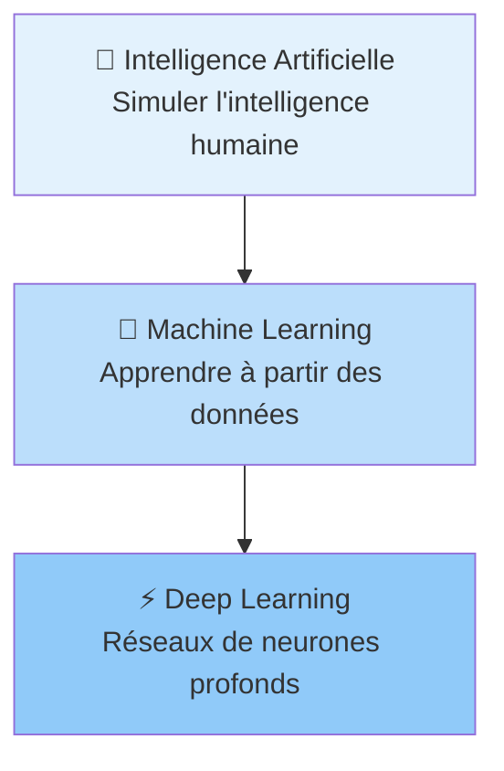
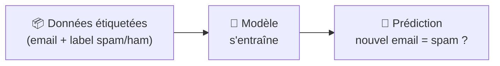
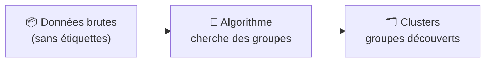
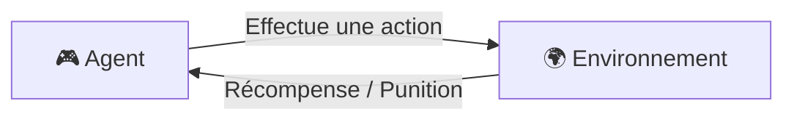

# Concepts Fondamentaux du Machine Learning

<span class="badge-beginner">Débutant</span>

## Intelligence Artificielle, Machine Learning, Deep Learning

Ces trois termes sont souvent confondus. En réalité, ils s'emboîtent comme des poupées russes.



| Terme | Définition simple | Exemple concret |
|-------|-------------------|-----------------|
| **Intelligence Artificielle** | Tout système capable d'imiter des comportements intelligents | Un programme qui joue aux échecs |
| **Machine Learning** | IA qui apprend automatiquement à partir d'exemples, sans être explicitement programmée | Un filtre antispam qui s'améliore avec le temps |
| **Deep Learning** | ML utilisant des réseaux de neurones à plusieurs couches | La reconnaissance d'images dans votre téléphone |

!!! info "Analogie"
    L'IA, c'est le domaine. Le ML, c'est une approche de ce domaine. Le Deep Learning, c'est une technique du ML.

---

## Un Peu d'Histoire

L'intelligence artificielle n'est pas une invention récente. Voici les grandes périodes clés :

| Période | Événement marquant |
|---------|--------------------|
| **1950** | Alan Turing propose le "Test de Turing" |
| **1957** | Création du premier **perceptron** (Frank Rosenblatt) |
| **1980s** | Premier "hiver de l'IA" — manque de puissance de calcul |
| **1997** | Deep Blue bat Kasparov aux échecs |
| **2012** | AlexNet relance le Deep Learning (GPU + big data) |
| **2017** | Transformers (base de GPT, BERT) |
| **2022** | ChatGPT, GitHub Copilot — IA générative grand public |

---

## Les 3 Types d'Apprentissage

### 1. Apprentissage Supervisé

La machine apprend à partir d'exemples **étiquetés** : on lui donne les données ET les réponses correctes.



**Exemples d'utilisation :**

- Prédire le prix d'une maison (régression)
- Classer un email en spam ou non (classification)
- Choisir le bon Pokémon selon ses statistiques de combat

### 2. Apprentissage Non Supervisé

La machine cherche **seule des structures** dans les données, sans étiquettes.



**Exemples d'utilisation :**

- Segmentation de clients par comportement d'achat
- Détection d'anomalies (fraude)
- Clustering de fruits par couleur et taille (abricots vs cerises)

### 3. Apprentissage par Renforcement

Un agent apprend par **essais et erreurs** : il reçoit une récompense ou une punition selon ses actions.



**Exemples d'utilisation :**

- Jeux vidéo (AlphaGo, Dota 2)
- Robots autonomes
- Optimisation de campagnes publicitaires

---

## Vocabulaire Essentiel

Avant de coder un modèle, il faut maîtriser ce vocabulaire fondamental.

| Terme | Définition | Exemple |
|-------|------------|---------|
| **Observation** | Une ligne de données (un exemple) | Les stats d'un Pokémon |
| **Feature** (attribut) | Une colonne de données (une variable) | `PV`, `Attaque`, `Type` |
| **Label** (étiquette) | La valeur à prédire | `Gagnant = Oui/Non` |
| **Jeu d'entraînement** | Données pour apprendre | 80% du dataset |
| **Jeu de test** | Données pour évaluer | 20% du dataset |
| **Modèle** | L'algorithme une fois entraîné | `RandomForestClassifier` entraîné |
| **Hyperparamètre** | Paramètre réglé avant l'entraînement | Nombre d'arbres dans une forêt |
| **Overfitting** | Modèle trop ajusté aux données d'entraînement | 99% sur train, 60% sur test |
| **Underfitting** | Modèle pas assez ajusté | 60% partout |

!!! warning "Overfitting : le piège classique"
    Un modèle qui fait 99% de précision sur les données d'entraînement mais seulement 60% sur de nouvelles données a **sur-appris** (overfitting). Il a mémorisé les données plutôt qu'appris les patterns généraux.

---

## Les Données : La Base de Tout

### Types de données

| Type | Description | Exemple | Traitement |
|------|------------|---------|-----------|
| **Numérique continu** | Valeurs décimales | Prix, température | Normalisation |
| **Numérique discret** | Valeurs entières | Nombre de victoires, PV | Souvent tel quel |
| **Catégoriel ordinal** | Catégories avec ordre | Note (A/B/C), rang | Label Encoding |
| **Catégoriel nominal** | Catégories sans ordre | Type de Pokémon, pays | One-Hot Encoding |
| **Booléen** | Vrai/Faux | Légendaire = Oui/Non | 0/1 |

### Indicateurs statistiques clés

```python
import pandas as pd

df = pd.read_csv("pokemon.csv")

# Mesures de tendance centrale
print(df["PV"].mean())    # Moyenne
print(df["PV"].median())  # Médiane (moins sensible aux extremes)
print(df["PV"].mode())    # Mode (valeur la plus fréquente)

# Mesures de dispersion
print(df["PV"].std())     # Écart type
print(df["PV"].describe())  # Résumé complet
```

!!! tip "Moyenne vs Médiane"
    Si vos données contiennent des **valeurs extrêmes** (outliers), préférez la **médiane** à la moyenne. Exemple : dans une classe de 30 élèves où un millionnaire a tout skewé, la moyenne des revenus sera trompeuse.

---

## Prochaines Étapes

Une fois ces concepts assimilés, tu peux explorer :

- [Algorithmes Courants](algorithmes-courants.md) — les principaux algorithmes et quand les utiliser
- [Python & Data Science](python-data-science.md) — passer à la pratique avec pandas et scikit-learn
- [Copilot pour le ML](copilot-workflow-ml.md) — comment Copilot assiste dans ces tâches
