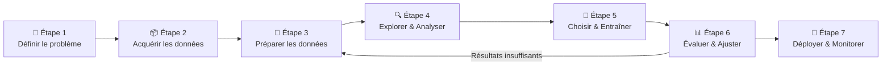

# Copilot pour le Workflow Machine Learning

<span class="badge-intermediate">Intermédiaire</span>

GitHub Copilot accélère chaque étape du cycle de vie d'un projet ML. Ce guide montre **comment et quand** solliciter Copilot à chaque phase.

---

## Vue d'Ensemble du Workflow ML



---

## Étape 1 — Définir le Problème

Avant d'écrire la moindre ligne de code, demandez à Copilot Chat de vous aider à **structurer votre problème**.

**Exemple de prompt :**

```
Je veux créer un modèle qui prédit si un Pokémon va gagner un combat
en fonction de ses statistiques (PV, Attaque, Défense, Vitesse, Type).
C'est quel type de problème ML ? Quelle approche recommandes-tu ?
```

Copilot identifie automatiquement :
- Type de problème : classification binaire (Victoire/Défaite)
- Features à utiliser
- Algorithmes adaptés (Random Forest, XGBoost)
- Métriques d'évaluation recommandées (accuracy, F1-score)

---

## Étape 2 — Acquérir les Données

Copilot aide à écrire les scripts d'acquisition de données.

```python
# Prompt : "Charge un CSV Pokemon avec pandas, affiche les premières lignes
#           et le résumé statistique"
import pandas as pd

df = pd.read_csv("pokemon.csv")

print(f"Dimensions : {df.shape}")
print(f"\nPremières observations :")
print(df.head(10))
print(f"\nRésumé statistique :")
print(df.describe())
print(f"\nTypes de colonnes :")
print(df.dtypes)
```

!!! tip "Copilot et la qualité des données"
    Ajoutez un commentaire comme `# Vérifier les valeurs manquantes et les types` — Copilot suggère automatiquement `df.isnull().sum()`, `df.info()` et les conversions de types.

---

## Étape 3 — Préparer les Données

La phase la plus chronophage. Copilot excelle ici grâce à ses suggestions de code de nettoyage.

### Gestion des valeurs manquantes

```python
# Prompt : "Gérer les valeurs manquantes : supprimer les lignes avec
#           plus de 30% de NaN, imputer le reste avec la médiane"
import pandas as pd
from sklearn.impute import SimpleImputer

# Supprimer colonnes avec trop de NaN
threshold = 0.3
df = df.dropna(thresh=int(df.shape[0] * (1 - threshold)), axis=1)

# Imputer les NaN restants avec la médiane
imputer = SimpleImputer(strategy='median')
df_num = pd.DataFrame(
    imputer.fit_transform(df.select_dtypes(include='number')),
    columns=df.select_dtypes(include='number').columns
)
```

### Encodage des variables catégorielles

```python
# Prompt : "One-hot encoder les colonnes catégorielles Type1 et Type2"
df_encoded = pd.get_dummies(df, columns=['Type1', 'Type2'], drop_first=True)

# Ou avec sklearn pour un pipeline
from sklearn.preprocessing import LabelEncoder

le = LabelEncoder()
df['Type1_encoded'] = le.fit_transform(df['Type1'].fillna('Unknown'))
```

### Normalisation

```python
# Prompt : "Normaliser les features numériques entre 0 et 1"
from sklearn.preprocessing import MinMaxScaler

scaler = MinMaxScaler()
features_to_scale = ['PV', 'Attaque', 'Defense', 'Vitesse']
df[features_to_scale] = scaler.fit_transform(df[features_to_scale])
```

---

## Étape 4 — Explorer et Analyser les Données

### Visualisation rapide avec Copilot

```python
# Prompt : "Créer une heatmap de corrélation des features numériques"
import seaborn as sns
import matplotlib.pyplot as plt

plt.figure(figsize=(12, 10))
corr_matrix = df.select_dtypes(include='number').corr()
sns.heatmap(
    corr_matrix,
    annot=True,
    fmt='.2f',
    cmap='coolwarm',
    center=0
)
plt.title("Matrice de corrélation")
plt.tight_layout()
plt.show()
```

```python
# Prompt : "Détecter et visualiser les outliers avec des boxplots"
fig, axes = plt.subplots(2, 3, figsize=(15, 10))
features = ['PV', 'Attaque', 'Defense', 'Sp. Atq', 'Sp. Def', 'Vitesse']

for ax, feature in zip(axes.flat, features):
    df.boxplot(column=feature, ax=ax)
    ax.set_title(feature)

plt.tight_layout()
plt.show()
```

!!! tip "Instructions Copilot pour le ML"
    Ajoutez dans `.github/copilot-instructions.md` :
    ```
    Stack ML : Python 3.11, pandas 2.x, scikit-learn 1.4, matplotlib, seaborn
    Dataset principal : pokemon.csv (colonnes: Nom, PV, Attaque, Defense, Type1, Type2, Legendaire)
    Output attendu : classification binaire (Victoire = 1 / Défaite = 0)
    Convention : toujours découper train/test avec random_state=42
    ```

---

## Étape 5 — Choisir et Entraîner le Modèle

### Pipeline complet généré par Copilot

```python
# Prompt : "Créer un pipeline sklearn complet avec preprocessing et
#           RandomForest, puis tester plusieurs algorithmes"
from sklearn.pipeline import Pipeline
from sklearn.preprocessing import StandardScaler
from sklearn.ensemble import RandomForestClassifier, GradientBoostingClassifier
from sklearn.svm import SVC
from sklearn.model_selection import train_test_split, cross_val_score
import pandas as pd

# Découpage train/test
X = df.drop('Victoire', axis=1)
y = df['Victoire']
X_train, X_test, y_train, y_test = train_test_split(
    X, y, test_size=0.2, random_state=42, stratify=y
)

# Tester plusieurs algorithmes
algorithms = {
    'Random Forest': RandomForestClassifier(n_estimators=100, random_state=42),
    'Gradient Boosting': GradientBoostingClassifier(n_estimators=100, random_state=42),
    'SVM': SVC(kernel='rbf', probability=True)
}

results = {}
for name, algo in algorithms.items():
    pipeline = Pipeline([
        ('scaler', StandardScaler()),
        ('model', algo)
    ])
    scores = cross_val_score(pipeline, X_train, y_train, cv=5, scoring='accuracy')
    results[name] = scores.mean()
    print(f"{name}: {scores.mean():.3f} ± {scores.std():.3f}")
```

---

## Étape 6 — Évaluer et Ajuster

```python
# Prompt : "Afficher rapport de classification complet et matrice de confusion"
from sklearn.metrics import classification_report, confusion_matrix, ConfusionMatrixDisplay

best_model = Pipeline([
    ('scaler', StandardScaler()),
    ('model', RandomForestClassifier(n_estimators=100, random_state=42))
])
best_model.fit(X_train, y_train)
y_pred = best_model.predict(X_test)

print("=== Rapport de Classification ===")
print(classification_report(y_test, y_pred, target_names=['Défaite', 'Victoire']))

print("\n=== Matrice de Confusion ===")
cm = confusion_matrix(y_test, y_pred)
disp = ConfusionMatrixDisplay(confusion_matrix=cm, display_labels=['Défaite', 'Victoire'])
disp.plot(cmap='Blues')
plt.show()
```

### Optimisation des Hyperparamètres

```python
# Prompt : "Optimiser les hyperparamètres de Random Forest avec GridSearchCV"
from sklearn.model_selection import GridSearchCV

param_grid = {
    'model__n_estimators': [50, 100, 200],
    'model__max_depth': [None, 10, 20],
    'model__min_samples_split': [2, 5, 10]
}

grid_search = GridSearchCV(best_model, param_grid, cv=5, n_jobs=-1, verbose=1)
grid_search.fit(X_train, y_train)

print(f"Meilleurs paramètres : {grid_search.best_params_}")
print(f"Meilleur score : {grid_search.best_score_:.3f}")
```

---

## Étape 7 — Sauvegarder et Utiliser le Modèle

```python
# Prompt : "Sauvegarder le modèle entraîné et l'utiliser pour de nouvelles prédictions"
import joblib

# Sauvegarde
joblib.dump(grid_search.best_estimator_, 'modele_pokemon.pkl')
print("✅ Modèle sauvegardé dans modele_pokemon.pkl")

# Chargement et prédiction
modele_charge = joblib.load('modele_pokemon.pkl')

# Nouveau Pokémon à évaluer
nouveau_pokemon = pd.DataFrame([{
    'PV': 80, 'Attaque': 95, 'Defense': 70,
    'Sp. Atq': 110, 'Sp. Def': 75, 'Vitesse': 100,
    'Type1_Feu': 1, 'Type2_Vol': 0
}])

prediction = modele_charge.predict(nouveau_pokemon)
probabilite = modele_charge.predict_proba(nouveau_pokemon)

print(f"Prédiction : {'Victoire ✅' if prediction[0] == 1 else 'Défaite ❌'}")
print(f"Confiance : {probabilite[0].max():.1%}")
```

---

## Prompts Copilot Recommandés par Phase

| Phase | Prompt type | Résultat attendu |
|-------|------------|-----------------|
| Exploration | `"Analyser la distribution de [colonne] et détecter les outliers"` | Statistiques + boxplot |
| Nettoyage | `"Stratégie de remplacement des NaN pour colonnes numériques et catégorielles"` | Code d'imputation |
| Feature engineering | `"Créer une feature [description] à partir des colonnes [A] et [B]"` | Transformation pandas |
| Modélisation | `"Comparer 3 algorithmes de classification avec cross-validation 5-fold"` | Boucle de comparaison |
| Évaluation | `"Afficher précision, rappel, F1-score et la courbe ROC"` | Rapport complet |
| Déploiement | `"Sauvegarder le pipeline sklearn avec joblib"` | Code de persistance |
