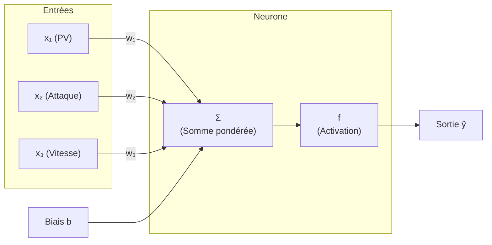
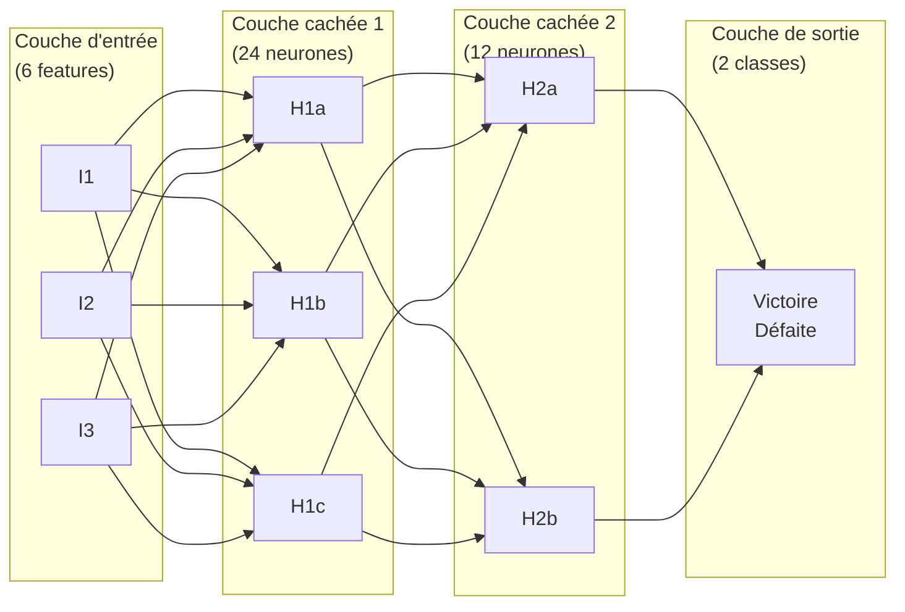
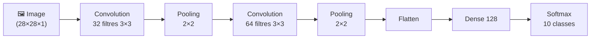

# Deep Learning avec GitHub Copilot

<span class="badge-expert">Expert</span>

## Du Perceptron aux Réseaux Profonds

Le Deep Learning est une branche du Machine Learning qui utilise des réseaux de neurones artificiels comportant plusieurs couches pour apprendre des représentations complexes.

### Le Neurone Artificiel (Perceptron)

Inventé en 1957 par Frank Rosenblatt, le perceptron s'inspire du neurone biologique.



**Calcul du neurone :**
$$\hat{y} = f\left(\sum_{i=1}^{n} w_i \cdot x_i + b\right)$$

---

## Fonctions d'Activation

| Fonction | Formule | Utilisation |
|----------|---------|-------------|
| **Sigmoid** | $\sigma(x) = \frac{1}{1+e^{-x}}$ | Couche de sortie binaire |
| **Tanh** | $\tanh(x) = \frac{e^x - e^{-x}}{e^x + e^{-x}}$ | Couches cachées (centrée en 0) |
| **ReLU** | $f(x) = \max(0, x)$ | **Référence** pour couches cachées |
| **Softmax** | $\sigma(x_i) = \frac{e^{x_i}}{\sum_j e^{x_j}}$ | Couche de sortie multiclasse |

!!! tip "Règle pratique"
    Utilisez **ReLU** dans les couches cachées et **Sigmoid/Softmax** uniquement en sortie. Copilot applique généralement cette convention correctement.

---

## Réseau de Neurones Multicouches



---

## TensorFlow & Keras avec Copilot

### Installation

```powershell
pip install tensorflow keras
```

### Réseau simple — classification Pokémon

```python
# Prompt : "Créer un réseau de neurones Dense avec TensorFlow/Keras
#           pour classifier des Pokémons gagnants/perdants (2 classes)"
import tensorflow as tf
from tensorflow import keras
from tensorflow.keras import layers
import numpy as np
from sklearn.model_selection import train_test_split
from sklearn.preprocessing import StandardScaler

# Préparer les données
scaler = StandardScaler()
X_scaled = scaler.fit_transform(X_train)
X_test_scaled = scaler.transform(X_test)

# Architecture du réseau
model = keras.Sequential([
    layers.Input(shape=(X_scaled.shape[1],)),
    layers.Dense(64, activation='relu'),
    layers.Dropout(0.3),
    layers.Dense(32, activation='relu'),
    layers.Dropout(0.2),
    layers.Dense(1, activation='sigmoid')  # Sortie binaire
], name='pokemon_classifier')

model.summary()
```

### Compilation et entraînement

```python
# Prompt : "Compiler le modèle avec Adam, loss binaire, et callback EarlyStopping"
model.compile(
    optimizer=keras.optimizers.Adam(learning_rate=0.001),
    loss='binary_crossentropy',
    metrics=['accuracy', keras.metrics.AUC(name='auc')]
)

callbacks = [
    keras.callbacks.EarlyStopping(
        monitor='val_loss',
        patience=10,
        restore_best_weights=True
    ),
    keras.callbacks.ReduceLROnPlateau(
        monitor='val_loss',
        factor=0.5,
        patience=5
    )
]

history = model.fit(
    X_scaled, y_train,
    epochs=100,
    batch_size=32,
    validation_split=0.2,
    callbacks=callbacks,
    verbose=1
)
```

### Visualisation de l'apprentissage

```python
# Prompt : "Afficher la courbe d'apprentissage loss et accuracy"
import matplotlib.pyplot as plt

fig, (ax1, ax2) = plt.subplots(1, 2, figsize=(14, 5))

# Loss
ax1.plot(history.history['loss'], label='Entraînement')
ax1.plot(history.history['val_loss'], label='Validation')
ax1.set_title('Courbe de Perte')
ax1.set_xlabel('Époque')
ax1.set_ylabel('Loss')
ax1.legend()
ax1.grid(True, alpha=0.3)

# Accuracy
ax2.plot(history.history['accuracy'], label='Entraînement')
ax2.plot(history.history['val_accuracy'], label='Validation')
ax2.set_title('Courbe de Précision')
ax2.set_xlabel('Époque')
ax2.set_ylabel('Accuracy')
ax2.legend()
ax2.grid(True, alpha=0.3)

plt.tight_layout()
plt.savefig('output/plots/courbe_apprentissage.png', dpi=150)
plt.show()
```

---

## Réseaux Convolutifs (CNN) — Classification d'Images

Les CNN sont spécialisés pour les images grâce à leur architecture : convolution → pooling → classification.



```python
# Prompt : "Créer un CNN pour classifier des images Fashion MNIST
#           (robes, pulls, chaussures - 10 classes)"
import tensorflow as tf
from tensorflow import keras
from tensorflow.keras import layers

# Charger Fashion MNIST (semblable à MNIST mais vêtements)
(X_train_img, y_train_img), (X_test_img, y_test_img) = (
    keras.datasets.fashion_mnist.load_data()
)

# Normaliser (0-255 → 0-1)
X_train_img = X_train_img.astype('float32') / 255.0
X_test_img = X_test_img.astype('float32') / 255.0

# Ajouter dimension canal (grayscale)
X_train_img = X_train_img[..., np.newaxis]  # (60000, 28, 28, 1)
X_test_img = X_test_img[..., np.newaxis]

# One-Hot Encoding des labels
y_train_cat = keras.utils.to_categorical(y_train_img, 10)
y_test_cat = keras.utils.to_categorical(y_test_img, 10)

# Architecture CNN
cnn_model = keras.Sequential([
    layers.Input(shape=(28, 28, 1)),

    # Premier bloc convolutif
    layers.Conv2D(32, (3, 3), activation='relu', padding='same'),
    layers.MaxPooling2D((2, 2)),

    # Deuxième bloc convolutif
    layers.Conv2D(64, (3, 3), activation='relu', padding='same'),
    layers.MaxPooling2D((2, 2)),

    # Classification
    layers.Flatten(),
    layers.Dense(128, activation='relu'),
    layers.Dropout(0.5),
    layers.Dense(10, activation='softmax')
], name='fashion_cnn')

cnn_model.compile(
    optimizer='adam',
    loss='categorical_crossentropy',
    metrics=['accuracy']
)

cnn_model.summary()
```

### Reconnaître des chiffres manuscrits (MNIST)

```python
# Prompt : "Charger MNIST, entraîner CNN, puis tester sur une image custom"
(X_mnist, y_mnist), (X_mnist_test, y_mnist_test) = (
    keras.datasets.mnist.load_data()
)

X_mnist = X_mnist[..., np.newaxis].astype('float32') / 255.0
X_mnist_test = X_mnist_test[..., np.newaxis].astype('float32') / 255.0

# Entraînement
cnn_model.fit(
    X_mnist, keras.utils.to_categorical(y_mnist),
    epochs=10,
    batch_size=128,
    validation_split=0.1
)

# Prédiction sur nouvelles données
chiffre = X_mnist_test[0:1]  # Premier chiffre du test
prediction = cnn_model.predict(chiffre)
chiffre_predit = prediction.argmax()
print(f"Chiffre reconnu : {chiffre_predit}")
```

---

## PyTorch avec Copilot

=== "TensorFlow / Keras"

    ```python
    model = keras.Sequential([
        layers.Dense(64, activation='relu'),
        layers.Dense(10, activation='softmax')
    ])
    model.compile(optimizer='adam', loss='categorical_crossentropy')
    model.fit(X_train, y_train, epochs=10)
    ```

=== "PyTorch"

    ```python
    import torch
    import torch.nn as nn
    import torch.optim as optim

    class ClassifierNet(nn.Module):
        def __init__(self, input_size, num_classes):
            super().__init__()
            self.network = nn.Sequential(
                nn.Linear(input_size, 64),
                nn.ReLU(),
                nn.Dropout(0.3),
                nn.Linear(64, num_classes)
            )

        def forward(self, x):
            return self.network(x)

    model = ClassifierNet(input_size=X_train.shape[1], num_classes=10)
    optimizer = optim.Adam(model.parameters(), lr=0.001)
    criterion = nn.CrossEntropyLoss()

    # Boucle d'entraînement
    for epoch in range(100):
        model.train()
        optimizer.zero_grad()
        output = model(torch.FloatTensor(X_train))
        loss = criterion(output, torch.LongTensor(y_train))
        loss.backward()
        optimizer.step()
    ```

---

## Rétropropagation — Comprendre le Mécanisme

!!! info "Comment le réseau apprend ?"
    1. **Propagation avant** : les données traversent le réseau, on calcule la prédiction ŷ
    2. **Calcul de l'erreur** : on mesure l'écart entre ŷ et y réel (loss function)
    3. **Rétropropagation** : on calcule le gradient de l'erreur par rapport à chaque poids
    4. **Mise à jour des poids** : chaque poids est ajusté dans la direction qui réduit l'erreur

    Ce cycle se répète pour chaque batch de données, à chaque époque.

---

## Sauvegarder et Déployer un Modèle Deep Learning

```python
# Prompt : "Sauvegarder le modèle Keras en format SavedModel et le recharger"
import tensorflow as tf

# Sauvegarde complète (architecture + poids + état optimizer)
model.save('models/pokemon_dl_model')

# Sauvegarde poids seulement
model.save_weights('models/pokemon_dl_weights.h5')

# Chargement
loaded_model = keras.models.load_model('models/pokemon_dl_model')

# Prédiction
sample = X_test_scaled[0:1]
proba = loaded_model.predict(sample)
print(f"Probabilité de victoire : {proba[0][0]:.1%}")
```

---

## Bonnes Pratiques avec Copilot

| Conseil | Pourquoi |
|---------|---------|
| Toujours utiliser `EarlyStopping` | Évite l'overfitting automatiquement |
| Mettre `Dropout` après les couches denses | Régularisation simple et efficace |
| Normaliser les inputs AVANT le réseau | Les réseaux convergent mal avec des valeurs non normalisées |
| Utiliser `validation_split=0.2` dans `fit()` | Copilot le suggère ; surveille le val_loss en temps réel |
| Sauver avec `restore_best_weights=True` | Récupère le meilleur modèle, pas le dernier |

---

## Prochaine étape

**[Copilot dans les Notebooks Jupyter](notebooks-jupyter.md)** : pratiquer le Deep Learning et le ML directement dans un environnement interactif cellule par cellule.

Concepts clés couverts :

- **Configuration Copilot en notebook** — Activer les suggestions inline dans VS Code + Jupyter, raccourcis clavier essentiels
- **Pattern cellule markdown → code généré** — Décrire l'étape en Markdown, Copilot génère le code dans la cellule suivante
- **Workflow notebook ML recommandé** — 11 cellules types : imports → chargement → EDA → nettoyage → entraînement → sauvegarde
- **Magic commands** — `%%time`, `%whos`, `%prun` : que Copilot connaît et suggère selon le contexte
