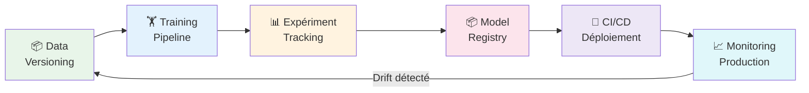

# MLOps & Déploiement de Modèles avec Copilot

<span class="badge-expert">Expert</span>

Le MLOps (Machine Learning Operations) applique les pratiques DevOps au cycle de vie ML : versionner les modèles, automatiser les pipelines d'entraînement, monitorer les performances en production.

---

## Cycle de Vie MLOps



---

## Versioning des Données et Modèles

### MLflow — Suivi des Expériences

MLflow est l'outil standard pour tracker les expériences ML, versioner les modèles et les déployer.

```powershell
pip install mlflow
```

```python
# Prompt : "Encapsuler l'entraînement d'un modèle Random Forest dans MLflow
#           en loggant les hyperparamètres, métriques et artefacts"
import mlflow
import mlflow.sklearn
from sklearn.ensemble import RandomForestClassifier
from sklearn.model_selection import train_test_split
from sklearn.metrics import accuracy_score, f1_score, roc_auc_score
import pandas as pd

mlflow.set_experiment("pokemon-classifier")

with mlflow.start_run(run_name="random_forest_v1"):
    # Hyperparamètres
    params = {
        "n_estimators": 100,
        "max_depth": 10,
        "min_samples_split": 5,
        "random_state": 42
    }
    mlflow.log_params(params)

    # Entraînement
    model = RandomForestClassifier(**params)
    model.fit(X_train, y_train)
    y_pred = model.predict(X_test)

    # Métriques
    metrics = {
        "accuracy": accuracy_score(y_test, y_pred),
        "f1_score": f1_score(y_test, y_pred, average='weighted'),
        "roc_auc": roc_auc_score(y_test, model.predict_proba(X_test)[:, 1])
    }
    mlflow.log_metrics(metrics)

    # Sauvegarder le modèle dans le registre
    mlflow.sklearn.log_model(
        sk_model=model,
        artifact_path="model",
        registered_model_name="pokemon-classifier"
    )

    print(f"✅ Run terminé — Accuracy: {metrics['accuracy']:.3f}")
    print(f"   F1-Score: {metrics['f1_score']:.3f}")
    print(f"   ROC-AUC: {metrics['roc_auc']:.3f}")
```

```powershell
# Lancer l'interface MLflow
mlflow ui
# Ouvrir http://localhost:5000
```

---

## Déploiement en API REST (FastAPI)

### Exposer un modèle ML comme API

```python
# Prompt : "Créer une API FastAPI qui charge un modèle joblib et expose
#           un endpoint /predict pour prédire la victoire d'un Pokémon"
from fastapi import FastAPI, HTTPException
from pydantic import BaseModel, Field
import joblib
import numpy as np
import pandas as pd
from typing import Optional

app = FastAPI(
    title="Pokémon Battle Predictor",
    description="API ML pour prédire le résultat d'un combat Pokémon",
    version="1.0.0"
)

# Chargement du modèle au démarrage
model = joblib.load("models/pokemon_classifier.pkl")
scaler = joblib.load("models/scaler.pkl")


class PokemonFeatures(BaseModel):
    """Features d'un Pokémon pour la prédiction."""
    pv: int = Field(..., ge=1, le=500, description="Points de Vie")
    attaque: int = Field(..., ge=1, le=200, description="Stat Attaque")
    defense: int = Field(..., ge=1, le=200, description="Stat Défense")
    sp_atk: int = Field(..., ge=1, le=200, description="Attaque Spéciale")
    sp_def: int = Field(..., ge=1, le=200, description="Défense Spéciale")
    vitesse: int = Field(..., ge=1, le=200, description="Stat Vitesse")
    type1: str = Field(..., description="Type primaire")
    type2: Optional[str] = Field(default="None", description="Type secondaire")


class PredictionResponse(BaseModel):
    victoire: bool
    probabilite: float
    confiance: str


@app.post("/predict", response_model=PredictionResponse)
async def predict(pokemon: PokemonFeatures):
    """Prédit si un Pokémon gagnera son prochain combat."""
    try:
        features = pd.DataFrame([{
            "PV": pokemon.pv,
            "Attaque": pokemon.attaque,
            "Defense": pokemon.defense,
            "Sp. Atk": pokemon.sp_atk,
            "Sp. Def": pokemon.sp_def,
            "Vitesse": pokemon.vitesse,
            "Type1": pokemon.type1,
            "Type2": pokemon.type2
        }])

        prediction = model.predict(features)[0]
        proba = model.predict_proba(features)[0].max()

        return PredictionResponse(
            victoire=bool(prediction),
            probabilite=round(float(proba), 4),
            confiance="haute" if proba > 0.8 else "moyenne" if proba > 0.6 else "faible"
        )
    except Exception as e:
        raise HTTPException(status_code=500, detail=str(e))


@app.get("/health")
async def health_check():
    return {"status": "ok", "modele": "pokemon-classifier-v1"}
```

```powershell
# Lancer l'API
uvicorn main:app --reload
# Docs auto : http://localhost:8000/docs
```

---

## Containerisation avec Docker

```dockerfile
# Prompt : "Créer un Dockerfile optimisé pour une API FastAPI avec modèle ML"
FROM python:3.11-slim

WORKDIR /app

# Copier et installer les dépendances d'abord (cache Docker)
COPY requirements.txt .
RUN pip install --no-cache-dir -r requirements.txt

# Copier le code et le modèle
COPY src/ ./src/
COPY models/ ./models/

EXPOSE 8000

CMD ["uvicorn", "src.main:app", "--host", "0.0.0.0", "--port", "8000"]
```

```yaml
# docker-compose.yml
version: '3.8'
services:
  ml-api:
    build: .
    ports:
      - "8000:8000"
    volumes:
      - ./models:/app/models:ro
    environment:
      - MODEL_PATH=/app/models/pokemon_classifier.pkl
    healthcheck:
      test: ["CMD", "curl", "-f", "http://localhost:8000/health"]
      interval: 30s
      timeout: 10s
      retries: 3
```

---

## Pipeline CI/CD ML avec GitHub Actions

```yaml
# .github/workflows/ml-pipeline.yml
# Prompt : "Pipeline GitHub Actions pour entraîner, évaluer et déployer un modèle ML"
name: ML Training Pipeline

on:
  push:
    paths:
      - 'data/**'
      - 'src/**'
      - 'models/config/**'

jobs:
  train-and-evaluate:
    runs-on: ubuntu-latest
    
    steps:
      - uses: actions/checkout@v4
      
      - name: Set up Python
        uses: actions/setup-python@v5
        with:
          python-version: '3.11'
      
      - name: Install dependencies
        run: pip install -r requirements.txt
      
      - name: Train model
        run: python src/train.py
      
      - name: Evaluate model
        run: python src/evaluate.py --threshold 0.85
      
      - name: Upload model artifact
        uses: actions/upload-artifact@v4
        with:
          name: trained-model
          path: models/
      
  deploy:
    needs: train-and-evaluate
    runs-on: ubuntu-latest
    if: github.ref == 'refs/heads/main'
    
    steps:
      - name: Deploy to production
        run: |
          echo "Déploiement du modèle en production..."
          # docker build + push + deploy
```

---

## Monitoring en Production

### Détecter le Data Drift

Le **data drift** survient quand la distribution des données en production diverge du jeu d'entraînement (concept drift = le comportement cible change).

```python
# Prompt : "Détecter le data drift avec evidently et générer un rapport HTML"
from evidently.report import Report
from evidently.metric_preset import DataDriftPreset, ClassificationPreset
import pandas as pd

# Données de référence (entraînement) vs production
reference_data = pd.read_csv("data/train.csv")
current_data = pd.read_csv("data/production_last_week.csv")

# Rapport de drift
drift_report = Report(metrics=[
    DataDriftPreset(),
    ClassificationPreset()
])

drift_report.run(
    reference_data=reference_data,
    current_data=current_data
)

drift_report.save_html("reports/drift_report.html")
print("✅ Rapport généré dans reports/drift_report.html")
```

### Logging des Prédictions

```python
# Prompt : "Logger chaque prédiction de l'API avec timestamp et features"
import logging
import json
from datetime import datetime

logging.basicConfig(
    filename='logs/predictions.log',
    level=logging.INFO,
    format='%(asctime)s - %(message)s'
)

@app.post("/predict", response_model=PredictionResponse)
async def predict(pokemon: PokemonFeatures):
    result = ...  # prédiction

    # Loguer chaque appel
    log_entry = {
        "timestamp": datetime.utcnow().isoformat(),
        "input": pokemon.model_dump(),
        "prediction": result.victoire,
        "probability": result.probabilite
    }
    logging.info(json.dumps(log_entry))

    return result
```

---

## Stack MLOps Recommandé

| Catégorie | Outil | Usage |
|-----------|-------|-------|
| **Tracking expériences** | MLflow | Metrics, params, artefacts |
| **Versioning données** | DVC | Git pour les données |
| **Déploiement API** | FastAPI + Docker | Inference REST |
| **Orchestration** | Prefect / Airflow | Pipelines automatisés |
| **Monitoring** | Evidently | Data drift, métriques |
| **CI/CD** | GitHub Actions | Automatisation entraînement |
| **Feature Store** | Feast | Partager features entre modèles |
