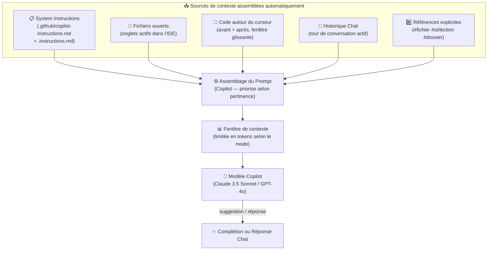
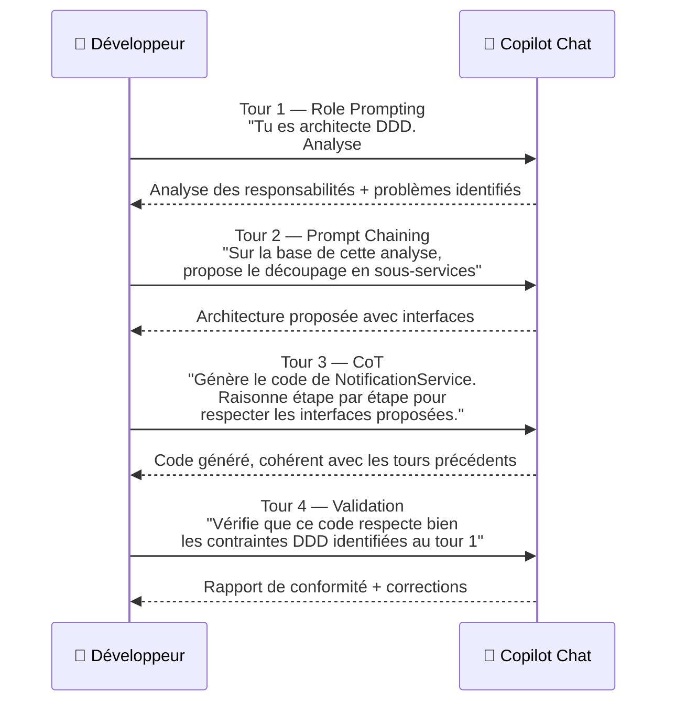
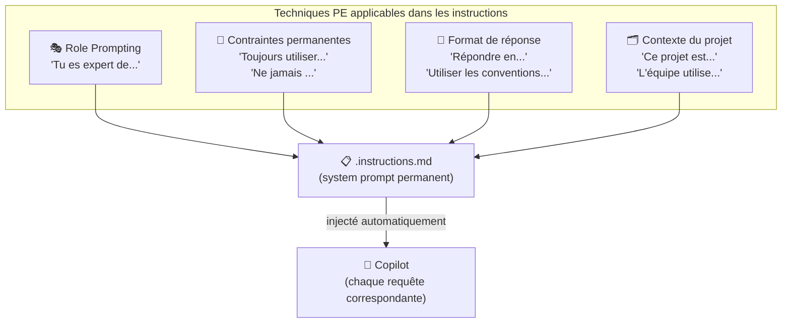
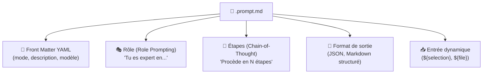
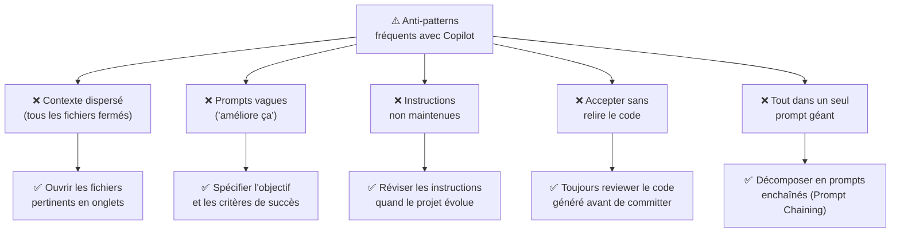

# Prompt Engineering avec GitHub Copilot

<span class="badge-beginner">Débutant</span> <span class="badge-intermediate">Intermédiaire</span> <span class="badge-expert">Expert</span>

Toutes les techniques vues dans ce chapitre s'appliquent directement à GitHub Copilot. Ce guide pratique fait la synthèse : comment Copilot assemble votre contexte comme un prompt, et comment appliquer consciemment le prompt engineering à chaque mode d'interaction — complétion inline, Chat, instructions permanentes et prompt files.

---

## 1. Comment Copilot Assemble Votre Contexte en Prompt

Copilot ne "voit" pas simplement votre fichier ouvert — il assemble en coulisses un **prompt structuré** à partir de multiples sources, le tout dans une fenêtre de tokens limitée.



!!! info "La fenêtre de tokens est une limite physique"
    Copilot ne peut pas ingérer tout votre projet. Il priorise : le fichier courant, les fichiers récemment ouverts, puis les références explicites. Ouvrir les bons fichiers dans des onglets = meilleur contexte = meilleures suggestions.

    | Mode | Fenêtre approximative |
    |------|-----------------------|
    | Suggestions inline | ~2 000 tokens |
    | Copilot Chat | ~8 000 à 128 000 tokens selon le modèle |
    | Copilot Edits | ~32 000 tokens |
    | Mode Agent | ~128 000 tokens |

---

## 2. Prompt Engineering en Complétion Inline

La complétion inline (suggestion automatique au curseur) est pilotée par le code et les commentaires qui entourent le curseur. Votre code **est** le prompt.

### Technique 1 : Le Commentaire comme Instruction

=== "❌ Sans prompt engineering"
    ```python
    # fonction
    def process():
    ```
    → Copilot génère quelque chose de générique, sans garantie d'utilité.

=== "✅ Zero-Shot explicite"
    ```python
    # Valide qu'un email est au format correct (RFC 5322 simplifié).
    # Paramètre : email (str)
    # Retourne : True si valide, False sinon
    # Lève ValueError si email n'est pas une string
    def validate_email(email: str) -> bool:
    ```
    → Copilot génère exactement ce qui est décrit dans le commentaire.

=== "⭐ Few-Shot par l'exemple"
    ```python
    # Exemples de comportement attendu :
    # validate_email("user@example.com")  → True
    # validate_email("invalid-email")     → False
    # validate_email(123)                 → ValueError
    # validate_email("user@")             → False
    def validate_email(email: str) -> bool:
    ```
    → Copilot génère une implémentation qui couvre tous les cas d'exemple montrés.

### Technique 2 : Le Nom comme Contexte

```typescript
// ❌ Trop vague — Copilot peut générer n'importe quoi
function process(data) {}

// ✅ Le nom seul guide déjà la complétion
function validateAndSanitizeUserInput(rawInput: string): SanitizedInput {}

// ⭐ Nom + types + JSDoc = prompt complet pour Copilot
/**
 * Validates user-provided search query and sanitizes it against XSS.
 * @throws {ValidationError} if query exceeds MAX_QUERY_LENGTH characters
 */
function validateAndSanitizeSearchQuery(
  rawQuery: string,
  options: SearchOptions = {}
): SanitizedQuery {}
```

### Technique 3 : Chain-of-Thought en Commentaires

```python
# Algorithme de Dijkstra pour le chemin le plus court.
# Étapes :
# 1. Initialiser les distances à l'infini sauf pour le nœud source (0)
# 2. Utiliser une min-heap pour extraire le nœud de distance minimale
# 3. Pour chaque voisin non visité, mettre à jour la distance si meilleure
# 4. Répéter jusqu'à atteindre le nœud cible ou vider la heap
# Complexité : O((V + E) log V)
def dijkstra(graph: Graph, source: str, target: str) -> PathResult:
```

---

## 3. Prompt Engineering en Mode Chat

Le Chat Copilot supporte toutes les techniques de prompt engineering. Voici comment les appliquer concrètement.

### Appliquer le Role Prompting

```
Tu es un architecte Java senior spécialisé en microservices Spring Boot 3.
Tu connais notre contexte : API REST, PostgreSQL, Redis comme cache L2,
déploiement Kubernetes.

Examine ce service et identifie :
1. Les problèmes de design selon les principes DDD
2. Les risques de performance sous charge élevée
3. Les améliorations recommandées, classées par priorité (High / Medium / Low)

#fichier:UserService.java
```

### Appliquer le Chain-of-Thought

```
Ce bug est difficile à localiser. Raisonne étape par étape :

1. Trace l'exécution pour l'entrée qui échoue : userId = null
2. Identifie chaque appel de méthode et sa valeur de retour attendue
3. Repère à quelle étape le comportement diverge de l'attendu
4. Explique la cause racine en une phrase précise
5. Propose le correctif minimal qui ne casse pas les autres cas

#fichier:OrderService.java

Erreur observée : NullPointerException ligne 47
```

### Appliquer le Few-Shot pour respecter un style existant

```
Génère les tests unitaires JUnit 5 pour ma méthode.

Style à suivre (exemples déjà dans le projet) :
#fichier:UserServiceTest.java

Méthode à tester :
#sélection

Crée les tests en suivant EXACTEMENT les conventions de UserServiceTest.java :
même structure d'annotation, même nommage des méthodes de test,
même utilisation de Mockito.
```

### Prompt Chaining en session Chat



---

## 4. Prompt Engineering dans les Instructions Permanentes

Les fichiers `.instructions.md` sont des **system prompts permanents** injectés automatiquement dans chaque interaction Copilot correspondant au filtre `applyTo`.



### Exemple d'instruction combinant plusieurs techniques PE

```markdown
---
applyTo: "**/*.java"
---

## Rôle (Role Prompting)
Tu es un développeur Java senior de l'équipe backend.
Tu connais notre architecture : microservices Spring Boot 3,
PostgreSQL avec JPA/Hibernate, Redis comme cache L2, déploiement Kubernetes.

## Contexte Permanent (Context Injection)
- Style : Google Java Style (Checkstyle configuré)
- Tests : JUnit 5 + Mockito, couverture minimale 80%
- Logs : SLF4J uniquement — jamais System.out.println
- Transactions : @Transactional sur les méthodes de service uniquement

## Contraintes (Constraining)
- Jamais @Autowired par champ : injection constructeur obligatoire
- Jamais exposer les entités JPA directement : utiliser des DTOs
- Toujours valider les entrées avec Jakarta Validation (@Valid, @NotNull...)
- Secrets : jamais en dur dans le code — utiliser @Value ou Spring Vault

## Format de Réponse
- Code : toujours avec les imports nécessaires inclus
- Explication : concise, maximum 3 points clés
- Si plusieurs approches possibles : tableau comparatif avant de choisir
```

---

## 5. Prompt Engineering dans les Prompt Files

Les prompt files (`.prompt.md`) sont des **templates de prompts réutilisables** pour des tâches récurrentes. Ils bénéficient pleinement de toutes les techniques avancées.

### Anatomie d'un Prompt File Expert



### Exemple : Audit de Sécurité (Expert)

```markdown
---
mode: agent
description: "Audit de sécurité complet d'un endpoint REST"
---

## Rôle
Tu es un expert en sécurité applicative certifié OWASP.
Tu utilises la méthodologie OWASP Top 10 et le référentiel CWE.

## Tâche (Chain-of-Thought explicite)
Audite l'endpoint sélectionné en suivant ces étapes dans l'ordre :

**Étape 1 — Analyse des entrées**
- Identifie tous les paramètres (path, query, body, headers)
- Compare le type attendu avec ce qui est effectivement validé
- Score de risque : 0 (aucun risque) → 3 (critique)

**Étape 2 — Authentification et autorisation**
- Quelles vérifications sont faites, à quel niveau du code ?
- Y a-t-il des risques IDOR (Insecure Direct Object Reference) ou BOLA ?

**Étape 3 — Dépendances et appels externes**
- Requêtes SQL/NoSQL : risque d'injection ?
- Appels HTTP sortants : risque SSRF ?
- Secrets : codés en dur ou gérés via un vault ?

**Étape 4 — Rapport de sortie**
Retourne uniquement ce JSON valide :
```json
{
  "globalRisk": "LOW|MEDIUM|HIGH|CRITICAL",
  "findings": [
    {
      "category": "Catégorie OWASP",
      "severity": "LOW|MEDIUM|HIGH|CRITICAL",
      "description": "Description précise du problème",
      "remediation": "Correction recommandée"
    }
  ]
}
```

## Entrée à analyser
${selection}
```

---

## 6. Anti-Patterns Copilot à Éviter



---

## 7. Matrice des Techniques par Mode d'Interaction

| Technique | Inline | Chat | Instructions | Prompt File |
|-----------|:------:|:----:|:------------:|:-----------:|
| Zero-Shot | ✅ Commentaire | ✅ Question directe | — | ✅ Par défaut |
| Few-Shot | ✅ Exemples commentés | ✅ Exemples dans le chat | ⚠️ Alourdit | ✅ Templates |
| Chain-of-Thought | ⚠️ Limité | ✅ Excellent | — | ✅ Étapes numérotées |
| Role Prompting | — | ✅ Début de session | ✅ Permanent | ✅ Par tâche |
| Contraintes | ✅ Via types / noms | ✅ Liste explicite | ✅ Permanentes | ✅ Par tâche |
| Format de sortie | ⚠️ Via commentaires | ✅ Format expliqué | ✅ Convention globale | ✅ Template exact |
| Prompt Chaining | — | ✅ Tours successifs | — | ✅ Étapes enchaînées |
| RAG | ✅ Fichiers ouverts | ✅ `#fichier` explicites | ✅ `applyTo` ciblé | ✅ `${file}` |
| Tree of Thoughts | — | ✅ "Explore 3 approches" | — | ✅ Structure guidée |

---

!!! success "Synthèse Finale"
    Le prompt engineering avec Copilot n'est pas différent du prompt engineering général. La particularité est que votre **code existant et vos fichiers ouverts constituent déjà un contexte implicite** — les techniques permettent simplement d'en tirer la valeur maximale.

    La règle d'or : **contexte explicite + instruction précise + format attendu = résultat optimal dès le premier essai**.

---

## Chapitres suivants

- [Machine Learning](../chapitre-6-machine-learning/index.md) — Utiliser Copilot pour vos workflows ML et Data Science
- [RAG — Retrieval-Augmented Generation](../chapitre-7-rag/index.md) — Comprendre la mécanique de contexte qui sous-tend les suggestions Copilot

