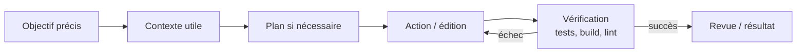
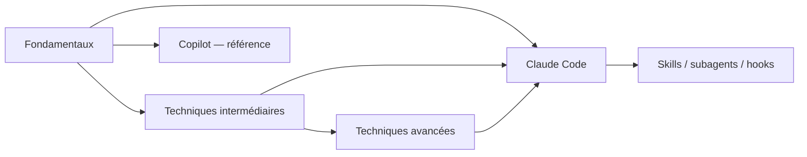

# Prompt Engineering

<span class="badge-beginner">Débutant</span> <span class="badge-intermediate">Intermédiaire</span> <span class="badge-expert">Expert</span>

Le **prompt engineering** consiste à formuler une tâche, fournir le bon contexte et définir des critères de réussite pour obtenir un résultat utile d'un modèle ou d'un agent IA.

Les principes restent génériques aux LLM, mais ce dépôt les applique désormais en priorité à **Claude Code** : travail agentique sur un dépôt, contexte explicite, planification, vérification, skills et subagents. La page GitHub Copilot reste conservée comme référence spécifique.

---

## Le cycle moderne : objectif → contexte → action → vérification



Avec un agent de code, le prompt ne doit pas seulement dire **quoi produire**. Il doit aussi, lorsque c'est pertinent :

- préciser la cible et les contraintes ;
- pointer vers les fichiers ou exemples utiles ;
- indiquer ce qui ne doit pas changer ;
- donner une méthode de vérification ;
- séparer exploration, plan et implémentation pour les changements complexes.

Claude Code recommande explicitement de **donner à l'agent un moyen de vérifier son travail** : tests, build, lint, script de comparaison ou validation visuelle.

---

## Contenu du chapitre

<div class="grid cards" markdown>

- :material-school: **[Fondamentaux](fondamentaux.md)**

    <span class="badge-beginner">Débutant</span>

    Anatomie d'un bon prompt, objectif, contexte, contraintes, exemples et format de sortie.

- :material-trending-up: **[Techniques intermédiaires](techniques-intermediaires.md)**

    <span class="badge-intermediate">Intermédiaire</span>

    Few-shot, rôle, structuration, itération et amélioration des requêtes.

- :material-atom: **[Techniques avancées](techniques-avancees.md)**

    <span class="badge-expert">Expert</span>

    Chaining, RAG, orchestration, sécurité des entrées et évaluation systématique.

- :material-robot: **[Prompt Engineering avec Claude Code](../chapitre-3b-claude-code-migration-copilot/prompt-engineering-claude.md)**

    <span class="badge-intermediate">Intermédiaire</span> <span class="badge-expert">Expert</span>

    Contexte de dépôt, plan mode, références ciblées, vérification, skills, subagents et gestion de contexte.

- :material-github: **[Prompting avec GitHub Copilot — référence](avec-copilot.md)**

    <span class="badge-beginner">Débutant</span> <span class="badge-intermediate">Intermédiaire</span>

    Page conservée pour les complétions, Chat, instructions et workflows Copilot.

</div>

---

## Prompt efficace pour Claude Code

Un bon prompt de développement ressemble davantage à un ticket exploitable qu'à une phrase vague :

```text
Corrige la validation des emails dans src/users/validate.ts.

Contraintes :
- ne change pas l'API publique ;
- conserve le style des tests existants ;
- couvre les cas user@example.com, invalid et user@.com.

Avant de modifier, lis les tests existants.
Après la modification, exécute les tests ciblés et indique leur résultat.
```

Cette forme donne :

1. une **cible** ;
2. des **contraintes** ;
3. des **exemples** ;
4. une **preuve de réussite**.

---

## Quand utiliser le plan mode ?

Pour une typo ou un changement local évident, demander un plan ajoute du coût sans bénéfice.

Pour une modification multi-fichiers, une architecture inconnue ou une migration risquée, Claude recommande un workflow :

1. **Explore** — lire et comprendre sans modifier ;
2. **Plan** — établir les fichiers et étapes ;
3. **Implement** — sortir du plan mode et exécuter ;
4. **Verify / Commit** — tester, revoir, puis versionner.

Le plan mode peut être activé dans le terminal avec ++shift+tab++ jusqu'à l'indication correspondante, ou au lancement avec :

```bash
claude --permission-mode plan
```

---

## Gérer le contexte comme une ressource

Le contexte inutile dégrade les réponses. Quelques réflexes Claude Code :

| Situation | Action |
|---|---|
| nouvelle tâche sans rapport | `/clear` |
| longue session proche de la limite | laisser l'auto-compaction agir ou utiliser `/compact` |
| question annexe qui ne doit pas polluer la session | `/btw` lorsque disponible dans votre version |
| grosse exploration de code | déléguer à un subagent |
| règle permanente | `CLAUDE.md` / `.claude/rules/` |
| procédure occasionnelle | skill |

---

## À éviter

- Un prompt géant qui mélange plusieurs objectifs indépendants.
- Un `CLAUDE.md` qui contient des tutoriels entiers.
- Répéter des corrections pendant dix tours au lieu de repartir avec `/clear` et une consigne améliorée.
- Demander « améliore ce code » sans indiquer le critère de réussite.
- Accepter une modification sans test, build, lint ou autre signal vérifiable lorsqu'un tel contrôle existe.
- Considérer les anciennes recettes « chain-of-thought » comme une obligation : demandez surtout un résultat structuré, une analyse utile, un plan ou des critères explicites selon le besoin.

---

## Parcours recommandé



---

## Prochaine étape

Commencez par **[Fondamentaux](fondamentaux.md)**, puis appliquez les principes à **[Claude Code](../chapitre-3b-claude-code-migration-copilot/prompt-engineering-claude.md)**.

---

## Sources

Sources officielles consultées le **28 septembre 2026** :

- [Claude Code — Best practices](https://code.claude.com/docs/en/best-practices)
- [Claude Code — Memory and project instructions](https://code.claude.com/docs/en/memory)
- [Claude Code — Skills](https://code.claude.com/docs/en/skills)
