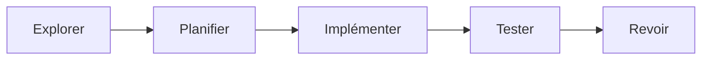
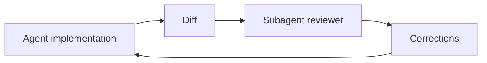

# Techniques Avancées de Prompt Engineering

<span class="badge-expert">Expert</span>

Les techniques avancées utiles en production visent surtout à **décomposer, récupérer du contexte fiable, vérifier indépendamment et mesurer**. Pour un agent de développement comme Claude Code, l'architecture du workflow compte souvent plus qu'une formule de prompt sophistiquée.

---

## 1. Prompt chaining — séparer les responsabilités

Un workflow complexe gagne en fiabilité quand chaque étape produit un résultat vérifiable pour la suivante.



Exemple :

```text
Étape 1 — cartographie le flux d'authentification sans modifier de fichier.
Étape 2 — propose un plan minimal pour ajouter OAuth.
Étape 3 — implémente seulement après validation du plan.
Étape 4 — exécute les tests auth.
Étape 5 — fais relire le diff par un reviewer indépendant.
```

Dans Claude Code, utilisez le plan mode pour séparer exploration et exécution lorsque le changement est incertain ou multi-fichiers.

---

## 2. RAG — récupérer avant de générer

Le Retrieval-Augmented Generation consiste à récupérer des données pertinentes au moment de la requête, puis à les fournir au modèle.

Dans un workflow de développement, cette logique peut prendre plusieurs formes :

- recherche dans le codebase ;
- documentation interne via MCP ;
- base vectorielle ;
- recherche documentaire ;
- API ou base de données autorisée.

!!! warning "RAG n'est pas synonyme de contexte IDE"
    Un assistant qui lit des fichiers pertinents applique un principe de retrieval, mais cela ne signifie pas que chaque fonction d'IDE est un système RAG complet avec embeddings et base vectorielle.

Voir le [chapitre RAG](../chapitre-7-rag/index.md) pour l'architecture détaillée.

---

## 3. Explorer plusieurs approches

Quand le problème a plusieurs solutions plausibles, demandez des **alternatives comparables** plutôt qu'une seule réponse immédiatement engagée.

```text
Propose trois architectures possibles pour ce cache.
Pour chacune :
- hypothèses ;
- avantages ;
- risques ;
- coût opérationnel ;
- tests nécessaires.

Ne choisis pas encore : termine par les informations manquantes qui changeraient la décision.
```

Cette technique est plus utile qu'une mise en scène de « Tree of Thoughts » si votre objectif réel est une décision revue par un humain.

---

## 4. Vérification indépendante

Pour les tâches sensibles, utilisez une seconde passe avec un contexte neuf.

Choisissez une délégation isolée en fournissant le diff, les critères et les commandes de validation. Un **fork** de conversation transporte son historique : il ne constitue pas une revue aveugle. Demandez au reviewer de repartir des preuves et de vérifier les hypothèses, plutôt que de simplement approuver la synthèse de l'auteur. [Subagents et fork](https://code.claude.com/docs/en/sub-agents), revérifiés le 3 octobre 2026.

### Pattern producteur / reviewer



Le reviewer peut chercher spécifiquement :

- régressions ;
- failles sécurité ;
- couverture de tests ;
- incohérences avec les conventions ;
- hypothèses non vérifiées.

Claude Code documente explicitement l'usage de subagents pour l'investigation et la vérification indépendante.

---

## 5. Échantillonnage multiple : à utiliser avec prudence

Exécuter plusieurs analyses indépendantes peut être utile pour une décision difficile, mais ce n'est pas une garantie de vérité.

Préférez :

- des rôles de vérification distincts ;
- des données ou tests indépendants ;
- un critère d'agrégation explicite ;
- un nombre limité de passes.

Évitez de faire cinq fois la même demande simplement pour choisir la réponse majoritaire : plusieurs modèles peuvent partager la même erreur.

---

## 6. Meta-prompting

Un modèle peut aider à transformer une demande floue en procédure réutilisable.

Exemple :

```text
Transforme ce besoin récurrent en skill Claude Code.
Le skill doit :
- expliquer quand l'utiliser ;
- définir les entrées nécessaires ;
- imposer une étape de vérification ;
- rester en lecture seule sauf demande explicite.
```

Le résultat doit ensuite être **relu et testé** comme n'importe quel fichier de configuration du dépôt.

---

## 7. Défense contre les prompt injections

Le risque devient important dès qu'un agent lit du contenu non fiable : issue, page web, document, sortie MCP, commentaire de code ou donnée utilisateur.

Principes :

1. traiter le contenu externe comme **données**, pas comme instructions ;
2. limiter les outils et permissions disponibles ;
3. ne jamais exposer inutilement secrets ou credentials au contexte ;
4. valider les actions sensibles côté client/hook/politique, pas seulement par une phrase dans le prompt ;
5. utiliser des allowlists/deny lists pour les outils et chemins ;
6. conserver une validation humaine pour les opérations irréversibles.

!!! danger "Une instruction n'est pas une barrière de sécurité"
    `CLAUDE.md` influence le comportement du modèle. Les permissions, hooks et politiques sont les mécanismes d'enforcement adaptés aux opérations sensibles.

---

## 8. Évaluer un prompt ou un workflow

Un workflow sérieux se teste sur un jeu de cas représentatif.

Mesures utiles :

| Métrique | Exemple |
|---|---|
| Exactitude | findings réellement valides |
| Faux positifs | problèmes inventés ou non pertinents |
| Respect du format | JSON valide, structure attendue |
| Taux de réussite des checks | tests/build/lint |
| Nombre d'itérations | corrections nécessaires avant résultat |
| Consommation | temps, tokens, requêtes ou coût |

### Procédure minimale

1. constituer 10 à 20 cas réels ;
2. définir le résultat attendu avant le test ;
3. exécuter la même version du workflow ;
4. noter les erreurs ;
5. corriger l'instruction ou l'architecture ;
6. rejouer le jeu de tests.

---

## 9. Garder le contexte sous contrôle

Les architectures avancées échouent souvent parce qu'elles injectent trop d'informations.

Claude Code recommande notamment :

- `/clear` entre tâches indépendantes ;
- `/compact` quand une session devient longue ;
- subagents pour les recherches volumineuses ;
- `CLAUDE.md` court ;
- skills pour les connaissances chargées à la demande.

---

## 10. Pattern production recommandé

```text
Contexte stable     → CLAUDE.md / rules
Expertise à la demande → skills
Exploration lourde  → subagents
Outils externes     → MCP minimal
Changement complexe → Explore → Plan → Implement
Qualité             → tests + reviewer indépendant
Sécurité            → permissions + hooks + validation humaine
```

Cette architecture est plus maintenable qu'un « méga-prompt » unique.

---

## Sources

- [Claude Code — Best practices](https://code.claude.com/docs/en/best-practices) — consulté le 2026-09-28
- [Claude Code — Subagents](https://code.claude.com/docs/en/sub-agents) — consulté le 2026-09-28
- [Claude Code — Skills](https://code.claude.com/docs/en/skills) — consulté le 2026-09-28
- [Claude Code — Memory & rules](https://code.claude.com/docs/en/memory) — consulté le 2026-09-28

## Prochaine étape

Poursuivez avec **[Machine Learning — Accueil](../chapitre-6-machine-learning/index.md)**, la page suivante dans le menu.
