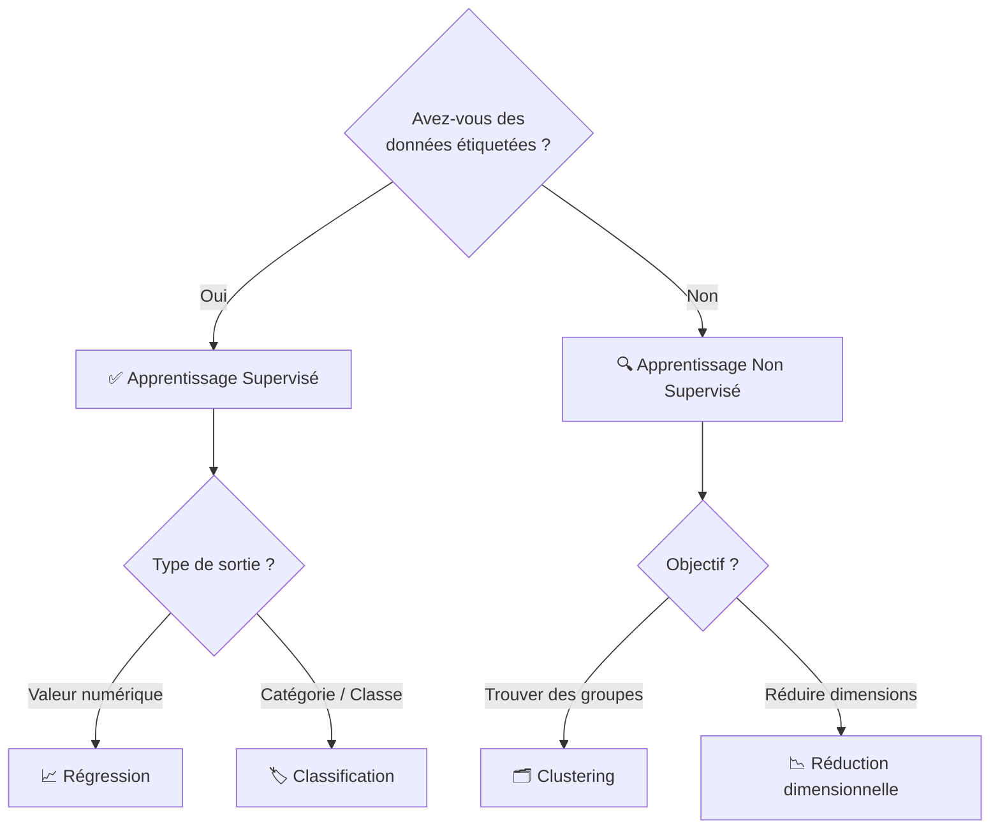

# Algorithmes Courants du Machine Learning

<span class="badge-intermediate">Intermédiaire</span>

## Choisir le Bon Algorithme

Le choix d'un algorithme dépend principalement de deux questions : quel **type d'apprentissage** utiliser, et quel **type de problème** résoudre.



---

## Algorithmes Supervisés — Régression

Les algorithmes de régression prédisent une **valeur numérique continue**.

### Régression Linéaire

L'algorithme le plus simple : il cherche la droite qui s'ajuste le mieux aux données.

```python
from sklearn.linear_model import LinearRegression
import numpy as np

X = np.array([[1], [2], [3], [4], [5]])
y = [10, 20, 30, 40, 50]

model = LinearRegression()
model.fit(X, y)

prediction = model.predict([[6]])  # → ~60
print(f"Prédiction : {prediction[0]:.1f}")
```

| Variante | Usage | Quand l'utiliser |
|----------|-------|-----------------|
| **Univariée** | 1 feature → 1 output | Relation simple |
| **Multiple (MLR)** | N features → 1 output | Plusieurs facteurs influencent le résultat |
| **Polynomiale** | Relation non-linéaire | Courbe plutôt que droite |

### Descente de Gradient

Mécanisme d'optimisation utilisé notamment par les réseaux de neurones et de nombreux modèles différentiables : il ajuste les poids du modèle pas à pas pour minimiser l'erreur.

!!! info "Analogie"
    Imaginez-vous dans un brouillard sur une montagne. Pour descendre dans la vallée (minimiser l'erreur), vous faites de petits pas dans la direction qui descend le plus. C'est la descente de gradient.

---

## Algorithmes Supervisés — Classification

Les algorithmes de classification prédisent une **catégorie**.

La **régression logistique** est un classifieur malgré son nom : elle modélise des probabilités de classe. Les arbres, forêts et KNN ne s'entraînent pas avec la même descente de gradient qu'un réseau. Les snippets de classification ci-dessous réutilisent le split Iris créé dans le premier exemple ; ils sont distincts de la démonstration de régression précédente.

### Arbre de Décision (Decision Tree)

Divise les données selon des règles logiques successives, comme un organigramme.

```python
from sklearn.datasets import load_iris
from sklearn.tree import DecisionTreeClassifier
from sklearn.model_selection import train_test_split

X, y = load_iris(return_X_y=True)
X_train, X_test, y_train, y_test = train_test_split(
    X, y, test_size=0.2, random_state=42, stratify=y,
)

clf = DecisionTreeClassifier(max_depth=5)
clf.fit(X_train, y_train)

score = clf.score(X_test, y_test)
print(f"Précision : {score:.2%}")
```

!!! tip "Avantage"
    L'arbre de décision est facilement **interprétable** : on peut visualiser et expliquer les décisions prises.

### Forêts Aléatoires (Random Forest)

Ensemble d'arbres de décision entraînés sur des sous-échantillons différents. Le résultat final est la **décision majoritaire** de tous les arbres.

```python
from sklearn.ensemble import RandomForestClassifier

# 100 arbres : valeur illustrative, à comparer sur la validation
clf = RandomForestClassifier(n_estimators=100, random_state=42)
clf.fit(X_train, y_train)
```

!!! success "Bonne pratique"
    Une forêt est une baseline tabulaire utile, mais peut aussi surapprendre. Comparez profondeur, taille des feuilles, métriques de validation et coût d'inférence.

### Méthodes ensemblistes : bagging et boosting

| Technique | Principe | Implémentation |
|-----------|----------|----------------|
| **Bagging** | Arbres en parallèle sur sous-échantillons | `RandomForestClassifier` |
| **Boosting** | Arbres en séquence, chacun corrige les erreurs du précédent | `GradientBoostingClassifier` |
| **XGBoost** | Boosting optimisé, très performant en compétition | `xgboost.XGBClassifier` |

### SVM — Machine à Vecteurs de Support

Trouve la frontière (hyperplan) qui sépare au mieux les classes avec la marge maximale.

```python
from sklearn.pipeline import make_pipeline
from sklearn.preprocessing import StandardScaler
from sklearn.svm import SVC

svm = make_pipeline(StandardScaler(), SVC(kernel='rbf', C=1.0))
svm.fit(X_train, y_train)
```

!!! info "Quand utiliser SVM ?"
    SVM excelle sur les jeux de données avec **peu d'observations mais beaucoup de features** (données textuelles, données génomiques).

### KNN — K Plus Proches Voisins

Classe un point en regardant les **K exemples les plus proches** dans l'espace de features.

```python
from sklearn.pipeline import make_pipeline
from sklearn.preprocessing import StandardScaler
from sklearn.neighbors import KNeighborsClassifier

knn = make_pipeline(StandardScaler(), KNeighborsClassifier(n_neighbors=5))
knn.fit(X_train, y_train)
```

### Naive Bayes

Basé sur le **théorème de Bayes** — très efficace pour la classification de texte (NLP).

```python
from sklearn.naive_bayes import MultinomialNB
from sklearn.feature_extraction.text import CountVectorizer

# Fournir textes_train, textes_test et labels_train issus d'un split préalable.
from sklearn.pipeline import make_pipeline

nb = make_pipeline(CountVectorizer(), MultinomialNB())
nb.fit(textes_train, labels_train)
predictions = nb.predict(textes_test)
```

!!! example "Cas d'usage : analyse de sentiment"
    Naive Bayes est idéal pour classer des opinions ou des emails en spam/ham. Il calcule la probabilité qu'un message appartienne à une catégorie selon les mots qu'il contient.

---

## Algorithmes non supervisés — Clustering

Les exemples suivants construisent leur propre jeu de données 2D. Un cluster est une structure statistique ; il ne prouve pas une catégorie métier.

### K-Means (K-Moyennes)

Divise les données en **K groupes** (clusters) dont on choisit le nombre à l'avance.

```python
from sklearn.cluster import KMeans
from sklearn.datasets import make_blobs
from sklearn.preprocessing import StandardScaler
import matplotlib.pyplot as plt

X_raw, _ = make_blobs(n_samples=300, centers=3, random_state=42)
X = StandardScaler().fit_transform(X_raw)
kmeans = KMeans(n_clusters=3, n_init=10, random_state=42)
kmeans.fit(X)

labels = kmeans.labels_
centers = kmeans.cluster_centers_

plt.scatter(X[:, 0], X[:, 1], c=labels, cmap='viridis')
plt.scatter(centers[:, 0], centers[:, 1], marker='*', s=300, c='red')
plt.show()
```

!!! info "Cas concret : abricots et cerises"
    Si vous avez des données de fruits (taille, couleur, poids) sans étiquettes, K-Means peut faire émerger des groupes selon les features et leur échelle. Ces groupes ne correspondent pas nécessairement aux espèces ; vérifiez leur interprétation au lieu de supposer qu'ils sont corrects.

### DBSCAN

Trouve des groupes de **forme quelconque** et détecte automatiquement les anomalies (bruit).

```python
from sklearn.cluster import DBSCAN

dbscan = DBSCAN(eps=0.5, min_samples=5)
labels = dbscan.fit_predict(X)
# label == -1 → point de bruit (outlier)
```

### Mélanges Gaussiens (GMM)

Modèle probabiliste qui suppose que les données sont générées par plusieurs **distributions gaussiennes** mélangées.

```python
from sklearn.mixture import GaussianMixture

gmm = GaussianMixture(n_components=3, random_state=42)
gmm.fit(X)
probas = gmm.predict_proba(X)  # Probabilité d'appartenir à chaque cluster
```

---

Les distances de KNN, SVM RBF, K-Means et DBSCAN dépendent de l’échelle des variables. Le scaler et le vocabulaire doivent être appris uniquement sur le train dans une évaluation supervisée, y compris à chaque fold de cross-validation.

[scikit-learn — preprocessing et fuites de données](https://scikit-learn.org/stable/common_pitfalls.html), revérifié le 3 octobre 2026.

## Tableau Comparatif

Les étoiles suivantes donnent une intuition qualitative, sans constituer un benchmark : les résultats dépendent du volume, des paramètres et de la représentation des données.

| Algorithme | Type | Interprétabilité | Scalabilité | Quand l'utiliser |
|-----------|------|-----------------|-------------|-----------------|
| Régression linéaire | Supervisé - Régression | ⭐⭐⭐⭐⭐ | ⭐⭐⭐⭐⭐ | Relation linéaire, données propres |
| Arbre de décision | Supervisé - Classification | ⭐⭐⭐⭐⭐ | ⭐⭐⭐ | Règles métier explicables |
| Random Forest | Supervisé - Classification | ⭐⭐⭐ | ⭐⭐⭐⭐ | Point de départ robuste |
| XGBoost | Supervisé - Classification | ⭐⭐ | ⭐⭐⭐⭐⭐ | Compétitions, haute performance |
| SVM | Supervisé - Classification | ⭐⭐ | ⭐⭐ | Peu de données, beaucoup de features |
| KNN | Supervisé - Classification | ⭐⭐⭐⭐ | ⭐ | Données peu volumineuses |
| Naive Bayes | Supervisé - Classification | ⭐⭐⭐ | ⭐⭐⭐⭐⭐ | NLP, classification de texte |
| K-Means | Non supervisé - Clustering | ⭐⭐⭐⭐ | ⭐⭐⭐⭐ | Groupes sphériques, K connu |
| DBSCAN | Non supervisé - Clustering | ⭐⭐⭐ | ⭐⭐⭐ | Groupes de forme quelconque, outliers |

---

## Sources

- [Scikit-learn documentation](https://scikit-learn.org/stable/) - consulté le 2026-06-20

---

## Référence en annexe

[Copilot — archive de ce chapitre](../appendices/copilot/chapitre-6-machine-learning.md#page-chapitre-6-machine-learning-algorithmes-courants).

## Prochaine étape

Poursuivez avec **[Claude Code pour le ML](claude-workflow-ml.md)**, la page suivante dans le menu.
