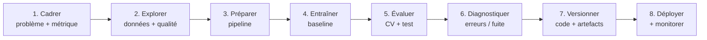

# Claude Code pour le workflow Machine Learning

<span class="badge-intermediate">Intermédiaire</span> <span class="badge-cli">CLI</span>

Claude Code est particulièrement utile en Machine Learning lorsqu'il travaille sur un **projet reproductible** : scripts Python, configuration, tests, données d'exemple, notebooks légers et commandes d'évaluation. L'objectif n'est pas de déléguer le jugement scientifique au modèle, mais de lui faire exécuter et vérifier les étapes techniques du cycle ML.

!!! info "Principe directeur"
    Pour le ML, demandez à Claude de **produire des preuves** : commandes exécutées, métriques calculées, tests passés, artefacts générés et diff relu. Une réponse plausible sans exécution n'est pas une validation.

---

## Workflow recommandé



Claude peut participer à toutes ces étapes, mais le **jeu de test final**, les hypothèses métier et l'interprétation des résultats restent sous contrôle humain.

---

## 1. Préparer le dépôt pour Claude

Structure simple :

```text
projet-ml/
├── CLAUDE.md
├── .claude/
│   ├── rules/
│   │   └── ml.md
│   └── skills/
│       └── evaluate-model/
│           └── SKILL.md
├── data/
│   ├── raw/
│   └── processed/
├── notebooks/
├── src/
│   ├── data.py
│   ├── features.py
│   ├── train.py
│   └── evaluate.py
├── tests/
├── pyproject.toml
└── README.md
```

### `CLAUDE.md` minimal

```markdown
# ML project

## Commands
- Tests: `pytest -q`
- Lint: `ruff check .`
- Train baseline: `python -m src.train --config configs/baseline.yaml`
- Evaluate: `python -m src.evaluate --model artifacts/model.joblib`

## Rules
- Never fit preprocessing on the test set.
- Keep the final test set untouched until final evaluation.
- Prefer sklearn Pipeline/ColumnTransformer for tabular ML.
- Every reported metric must state the split and dataset used.
- Do not commit raw confidential datasets or secrets.
```

Déplacez les conventions détaillées dans `.claude/rules/ml.md` ou dans un skill afin de garder `CLAUDE.md` court.

---

## 2. Cadrer le problème avant le code

Exemple :

```text
Nous voulons prédire `churn` à partir de @data/schema.md.
Avant d'écrire du code :
1. classe le problème ML ;
2. identifie la variable cible et les risques de fuite ;
3. propose une baseline simple ;
4. propose 2-3 métriques et explique ce qu'elles mesurent ;
5. liste les informations manquantes.
```

Pour un sujet complexe, utilisez le mode Plan : l'objectif est de valider le protocole avant que Claude modifie le dépôt.

---

## 3. Explorer les données avec des sorties vérifiables

Évitez :

```text
Analyse mon dataset et dis-moi ce qui est intéressant.
```

Préférez :

```text
Lis le schéma et un échantillon de @data/raw/customers.csv.
Crée `scripts/profile_data.py` qui produit :
- dimensions et types ;
- taux de valeurs manquantes ;
- cardinalité des catégories ;
- distribution de la cible ;
- doublons ;
- valeurs numériques extrêmes.
Exécute le script et résume uniquement les constats mesurés.
```

Claude doit distinguer les **observations mesurées** des hypothèses à tester.

---

## 4. Construire une baseline reproductible

Pour du tabulaire scikit-learn :

```text
Implémente une baseline dans `src/train.py` :
- split stratifié train/test ;
- preprocessing dans ColumnTransformer ;
- modèle simple ;
- cross-validation uniquement sur le train ;
- seed centralisée ;
- sauvegarde du Pipeline complet ;
- aucune transformation apprise avant le split.

Ajoute des tests qui échouent si le preprocessing est ajusté sur le test set.
```

!!! warning "Data leakage"
    Demandez explicitement à Claude de chercher la fuite de données. Un pipeline qui affiche un excellent score peut être invalide si des informations du futur ou du jeu de test entrent dans les features ou le preprocessing.

---

## 5. Faire exécuter l'évaluation

```text
Exécute la suite de tests puis l'évaluation de la baseline.
Retourne un tableau avec :
- métrique ;
- moyenne CV ;
- écart-type CV ;
- score test final ;
- taille des splits.

Si une commande échoue, corrige la cause avant de conclure.
```

Pour une classification déséquilibrée, demandez plusieurs métriques pertinentes plutôt qu'une simple accuracy.

---

## 6. Utiliser un skill pour l'évaluation récurrente

`.claude/skills/evaluate-model/SKILL.md` :

```markdown
---
name: evaluate-model
description: Évalue un modèle ML du projet et recherche les erreurs méthodologiques avant de comparer les scores.
---

1. Lire le protocole et la configuration du run.
2. Vérifier split, seed, preprocessing et absence de leakage évident.
3. Exécuter les tests.
4. Exécuter l'évaluation.
5. Comparer à la baseline avec les mêmes données et métriques.
6. Produire les commandes et artefacts permettant de reproduire le résultat.
```

L'intérêt du skill est la **répétabilité du protocole**, pas seulement le gain de frappe.

---

## 7. Déléguer les analyses lourdes aux subagents

Utilisez des subagents pour des recherches indépendantes qui produisent beaucoup de contexte :

- audit du preprocessing ;
- recherche de fuite de données ;
- revue des tests ;
- revue performance/mémoire ;
- comparaison de plusieurs approches dans des fichiers distincts.

Le résultat retourné au contexte principal doit rester synthétique : constat, preuve, fichier/ligne, action recommandée.

---

## 8. Notebooks : garder une source de vérité propre

Les notebooks sont pratiques pour l'exploration, mais leurs sorties et métadonnées produisent facilement des diffs volumineux.

Pour les travaux destinés à durer :

1. utilisez le notebook pour explorer ;
2. déplacez la logique stable dans `src/` ;
3. testez cette logique hors notebook ;
4. gardez les notebooks minces et reproductibles ;
5. nettoyez les outputs lourds avant commit quand ils ne sont pas utiles.


---

## 9. MLOps : faire de l'environnement la source de vérité

Claude peut générer ou modifier :

- Dockerfile ;
- workflows CI ;
- scripts de validation ;
- configuration de tracking ;
- manifests de déploiement ;
- alertes de dérive.

Mais il doit valider ces modifications avec les outils du dépôt lorsque c'est possible.

```text
Modifie le pipeline CI ML.
Avant de terminer :
- valide la syntaxe ;
- exécute les tests unitaires pertinents ;
- vérifie que le job n'a pas accès aux secrets dans les PR non fiables ;
- résume les permissions ajoutées.
```

---

## Anti-patterns

| Anti-pattern | Correctif |
|---|---|
| Demander « le meilleur modèle » sans baseline | Commencer simple et mesurer |
| Optimiser sur le test final | Conserver un test final hors boucle |
| Copier une métrique sans exécuter le code | Exiger la commande et le résultat |
| Mettre toutes les conventions ML dans `CLAUDE.md` | Rules/skills à la demande |
| Donner au modèle un dataset sensible complet sans nécessité | Échantillonner, anonymiser, limiter les accès |
| Changer à la fois données, features et modèle | Une hypothèse mesurable par itération |

---

## Sources

- [Claude Code — répertoire `.claude/`](https://code.claude.com/docs/en/claude-directory) — consulté le 2026-09-28
- [Claude Code — fonctionnalités et extensions](https://code.claude.com/docs/en/features-overview) — consulté le 2026-09-28
- [Anthropic — Effective context engineering for AI agents](https://www.anthropic.com/engineering/effective-context-engineering-for-ai-agents) — consulté le 2026-09-28
- [scikit-learn — Pipeline](https://scikit-learn.org/stable/modules/compose.html) — consulté le 2026-09-28

---

## Référence en annexe

[Copilot — archive de ce chapitre](../appendices/copilot/chapitre-6-machine-learning.md#page-chapitre-6-machine-learning-claude-workflow-ml).

## Prochaine étape

Poursuivez avec **[Python & Data Science](python-data-science.md)**, la page suivante dans le menu.
