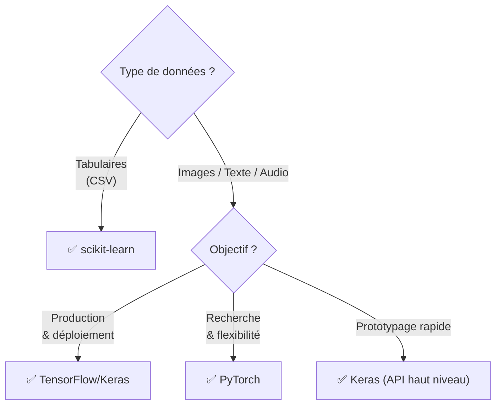

# Comparaison des Frameworks ML : scikit-learn vs TensorFlow vs PyTorch vs Keras

<span class="badge-intermediate">Intermédiaire</span>

Choisir le bon framework ML dépend de votre cas d'usage, de votre niveau et de votre environnement de déploiement. 

---

## Tableau de Comparaison Général

| Critère | scikit-learn | TensorFlow | PyTorch | Keras |
|---------|-------------|-----------|---------|-------|
| **Usage principal** | ML classique | Deep Learning prod | Deep Learning recherche | API haut niveau DL |
| **Courbe d'apprentissage** | ⭐ Très facile | ⭐⭐⭐ Moyen | ⭐⭐⭐ Moyen | ⭐⭐ Facile |
| **Débogage** | ⭐⭐⭐⭐⭐ | ⭐⭐⭐ | ⭐⭐⭐⭐⭐ | ⭐⭐⭐ |
| **Déploiement** | ⭐⭐⭐ | ⭐⭐⭐⭐⭐ | ⭐⭐⭐⭐ | ⭐⭐⭐⭐⭐ |
| **GPU natif** | ❌ | ✅ | ✅ | ✅ |
| **Support Copilot** | ⭐⭐⭐⭐⭐ | ⭐⭐⭐⭐⭐ | ⭐⭐⭐⭐⭐ | ⭐⭐⭐⭐⭐ |
| **Communauté** | ⭐⭐⭐⭐⭐ | ⭐⭐⭐⭐⭐ | ⭐⭐⭐⭐⭐ | ⭐⭐⭐⭐ |
| **Interprétabilité** | ⭐⭐⭐⭐⭐ | ⭐⭐ | ⭐⭐ | ⭐⭐ |

---

## scikit-learn

**Le couteau suisse du ML classique.**

### Quand l'utiliser

- Données tabulaires (CSV, base de données)
- Algorithmes classiques : régression, classification, clustering
- Prototypage rapide avec évaluation rigoureuse
- Pipelines de preprocessing intégrés

### Exemple caractéristique

```python
from sklearn.pipeline import Pipeline
from sklearn.preprocessing import StandardScaler
from sklearn.ensemble import GradientBoostingClassifier
from sklearn.model_selection import GridSearchCV

# Pipeline propre en quelques lignes
pipeline = Pipeline([
    ('scaler', StandardScaler()),
    ('model', GradientBoostingClassifier())
])

# Recherche hyperparamètres
param_grid = {
    'model__n_estimators': [100, 200],
    'model__learning_rate': [0.05, 0.1],
    'model__max_depth': [3, 5]
}

gs = GridSearchCV(pipeline, param_grid, cv=5, n_jobs=-1)
gs.fit(X_train, y_train)
print(f"Meilleur score : {gs.best_score_:.3f}")
```

### Forces avec Copilot

!!! success "scikit-learn + Copilot"
    Copilot connaît l'ensemble de l'API sklearn en détail. Il complète les noms de paramètres, suggère les bonnes métriques selon le type de problème et génère des pipelines `ColumnTransformer` complexes en quelques commentaires.

---

## TensorFlow / Keras (Google)

**Le framework de production de Google.**

### Quand l'utiliser

- Modèles en production à grande échelle
- Déploiement mobile (TensorFlow Lite) ou web (TensorFlow.js)
- Intégration avec l'écosystème Google Cloud (Vertex AI)
- `tf.data` pour les pipelines de données efficaces

### Exemple caractéristique

```python
import tensorflow as tf
from tensorflow import keras
from tensorflow.keras import layers

# API Sequential — simple
model = keras.Sequential([
    layers.Dense(128, activation='relu', input_shape=(10,)),
    layers.BatchNormalization(),
    layers.Dropout(0.3),
    layers.Dense(64, activation='relu'),
    layers.Dense(1, activation='sigmoid')
])

# Ou API Fonctionnelle — pour architectures complexes
inputs = keras.Input(shape=(10,))
x = layers.Dense(128, activation='relu')(inputs)
x = layers.BatchNormalization()(x)
outputs = layers.Dense(1, activation='sigmoid')(x)
model = keras.Model(inputs=inputs, outputs=outputs)

model.compile(
    optimizer='adam',
    loss='binary_crossentropy',
    metrics=['accuracy']
)
model.summary()
```

### TensorFlow Serving — Déploiement Production

```python
# Sauvegarder pour TensorFlow Serving
model.save("models/my_model/1")  # Versioning automatique

# Ou en format TF Lite pour mobile
converter = tf.lite.TFLiteConverter.from_saved_model("models/my_model/1")
tflite_model = converter.convert()
with open("models/model.tflite", "wb") as f:
    f.write(tflite_model)
```

---

## PyTorch (Meta)

**La référence de la recherche en Deep Learning.**

### Quand l'utiliser

- Recherche et prototypage de nouvelles architectures
- Contrôle fin de la boucle d'entraînement
- NLP (HuggingFace utilise PyTorch)
- Debugging et visualisation des gradients

### Exemple caractéristique

```python
import torch
import torch.nn as nn
import torch.optim as optim
from torch.utils.data import DataLoader, TensorDataset

# Définir le modèle — classe Python claire
class PokemonNet(nn.Module):
    def __init__(self, input_size: int, hidden_size: int, num_classes: int):
        super().__init__()
        self.network = nn.Sequential(
            nn.Linear(input_size, hidden_size),
            nn.BatchNorm1d(hidden_size),
            nn.ReLU(),
            nn.Dropout(0.3),
            nn.Linear(hidden_size, hidden_size // 2),
            nn.ReLU(),
            nn.Linear(hidden_size // 2, num_classes)
        )

    def forward(self, x: torch.Tensor) -> torch.Tensor:
        return self.network(x)

# Boucle d'entraînement explicite — contrôle total
model = PokemonNet(input_size=6, hidden_size=64, num_classes=2)
optimizer = optim.AdamW(model.parameters(), lr=1e-3, weight_decay=1e-4)
criterion = nn.CrossEntropyLoss()
scheduler = optim.lr_scheduler.CosineAnnealingLR(optimizer, T_max=100)

dataset = TensorDataset(
    torch.FloatTensor(X_train),
    torch.LongTensor(y_train)
)
loader = DataLoader(dataset, batch_size=32, shuffle=True)

for epoch in range(100):
    model.train()
    total_loss = 0.0
    for X_batch, y_batch in loader:
        optimizer.zero_grad()
        output = model(X_batch)
        loss = criterion(output, y_batch)
        loss.backward()
        optimizer.step()
        total_loss += loss.item()
    scheduler.step()

    if (epoch + 1) % 10 == 0:
        print(f"Époque {epoch+1:3d} — Loss: {total_loss/len(loader):.4f}")
```

### Forces avec Copilot

!!! tip "PyTorch + Copilot"
    Copilot propose automatiquement les patterns PyTorch courants : `optimizer.zero_grad()`, `loss.backward()`, `optimizer.step()`. Il génère aussi les boucles d'évaluation avec `model.eval()` et `torch.no_grad()`.

---

## Guide de Décision Rapide



| Cas d'Usage | Framework Recommandé |
|------------|---------------------|
| Classification Pokémon (données CSV) | **scikit-learn** |
| Application mobile de reconnaissance d'images | **TensorFlow Lite** |
| Fine-tuning d'un LLM (BERT, GPT) | **PyTorch + HuggingFace** |
| API ML en production sur GCP | **TensorFlow + Keras** |
| Nouveau papier de recherche | **PyTorch** |
| Débutant en Deep Learning | **Keras** |
| Clustering de clients | **scikit-learn** |

---

## Résumé des Commandes d'Installation

```powershell
# scikit-learn
pip install scikit-learn

# TensorFlow (CPU)
pip install tensorflow

# TensorFlow (GPU - NVIDIA)
pip install tensorflow[gpu]

# PyTorch (CPU)
pip install torch torchvision torchaudio

# PyTorch (GPU CUDA 12.1)
pip install torch torchvision torchaudio --index-url https://download.pytorch.org/whl/cu121

# Keras standalone
pip install keras
```

!!! info "Keras 3 — Multi-Backend"
    Depuis Keras 3 (2024), Keras peut utiliser TensorFlow, PyTorch **ou** JAX comme backend. Vous écrivez le code une fois, vous choisissez le backend selon votre environnement.
    ```python
    import os
    os.environ["KERAS_BACKEND"] = "torch"  # ou "tensorflow" ou "jax"
    import keras
    ```

---

## Chapitres suivants

- **[RAG — Retrieval-Augmented Generation](../chapitre-7-rag/index.md)** — Implémenter le RAG pas à pas avec code fonctionnel
- **[Bonnes Pratiques](../chapitre-9-bonnes-pratiques/index.md)** — Utilisation effective, productivité, sécurité et workflows IA au quotidien

