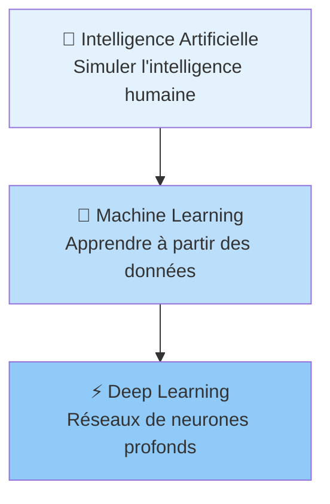
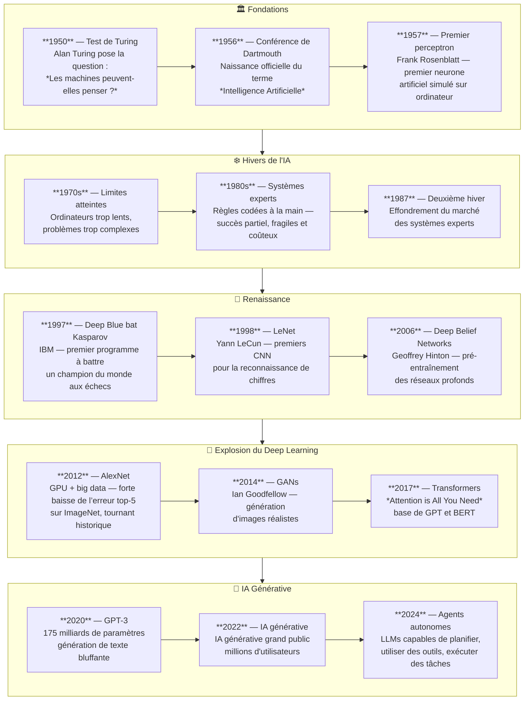
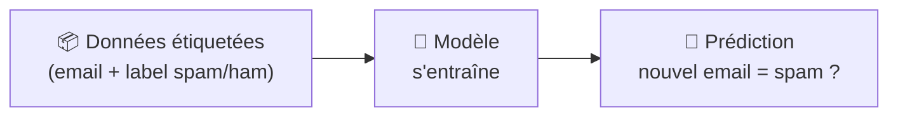
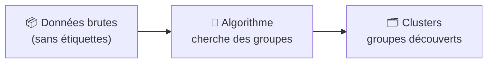
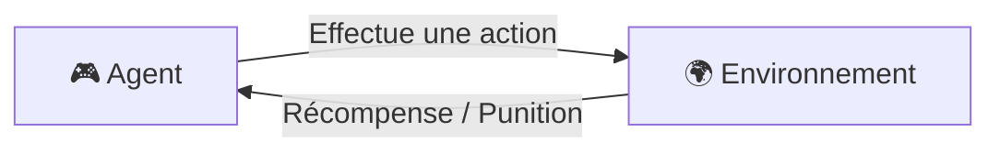

# Concepts Fondamentaux du Machine Learning

<span class="badge-beginner">Débutant</span>

## Intelligence Artificielle, Machine Learning, Deep Learning

Ces trois termes sont souvent confondus. En réalité, ils s'emboîtent comme des poupées russes.



| Terme | Définition simple | Exemple concret |
|-------|-------------------|-----------------|
| **Intelligence Artificielle** | Tout système capable d'imiter des comportements intelligents | Un programme qui joue aux échecs |
| **Machine Learning** | IA qui apprend automatiquement à partir d'exemples, sans être explicitement programmée | Un filtre antispam qui s'améliore avec le temps |
| **Deep Learning** | ML utilisant des réseaux de neurones à plusieurs couches | La reconnaissance d'images dans votre téléphone |

!!! info "Analogie"
    L'IA, c'est le domaine. Le ML, c'est une approche de ce domaine. Le Deep Learning, c'est une technique du ML.

---

## Un Peu d'Histoire

L'intelligence artificielle n'est pas une invention récente. Elle a traversé des périodes d'enthousiasme intense et des "hivers" de désillusion avant d'atteindre la maturité actuelle.



### Les grandes ruptures technologiques

Trois facteurs ont rendu possible la révolution du Deep Learning :

| Facteur | Avant (2000s) | Après (2010s+) |
|---------|--------------|----------------|
| **Données** | Quelques milliers d'exemples | Milliards d'exemples (internet, médias sociaux) |
| **Puissance de calcul** | CPUs lents, coûteux | GPUs massivement parallèles, cloud accessible |
| **Algorithmes** | Réseaux peu profonds (2-3 couches) | Réseaux très profonds (100+ couches), Transformers |

!!! info "Pourquoi 2012 est une date charnière ?"
    L’article d’Alex Krizhevsky, Ilya Sutskever et Geoffrey Hinton rapporte pour ILSVRC-2012 une **erreur top-5 de 15,3 %**, contre **26,2 %** pour la deuxième meilleure entrée. Il s’agit de ce concours et de cette métrique, pas d’un taux d’erreur générique. [Publication originale](https://papers.neurips.cc/paper_files/paper/2012/file/c399862d3b9d6b76c8436e924a68c45b-Paper.pdf), consultée le 3 octobre 2026.

### Les pionniers à connaître

| Nom | Contribution | Récompense |
|-----|-------------|-----------|
| **Alan Turing** | Test de Turing, fondements théoriques | Le prix Turing porte son nom ; il ne lui a pas été attribué |
| **Frank Rosenblatt** | Perceptron (1957) | — |
| **Geoffrey Hinton** | Backpropagation, Deep Belief Networks | Prix Turing 2018 |
| **Yann LeCun** | Réseaux convolutifs (CNN) | Prix Turing 2018 |
| **Yoshua Bengio** | Apprentissage de représentations | Prix Turing 2018 |
| **Ian Goodfellow** | GANs (Generative Adversarial Networks) | — |
| **Vaswani et al.** | Architecture Transformer (2017) | — |

!!! tip "Les trois prix Turing 2018"
    Hinton, LeCun et Bengio sont surnommés les **"parrains du Deep Learning"**. Ils ont persisté dans leurs recherches pendant les "hivers de l'IA", quand la communauté scientifique les considérait marginaux. Leur ténacité a rendu possible la révolution actuelle.

---

## Types d’apprentissage

### 1. Apprentissage Supervisé

La machine apprend à partir d'exemples **étiquetés** : on lui donne les données ET les réponses correctes.



**Exemples d'utilisation :**

- Prédire le prix d'une maison (régression)
- Classer un email en spam ou non (classification)
- Choisir le bon Pokémon selon ses statistiques de combat

### 2. Apprentissage Non Supervisé

La machine cherche **seule des structures** dans les données, sans étiquettes.



**Exemples d'utilisation :**

- Segmentation de clients par comportement d'achat
- Détection d'anomalies (fraude)
- Clustering de fruits par couleur et taille (abricots vs cerises)

### 3. Apprentissage par Renforcement

Un agent apprend par **essais et erreurs** : il reçoit une récompense ou une punition selon ses actions.



**Exemples d'utilisation :**

- Jeux vidéo (AlphaGo, Dota 2)
- Robots autonomes
- Optimisation de campagnes publicitaires

---

## Vocabulaire Essentiel

Avant de coder un modèle, il faut maîtriser ce vocabulaire fondamental.

| Terme | Définition | Exemple |
|-------|------------|---------|
| **Observation** | Une ligne de données (un exemple) | Les stats d'un Pokémon |
| **Feature** (attribut) | Une colonne de données (une variable) | `PV`, `Attaque`, `Type` |
| **Label** (étiquette) | La valeur à prédire | `Gagnant = Oui/Non` |
| **Jeu d'entraînement** | Données pour apprendre | 80% du dataset |
| **Jeu de test** | Données pour évaluer | 20% du dataset |
| **Modèle** | L'algorithme une fois entraîné | `RandomForestClassifier` entraîné |
| **Hyperparamètre** | Paramètre réglé avant l'entraînement | Nombre d'arbres dans une forêt |
| **Overfitting** | Modèle trop ajusté aux données d'entraînement | 99% sur train, 60% sur test |
| **Underfitting** | Modèle pas assez ajusté | 60% partout |

!!! warning "Overfitting : le piège classique"
    Un modèle qui fait 99% de précision sur les données d'entraînement mais seulement 60% sur de nouvelles données a **sur-appris** (overfitting). Il a mémorisé les données plutôt qu'appris les patterns généraux.

---

### Types de données

| Type | Description | Exemple | Traitement |
|------|------------|---------|-----------|
| **Numérique continu** | Valeurs décimales | Prix, température | Normalisation |
| **Numérique discret** | Valeurs entières | Nombre de victoires, PV | Souvent tel quel |
| **Catégoriel ordinal** | Catégories avec ordre | Note (A/B/C), rang | Label Encoding |
| **Catégoriel nominal** | Catégories sans ordre | Type de Pokémon, pays | One-Hot Encoding |
| **Booléen** | Vrai/Faux | Légendaire = Oui/Non | 0/1 |

### Indicateurs statistiques clés

```python
import pandas as pd

df = pd.read_csv("pokemon.csv")

# Mesures de tendance centrale
print(df["PV"].mean())    # Moyenne
print(df["PV"].median())  # Médiane (moins sensible aux extremes)
print(df["PV"].mode())    # Mode (valeur la plus fréquente)

# Mesures de dispersion
print(df["PV"].std())     # Écart type
print(df["PV"].describe())  # Résumé complet
```

!!! tip "Moyenne vs Médiane"
    Si vos données contiennent des **valeurs extrêmes** (outliers), préférez la **médiane** à la moyenne. Exemple : dans une classe de 30 élèves où un millionnaire a tout skewé, la moyenne des revenus sera trompeuse.

---

## Sources

- [Scikit-learn documentation](https://scikit-learn.org/stable/) - consulté le 2026-06-20

---

## Référence en annexe

[Copilot — archive de ce chapitre](../appendices/copilot/chapitre-6-machine-learning.md#page-chapitre-6-machine-learning-concepts-fondamentaux).

## Prochaine étape

Poursuivez avec **[Algorithmes Courants](algorithmes-courants.md)**, la page suivante dans le menu.
