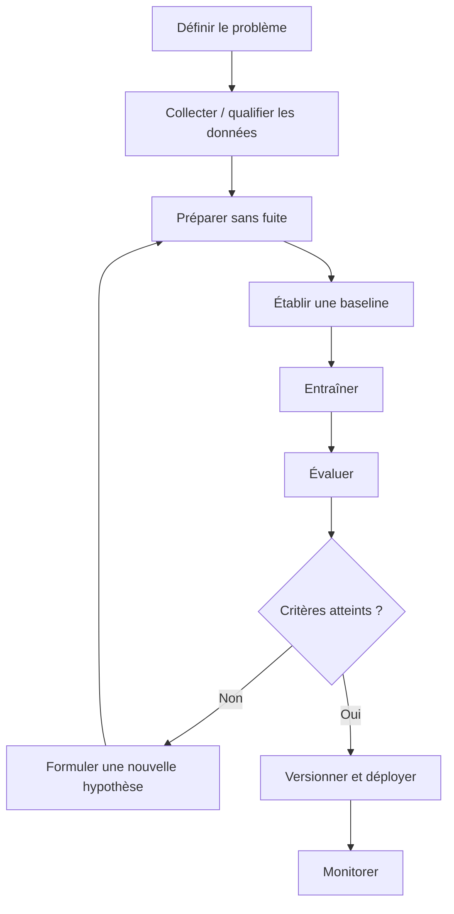

# Machine Learning avec Claude Code

<span class="badge-intermediate">Intermédiaire</span>

Ce chapitre couvre le Machine Learning sous deux angles complémentaires : comprendre les **fondamentaux théoriques** et utiliser **Claude Code comme agent de développement** pour rendre les expérimentations reproductibles, testables et vérifiables.

GitHub Copilot n'est pas retiré : son ancien workflow ML reste disponible comme **référence** pour les équipes qui l'utilisent encore ou qui y reviendraient plus tard.

---

## Parcourir ce chapitre

<div class="grid cards" markdown>

- :material-brain: **[Concepts fondamentaux](concepts-fondamentaux.md)**

    IA, Machine Learning, Deep Learning, types d'apprentissage et métriques.

- :material-function: **[Algorithmes courants](algorithmes-courants.md)**

    Régression, classification, clustering et choix d'une baseline.

- :material-robot-outline: **[Claude Code pour le workflow ML](claude-workflow-ml.md)**

    Parcours principal : cadrage, exploration, pipelines reproductibles, tests, évaluation, subagents et MLOps.

- :simple-python: **[Python & Data Science](python-data-science.md)**

    pandas, NumPy, scikit-learn et organisation d'un projet data avec Claude.

- :simple-jupyter: **[Notebooks Jupyter](notebooks-jupyter.md)**

    Bonnes pratiques de collaboration IA sur les notebooks et limites à connaître.

- :material-layers: **[Deep Learning](deep-learning.md)**

    Réseaux de neurones, TensorFlow/Keras/PyTorch et validation des expériences.

- :material-rocket-launch: **[MLOps & Déploiement](mlops-deploiement.md)**

    Passage de l'expérimentation au pipeline versionné, testé et monitoré.

- :material-github: **[Workflow ML avec Copilot — référence](copilot-workflow-ml.md)**

    Ancien parcours Copilot conservé volontairement.

- :material-scale-balance: **[Comparaison écosystèmes ML](comparaison-ecosystemes-ml.md)**

    Python, R, Julia et critères de choix techniques.

- :material-compare: **[Comparaison des outils](comparaison-outils.md)**

    scikit-learn, TensorFlow, PyTorch, Keras et autres frameworks selon le besoin.

</div>

---

## Prérequis

!!! info "Ce dont vous avez besoin"
    - Python installé et un environnement virtuel par projet ;
    - Claude Code installé, en CLI ou via son intégration IDE ;
    - notions de base en Python ;
    - Git pour versionner code, configuration et protocoles d'expérience.

Les numéros de versions de bibliothèques évoluent vite : préférez les contraintes réellement supportées par votre projet (`pyproject.toml`, lockfile, image Docker) plutôt qu'une version figée dans cette documentation.

---

## Le workflow ML : la boucle scientifique avant l'outil



Claude Code peut accélérer cette boucle en lisant le dépôt, en écrivant les scripts, en exécutant les commandes, en corrigeant les erreurs et en comparant les résultats. Il ne remplace pas le choix des hypothèses, la définition d'une métrique métier ni la décision finale sur la validité scientifique d'une expérience.

---

## Les règles Claude les plus utiles en ML

Mettez dans `CLAUDE.md` uniquement les invariants du projet :

```markdown
## Machine Learning
- Tests: `pytest -q`
- Lint: `ruff check .`
- Never fit preprocessing on the final test set.
- Report the dataset split with every metric.
- Keep training/evaluation commands reproducible.
- Do not commit confidential raw data or credentials.
```

Pour les procédures longues, utilisez `.claude/rules/` et `.claude/skills/` plutôt que de gonfler `CLAUDE.md`.

---

## Validation avant confiance

Une réponse textuelle n'est pas une preuve d'expérience ML. Demandez systématiquement :

1. quelle commande a été exécutée ;
2. sur quel split/dataset ;
3. quelle métrique a été mesurée ;
4. quels tests ont été passés ;
5. quels fichiers et artefacts ont été produits.

Cette discipline rejoint le fonctionnement agentique recommandé par Anthropic : l'agent doit récupérer du **ground truth** depuis son environnement pendant l'exécution plutôt que se fier uniquement à son raisonnement interne.

---

## Copilot reste documenté

La page [Copilot pour le workflow ML](copilot-workflow-ml.md) reste disponible et ne doit pas être supprimée. Elle sert de référence historique, comparative et opérationnelle si l'environnement Copilot redevient pertinent.

---

## Sources

- [Claude Code — fonctionnalités et extensions](https://code.claude.com/docs/en/features-overview) — consulté le 2026-09-28
- [Claude Code — répertoire `.claude/`](https://code.claude.com/docs/en/claude-directory) — consulté le 2026-09-28
- [Anthropic — Building effective agents](https://www.anthropic.com/engineering/building-effective-agents) — consulté le 2026-09-28

## Prochaine étape

**[Concepts fondamentaux du Machine Learning](concepts-fondamentaux.md)** pour les bases, puis **[Claude Code pour le workflow ML](claude-workflow-ml.md)** pour le parcours pratique.
