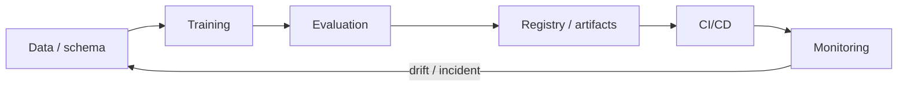

# MLOps & Déploiement avec Claude Code

<span class="badge-expert">Expert</span>

Le MLOps applique les pratiques d'ingénierie logicielle au cycle de vie des modèles : versionnement, reproductibilité, validation automatique, packaging, déploiement et monitoring. Claude Code peut accélérer ces tâches parce qu'il peut travailler directement dans le dépôt et exécuter les outils du projet.

!!! warning "Claude n'est pas le système MLOps"
    La source de vérité reste votre CI, votre registry, votre tracking d'expériences et vos métriques de production. Claude aide à construire, diagnostiquer et maintenir ce système ; il ne remplace pas ses contrôles.

---

## Cycle de vie



À chaque étape, exigez des artefacts vérifiables : configuration, hash/version, métriques, logs, image, modèle ou rapport.

---

## 1. Versionner ce qui rend un run reproductible

Un résultat ML n'est pas seulement un fichier modèle. Versionnez ou tracez au minimum :

- code source et commit ;
- dépendances et environnement ;
- configuration d'entraînement ;
- version/snapshot des données ou identifiant du dataset ;
- seed et protocole de split ;
- métriques ;
- artefacts produits.

Exemple de demande à Claude :

```text
Audite la reproductibilité de ce projet ML.
Pour chaque run, vérifie si l'on peut retrouver :
commit, config, dataset, dépendances, seed, métriques et artefact modèle.
Crée un plan de correction avant de modifier quoi que ce soit.
```

---

## 2. Tracking d'expériences

MLflow, Weights & Biases ou un système interne peuvent enregistrer paramètres, métriques et artefacts. Ne présentez pas un outil particulier comme obligatoire : choisissez celui déjà adopté par l'équipe.

Claude peut :

- encapsuler l'entraînement dans un run ;
- ajouter le logging manquant ;
- standardiser les noms de métriques ;
- comparer deux runs à protocole identique ;
- écrire des tests pour empêcher la promotion d'un modèle sans métadonnées minimales.

```text
Ajoute le tracking au training existant sans changer l'algorithme.
Logge config, métriques de validation et artefact final.
Exécute un run de test et donne le chemin/ID permettant de le retrouver.
```

---

## 3. Servir un modèle

Pour une API FastAPI, séparez :

```text
src/
├── api.py          # contrat HTTP
├── inference.py    # chargement + prédiction
├── schema.py       # validation entrée/sortie
└── settings.py     # configuration
```

Demandez à Claude de tester :

- schémas invalides ;
- modèle absent/incompatible ;
- health/readiness ;
- timeouts et erreurs ;
- concurrence si pertinente ;
- absence de secrets dans les réponses/logs.

Évitez les exemples qui renvoient directement `str(exception)` au client : cela peut divulguer des détails internes.

---

## 4. Containerisation

Le Dockerfile doit être reproductible et minimal :

```dockerfile
FROM python:3.12-slim

WORKDIR /app
COPY pyproject.toml ./
COPY src ./src
RUN pip install --no-cache-dir .

USER 10001
EXPOSE 8000
CMD ["uvicorn", "src.api:app", "--host", "0.0.0.0", "--port", "8000"]
```

Le numéro Python ci-dessus est un **exemple**, pas une exigence : utilisez la version réellement supportée et verrouillée par votre projet.

Demande utile :

```text
Revois ce Dockerfile pour :
- reproductibilité ;
- utilisateur non-root ;
- taille d'image ;
- cache de build ;
- secrets ;
- healthcheck ;
- compatibilité avec notre pyproject/lockfile.
Valide le build si Docker est disponible.
```

---

## 5. CI : tests avant entraînement coûteux

Ordre recommandé :

1. lint / type-check ;
2. tests unitaires ;
3. tests du preprocessing ;
4. smoke training sur petit échantillon ;
5. évaluation ;
6. seulement ensuite job coûteux ou promotion.

Claude peut générer le workflow, mais faites relire explicitement les **permissions**, secrets et déclencheurs GitHub Actions.

!!! danger "PR non fiable"
    Un workflow déclenché depuis une contribution externe ne doit pas avoir accès inutilement aux secrets ou credentials de déploiement. Séparez entraînement/validation et promotion.

---

## 6. Quality gates de modèle

Ne bloquez pas uniquement sur un seuil unique de score. Un gate peut combiner :

- métrique principale ;
- régression maximale par rapport à la baseline ;
- latence ;
- taille du modèle ;
- tests de données ;
- fairness/robustesse si le cas d'usage l'exige ;
- absence de fuite de données détectée.

```text
Implémente un script `scripts/model_gate.py` qui compare candidate.json à baseline.json.
Le script doit retourner exit 1 si un critère obligatoire échoue et expliquer chaque échec.
Ajoute des tests unitaires du gate.
```

---

## 7. Monitoring production

Surveillez séparément :

| Axe | Exemples |
|---|---|
| Service | latence, erreurs, saturation |
| Données | valeurs manquantes, changement de distributions |
| Modèle | qualité lorsque le ground truth arrive |
| Métier | KPI réellement visé |

Un drift statistique n'implique pas automatiquement une baisse de performance. Claude peut aider à diagnostiquer les corrélations, mais la décision de retrain doit suivre un protocole défini.

---

## 8. Automatiser avec skills et hooks

Un skill Claude peut encapsuler la procédure de promotion :

```markdown
---
name: validate-model-release
description: Vérifie un candidat ML avant promotion.
---

1. Exécuter tests et model gate.
2. Vérifier métadonnées de reproductibilité.
3. Comparer à la baseline.
4. Vérifier l'image de serving.
5. Produire un rapport ; ne jamais promouvoir automatiquement sans instruction explicite.
```

Un hook peut lancer un linter ou un test léger après modification, mais évitez d'attacher des entraînements coûteux à chaque événement d'édition.

---

## 9. MCP et systèmes externes

Si vos expériences, tickets ou métriques vivent dans des services externes, MCP peut donner à Claude un accès contrôlé à ces outils. Séparez :

- accès lecture pour exploration/diagnostic ;
- accès écriture pour actions ;
- permissions de production, à limiter strictement.

La configuration projet partagée se place dans `.mcp.json`.

---

## Copilot

Les anciens exemples Copilot/GitHub Actions ne sont pas supprimés du dépôt lorsque leur contenu reste utile. Le parcours principal est désormais Claude Code ; Copilot reste une référence secondaire et pourra être réévalué si son modèle de coût ou ses capacités changent.

---

## Sources

- [Claude Code — fonctionnalités et extensions](https://code.claude.com/docs/en/features-overview) — consulté le 2026-09-28
- [Claude Code — MCP](https://code.claude.com/docs/en/mcp) — consulté le 2026-09-28
- [Anthropic — Building effective agents](https://www.anthropic.com/engineering/building-effective-agents) — consulté le 2026-09-28
- [Anthropic — Trustworthy agents in practice](https://www.anthropic.com/research/trustworthy-agents) — consulté le 2026-09-28

## Prochaine étape

**[RAG — Retrieval-Augmented Generation](../chapitre-7-rag/index.md)** : appliquer les mêmes principes de reproductibilité, évaluation et observabilité aux systèmes de retrieval et de génération.
