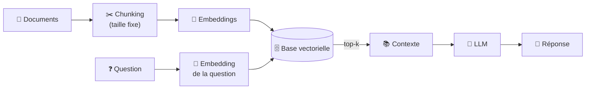
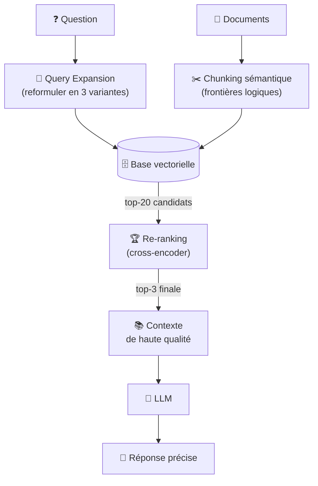
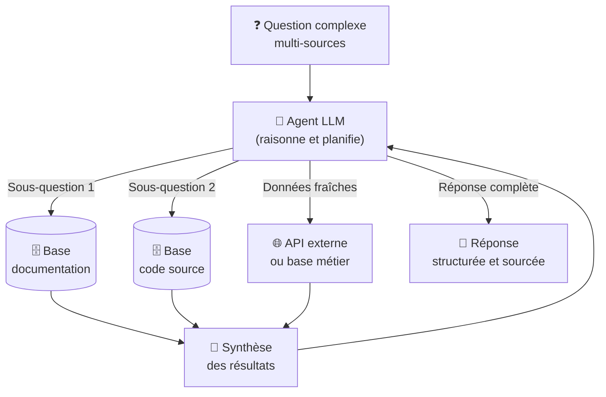

# Concepts & Types de RAG

Expert

Avant d'implémenter un RAG, il faut choisir la bonne architecture. Il en existe trois grandes familles, chacune adaptée à un niveau de complexité et de volume différent. Comprendre leurs forces et limites respectives vous évitera de sur-ingénierer une solution pour un besoin simple, ou d'under-delivrer sur un besoin complexe.

---

## Les 3 grandes architectures RAG

### Naive RAG — Le RAG de base

Le Naive RAG est l'implémentation la plus directe : découper les documents en chunks, les vectoriser, les indexer dans une base vectorielle, puis récupérer les top-k passages les plus proches à chaque question. C'est le point de départ obligatoire de toute implémentation RAG.

**Avantages** : simple à mettre en place, facile à déboguer, faible coût d'infrastructure, aucune dépendance externe complexe.

**Limites** : les questions complexes ou ambiguës produisent des résultats médiocres, le chunking à taille fixe peut couper des concepts en plein milieu, et la recherche par similarité seule peut rater des passages pertinents formulés différemment.

!!! example "Cas d'usage idéaux"
    - FAQ interne, documentation produit (< 50 000 chunks)
    - Assistant Q&A sur une base de connaissances stable
    - Prototype ou MVP à livrer rapidement

---

### Advanced RAG — Le RAG amélioré

L'Advanced RAG ajoute des étapes de pré et post-traitement pour améliorer la qualité des résultats. Il s'attaque aux faiblesses du Naive RAG sans nécessiter d'agent autonome.

Les techniques clés de l'Advanced RAG :

| Technique | Ce qu'elle résout | Comment |
|-----------|-----------------|---------|
| **Chunking sémantique** | Coupes en plein milieu d'un concept | Découper aux frontières logiques (fonction, paragraphe, titre) |
| **Query expansion** | Questions ambiguës ou trop courtes | Reformuler en 3–5 variantes, fusionner les résultats (Reciprocal Rank Fusion) |
| **Re-ranking** | Top-k pas toujours les plus pertinents | Classement fin avec un modèle cross-encoder après la recherche vectorielle |
| **HyDE** | Mismatch embedding question vs document | Générer un doc hypothétique et vectoriser le doc (pas la question) |
| **Parent-child chunking** | Chunks trop petits = perte de contexte | Indexer de petits chunks, retourner le bloc parent au LLM |

!!! example "Cas d'usage idéaux"
    - Documentation technique large et évolutive
    - Support client (tickets, manuels, historiques)
    - Recherche sur codebase (> 100 000 chunks)

---

### Agentic RAG — Le RAG autonome

L'Agentic RAG donne au LLM la capacité de **décider lui-même quand et comment interroger la base vectorielle** : décomposer les questions complexes en sous-questions, itérer jusqu'à avoir une réponse suffisante, combiner plusieurs sources différentes.

**Cas d'usage typiques** : "Quels bugs ont été introduits dans ce sprint et comment les corriger ?" (combines code + tickets + docs), analyse croisée multi-documents, assistant de veille qui interroge plusieurs bases en parallèle.

**Complexité** : nécessite une infrastructure d'agents (LangChain, LlamaIndex, ou function calling natif de l'API LLM), une gestion des boucles et des guardrails pour éviter les dérives.

!!! example "Cas d'usage idéaux"
    - Assistant de développement autonome (code + docs + tickets)
    - Analyse forensique sur corpus hétérogène
    - Workflows où la question elle-même n'est pas connue à l'avance

---

## Quelle architecture choisir ?

| Contexte | Architecture recommandée |
|----------|--------------------------|
| Prototype rapide, < 50 000 chunks | **Naive RAG** |
| Questions simples sur documentation interne | **Naive RAG** |
| Questions souvent mal servies par le Naive | **Advanced RAG** (ajouter re-ranking en premier) |
| Corpus > 100 000 chunks | **Advanced RAG** |
| Questions nécessitant plusieurs sources simultanées | **Advanced RAG** + fusion de résultats |
| Questions complexes, raisonnement multi-étapes | **Agentic RAG** |
| Assistant autonome avec accès à plusieurs bases | **Agentic RAG** |
| Équipe IA avec infrastructure dédiée | **Agentic RAG** |

!!! tip "Commencer simple, mesurer, puis progresser"
    95 % des cas d'usage documentaires sont résolus par un Naive RAG bien configuré. Commencez toujours par là. Construisez un jeu de 20–30 questions de référence avec leurs réponses attendues, évaluez le taux de réponses correctes, et n'ajoutez des techniques Advanced que si les métriques le justifient. L'Agentic RAG n'est pertinent que quand la complexité des questions le justifie vraiment.

---

## RAG vs autres approches

| Approche | Quand l'utiliser | Coût | Fraîcheur des données |
|----------|-----------------|------|----------------------|
| **LLM seul** | Questions générales, pas de données privées | Faible | Date d'entraînement |
| **Fine-tuning** | Adapter le *style* ou le *comportement* du modèle | Très élevé (GPU, temps) | Date du fine-tuning |
| **RAG** | Répondre sur des données privées ou récentes | Faible à modéré | Temps réel |
| **RAG + Fine-tuning** | Adapter le style *et* accéder aux données privées | Élevé | Temps réel |

!!! info "Fine-tuning ≠ RAG"
    Une erreur courante est de confondre les deux. Le fine-tuning modifie les *poids* du modèle pour qu'il adopte un style ou maîtrise un domaine. Le RAG lui fournit des *informations* au moment de la requête. Les deux sont complémentaires, mais le RAG est presque toujours la bonne réponse pour accéder à des données privées changeantes — le fine-tuning est adapté quand vous voulez que le modèle raisonne *différemment*, pas qu'il connaisse de nouvelles données.

---

## Prochaine étape

**[Mise en Œuvre pas à pas](implementation.md)** : construire un RAG fonctionnel en local, sans serveur externe, en 4 étapes.

Concepts clés couverts :

- **Chunking avec overlap** — découper les documents en blocs de taille fixe avec fenêtre glissante
- **Embeddings avec sentence-transformers** — vectoriser les chunks avec `all-MiniLM-L6-v2`
- **Base vectorielle** — stocker et interroger avec ChromaDB (disque) ou FAISS (RAM)
- **Prompt augmenté** — assembler le contexte récupéré dans un prompt défensif envoyé au LLM
