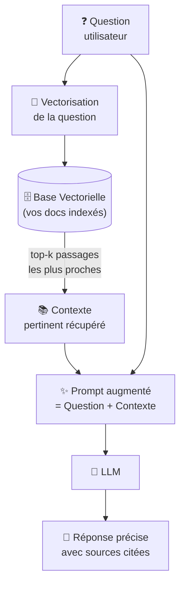

# RAG — Retrieval-Augmented Generation

Expert

Le **RAG** (*Retrieval-Augmented Generation*) est l'architecture qui permet à un LLM de répondre avec précision sur des données privées ou récentes qu'il n'a jamais vues lors de son entraînement. Au lieu d'espérer que le modèle connaît votre codebase, vos documents internes ou vos données métier, le RAG les indexe et injecte automatiquement les passages pertinents dans chaque prompt.

Si vous utilisez GitHub Copilot, vous bénéficiez déjà d'une forme de RAG sans le savoir : Copilot indexe vos fichiers ouverts, votre historique de conversation et vos `.instructions.md` pour construire un contexte adapté à votre projet avant chaque suggestion.

## Ce que vous allez apprendre dans ce chapitre

| Page | Contenu |
|------|---------|
| [Concepts & Types de RAG](concepts.md) | Ce qu'est le RAG, les 3 grandes architectures (Naive, Advanced, Agentic), quand choisir laquelle |
| [Mise en Œuvre pas à pas](implementation.md) | Construire un RAG fonctionnel : chunking, embeddings, base vectorielle (ChromaDB / FAISS), requête augmentée |

---

## Pourquoi le RAG existe

Un LLM seul présente des limitations critiques pour un usage professionnel :

| Problème | Conséquence | Solution RAG |
|----------|-------------|--------------|
| Connaissance figée à la date d'entraînement | Pas de réponse sur vos données récentes | Données injectées en temps réel |
| Aucune connaissance de votre codebase | Suggestions génériques, hors contexte | Documents du projet indexés automatiquement |
| Hallucinations sur données internes | Réponses inventées mais confiantes | Réponses ancrées dans vos documents réels |
| Fine-tuning coûteux (temps + argent) | Inaccessible pour la plupart des équipes | RAG économique et sans ré-entraînement |
| Pas de traçabilité des sources | Impossible de vérifier l'origine d'une réponse | Sources citables, liens vers les passages |

---

## Comment fonctionne le RAG

Le RAG opère en **deux phases distinctes** :

1. **Indexation** (une fois, puis mise à jour au fil des changements) : les documents sont découpés en chunks → chaque chunk est converti en vecteur (*embedding*) → les vecteurs sont stockés dans une base vectorielle.

2. **Requête** (à chaque question) : la question est vectorisée → les chunks les plus proches sémantiquement sont récupérés → ils sont injectés dans le prompt avant d'appeler le LLM.

---

## Prochaine étape

**[Concepts & Types de RAG](concepts.md)** : comprendre les trois grandes architectures avant de choisir et d'implémenter.

Concepts clés couverts :

- **Naive RAG** — le point de départ obligatoire : chunking, vectorisation, index, top-k
- **Advanced RAG** — query expansion, re-ranking, chunking sémantique, HyDE pour améliorer la qualité
- **Agentic RAG** — le LLM décide lui-même quand et comment interroger la base vectorielle
- **Quelle architecture choisir** — arbre de décision selon le volume, la complexité et le budget infrastructure
