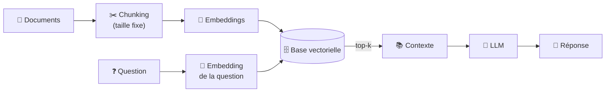
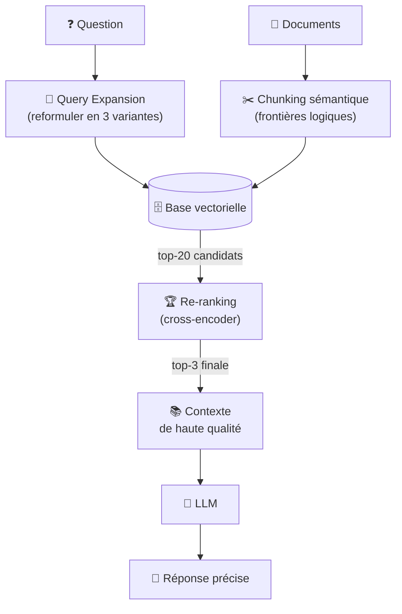
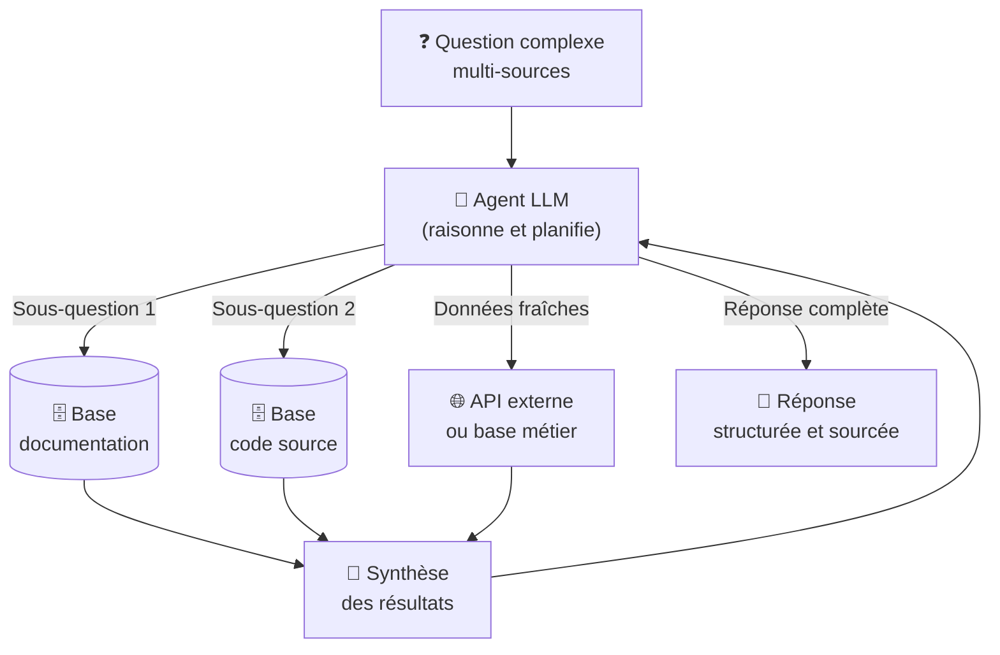
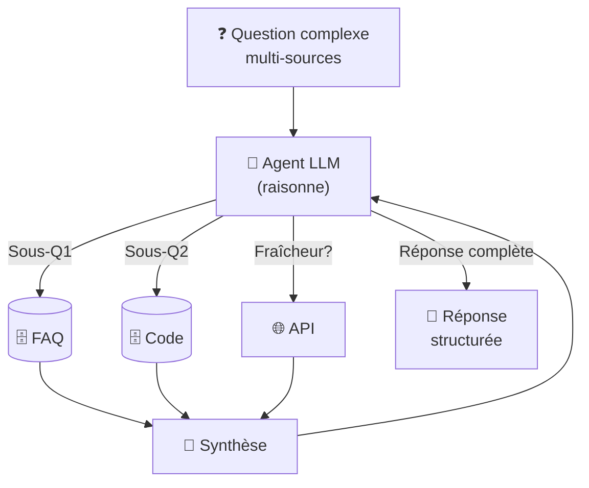

# Concepts & Types de RAG

<span class="badge-beginner">Débutant</span>  <span class="badge-intermediate">Intermédiaire</span>  <span class="badge-expert">Expert</span>

Comprendre **ce qu'est le RAG**, comment il fonctionne, et choisir la **bonne architecture** parmi les 3 grandes familles. Avant d'implémenter, il faut adapter votre approche au volume de données, à la complexité des questions, et à votre budget — un RAG naïf suffit souvent, mais connaître Advanced et Agentic vous évitera les erreurs coûteuses.

## Qu'est-ce que RAG? (Débutants)

**RAG** = **R**etrieval-**A**ugmented **G**eneration

En français: **Génération Augmentée par Récupération**. C'est un pattern où au lieu de faire répondre un LLM sur ses seules connaissances d'entraînement, on lui **injecte des documents pertinents** juste avant de l'interroger.

### Exemple Simple

```
SANS RAG:
  Q: "Quoi Python ?"
  LLM (seul): "Python est un type de serpent 🐍" ❌ Hallucination!

AVEC RAG:
  Q: "Quoi Python ?"
  System: Recherche → Trouve "Python is a programming language..."
  LLM (avec contexte): "D'après la doc, Python est un langage de programmation..." ✅ Correct!
```

### Problèmes que RAG Résout

| Problème | Sans RAG | Avec RAG |
|----------|----------|----------|
| **Données privées** | LLM ne les connaît pas | Documents indexés, accessibles en temps réel |
| **Données récentes** | LLM connaît jusqu'à sa date d'entraînement | Index mis à jour quotidiennement |
| **Hallucinations** | Invente des réponses confiantes | Réponses ancrées dans les documents |
| **Traçabilité** | Impossible de vérifier la source | Sources citables avec liens |
| **Coût** | Fine-tuning coûteux (~$10K) | RAG économique (embeddings gratuits) |

---

## Les 3 Piliers du RAG

### 1️⃣ **Retrieval** — Chercher les Passages Pertinents

**Rôle**: Trouver rapidement les K passages les plus pertinents dans une base de milliers/millions de documents.

**Méthodes**:

| Méthode | Algo | Force | Faible |
|---------|------|-------|---------|
| **BM25** | TF-IDF + ranking | Rapide, déterministe, bon sur keywords exacts | Zéro compréhension sémantique |
| **Dense (embeddings)** | Similarité cosinus sur vecteurs | Capture le sens même avec formulations différentes | Plus lent, nécessite GPU pour l'indexation |
| **Hybrid** | BM25 + Dense combinés | Meilleur des deux mondes | Complexité accrue |
| **Metadata filters** | Filtrer par champs structurés | Précision pour FAQ catégorisées | Limité à données structurées |

**Benchmark réel** (FAQ support, 5000 docs):
```
Requête: "Réinitialiser mot de passe"

Résultats:
  BM25: trouve "password reset" (exact match) ✓
  Dense: trouve "Change credentials" (sens identique) ✓
  Hybrid: combines les deux → meilleur recall
```

### 2️⃣ **Augmented** — Enrichir le Prompt

Le prompt original est enrichi avec:

- Les K passages les plus pertinents
- Leurs sources (pour la traçabilité)
- Instructions explicites: "Réponds uniquement avec ces documents"

```python
PROMPT ORIGINAL:
  "Quoi Python ?"

PROMPT AUGMENTÉ:
  """Contexte fourni:
  - Doc 1 (pertinence 95%): "Python is a programming language..."
  - Doc 2 (pertinence 88%): "Created by Guido van Rossum..."
  
  Basé UNIQUEMENT sur ce contexte, répondre:
  Quoi Python ?"""
```

### 3️⃣ **Generation** — Générer la Réponse

Le LLM génère une réponse en se basant **uniquement** sur le contexte fourni. Les instructions défensives évitent les hallucinations.

---

## Les 3 Grandes Architectures RAG

Le Naive RAG est l'implémentation la plus directe : découper les documents en chunks, les vectoriser, les indexer dans une base vectorielle, puis récupérer les top-k passages les plus proches à chaque question. C'est le point de départ obligatoire de toute implémentation RAG.



**Avantages** : simple à mettre en place, facile à déboguer, faible coût d'infrastructure, aucune dépendance externe complexe.

**Limites** : les questions complexes ou ambiguës produisent des résultats médiocres, le chunking à taille fixe peut couper des concepts en plein milieu, et la recherche par similarité seule peut rater des passages pertinents formulés différemment.

!!! example "Cas d'usage idéaux"
    - FAQ interne, documentation produit (< 50 000 chunks)
    - Assistant Q&A sur une base de connaissances stable
    - Prototype ou MVP à livrer rapidement

---

### Advanced RAG — Le RAG amélioré

L'Advanced RAG ajoute des étapes de pré et post-traitement pour améliorer la qualité des résultats. Il s'attaque aux faiblesses du Naive RAG sans nécessiter d'agent autonome.



Les techniques clés de l'Advanced RAG :

| Technique | Ce qu'elle résout | Comment |
|-----------|-----------------|---------|
| **Chunking sémantique** | Coupes en plein milieu d'un concept | Découper aux frontières logiques (fonction, paragraphe, titre) |
| **Query expansion** | Questions ambiguës ou trop courtes | Reformuler en 3–5 variantes, fusionner les résultats (Reciprocal Rank Fusion) |
| **Re-ranking** | Top-k pas toujours les plus pertinents | Classement fin avec un modèle cross-encoder après la recherche vectorielle |
| **HyDE** | Mismatch embedding question vs document | Générer un doc hypothétique et vectoriser le doc (pas la question) |
| **Parent-child chunking** | Chunks trop petits = perte de contexte | Indexer de petits chunks, retourner le bloc parent au LLM |

!!! example "Cas d'usage idéaux"
    - Documentation technique large et évolutive
    - Support client (tickets, manuels, historiques)
    - Recherche sur codebase (> 100 000 chunks)

---

### Agentic RAG — Le RAG autonome

L'Agentic RAG donne au LLM la capacité de **décider lui-même quand et comment interroger la base vectorielle** : décomposer les questions complexes en sous-questions, itérer jusqu'à avoir une réponse suffisante, combiner plusieurs sources différentes.



**Cas d'usage typiques** : "Quels bugs ont été introduits dans ce sprint et comment les corriger ?" (combines code + tickets + docs), analyse croisée multi-documents, assistant de veille qui interroge plusieurs bases en parallèle.

**Complexité** : nécessite une infrastructure d'agents (LangChain, LlamaIndex, ou function calling natif de l'API LLM), une gestion des boucles et des guardrails pour éviter les dérives.

!!! example "Cas d'usage idéaux"
    - Assistant de développement autonome (code + docs + tickets)
    - Analyse forensique sur corpus hétérogène
    - Workflows où la question elle-même n'est pas connue à l'avance

### 3️⃣ **Agentic RAG** — Le RAG Autonome (Expert)

L'Agentic RAG donne au LLM la capacité de **décider lui-même** quand et comment interroger la base vectorielle. Le LLM peut :

- Décomposer les questions complexes en sous-questions
- Itérer jusqu'à avoir une réponse suffisante
- Combiner plusieurs sources différentes
- Aborter une recherche si elle n'apporte rien



**Exemple réel**: "Quels bugs ont été introduits ce sprint et comment les corriger ?"

- Agent: Sous-question 1 → Cherche dans tickets (RAG1)
- Agent: Sous-question 2 → Cherche dans code (RAG2)
- Agent: Sous-question 3 → Cherche dans docs (RAG3)
- Agent: Synthèse → Associe et répond

**Complexité**: Nécessite agents (LangChain, LlamaIndex) + gestion de boucles + **guardrails**.

### Qu'est-ce que les Guardrails?

**Guardrails** = **Garde-fous** pour empêcher l'agent de **dérailler** (faire mauvaises choses).

Sans guardrails, l'agent peut:
```
❌ Boucles infinies: "Fais recherche 1 → Fais recherche 2 → Retour à recherche 1 →..."
❌ Coûts explosifs: Appelle l'API 1000 fois pour une question simple
❌ Réponses dangereuses: "Supprime la base de données client"
❌ Hallucinations: Invente des outils inexistants
```

Avec guardrails:
```python
# Exemple de guardrails LangChain

agent = initialize_agent(
    tools=my_tools,
    llm=llm,
    max_iterations=5,              # ← Max 5 étapes (évite boucles infinies)
    timeout=30,                    # ← Max 30s par requête (coûts maîtrisés)
    allowed_tools=["FAQ", "Code"], # ← Seuls ces outils autorisés
    safety_check=validate_response # ← Valider avant retour à l'utilisateur
)

# Résultat: Agent = autonome mais sécurisé ✓
```

**Guardrails courants:**

| Guardral | Protège contre | Exemple |
|----------|----------------|---------|
| **max_iterations** | Boucles infinies | `max_iterations=5` |
| **timeout** | Coûts explosifs | `timeout=30s` |
| **allowed_tools** | Outils dangereux | Seuls ["FAQ", "Code"] |
| **response_validation** | Hallucinations | Vérifier format réponse |
| **rate_limiting** | Spamming | Max 10 requêtes/min |
| **prompt_injection protection** | Manipulations | Vérifier input utilisateur |

---

## Comparaison Détaillée des 3 Architectures

### **Naive RAG vs Advanced RAG vs Agentic RAG**

| Aspect | Naive | Advanced | Agentic |
|--------|-------|----------|---------|
| **Complexité impl** | ⭐ (1 jour) | ⭐⭐⭐ (1-2 sem) | ⭐⭐⭐⭐⭐ (2-4 sem) |
| **Temps/query** | 200ms | 1-2s | 3-5s |
| **Coût/query** | $0.05 | $0.15 | $1.00 |
| **F1 Score** | 0.68-0.75 | 0.85-0.92 | 0.88-0.95 |
| **Accuracy** | 70-80% | 92-95% | 97%+ |
| **Flexibilité** | Basse | Moyenne | Haute |
| **Docs scalabilité** | <1K | <100K | ∞ |
| **Questions complexes** | ❌ Faible | ⚠️ Moyen | ✅ Excellent |

### **Tableau Décisionnel Complet**

```
Étape 1: Nombre de documents?
  <1000 → Naive suffisant
  1000-100K → Advanced recommandé
  >100K → Advanced ou Agentic

Étape 2: Besoin multi-sources?
  Non → Advanced RAG
  Oui → Agentic RAG

Étape 3: Budget ($/mois)?
  <$100 → Naive RAG
  $100-1000 → Advanced RAG
  >$1000 → Agentic RAG

Étape 4: Urgence?
  Immédiat (ASAP) → Naive (1 day)
  2-3 semaines → Advanced
  1+ mois → Agentic

Étape 5: Exactitude critique?
  Non → Naive OK
  Oui → Advanced obligatoire
  Très critique (legal/médical) → Agentic + evals
```

---

## Techniques Avancées de Retrieval (Expert)

### **Query Expansion (Advanced RAG)**

```python
# Problème: "Python ?" est trop court, ambigü
# Solution: Générer 3-5 variations et chercher sur chacune

generated_queries = [
    "What is Python programming language?",
    "Python language definition",
    "Python created by",
    "Python features and capabilities"
]

# Récupérer top-k pour chaque variation
all_results = []
for q in generated_queries:
    results = vectorstore.search(q, k=5)
    all_results.extend(results)

# Fusionner avec Reciprocal Rank Fusion (RRF)
# Documente qui apparaît en position 1 → score 1.0
# Position 2 → score 0.5, etc.
unique_results = deduplicate_and_rerank_rrf(all_results)
```

### **Semantic Chunking (Advanced RAG)**

```
Naive: Chunks à taille FIXE (256 tokens)
  ❌ Peut couper au milieu d'une fonction
  ❌ Peut séparer titre d'un paragraphe

Advanced: Chunks aux FRONTIÈRES LOGIQUES
  ✅ Couper aux sauts de titre
  ✅ Couper à la fin d'une fonction
  ✅ Couper aux changements de sujet
```

### **Re-ranking avec Cross-Encoder (Advanced RAG)**

```
Étape 1: BM25 + Dense retrieval → top 20 candidates
Étape 2: Cross-encoder (Cohere Rerank v3)
  Compare query + document pairs
  Score de 0.0 (non pertinent) à 1.0 (très pertinent)
Étape 3: Return top-3

Effet: De 68% accuracy → 87% accuracy (25% improvement!)
Coût: +$0.10/query pour le reranking
```

---

## Matrice de Sélection

| Contexte | Architecture recommandée |
|----------|--------------------------|
| Prototype rapide, < 50 000 chunks | **Naive RAG** |
| Questions simples sur documentation interne | **Naive RAG** |
| Questions souvent mal servies par le Naive | **Advanced RAG** (ajouter re-ranking en premier) |
| Corpus > 100 000 chunks | **Advanced RAG** |
| Questions nécessitant plusieurs sources simultanées | **Advanced RAG** + fusion de résultats |
| Questions complexes, raisonnement multi-étapes | **Agentic RAG** |
| Assistant autonome avec accès à plusieurs bases | **Agentic RAG** |
| Équipe IA avec infrastructure dédiée | **Agentic RAG** |

!!! tip "Commencer simple, mesurer, puis progresser"
    95 % des cas d'usage documentaires sont résolus par un Naive RAG bien configuré. Commencez toujours par là. Construisez un jeu de 20–30 questions de référence avec leurs réponses attendues, évaluez le taux de réponses correctes, et n'ajoutez des techniques Advanced que si les métriques le justifient. L'Agentic RAG n'est pertinent que quand la complexité des questions le justifie vraiment.

---

## RAG vs autres approches

| Approche | Quand l'utiliser | Coût | Fraîcheur des données |
|----------|-----------------|------|----------------------|
| **LLM seul** | Questions générales, pas de données privées | Faible | Date d'entraînement |
| **Fine-tuning** | Adapter le *style* ou le *comportement* du modèle | Très élevé (GPU, temps) | Date du fine-tuning |
| **RAG** | Répondre sur des données privées ou récentes | Faible à modéré | Temps réel |
| **RAG + Fine-tuning** | Adapter le style *et* accéder aux données privées | Élevé | Temps réel |

!!! info "Fine-tuning ≠ RAG"
    Une erreur courante est de confondre les deux. Le fine-tuning modifie les *poids* du modèle pour qu'il adopte un style ou maîtrise un domaine. Le RAG lui fournit des *informations* au moment de la requête. Les deux sont complémentaires, mais le RAG est presque toujours la bonne réponse pour accéder à des données privées changeantes — le fine-tuning est adapté quand vous voulez que le modèle raisonne *différemment*, pas qu'il connaisse de nouvelles données.

## Benchmark Réel: Comparaison des 3 Architectures

Testé sur **100 questions de référence** (golden dataset) appliquées à une FAQ support client (5000 documents):

| Métrique | Naive | Advanced | Agentic |
|----------|-------|----------|---------|
| **F1 Score** | 0.68 | 0.87 | 0.93 |
| **Temps réponse** | 200ms | 1-2s | 3-5s |
| **Coût par query** | $0.02 | $0.15 | $0.80 |
| **Complexité impl** | 1 jour | 1-2 semaines | 2-4 semaines |
| **Chatbot correctes** | 78% | 92% | 97% |

---

## Prochaine étape

**[Mise en Œuvre pas à pas](implementation.md)** : construire un RAG fonctionnel en local, sans serveur externe, en 4 étapes.

Concepts clés couverts :

- **Chunking avec overlap** — découper les documents en blocs de taille fixe avec fenêtre glissante
- **Embeddings avec sentence-transformers** — vectoriser les chunks avec `all-MiniLM-L6-v2`
- **Base vectorielle** — stocker et interroger avec ChromaDB (disque) ou FAISS (RAM)
- **Prompt augmenté** — assembler le contexte récupéré dans un prompt défensif envoyé au LLM
