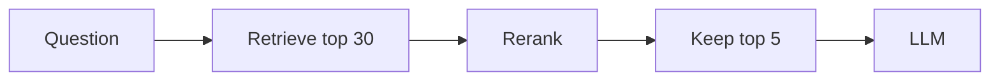
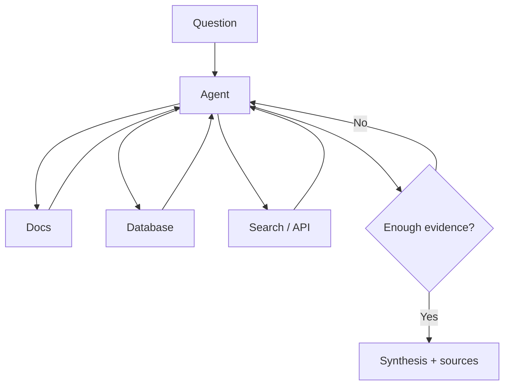

# Concepts & architectures RAG

<span class="badge-beginner">Débutant</span> <span class="badge-intermediate">Intermédiaire</span> <span class="badge-expert">Expert</span>

Le **RAG** (*Retrieval-Augmented Generation*) ajoute une étape de récupération d'information avant ou pendant la génération. L'objectif n'est pas seulement de « donner plus de contexte » au modèle, mais de lui fournir les **bons éléments, au bon moment, avec une provenance vérifiable**.

---

## 1. Les quatre blocs à distinguer


```mermaid
graph LR
    Q["Question"] --> R["Retrieval"]
    R --> C["Context assembly"]
    C --> G["Generation"]
    G --> V["Verification / citations"]
```

| Bloc | Question |
|---|---|
| Retrieval | Quels documents/passages récupérer ? |
| Context assembly | Dans quel ordre et avec quelles métadonnées ? |
| Generation | Comment répondre à partir des sources ? |
| Verification | La réponse est-elle soutenue par les sources ? |

Une mauvaise réponse peut venir de n'importe lequel de ces blocs. Il faut donc les évaluer séparément.

---

## 2. Retrieval lexical, dense et hybride

### Lexical

BM25 et les moteurs de recherche classiques sont excellents lorsque les mots exacts comptent : identifiants, erreurs, noms de produit, références légales.

### Dense

Les embeddings permettent une recherche sémantique : deux passages peuvent être proches même s'ils n'emploient pas exactement les mêmes mots.

### Hybride

La recherche hybride combine généralement un signal lexical et un signal dense. Elle est souvent utile sur les corpus techniques où les identifiants exacts et le sens général sont tous les deux importants.

!!! tip "Ne choisissez pas par réputation"
    Mesurez Recall@k / MRR / nDCG ou une métrique adaptée sur **vos propres questions**. Un moteur simple bien évalué vaut mieux qu'une architecture sophistiquée sans benchmark.

---

## 3. Chunking

Le chunking transforme les documents en unités récupérables.

### Taille fixe

Simple à implémenter et utile comme baseline, mais peut couper une section au mauvais endroit.

### Sémantique / structurel

Découpe selon des frontières naturelles : titres Markdown, fonctions, classes, paragraphes, sections contractuelles.

### Parent-child

Indexe des petits passages pour la précision du retrieval mais retourne un bloc parent plus large pour préserver le contexte.

### Ce qu'il faut mesurer

- passage pertinent récupéré ou non ;
- bruit ajouté au contexte ;
- duplication ;
- latence ;
- volume de tokens transmis au LLM.

---

## 4. Embeddings

Un modèle d'embeddings transforme une entrée en vecteur. Le choix dépend du corpus :

- langues ;
- domaine ;
- longueur des passages ;
- hébergement ;
- confidentialité ;
- latence ;
- coût réel ;
- performance mesurée sur vos evals.

Évitez de figer dans cette documentation un fournisseur ou un tarif précis : ces informations évoluent rapidement.

---

## 5. Reranking

Un reranker reprend un ensemble de candidats et les reclasse avec un signal plus coûteux mais plus fin.


```mermaid
graph LR
    Q["Question"] --> R["Retrieve top 30"]
    R --> RR["Rerank"]
    RR --> K["Keep top 5"]
    K --> LLM["LLM"]
```

Le reranking n'est utile que s'il améliore la qualité suffisamment pour compenser latence et coût supplémentaires.

---

## 6. Trois niveaux d'architecture

### Baseline RAG

```text
question → retrieve → top-k → prompt → answer
```

À utiliser en premier pour établir une baseline observable.

### RAG enrichi

Ajoute un ou plusieurs mécanismes :

- hybrid search ;
- metadata filtering ;
- query rewriting ;
- reranking ;
- parent-child retrieval ;
- déduplication.

Chaque ajout doit correspondre à un échec mesuré.

### Agentic retrieval

L'agent choisit dynamiquement :

- s'il faut chercher ;
- dans quelle source ;
- avec quelle requête ;
- s'il faut reformuler ;
- s'il faut poursuivre ou s'arrêter.


```mermaid
graph TD
    Q["Question"] --> A["Agent"]
    A --> DOC["Docs"]
    A --> DB["Database"]
    A --> WEB["Search / API"]
    DOC --> A
    DB --> A
    WEB --> A
    A --> V{"Enough evidence?"}
    V -- No --> A
    V -- Yes --> S["Synthesis + sources"]
```

L'agentic retrieval ne nécessite pas obligatoirement un framework spécifique. Un modèle capable d'utiliser des outils avec une boucle de contrôle simple peut suffire. Ajoutez une couche d'orchestration uniquement lorsqu'elle apporte une valeur mesurable.

---

## 7. MCP dans un système Claude

MCP connecte Claude Code à des outils et données externes. Exemples :

- moteur de recherche interne ;
- base SQL ;
- stockage documentaire ;
- observabilité ;
- tickets et knowledge base.

MCP n'est pas lui-même un RAG. Il fournit **l'accès** ; un skill, l'agent ou votre application décide ensuite comment rechercher et utiliser les données.

---

## 8. Just-in-time context

Anthropic décrit un pattern important pour les agents : garder dans le contexte des **références légères** (chemins, identifiants, requêtes sauvegardées, URLs) puis charger les données détaillées seulement lorsqu'elles deviennent nécessaires.

Ce pattern évite deux excès :

- tout précharger et saturer le contexte ;
- ne rien fournir et obliger l'agent à deviner.

Pour du RAG, cela pousse vers des outils de retrieval observables et ciblés plutôt qu'une injection massive systématique.

---

## 9. Évaluer le retrieval

Construisez un petit dataset d'évaluation avec :

```text
question
expected_document_ids
expected_answer_facts
forbidden_or_distractor_documents (optionnel)
```

Mesurez au minimum :

| Métrique | Ce qu'elle teste |
|---|---|
| Recall@k | Le passage utile apparaît-il dans les k résultats ? |
| Precision@k | Combien de résultats sont réellement utiles ? |
| MRR | Le premier bon résultat arrive-t-il tôt ? |
| Citation accuracy | Les sources citées soutiennent-elles réellement la réponse ? |
| Answer correctness | Les faits finaux sont-ils corrects ? |

Ne confondez pas retrieval quality et answer quality.

---

## 10. Sécurité et prompt injection

Les documents récupérés sont du **contenu non fiable**. Un document peut contenir une instruction malveillante destinée à l'agent.

Garde-fous essentiels :

- appliquer les ACL avant retrieval ;
- séparer clairement données et instructions ;
- conserver l'identité/provenance de chaque source ;
- minimiser les outils disponibles ;
- demander confirmation pour les actions sensibles ;
- tester un corpus contenant des injections adversariales ;
- journaliser les recherches et décisions importantes.

Pour les agents ayant accès en écriture à des systèmes externes, le risque n'est plus seulement une mauvaise réponse : une injection peut essayer de provoquer une action.

---

## 11. Pattern d'amélioration expérimental

```text
1. Exécuter la baseline d'evals.
2. Classer les erreurs : corpus, chunking, retrieval, reranking, génération.
3. Choisir UNE hypothèse.
4. Modifier UNE composante.
5. Réexécuter les mêmes evals.
6. Comparer qualité, latence et coût.
7. Conserver seulement si le compromis est meilleur.
```

Claude Code est utile pour automatiser cette boucle, à condition de lui demander d'exécuter les évaluations et de conserver les résultats plutôt que de juger « à l'impression ».

---

## Sources

- [Anthropic — Effective context engineering for AI agents](https://www.anthropic.com/engineering/effective-context-engineering-for-ai-agents) — consulté le 2026-09-28
- [Anthropic — Building effective agents](https://www.anthropic.com/engineering/building-effective-agents) — consulté le 2026-09-28
- [Claude Code — MCP](https://code.claude.com/docs/en/mcp) — consulté le 2026-09-28
- [Claude Code — fonctionnalités et extensions](https://code.claude.com/docs/en/features-overview) — consulté le 2026-09-28

## Prochaine étape

Poursuivez avec **[Docling — Ingestion documentaire](docling.md)**, la page suivante dans le menu.
