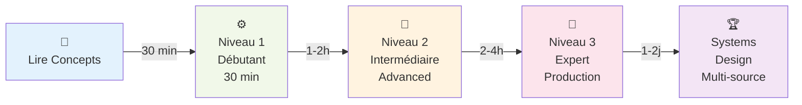
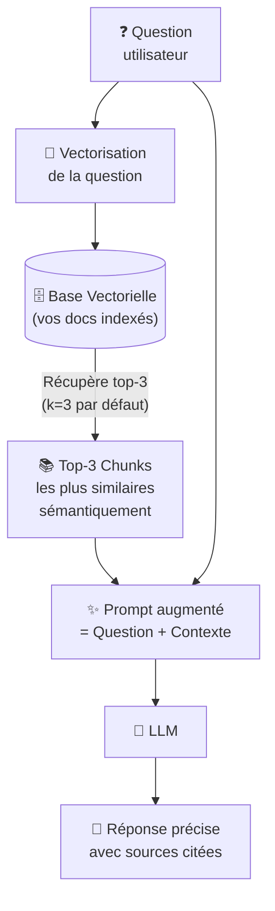

# RAG — Retrieval-Augmented Generation

<span class="badge-beginner">Débutant</span>  <span class="badge-intermediate">Intermédiaire</span>  <span class="badge-expert">Expert</span>

Le **RAG** (*Retrieval-Augmented Generation*) est l'architecture qui permet à un LLM de répondre avec précision sur des données privées ou récentes qu'il n'a jamais vues lors de son entraînement. Au lieu d'espérer que le modèle connaît votre codebase, vos documents internes ou vos données métier, le RAG les indexe et injecte automatiquement les passages pertinents dans chaque prompt.

Si vous utilisez GitHub Copilot, vous bénéficiez déjà d'une forme de RAG sans le savoir : Copilot indexe vos fichiers ouverts, votre historique de conversation et vos `.instructions.md` pour construire un contexte adapté à votre projet avant chaque suggestion.

---

## Roadmap Apprentissage RAG



---

## Ce que vous allez apprendre dans ce chapitre

| Page | Niveau | Temps | Contenu |
|------|--------|-------|---------|
| **[Concepts & Types de RAG](concepts.md)** | Tous | 30 min | Qu'est-ce que RAG, 3 architectures, quand choisir laquelle, benchmarks réels |
| **[Implémentation (1-3)](implementation.md)** | Tous | 5h total | Niveau 1 (30 min), Niveau 2 (Advanced), Niveau 3 (Enterprise) + Ressources |
| **[Cas d'Usage par Secteur](cas-usage-secteurs.md)** | Intermédiaire | 1h | 6 secteurs réels (Support, Juridique, R&D, Santé, Commerce, HR) avec KPIs |
| **[Optimisation Avancée](optimisation-avancee.md)** | Expert | 2h | Tuning, évaluation, monitoring, sécurité, troubleshooting |

---

## Pourquoi le RAG existe

Un LLM seul présente des limitations critiques pour un usage professionnel :

| Problème | Conséquence | Solution RAG |
|----------|-------------|--------------|
| Connaissance figée à la date d'entraînement | Pas de réponse sur vos données récentes | Données injectées en temps réel |
| Aucune connaissance de votre codebase | Suggestions génériques, hors contexte | Documents du projet indexés automatiquement |
| Hallucinations sur données internes | Réponses inventées mais confiantes | Réponses ancrées dans vos documents réels |
| Fine-tuning coûteux (temps + argent) | Inaccessible pour la plupart des équipes | RAG économique et sans ré-entraînement |
| Pas de traçabilité des sources | Impossible de vérifier l'origine d'une réponse | Sources citables, liens vers les passages |

---

## Comment fonctionne le RAG



!!! info "Qu'est-ce que **top-k** ?"
    - **k** = nombre entier qu'on choisit (1, 3, 5, 10, etc.)
    - **top-k** = les **K meilleurs résultats**
    - **Exemple**: k=3 retourne les 3 chunks les plus similaires à la question

---

## Mesure de Similarité — Comment ça Marche?

C'est ultra simple: convertir texte → nombres (vecteurs) → comparer les nombres.

#### Étape 1: Vectorisation (Texte → Nombres)

```
Question: "Comment redémarrer le service?"
           ↓ Embedding model (all-MiniLM-L6-v2)
Vecteur:   [0.12, -0.45, 0.88, 0.23, ..., 0.06]  ← 384 nombres

Chunk #47: "Redémarrez le service avec systemctl restart myapp"
           ↓ Même embedding model
Vecteur:   [0.13, -0.44, 0.87, 0.25, ..., 0.07]  ← 384 nombres aussi

Chunk #128: "Pour explorer Paris, visiter la tour Eiffel"
           ↓ Même embedding model
Vecteur:   [0.92, 0.11, -0.33, 0.81, ..., 0.44]  ← Complètement différent!
```

#### Étape 2: Mesure de Similitude (Comparer les Vecteurs)

**Distance Cosinus** = Comment 2 vecteurs se ressemblent:

```
Formule simple: Se demander "Vers la même direction?"

Question vecteur:  [0.12, -0.45, 0.88, ...]
Chunk #47 vecteur: [0.13, -0.44, 0.87, ...]

Résultat: De 0.0 à 1.0
  1.0 = IDENTIQUE ✓ (même direction)
  0.5 = SIMILAIRE (direction proche)
  0.0 = RIEN EN COMMUN ✗ (directions opposées)
```

#### Exemple Réel:

```
QUESTION: "Redémarrer service?"

CHUNK #47: "Redémarrez le service avec..."
Similarité: 0.95 ✓✓✓ TRÈS PERTINENT!

CHUNK #128: "Tour Eiffel à Paris..."
Similarité: 0.12 ✗ PAS PERTINENT (complètement hors sujet)

CHUNK #234: "Arrêter et relancer le processus..."
Similarité: 0.88 ✓✓ PERTINENT!

CLASSEMENT (top-3):
  1. Chunk #47 (0.95)  ← TOP 1 🥇
  2. Chunk #234 (0.88) ← TOP 2 🥈
  3. Chunk #301 (0.82) ← TOP 3 🥉
```

!!! tip "Pourquoi distance cosinus?"
    Elle capture le **sens** même si les mots changent:
    - "Redémarrer service" vs "Relancer application" → SIMILAIRE (0.88)
    - "Redémarrer" vs "Tour Eiffel" → DIFFÉRENT (0.12)
    
    C'est magique car le modèle a appris que "redémarrer" et "relancer" se ressemblent!

Le RAG opère en **deux phases distinctes** :

1. **Indexation** (une fois, puis mise à jour au fil des changements) : les documents sont découpés en chunks → chaque chunk est converti en vecteur (*embedding*) → les vecteurs sont stockés dans une base vectorielle.

2. **Requête** (à chaque question) : la question est vectorisée → les chunks les plus proches sémantiquement sont récupérés → ils sont injectés dans le prompt avant d'appeler le LLM.

---

## Prérequis & Stack Recommandée

### Langages & Frameworks

- **Python 3.8+** (tous les exemples sont en Python)
- **LangChain** ou **LlamaIndex** (abstraction RAG)
- **sentence-transformers** (embeddings gratuits) ou **OpenAI API** (embeddings payants)

### Infrastructure

| Ressource | Niveau 1 | Niveau 2 | Niveau 3 |
|-----------|----------|----------|----------|
| **Embedding Model** | all-MiniLM-L6-v2 ($0) | all-mpnet-base-v2 ($0) | text-embedding-3-large ($0.13/M) |
| **Vector DB** | ChromaDB (local) | Qdrant (cloud $18/mo) | Pinecone ($25/mo) + FAISS (self) |
| **LLM** | gpt-3.5-turbo ($0.50/M) | gpt-4 ($15/M) | Claude 3 ($3-30/M) ou local (Ollama) |
| **Re-ranker** | ❌ Non | Cohere Rerank ($0.10/q) | Cohere + custom scoring |

### Budget Estimé (par mois, pour 10K requêtes)

```
Niveau 1: $5-10    (all-MiniLM + ChromaDB + GPT-3.5)
Niveau 2: $50-200  (all-mpnet + Qdrant + GPT-4 + Cohere)
Niveau 3: $500+    (text-embedding-3-large + Pinecone + Claude + monitoring)
```

!!! warning "Qu'est-ce qu'une **requête RAG**?"
    Une **requête RAG** = une question posée par un utilisateur à ton système RAG.
    
    **C'est DIFFÉRENT des consumptions Copilot** :
    
    | Aspect | Requête RAG | Copilot Consumption |
    |--------|-------------|-------------------|
    | **Définition** | Une question utilisateur ("Redémarrer service?") | Suggestion de code / completion |
    | **Coût par requête** | $0.005 - $1.00 | Dépend de la durée session + usage |
    | **10K/mois** | ~333 questions/jour | Non applicable (metric différente) |
    | **Exemple** | FAQ support: 10K questions/mois = normal | Développeur VS Code: X completions/jour |
    
    **Une requête RAG coûte PLUS qu'une simple API call** car elle inclut:
    ```
    1 Requête RAG = {
      + Embeddings query (vectoriser la question) 
      + Recherche dans le vector DB (peut être gratuit si local)
      + Appel LLM (répondre avec contexte)
      + Parfois: Re-ranking (Cohere)
      + Parfois: Autres API calls (external services)
    }
    
    Exemple coûts unitaires:
      Embeddings query: $0.0000004 (text-embedding-3-large)
      LLM (gpt-3.5): $0.0005 (output token)
      Cohere Rerank: $0.10 (par requête)
      Total/requête: ~$0.0005 - $0.10 dépend config
    ```
    
    **10K requêtes/mois** = système avec:
    
    - FAQ support: 333 questions/jour (réaliste)
    - Chatbot interne: 500 questions/jour
    - Recherche documentaire: plusieurs milliers/jour

---

## Prochaine étape

**[Concepts & Types de RAG](concepts.md)** : comprendre les trois grandes architectures avant de choisir et d'implémenter.

Concepts clés couverts :

- **Naive RAG** — le point de départ obligatoire : chunking, vectorisation, index, top-k
- **Advanced RAG** — query expansion, re-ranking, chunking sémantique, HyDE pour améliorer la qualité
- **Agentic RAG** — le LLM décide lui-même quand et comment interroger la base vectorielle
- **Quelle architecture choisir** — arbre de décision selon le volume, la complexité et le budget infrastructure
