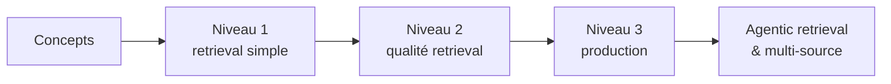
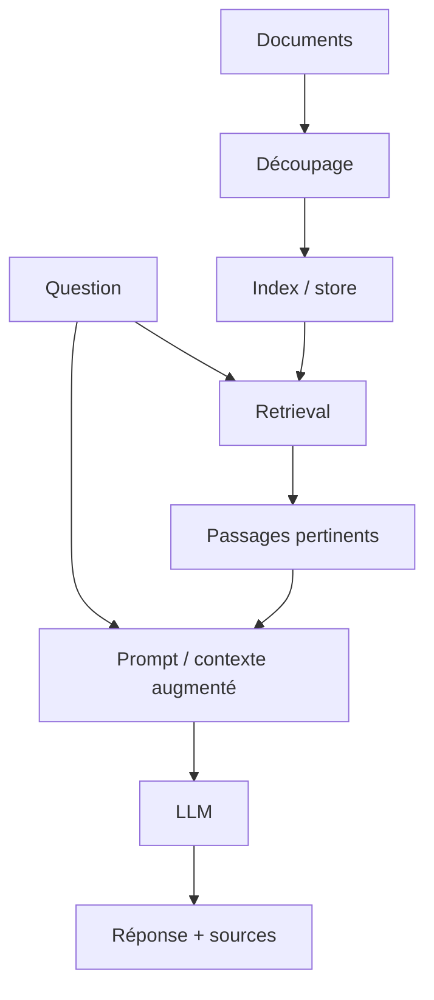

# RAG — Retrieval-Augmented Generation

<span class="badge-beginner">Débutant</span> <span class="badge-intermediate">Intermédiaire</span> <span class="badge-expert">Expert</span>

Le **RAG** (*Retrieval-Augmented Generation*) consiste à récupérer des informations externes pertinentes puis à les fournir au modèle au moment de répondre. C'est une technique utile lorsque la réponse doit s'appuyer sur des documents privés, volumineux ou fréquemment mis à jour.

!!! important "RAG ≠ tout mécanisme de contexte"
    Un IDE qui fournit des fichiers ouverts ou un agent qui lit un dépôt utilise du **contexte** et des outils de recherche, mais ce n'est pas automatiquement une architecture RAG au sens strict. Le RAG implique généralement une étape explicite de **retrieval** sur un corpus avant génération.

---

## Où Claude Code se place

Claude Code peut participer à deux niveaux différents :

1. **développer et tester** votre système RAG (ingestion, indexation, retrieval, évaluation, API) ;
2. **consommer des sources externes** via MCP ou des outils pour charger du contexte juste à temps.

Anthropic décrit justement cette évolution vers le **just-in-time context** : plutôt que d'injecter un maximum de données à l'avance, l'agent conserve des références légères puis charge les informations utiles au moment où il en a besoin.

---

## Roadmap d'apprentissage


```mermaid
graph LR
    A["Concepts"] --> B["Niveau 1\nretrieval simple"]
    B --> C["Niveau 2\nqualité retrieval"]
    C --> D["Niveau 3\nproduction"]
    D --> E["Agentic retrieval\n& multi-source"]
```

| Page | Niveau | Contenu |
|---|---|---|
| [Concepts & architectures](concepts.md) | Tous | Retrieval, embeddings, chunking, reranking, agentic retrieval |
| [Implémentation](implementation.md) | Tous | Progression du prototype à la production |
| [Niveau 1](niveau-1.md) | Débutant | Pipeline minimal et observable |
| [Niveau 2](niveau-2.md) | Intermédiaire | Retrieval hybride, reranking, qualité |
| [Niveau 3](niveau-3.md) | Expert | Production, sécurité, monitoring |
| [Cas d'usage par secteur](cas-usage-secteurs.md) | Intermédiaire | Exemples métier et contraintes |
| [Optimisation avancée](optimisation-avancee.md) | Expert | Évaluation, tuning et diagnostic |

---

## Pipeline RAG minimal


```mermaid
graph TD
    DOCS["Documents"] --> CHUNK["Découpage"]
    CHUNK --> IDX["Index / store"]
    Q["Question"] --> RET["Retrieval"]
    IDX --> RET
    RET --> CTX["Passages pertinents"]
    Q --> AUG["Prompt / contexte augmenté"]
    CTX --> AUG
    AUG --> LLM["LLM"]
    LLM --> ANS["Réponse + sources"]
```

Le pipeline est simple à dessiner mais difficile à rendre fiable. Les erreurs peuvent venir du chunking, de l'indexation, du retrieval, du reranking, du prompt ou du modèle.

---

## Embeddings et similarité

Une approche courante consiste à représenter textes et requêtes sous forme de vecteurs puis à rechercher les passages proches.

La similarité cosinus est fréquente, mais **un score élevé n'est pas une preuve de pertinence métier**. Un retrieval doit être évalué sur un jeu de questions représentatif.

Métriques utiles côté retrieval :

- Recall@k ;
- Precision@k ;
- MRR / nDCG selon le problème ;
- taux de réponse avec source correcte ;
- couverture des documents critiques.

---

## Ne pas figer les fournisseurs et tarifs

Les anciennes versions de cette page associaient des niveaux à des modèles précis, des prix mensuels de vector DB et des tarifs de tokens. Ces informations vieillissent trop vite.

Conservez plutôt une matrice de décision :

| Composant | Questions à poser |
|---|---|
| Embeddings | langue, domaine, dimension, coût, hébergement, confidentialité |
| Store | volume, filtres metadata, latence, sauvegarde, coût opérationnel |
| Reranker | gain mesuré, latence ajoutée, coût par requête |
| LLM | qualité sur votre eval, contexte, outils, coût réel du trafic |
| Framework | abstraction utile ou complexité inutile ? |

Les prix doivent être vérifiés sur les pages officielles des fournisseurs au moment d'une décision d'achat, pas recopiés ici comme constantes.

---

## Baseline avant architecture « avancée »

Commencez par :

1. un corpus propre ;
2. un chunking simple ;
3. un retrieval observable ;
4. des citations ;
5. un petit jeu d'évaluation réel.

N'ajoutez query expansion, reranking, hybrid search, graph retrieval ou orchestration agentique **que si les evals montrent un problème qu'ils résolvent**.

Cette approche suit le principe Anthropic : privilégier des patterns simples et composables avant d'ajouter de la complexité agentique.

---

## Évaluer le retrieval séparément de la génération

Si la réponse est mauvaise, demandez d'abord :

- le bon document était-il indexé ?
- a-t-il été chunké correctement ?
- le bon passage était-il dans le top-k ?
- le reranker l'a-t-il conservé ?
- le modèle a-t-il utilisé la source ?

Ne changez pas simultanément embeddings, chunk size, prompt et modèle : vous perdrez la capacité d'expliquer l'amélioration.

---

## Agentic retrieval et MCP

Un agent peut décider **quand** chercher, **quelle source** interroger et **s'il faut rechercher à nouveau**. C'est différent d'un pipeline RAG fixe.

Claude Code peut accéder à des systèmes externes via MCP. Pour un projet RAG, cela permet par exemple de connecter :

- une base documentaire ;
- un moteur de recherche interne ;
- une base SQL ;
- un outil d'observabilité ;
- un système de tickets.

MCP fournit l'accès aux outils et données ; les **skills** peuvent documenter comment les utiliser correctement.

---

## Sécurité

Le retrieval fait entrer du contenu externe dans le contexte du modèle. Considérez ce contenu comme **non fiable** :

- contrôlez les droits d'accès avant retrieval ;
- ne faites pas remonter de document qu'un utilisateur n'a pas le droit de voir ;
- conservez la provenance ;
- séparez données et instructions ;
- testez les prompt injections présentes dans les documents ;
- limitez les outils d'écriture lorsque seule la lecture est nécessaire.

---

## Workflow Claude pour développer un RAG

```text
1. Cartographie le pipeline RAG actuel sans modifier le code.
2. Identifie où sont ingestion, chunking, indexation, retrieval, reranking et génération.
3. Trouve les evals existantes.
4. Exécute la baseline et enregistre ses métriques.
5. Propose UNE modification avec hypothèse mesurable.
6. Implémente-la.
7. Réexécute exactement les mêmes evals.
8. Compare coût, latence et qualité avant/après.
```

Pour les analyses volumineuses, déléguez l'exploration à un subagent afin de garder la conversation principale concentrée sur la décision.

---

## Sources

- [Anthropic — Effective context engineering for AI agents](https://www.anthropic.com/engineering/effective-context-engineering-for-ai-agents) — consulté le 2026-09-28
- [Anthropic — Building effective agents](https://www.anthropic.com/engineering/building-effective-agents) — consulté le 2026-09-28
- [Claude Code — MCP](https://code.claude.com/docs/en/mcp) — consulté le 2026-09-28
- [Claude Code — fonctionnalités et extensions](https://code.claude.com/docs/en/features-overview) — consulté le 2026-09-28

## Prochaine étape

**[Concepts & architectures RAG](concepts.md)** : comprendre retrieval, chunking, embeddings, hybrid search, reranking et agentic retrieval avant l'implémentation.
