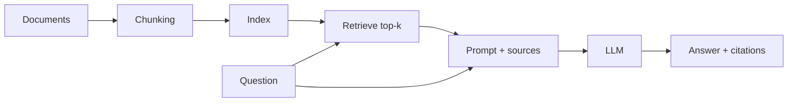

# Niveau 1 — Construire une baseline RAG observable

<span class="badge-beginner">Débutant</span>

L'objectif du niveau 1 n'est pas de construire « le meilleur RAG » en quelques minutes. Il est de produire un pipeline **simple, observable et évaluable** qui servira de référence aux optimisations futures.

---

## Prérequis

- un environnement de développement reproductible ;
- un petit corpus ;
- un moyen de calculer des embeddings ;
- un index/retriever ;
- un LLM ou un modèle local pour la génération ;
- 20 à 50 questions d'évaluation si possible.

Les fournisseurs, modèles et tarifs ne sont pas figés ici. Utilisez les composants approuvés par votre projet et vérifiez leur documentation actuelle.

---

## Architecture minimale



---

## 1. Préparer un corpus miniature

Commencez avec quelques documents dont vous connaissez les réponses :

```python
DOCUMENTS = [
    {
        "id": "auth-reset",
        "text": "Un token expiré se renouvelle via POST /token/refresh avec un refresh token valide.",
    },
    {
        "id": "auth-revoke",
        "text": "La révocation d'une session invalide le refresh token associé.",
    },
]
```

Gardez l'identifiant/source avec chaque passage dès le début.

---

## 2. Chunking simple

Pour une baseline, découpez aux frontières naturelles si elles existent : paragraphes, titres Markdown, fonctions ou sections.

Évitez d'optimiser `chunk_size` avant d'avoir une mesure de retrieval.

```python
def chunk_document(document: dict[str, str]) -> list[dict[str, str]]:
    paragraphs = [p.strip() for p in document["text"].split("\n\n") if p.strip()]
    return [
        {"id": f'{document["id"]}:{index}', "source": document["id"], "text": paragraph}
        for index, paragraph in enumerate(paragraphs)
    ]
```

---

## 3. Indexer

Le code exact dépend du store et du modèle d'embeddings. L'interface logique reste :

```python
chunks = load_and_chunk_documents()
index = build_index(chunks)
```

Conservez :

- texte ;
- source ;
- identifiant stable ;
- métadonnées nécessaires au filtrage.

---

Les fonctions `load_and_chunk_documents`, `build_index` et l’interface `index.search` sont du **pseudocode de contrat**, pas des fonctions installées par un package. Pour Qdrant, adaptez cette étape à sa [Query API](qdrant.md#api-de-recherche-actuelle). Le modèle de génération ne fournit pas nécessairement les embeddings : choisissez et versionnez un encodeur distinct, ses dimensions, sa normalisation et son tokenizer.

## 4. Retrieval inspectable

Avant de générer une réponse, affichez ou loggez les résultats du retrieval :

```python
results = index.search("Comment renouveler un token expiré ?", k=5)

for result in results:
    print(result.source, result.score, result.text[:120])
```

Si le bon passage n'est pas récupéré, changer le prompt du LLM ne résoudra pas le problème.

---

## 5. Génération avec citations

Le modèle reçoit :

```text
Question
+ passages récupérés
+ identifiants de source
+ consigne de ne pas inventer si les sources sont insuffisantes
```

Exemple de contrat :

```text
Réponds à partir des sources fournies.
Cite chaque fait important avec [source].
Si les sources ne permettent pas de répondre, indique-le explicitement.
```

Une citation ne garantit pas la correction : vérifiez qu'elle soutient réellement le fait cité.

---

## 6. Créer une première eval

```python
EVALS = [
    {
        "question": "Comment renouveler un token expiré ?",
        "expected_sources": {"auth-reset"},
        "expected_facts": {"POST /token/refresh", "refresh token"},
    },
]
```

Mesurez au minimum :

- le bon document apparaît-il dans top-k ?
- la réponse contient-elle les faits attendus ?
- les citations pointent-elles vers la bonne source ?

---

## 7. Utiliser Claude Code pour construire la baseline

```text
Construis une baseline RAG à partir de ce dépôt.
Commence par identifier ingestion, corpus et tests existants.
Implémente le pipeline le plus simple permettant :
- retrieval inspectable ;
- source IDs conservés ;
- réponse sourcée ;
- une commande d'eval reproductible.
N'ajoute pas reranking ou query expansion à ce stade.
```

Claude doit exécuter l'eval avant de conclure.

---

## Critères de sortie du niveau 1

- [ ] corpus et chunks traçables ;
- [ ] retrieval inspectable ;
- [ ] sources conservées ;
- [ ] petit dataset d'eval ;
- [ ] baseline qualité + latence enregistrée ;
- [ ] aucune dépendance avancée ajoutée sans besoin mesuré.

---

## Prochaine étape

Poursuivez avec **[Niveau 2 (Intermédiaire)](niveau-2.md)**, la page suivante dans le menu.
