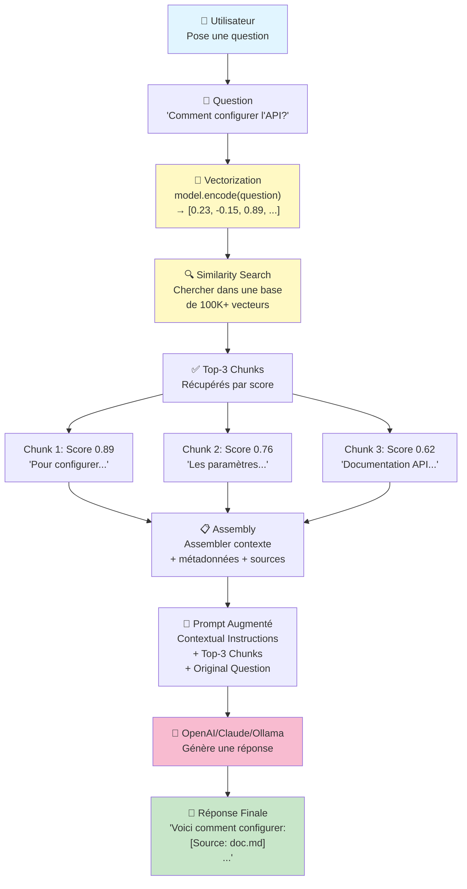

# 🚀 NIVEAU 3 — RAG Enterprise & Scaling

<span class="badge-expert">Expert</span>

**Prérequis :**

- Avoir complété [Niveau 2](niveau-2.md)
- Comprendre les trade-offs performance vs. qualité
- Vouloir scaler en production avec monitoring et évaluation

**Coûts :**

- ✅ **Gratuit** : FAISS, Chunking, Agents locaux
- 💰 **Payant** : OpenAI/Claude, Langsmith ($40/mois), Cohere Rerank

!!! danger "💰💰 Coûts Enterprise (de 100K à 1M requêtes/mois)"
    | Composant | Coût par 1M requêtes |
    |-----------|---------------------|
    | **LLM** (gpt-3.5) | ~$1,500 |
    | **Embeddings** (text-embedding-3-small) | ~$10 |
    | **Langsmith Monitoring** | $40/mois |
    | **Cohere Rerank** | ~$200 |
    | **Infrastructure** (FAISS + Qdrant) | $50-500/mois |
    | **TOTAL** | $1,800-2,250/mois |
    
    ✅ **Optimisations gratuites** : Caching, Batch processing, Local LLMs (Ollama)

**Objectif :** Construire un RAG production-grade avec évaluation, monitoring, agents, et optimisation haute charge.

---

## Chunking Avancé

Un LLM ne peut pas lire un document entier d'un coup : la **fenêtre de contexte est limitée** en tokens. Mais surtout, si on indexe des documents trop longs, la recherche vectorielle ramènera des passages trop généraux — et le LLM noiera la réponse cherchée dans du bruit.

La solution est le **chunking** : découper chaque document en petits blocs de taille fixe avec un **chevauchement** (*overlap*). L'overlap fonctionne comme une fenêtre coulissante : les derniers tokens du chunk N sont répétés au début du chunk N+1. Cela évite de couper une phrase ou un concept en plein milieu.

| Type de document | `chunk_size` recommandé | `overlap` recommandé |
|-----------------|------------------------|---------------------|
| Code source | 512 tokens (~380 mots) | 50 tokens |
| Documentation prose | 256–512 tokens | 30–50 tokens |
| Contrat / texte légal | 1024 tokens | 100 tokens |
| FAQ / Q&A courtes | 128–256 tokens | 20 tokens |

```python
def chunk_text(text: str, chunk_size: int = 512, overlap: int = 50) -> list[str]:
    """
    Découpe un texte en chunks de taille fixe avec chevauchement.

    Args:
        text: Le texte brut à découper (contenu d'un fichier, page de doc, etc.)
        chunk_size: Nombre de mots par chunk (approximatif — on travaille en mots, pas en tokens)
        overlap: Nombre de mots répétés entre deux chunks consécutifs

    Returns:
        Liste de chunks sous forme de chaînes de caractères
    """
    words = text.split()
    chunks = []
    start = 0

    while start < len(words):
        end = start + chunk_size
        chunk = " ".join(words[start:end])
        chunks.append(chunk)

        # Avancer en tenant compte du chevauchement
        # Si overlap=50, on revient 50 mots en arrière pour le prochain chunk
        start += chunk_size - overlap

    return chunks

# Exemple d'utilisation
with open("docs/guide-architecture.md", "r", encoding="utf-8") as f:
    contenu = f.read()

chunks = chunk_text(contenu, chunk_size=300, overlap=30)
print(f"{len(chunks)} chunks générés")
# → 47 chunks générés

print(chunks[0][:200])
# → "# Guide d'Architecture Ce document décrit les principes..."
print(chunks[1][:200])
# → "...les principes fondamentaux de notre stack. ## Composants Le service..."
# ↑ On voit que les 30 derniers mots du chunk 0 apparaissent au début du chunk 1
```

!!! warning "Stratégie de chunking en production"
    Pour du code source, évitez de découper au milieu d'une fonction. Préférez utiliser l'AST du langage (avec `tree-sitter` par exemple) pour couper aux frontières de classes ou de méthodes. Pour du Markdown, coupez aux titres (`##` / `###`) plutôt qu'au milieu d'un paragraphe.

---

## Générer les Embeddings

Un **embedding** est un vecteur de nombres décimaux qui encode la *signification sémantique* d'un texte. Deux phrases proches conceptuellement produisent des vecteurs proches dans l'espace vectoriel — même si elles ne partagent aucun mot en commun.

> "Comment redémarrer le service ?" et "Procédure de relance du processus" auront des vecteurs très proches, car leur sens est identique.

Le modèle `all-MiniLM-L6-v2` est un bon choix pour débuter : 80 MB, 384 dimensions par vecteur, open source, et performant.

```python
from sentence_transformers import SentenceTransformer
import numpy as np

# Charger le modèle une seule fois (mise en cache automatique après le premier téléchargement)
model = SentenceTransformer("all-MiniLM-L6-v2")

# Encoder tous les chunks — retourne un tableau NumPy de shape (N, 384)
# N = nombre de chunks, 384 = dimensions du vecteur par chunk
embeddings = model.encode(chunks, show_progress_bar=True)

print(f"Shape des embeddings : {embeddings.shape}")
# → Shape des embeddings : (47, 384)
# Chaque chunk est représenté par un vecteur de 384 nombres

# La similarité entre deux chunks se mesure avec la distance cosinus :
# cos(A, B) proche de 1.0 → très similaires sémantiquement
# cos(A, B) proche de 0.0 → sans rapport
from numpy.linalg import norm

def cosine_similarity(v1: np.ndarray, v2: np.ndarray) -> float:
    return float(np.dot(v1, v2) / (norm(v1) * norm(v2)))

# Exemple : mesurer la proximité entre deux chunks
sim = cosine_similarity(embeddings[0], embeddings[1])
print(f"Similarité chunks 0 et 1 : {sim:.3f}")
# → Similarité chunks 0 et 1 : 0.712  (très proches, même section du document)
```

---

## Stocker dans une Base Vectorielle

Une base vectorielle est optimisée pour un type de recherche qu'une base SQL ne sait pas faire efficacement : trouver les **k vecteurs les plus proches** d'un vecteur requête (recherche approximative du plus proche voisin, ou ANN).

=== "ChromaDB"

    ChromaDB stocke les embeddings **sur disque** et offre une API simple. Idéal pour prototyper ou pour des projets où la persistance entre deux sessions est importante.

    ```python
    import chromadb
    from chromadb.config import Settings

    # Créer ou charger une collection persistante sur disque
    client = chromadb.PersistentClient(path="./chroma_storage")
    collection = client.get_or_create_collection(
        name="documentation",
        # ChromaDB peut calculer les embeddings lui-même si on ne les fournit pas,
        # mais ici on fournit les nôtres (all-MiniLM-L6-v2) pour contrôler le modèle
        metadata={"hnsw:space": "cosine"}  # distance cosinus pour la recherche
    )

    # Indexer les chunks avec leurs embeddings et leurs métadonnées
    collection.add(
        ids=[f"chunk_{i}" for i in range(len(chunks))],
        documents=chunks,                           # texte brut (pour l'affichage)
        embeddings=embeddings.tolist(),             # vecteurs (pour la recherche)
        metadatas=[{"source": "guide-architecture.md", "chunk_index": i}
                   for i in range(len(chunks))]    # métadonnées (pour citer la source)
    )

    print(f"Collection indexée : {collection.count()} chunks")
    # → Collection indexée : 47 chunks

    # Rechercher les 3 chunks les plus pertinents pour une question
    results = collection.query(
        query_embeddings=[model.encode("Comment redémarrer le service ?").tolist()],
        n_results=3,
        include=["documents", "distances", "metadatas"]
    )
    # results["documents"][0] → liste des 3 chunks les plus proches
    # results["distances"][0] → leurs scores de similarité
    # results["metadatas"][0] → leurs sources
    ```

=== "FAISS"

    FAISS (Facebook AI Similarity Search) est une bibliothèque ultra-performante qui stocke les vecteurs **en mémoire RAM**. Idéal pour la production à haute charge.

    ```bash
    pip install faiss-cpu  # ou faiss-gpu pour nvidia
    ```

    ```python
    import faiss
    import numpy as np
    import pickle

    # FAISS travaille en float32 — normaliser pour la distance cosinus
    embeddings_f32 = embeddings.astype(np.float32)
    faiss.normalize_L2(embeddings_f32)  # normalisation L2 → produit scalaire = cosinus

    # Créer un index plat (recherche exacte) — pour des corpus > 100k docs, utiliser IndexIVFFlat
    dimension = embeddings_f32.shape[1]  # 384
    index = faiss.IndexFlatIP(dimension)  # IP = Inner Product (= cosinus après normalisation)
    index.add(embeddings_f32)

    print(f"Index FAISS : {index.ntotal} vecteurs indexés")
    # → Index FAISS : 47 vecteurs indexés

    # Persistance manuelle (FAISS n'est pas persistant nativement)
    faiss.write_index(index, "faiss_storage.index")
    with open("chunks.pkl", "wb") as f:
        pickle.dump(chunks, f)  # stocker les textes séparément

    # Recherche des 3 chunks les plus proches
    query_vec = model.encode(["Comment redémarrer le service ?"]).astype(np.float32)
    faiss.normalize_L2(query_vec)
    distances, indices = index.search(query_vec, k=3)
    # distances[0] → scores cosinus (entre 0 et 1)
    # indices[0]   → positions dans la liste chunks[]
    ```

!!! tip "ChromaDB ou FAISS ?"
    | Critère | ChromaDB | FAISS |
    |---------|----------|-------|
    | Persistance | Automatique sur disque | Manuelle (sérialisation) |
    | Scalabilité | Milliers de docs | Millions de docs |
    | Setup | 3 lignes | Quelques étapes de plus |
    | Filtres sur métadonnées | Natif | Non (nécessite post-filtrage) |
    | Cas d'usage idéal | Prototype, projet local | Production haute charge |

---

## Query Avancée

Le flux complet : la question de l'utilisateur est convertie en vecteur → les top-k chunks les plus proches sont récupérés → ils sont injectés comme contexte dans le prompt → le LLM répond en se basant uniquement sur ce contexte.

### Diagramme du Flux Complet



**Flux détaillé :**

1. 👤 L'utilisateur pose une **question en langage naturel**
2. 🔢 La question est **vectorisée** (même modèle qu'à l'indexation)
3. 🔍 **Recherche de similarité** : trouver les K vecteurs les plus proches
4. ✅ **Récupération** des top-K chunks avec leurs scores et sources
5. 📋 **Assemblage du contexte** : formatage des chunks + citation des sources
6. 🎯 **Construction du prompt augmenté** : instructions + contexte + question
7. 🤖 **Appel LLM** : le modèle génère une réponse basée UNIQUEMENT sur le contexte
8. 💬 **Réponse finale** : avec citations des sources utilisées

---

### Code Implémentation

```python
def query_rag(question: str, collection, model, top_k: int = 3) -> str:
    """
    Interroge le RAG : récupère les chunks pertinents et construit le prompt augmenté.
    """
    # 1. Convertir la question en vecteur avec le MÊME modèle que lors de l'indexation
    question_vec = model.encode(question).tolist()

    # 2. Rechercher les chunks les plus pertinents
    results = collection.query(
        query_embeddings=[question_vec],
        n_results=top_k,
        include=["documents", "metadatas", "distances"]
    )

    # 3. Assembler le contexte avec les sources pour permettre la traçabilité
    passages = []
    for doc, meta, dist in zip(
        results["documents"][0],
        results["metadatas"][0],
        results["distances"][0]
    ):
        source = meta.get("source", "inconnu")
        score = 1 - dist  # ChromaDB retourne une distance, on la convertit en similarité
        passages.append(f"[Source : {source} | Pertinence : {score:.0%}]\n{doc}")

    context = "\n\n---\n\n".join(passages)

    # 4. Construire le prompt augmenté
    prompt = f"""Tu es un assistant technique. Réponds à la question en te basant UNIQUEMENT
sur les passages de documentation fournis ci-dessous. Si la réponse ne se trouve pas
dans ces passages, réponds "Je ne trouve pas cette information dans la documentation fournie."
Ne complète pas avec des connaissances extérieures.

=== DOCUMENTATION PERTINENTE ===
{context}
=== FIN DE LA DOCUMENTATION ===

Question : {question}

Réponse (en citant les sources entre crochets) :"""

    return prompt
```

!!! warning "Le piège du top-k trop élevé"
    Augmenter `top_k` au-delà de 5 dégrade souvent la qualité des réponses. Avec trop de contexte, le LLM a du mal à identifier les passages vraiment pertinents (**phénomène de dilution**). Commencez avec `top_k=3`, et si la précision est insuffisante, préférez un **re-ranking** plutôt qu'augmenter top_k.

---

## Agents RAG (Multi-tool Orchestration)

```python
from langchain.agents import AgentType, initialize_agent
from langchain.agents.tools import Tool
from langchain.tools import DuckDuckGoSearchRun

# Définir outils
faq_retriever = RetrievalQA.from_chain_type(...)
search = DuckDuckGoSearchRun()

tools = [
    Tool(
        name="FAQRetriever",
        func=faq_retriever.run,
        description="Retrieve from internal FAQ"
    ),
    Tool(
        name="WebSearch",
        func=search.run,
        description="Search the web for latest info"
    ),
]

# Créer agent
agent = initialize_agent(
    tools,
    llm,
    agent=AgentType.ZERO_SHOT_REACT_DESCRIPTION,
    verbose=True
)

# Agent décide automatiquement quel outil utiliser
result = agent.run("What's latest Python version? Any security alerts?")
```

---

## Evaluation avec RAGAS

```bash
pip install ragas
```

```python
from ragas import evaluate

# Golden dataset
dataset = [
    {
        "question": "Quoi Python?",
        "expected": "Python is a programming language",
        "retrieved_contexts": ["Python is..."],
        "response": "D'après la doc..."
    },
    ...
]

# Evaluate
metrics = evaluate(
    dataset=dataset,
    metrics=[
        context_precision,
        context_recall,
        faithfulness,
        answer_relevancy,
    ]
)

print(metrics)
# context_precision: 0.85
# faithfulness: 0.92
```

---

## Monitoring avec Langsmith

```python
import os

os.environ["LANGCHAIN_TRACING_V2"] = "true"
os.environ["LANGCHAIN_API_KEY"] = "..."

# Automatic tracing of all chains
chain.invoke({"query": "..."})
# ↓ View in https://smith.langchain.com/
```

Tous les appels RAG sont automatiquement tracés dans Langsmith. Vous pouvez :

- Voir les requêtes utilisateur
- Tracer les chunks récupérés
- Analyser les latencies
- Détecter les patterns de défaillance

---

## Prochaines Étapes

✅ **Vous êtes maintenant expert en RAG !** Bienvenue au Niveau 3 entreprise. Voici comment continuer :

### 📋 Appliquer à des Cas Réels

Voir comment implémenter le RAG dans différents secteurs :

**[Cas d'Usage par Secteur](../chapitre-7-rag/cas-usage-secteurs.md)**
- Support client (chatbots)
- Recherche juridique
- Documentation technique (R&D)
- Diagnostic médical
- Recommandations e-commerce
- Recrutement & RH

### 🎯 Affiner les Performances

Optimiser votre RAG production pour coûts, latence et précision :

**[Optimisation Avancée](../chapitre-7-rag/optimisation-avancee.md)**
- Evaluation & Benchmarking (RAGAS)
- Tuning empirique (chunk_size, top_k)
- Caching & Performance
- Security & Compliance

### 📚 Ressources Complémentaires

**[Ressources Externes](../appendices/ressources-externes.md)** pour approfondir avec papiers, projets open-source, et communautés.

---

## Bonus: Checklist Production RAG

Avant de déployer en production, vérifiez :

- ✅ Évaluation avec dataset de test (RAGAS metrics)
- ✅ Monitoring en place (Langsmith ou équivalent)
- ✅ Gestion du cache (réduire appels LLM)
- ✅ Fallback en cas d'erreur (pas de réponse vide)
- ✅ Rate limiting sur les appels API
- ✅ PII redaction (si données sensibles)
- ✅ Mécanisme de feedback utilisateur (pour amélioration continue)

