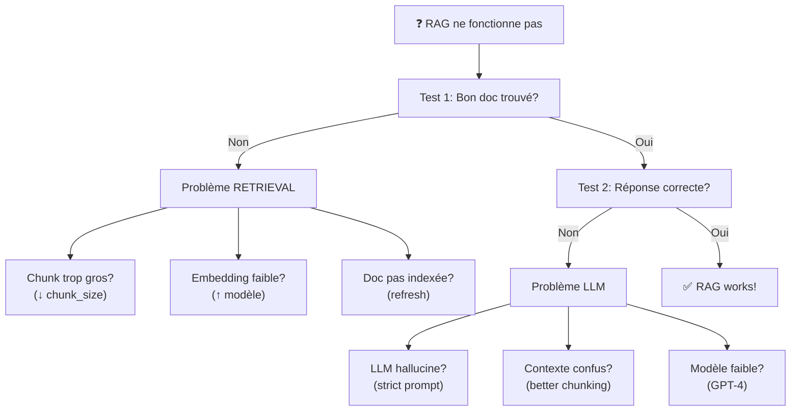

# Optimisation Avancée du RAG — Tuning, Évaluation, Monitoring

<span class="badge-expert">Expert</span>

Production RAG requires metrics, monitoring, continuous improvements.

## 1. ÉVALUATION & BENCHMARKING

### Métriques de Retrieval

```
Précision@K = (# chunks pertinents dans top-K) / K
Rappel = (# chunks pertinents trouvés) / (# chunks pertinents totaux)

Exemple:
  100 docs total
  Query: "Quoi Python ?"
  Top-5: [Python doc, Java, Fruits, C++, HTML]
  Pertinents: 2 (Python, C++)
  
  Precision@5 = 2/5 = 40%
  Recall = 2/2 = 100%
```

### Métriques de Generation

```
BLEU = n-gram overlap avec réponse "gold"
ROUGE = recall-oriented (sumarization)
F1 = harmonic mean precision/recall

Exemple: ROUGE = 80%, BLEU = 75%, F1 = 77%
```

### Golden Dataset

```python
golden_dataset = [
    {
        "question": "Réinitialiser mot de passe ?",
        "expected": "Settings > Security > Change Password",
        "source_docs": ["doc_42"],
        "metadata": {"category": "account", "difficulty": "easy"}
    },
    {
        "question": "Délai paiement ?",
        "expected": "Net-30 jours",
        "source_docs": ["contract.pdf#p5"],
        "metadata": {"category": "legal", "difficulty": "medium"}
    }
]

def evaluate_rag(qa_chain, golden_dataset):
    scores = {"precision": [], "recall": [], "f1": []}
    
    for case in golden_dataset:
        result = qa_chain({"query": case["question"]})
        
        precision, recall, f1 = compute_metrics(
            result['result'],
            case['expected']
        )
        
        scores['precision'].append(precision)
        scores['recall'].append(recall)
        scores['f1'].append(f1)
    
    return {k: sum(v)/len(v) for k, v in scores.items()}

# Day 1
metrics_v1 = evaluate_rag(rag_v1, golden_dataset)
# precision=0.62, recall=0.71, f1=0.66

# Day 2
metrics_v2 = evaluate_rag(rag_v2, golden_dataset)
# precision=0.84, recall=0.82, f1=0.83 ← +25% improvement!
```

---

## 2. TUNING EMPIRIQUE

### Chunk Size Optimization

```
Test chunk_size values:
  100 tokens: F1=0.68 (trop détaillé, perte contexte)
  256 tokens: F1=0.86 ✅ (sweet spot)
  512 tokens: F1=0.72 (trop générique)
  1024 tokens: F1=0.65 (contexte dilué)

→ Recommendation: 256-512 optimal range
```

### Embedding Model Selection

```
Benchmarks (F1 on golden_dataset):

all-MiniLM-L6-v2        F1=0.74, latency=5ms, cost=Free
all-mpnet-base-v2       F1=0.78, latency=20ms, cost=Free
textembedding-3-small   F1=0.83, latency=100ms, cost=$0.02/1M
textembedding-3-large   F1=0.87, latency=200ms, cost=$0.13/1M

Decision matrix:
  Latency critical? → all-MiniLM
  Quality critical? → textembedding-3-large
  Else? → all-mpnet (balanced)
```

### Top-K Tuning

```python
k_values = [1, 3, 5, 10, 20, 50]

for k in k_values:
    precision = evaluate_retrieval(vectorstore, golden_dataset, k)
    latency = measure_latency(retriever, k)
    
    print(f"k={k}: precision={precision:.2f}, latency={latency:.0f}ms")

# Output:
# k=1: precision=0.85 (misses context)
# k=3: precision=0.92, latency=50ms  ← Balanced
# k=5: precision=0.94, latency=80ms
# k=20: precision=0.96, latency=200ms (LLM overload)

# → Recommendation: k=3-5
```

---

## 3. CACHING & PERFORMANCE

### Prompt Caching (OpenAI)

```python
# Cache context for repeated queries
# 10x latency improvement, 100x cost reduction

client = OpenAI(cache_control_ephemeral=True, ttl_seconds=3600)

# First request (slow, writes cache)
context = "Very long context... 10K tokens..."
response = client.chat.completions.create(
    model="gpt-4",
    messages=[
        {"role": "system", "content": context},  # Cached
        {"role": "user", "content": "Question 1"}
    ]
)
# Time: 800ms, Tokens: 10K input

# Second request (fast, from cache)
response = client.chat.completions.create(
    model="gpt-4",
    messages=[
        {"role": "system", "content": context},  # From cache!
        {"role": "user", "content": "Question 2"}
    ]
)
# Time: 100ms (10x faster!), Tokens: ~100 (cache hit!)
```

### Redis Response Caching

```python
import redis
import json

redis_client = redis.Redis(host='localhost', port=6379)

def cached_rag_query(question: str, ttl_seconds: int = 3600):
    cache_key = f"rag:{hash(question)}"
    
    # Check cache
    cached = redis_client.get(cache_key)
    if cached:
        print(f"✓ Cache hit: {question}")
        return json.loads(cached)
    
    # Cache miss → full RAG
    print(f"✗ Cache miss, running RAG...")
    result = rag_chain({"query": question})
    
    # Store
    redis_client.setex(cache_key, ttl_seconds, json.dumps(result))
    
    return result

# Typical results:
# 70% cache hit rate (repeated questions)
# Latency range: 10ms (cache) to 800ms (full RAG)
```

---

## 4. SÉCURITÉ & COMPLIANCE

### PII Redaction

```python
import re

def sanitize_retrieval(document: str, query: str, user_id: str):
    # 1. Input validation
    suspicious = ["DROP TABLE", "DELETE", "<script>"]
    if any(kw in query for kw in suspicious):
        log_security_alert(f"Suspicious from {user_id}: {query}")
        return "Query blocked for security"
    
    # 2. PII redaction
    redacted = re.sub(r'\b\d{3}-\d{2}-\d{4}\b', '[SSN]', document)  # SSN
    redacted = re.sub(r'\b\d{16}\b', '[CARD]', redacted)  # Credit card
    
    # 3. Audit log
    log_access(
        user_id=user_id,
        query=query,
        timestamp=now(),
        document_id=document.metadata.get('id'),
        pii_redacted=len(redacted) < len(document)
    )
    
    return redacted
```

### GDPR Right to be Forgotten

```python
def delete_user_data(user_id: str, vectorstore):
    """Supprimer tous les docs d'un utilisateur (GDPR)"""
    
    docs = vectorstore.search_by_metadata({"user_id": user_id})
    
    for doc_id in docs:
        vectorstore.delete(doc_id)
    
    print(f"✓ Deleted {len(docs)} docs for user {user_id}")
```

---

## 5. DÉPANNAGE : Decision Tree



### Cas Réels

```python
# CASE 1: "Réponses toujours générales"
if avg_chunk_size > 512:
    print("❌ Chunks trop gros → Refactoriser")
    new_splitter = CharacterTextSplitter(chunk_size=256, overlap=50)

# CASE 2: "Cite bon passage mais réponse fausse"
result_no_rag = llm("Réinitialiser?")  # Seul
if "Settings" in result_no_rag:
    print("❌ LLM hallucine seul → Upgrade GPT-4")

# CASE 3: "10s latency, too slow"
t_ret = time_retrieval()
t_llm = time_llm()
print(f"Retrieval: {t_ret}s, LLM: {t_llm}s")
```

---

## 6. COÛTS COMPARATIFS

| Solution | Setup | Mensuel | Par Query | Scale |
|----------|-------|---------|-----------|-------|
| **ChromaDB local** | $0 | $0 | $0 | <100K docs |
| **Pinecone** | $0 | $25+ | $0.03-0.10 | ∞ |
| **Qdrant cloud** | $0 | $18-200 | $0.002 | ∞ |
| **Azure Cognitive** | $100 | $100-500 | $0.03-0.20 | ∞ |
| **AWS Kendra** | $0 | $2000+ | $0.30-1.0 | ∞ |

### ROI Calculation

```
Old: 1 FTE (HR) $50K/year answering FAQs
New: Pinecone $500/year + OpenAI $200/year = $700/year

Savings: $50K - $700 = $49,300/year
ROI Payback: < 1 week! 🎉
```

---

## 7. MONITORING TOOLS

### RAGAS (RAG Evaluation Framework)

```python
from ragas import evaluate

result = evaluate(
    dataset=dataset,
    llm=llm,
    embeddings=embeddings,
    metrics=[
        context_precision,
        context_recall,
        faithfulness,
        answer_relevancy,
    ]
)

# Outputs:
# context_precision: 0.82
# context_recall: 0.91
# faithfulness: 0.87
# answer_relevancy: 0.79
```

### Langsmith (LangChain Tracing)

Tracer requests LangChain, visualiser chains, debug issues.

Dashboard: https://smith.langchain.com/

### TruLens (RAG Observability)

```python
from trulens_eval import Tru, TruChain

tru = Tru()
tru_chain = TruChain(my_rag_chain)
tru.run_dashboard()  # Launch observability UI
```

---

### Sources

- **RAGAS Research Paper**: "Evaluating RAG Systems" (https://arxiv.org/abs/2309.15217)
- **OpenAI Prompt Caching**: Official docs (https://platform.openai.com/docs/)
- **Langsmith**: https://smith.langchain.com/
- **TruLens**: https://github.com/truera/trulens
- **Cohere Reranking**: https://docs.cohere.ai/docs/rerank

---

---

## Prochaines Étapes

Votre RAG est en production ? Continuez votre parcours IA :

### 📚 [Bonnes Pratiques](../chapitre-9-bonnes-pratiques/index.md)

### 💼 [Cas d'Usage Avancés](../chapitre-10-cas-usage/index.md)

### 🚨 [Troubleshooting](../chapitre-11-troubleshooting/index.md)

### 💰 [Coûts & Gouvernance](../chapitre-12-couts-gouvernance/index.md)

