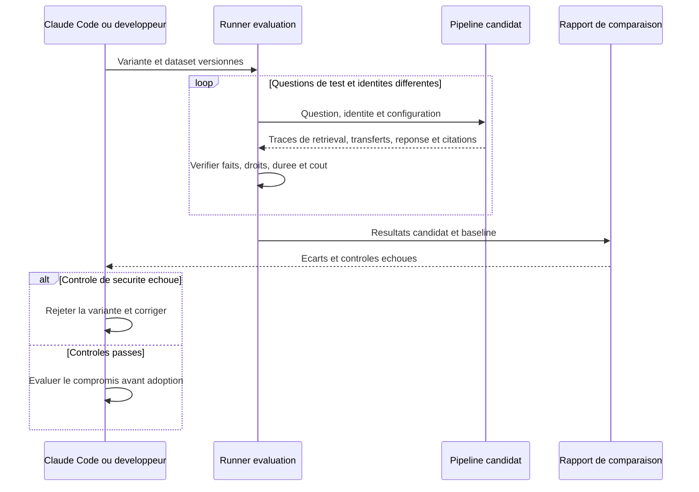

# Optimisation avancée du RAG — Évaluation, tuning et monitoring

<span class="badge-expert">Expert</span>

Optimiser un RAG signifie améliorer un compromis **qualité / latence / coût / sécurité** sur un dataset représentatif. Cette page retire les anciens « sweet spots » et gains chiffrés inventés : tout réglage doit être mesuré sur votre système.

---

## 1. Dataset d'évaluation versionné

```json
{
  "id": "auth-001",
  "question": "Comment renouveler un token expiré ?",
  "expected_sources": ["auth/token-reset.md"],
  "expected_facts": ["POST /token/refresh", "refresh token"],
  "metadata": {"category": "auth", "difficulty": "normal"}
}
```

Le dataset doit inclure :

- questions fréquentes ;
- formulations ambiguës ;
- cas sans réponse ;
- distracteurs ;
- versions/documents obsolètes ;
- cas de sécurité/ACL ;
- injections adversariales lorsque pertinent.

Gardez un jeu de test hors de la boucle de tuning si vous comparez beaucoup de variantes.

### Cycle d'une variante : diagramme de séquence UML

La qualité, la sécurité et la performance sont des contrôles distincts. Une meilleure réponse moyenne ne compense pas une fuite de document.


```mermaid
sequenceDiagram
    participant C as Claude Code ou developpeur
    participant E as Runner evaluation
    participant P as Pipeline candidat
    participant R as Rapport de comparaison
    C->>E: Variante et dataset versionnes
    loop Questions de test et identites differentes
        E->>P: Question, identite et configuration
        P-->>E: Traces de retrieval, transferts, reponse et citations
        E->>E: Verifier faits, droits, duree et cout
    end
    E->>R: Resultats candidat et baseline
    R-->>C: Ecarts et controles echoues
    alt Controle de securite echoue
        C->>C: Rejeter la variante et corriger
    else Controles passes
        C->>C: Evaluer le compromis avant adoption
    end
```

Le guide **[Sécurité du RAG](securite.md#10-tests-de-securite-prouver-aussi-les-refus)** fournit des cas de test pour les ACL, caches et injections documentaires.

---

## 2. Métriques retrieval

### Precision@k

Part des résultats top-k qui sont pertinents.

### Recall@k

Part des documents pertinents retrouvés dans top-k.

### MRR

Favorise les systèmes où le premier résultat pertinent arrive tôt.

### nDCG

Utile lorsqu'il existe plusieurs niveaux de pertinence.

Ne calculez pas « recall total » si vous ne connaissez pas l'ensemble des documents pertinents pour la question.

---

## 3. Métriques génération

Les métriques lexicales comme BLEU/ROUGE ne sont pas des métriques universelles de factualité RAG.

Évaluez plutôt selon le cas :

- exactitude des faits attendus ;
- citation correcte ;
- complétude ;
- refus lorsque les sources sont insuffisantes ;
- format/contrat ;
- évaluation humaine ou LLM-as-judge **calibré** si nécessaire.

Un judge LLM doit lui-même être validé sur un échantillon humain avant d'être traité comme ground truth.

---

## 4. Tuning du chunking

Au lieu de :

```text
256 tokens = optimal
```

faites :

```text
variants = [structurel, 256, 512, parent-child]
→ même corpus
→ même eval set
→ même retrieval config
→ comparer Recall@k + contexte moyen + latence
```

La bonne taille varie avec la structure documentaire et la question.

---

## 5. Tuning top-k

Mesurez deux niveaux :

```text
candidate_k = nombre de candidats récupérés
context_k   = nombre réellement transmis au LLM
```

Avec reranking, `candidate_k` peut être élevé tandis que `context_k` reste bas.

Tracez :

- Recall@candidate_k ;
- Precision/context quality à `context_k` ;
- tokens de contexte ;
- latence.

---

## 6. Comparer embeddings / retrievers

Matrice d'expérience :

```text
retriever_id
embedding_model
index_config
corpus_version
eval_version
Recall@5
MRR
p50/p95 latency
index size
estimated/observed cost
```

Ne recopiez pas les tarifs dans la doc : récupérez-les depuis le fournisseur au moment du benchmark.

---

## 7. Cache

Trois caches possibles :

### Embeddings

Éviter de recalculer les vecteurs d'un document inchangé.

### Retrieval

Réutiliser une recherche identique si corpus + ACL + config n'ont pas changé.

### Réponse

Plus risqué : la réponse dépend de l'identité, des droits, de la fraîcheur et du modèle.

Clé de cache conceptuelle :

```text
hash(query, tenant, permissions, corpus_version, pipeline_version)
```

Mesurez le hit rate avant d'annoncer un gain.

---

## 8. Latence par étape

Tracez séparément :

```text
query rewrite
embedding
lexical search
dense search
reranking
generation
post-validation
```

Sans breakdown, une « requête lente » ne permet pas de savoir où optimiser.

---

## 9. Coût

Calculez sur trafic réel ou simulé :

```text
embedding ingestion
embedding query
retrieval infra
reranker
generation input/output
caches
observability
retries
```

Conservez un script/tableur versionné avec les hypothèses et la date des tarifs.

---

## 10. Monitoring qualité en production

Tous les signaux ne disposent pas immédiatement d'un ground truth.

Surveillez :

- absence de résultats ;
- changements de distribution des requêtes ;
- documents souvent cités ;
- taux d'escalade ;
- feedback explicite ;
- erreurs/outages ;
- latence ;
- régressions sur golden set à chaque release.

Lorsque le ground truth arrive plus tard, reliez-le aux traces du run correspondant.

---

## 11. Expériences contrôlées

Une bonne expérience :

```text
Hypothèse : le reranker améliorera MRR sur les requêtes techniques.
Variable : reranker on/off.
Constant : corpus, embeddings, candidate_k, prompt, model.
Critère : +X défini par l'équipe avec régression latence acceptable.
```

La valeur `X` doit venir des besoins produit, pas de cette documentation.

---

## 12. Claude Code pour automatiser les evals

```text
Exécute la matrice d'expériences définie dans `evals/config.yaml`.
Pour chaque variante :
- conserve la config ;
- exécute les mêmes questions ;
- stocke résultats bruts ;
- calcule les métriques ;
- produis un tableau comparatif.
Ne modifie pas l'eval set pendant l'expérience.
```

Un skill peut encapsuler cette procédure pour la CI.

---

## 13. CI de non-régression

Sur chaque changement RAG significatif :

1. tests unitaires ;
2. petit eval set rapide ;
3. sécurité/ACL ;
4. benchmark complet en job séparé si nécessaire.

Ne bloquez pas toutes les PR sur un benchmark coûteux si un smoke eval suffit pour le feedback immédiat.

---

## Sources

- [Anthropic — Writing effective tools for agents](https://www.anthropic.com/engineering/writing-tools-for-agents) — consulté le 2026-09-28
- [Anthropic — Building effective agents](https://www.anthropic.com/engineering/building-effective-agents) — consulté le 2026-09-28
- [Anthropic — Effective context engineering](https://www.anthropic.com/engineering/effective-context-engineering-for-ai-agents) — consulté le 2026-09-28

## Prochaine étape

Poursuivez avec **[Bonnes Pratiques — Accueil](../chapitre-9-bonnes-pratiques/index.md)**, la page suivante dans le menu.
