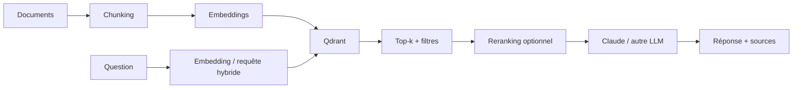

# Qdrant — moteur vectoriel pour le RAG

<span class="badge-intermediate">Intermédiaire</span>

**Qdrant** est un moteur de recherche vectorielle et sémantique orienté applications IA. Dans une architecture RAG, il sert principalement à **stocker les représentations vectorielles**, filtrer les documents par métadonnées et retrouver les passages pertinents avant la génération.

!!! info "Pourquoi Qdrant est dans le chapitre RAG"
    Qdrant n'est ni un LLM ni un framework d'agents. Sa place naturelle est la couche **retrieval** : ingestion → indexation → recherche → passages pertinents → génération.

---

## Où Qdrant se place



Qdrant stocke des **points** associant vecteurs et payloads. Les payloads servent à conserver les métadonnées utiles au filtrage : tenant, type de document, langue, droits, date, catégorie, etc.

---

## Recherche dense, sparse et hybride

Qdrant supporte plusieurs représentations pour un même objet. Cela permet notamment de combiner :

- **dense vectors** pour la proximité sémantique ;
- **sparse vectors** pour la pertinence lexicale ;
- filtres metadata ;
- requêtes multi-étapes et reranking.

La recherche hybride est utile lorsqu'une requête doit retrouver à la fois :

- des concepts proches sémantiquement ;
- des identifiants ou termes exacts ;
- des documents respectant des contraintes métier.

Exemple : une recherche `facture timeout 504` peut bénéficier à la fois du sens global de la requête et du terme exact `504`.

---

## Filtrage par payload

Un embedding ne doit pas porter à lui seul toutes les contraintes métier.

Utilisez les filtres pour imposer des conditions explicites :

```text
tenant = acme
AND language = fr
AND document_type = procedure
AND visibility = internal
```

Qdrant permet de combiner des conditions `AND`, `OR` et `NOT`. Pour les champs fréquemment filtrés, la documentation recommande de créer des **payload indexes** afin d'éviter un coût inutile sur les requêtes filtrées.

!!! warning "Sécurité ≠ simple filtre applicatif"
    Dans un RAG multi-utilisateur, l'autorisation doit être appliquée **avant** de fournir les passages au modèle. Ne comptez jamais sur Claude pour ignorer un document qu'il n'aurait pas dû recevoir.

---

## API de recherche actuelle

Pour les nouveaux exemples Python, utilisez `client.query_points(...)` (Query API) : `prefetch` définit les candidats dense/sparse et la requête principale leur fusion ou reranking. L’API couvre aussi les requêtes multi-étapes ; ne supposez pas que les snippets historiques `client.search(...)` fonctionnent dans votre SDK verrouillé.

Appliquez les filtres d’autorisation à **chaque branche de prefetch**, puis à toute récupération des parents ou des documents complets. Ne faites pas confiance à un `tenant_id` fourni directement par le modèle : le service doit le déduire de l’identité authentifiée. Gardez la même convention de distance et le même modèle d’embeddings entre ingestion et requêtes.

[Qdrant — Query API et fusion](https://qdrant.tech/documentation/search/hybrid-queries/), revérifiés le 3 octobre 2026.

## Qdrant et Claude Code

Claude Code peut intervenir comme **outil de développement et d'exploitation** du pipeline :

1. cartographier ingestion, embeddings et collections ;
2. écrire ou corriger les scripts d'indexation ;
3. ajouter les payloads et filtres nécessaires ;
4. construire un jeu d'évaluation ;
5. comparer retrieval dense, sparse et hybride ;
6. analyser les faux positifs/faux négatifs ;
7. automatiser les tests de non-régression du retrieval.

Claude Code ne remplace pas le moteur de retrieval : il aide à **concevoir, instrumenter et vérifier** son utilisation.

---

## Qdrant et MCP

Deux architectures sont possibles :

```text
Application RAG ──SDK/API──> Qdrant
```

ou, pour un agent qui doit interroger une source à la demande :

```text
Claude Code ──MCP / outil interne──> service de retrieval ──> Qdrant
```

Dans le second cas, exposez à l'agent un outil de haut niveau (`search_docs`, `get_document`, etc.) plutôt que l'administration complète de la base.

Cela réduit :

- la surface de permissions ;
- la complexité des appels ;
- le risque de suppression/modification accidentelle ;
- le bruit dans le contexte.

---

## Qdrant vs Graphify

Ces deux outils répondent à des problèmes différents :

| Besoin | Qdrant | Graphify |
|---|---:|---:|
| Similarité sémantique | ✅ | secondaire |
| Recherche dense/sparse | ✅ | ❌ |
| Filtres metadata | ✅ | selon graphe/import |
| Relations explicites entre symboles/concepts | ❌ | ✅ |
| Chemins entre entités | ❌ | ✅ |
| RAG documentaire classique | ✅ | complément possible |
| Code intelligence structurée | complément | ✅ |

Une architecture peut combiner les deux : Qdrant pour le **retrieval sémantique**, Graphify pour la **navigation relationnelle**.

---

## Quand choisir Qdrant

Qdrant est pertinent si vous avez besoin de :

- recherche sémantique sur un corpus important ;
- filtres metadata riches ;
- hybrid search dense + sparse ;
- plusieurs représentations vectorielles par document ;
- contrôle sur le stockage et l'architecture du retrieval.

Il est probablement excessif si :

- le corpus tient dans quelques fichiers directement lisibles par l'agent ;
- une recherche lexicale simple suffit ;
- vous n'avez pas encore de jeu d'évaluation ;
- vous ajoutez une base vectorielle uniquement « parce qu'un RAG doit en avoir une ».

---

## Checklist de mise en production

- [ ] corpus et droits d'accès définis ;
- [ ] stratégie de chunking mesurée ;
- [ ] modèle d'embeddings versionné ;
- [ ] payloads et filtres documentés ;
- [ ] indexes créés sur les champs fréquemment filtrés ;
- [ ] jeu d'évaluation retrieval séparé de l'évaluation LLM ;
- [ ] sauvegarde/restauration testées ;
- [ ] métriques de latence et qualité suivies ;
- [ ] secrets et endpoint protégés ;
- [ ] procédure de réindexation documentée.

---

## Sources

Sources officielles consultées le **28 septembre 2026** :

- [Qdrant — Documentation](https://qdrant.tech/documentation/)
- [Qdrant — Hybrid Search](https://qdrant.tech/documentation/search/text-search/hybrid-search/)
- [Qdrant — Hybrid and Multi-Stage Queries](https://qdrant.tech/documentation/search/hybrid-queries/)
- [Qdrant — Filtering](https://qdrant.tech/documentation/search/filtering/)
- [Qdrant — Fundamentals / FAQ](https://qdrant.tech/documentation/faq/)

## Prochaine étape

Poursuivez avec **[Implémentation (Basic→Expert) — Présentation](implementation.md)**, la page suivante dans le menu.
