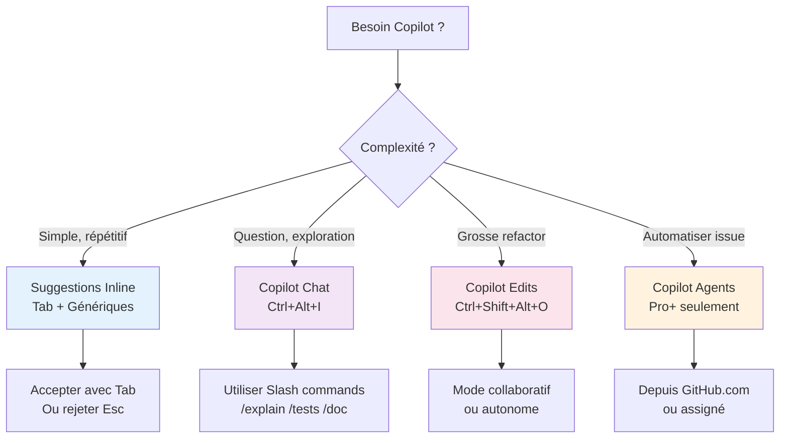
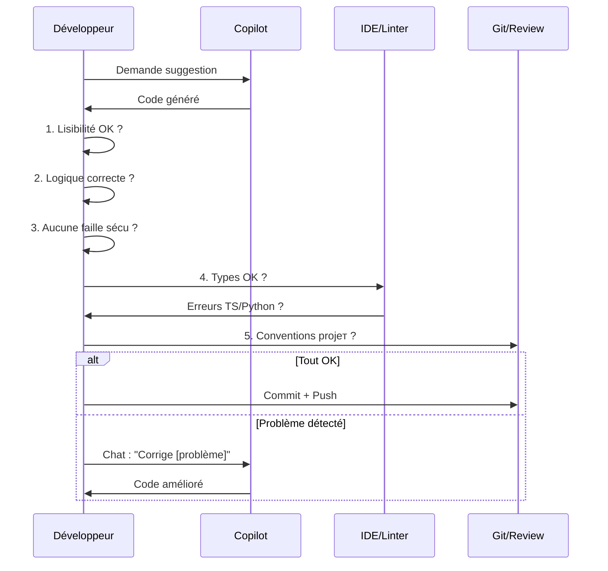

# Utilisation Effective de GitHub Copilot

<span class="badge-intermediate">Intermédiaire</span>

## Guide Décisionnel : Quand utiliser quoi ?

Avant de commencer, choisissez le bon outil pour votre tâche :



---

## Écrire des prompts efficaces (commentaires)

La façon la plus efficace de guider Copilot pour les suggestions inline est d'écrire des **commentaires précis** avant votre code.

### La technique du commentaire-prompt

```python
# ❌ Trop vague — Copilot génère quelque chose de générique
# Fonction pour les utilisateurs

# ✅ Précis et contextualisé — Copilot génère quelque chose d'utile
# Filtre les utilisateurs actifs (status='active') créés dans les 30 derniers jours
# Retourne une liste triée par date de création décroissante
# Paramètre: users (List[User]) — liste complète des utilisateurs
def get_recent_active_users(users: list[User]) -> list[User]:
```

### Niveau de détail recommandé

| Niveau | Quand l'utiliser | Exemple |
|--------|-----------------|---------|
| **Minimal** | Code très simple et évident | `# Validation de l'email` |
| **Modéré** | Code avec logique spécifique | `# Validate email format with regex, return bool` |
| **Détaillé** | Code complexe ou non-standard | Décrivez inputs, outputs, edge cases, algo attendu |
| **Préconditions** | Fonctions critiques | Listez les hypothèses (`# Assume user.id is always a valid UUID`) |

---

## Techniques avancées de prompting inline

### 1. Décrire l'algorithme attendu

```typescript
// Algorithme de Dijkstra pour trouver le chemin le plus court
// entre deux noeuds dans un graphe orienté pondéré
// Complexité : O((V + E) log V) avec min-heap
// Retourne le tableau des noeuds du chemin + le coût total
function dijkstra(graph: Graph, start: string, end: string): PathResult {
```

### 2. Donner des exemples d'entrée/sortie

```javascript
// Convertit un objet imbriqué en QueryString URL
// Ex: {user: {name: "Alice", age: 30}, active: true}
// →   "user[name]=Alice&user[age]=30&active=true"
function toQueryString(obj, prefix = '') {
```

### 3. Spécifier les contraintes de performance

```java
// Recherche binaire dans un tableau trié d'entiers
// O(log n) — NE PAS utiliser de recherche linéaire
// Retourne l'index ou -1 si absent
// Tableau garanti trié en ordre croissant sans doublons
public int binarySearch(int[] sortedArray, int target) {
```

### 4. Références à du code existant

```typescript
// Même pattern que UserRepository.findByEmail()
// mais pour la recherche par phone number
// Utiliser la même gestion d'erreurs (UserNotFoundException)
async findByPhoneNumber(phone: string): Promise<User> {
```

---

## Copilot Chat : meilleures pratiques de prompting

### Commencer par un mini-PRD

!!! info "C'est quoi un PRD ?"
    Un **PRD** (Product Requirements Document — Document de Spécifications Produit) est un document structuré qui décrit **ce qu'un logiciel doit faire, pour qui, et pourquoi**. Historiquement rédigé par un Product Manager à destination des équipes techniques, il formalise les besoins avant toute ligne de code.

    **Dans le contexte Copilot**, un mini-PRD sert de *prompt de haut niveau* : il donne à l'IA suffisamment de contexte pour générer du code cohérent et aligné avec vos intentions, au lieu de deviner.

    Un PRD complet contient typiquement :
    
    - **Contexte** : pourquoi cette fonctionnalité existe
    - **Utilisateurs cibles** : qui va s'en servir
    - **Périmètre fonctionnel** : ce qui doit être fait (et ce qui est hors périmètre)
    - **Critères d'acceptation** : comment vérifier que c'est réussi
    - **Contraintes** : techniques, de performance, de sécurité

Avant de demander du code, formalisez un mini-PRD en 5 points :

1. Objectif produit
2. Utilisateurs concernés
3. Contraintes techniques
4. Critères d'acceptation
5. Cas limites

Template rapide :

```markdown
## PRD court
- Objectif: ...
- Utilisateurs: ...
- Contraintes: ...
- Acceptance criteria:
   - [ ] ...
   - [ ] ...
- Cas limites:
   - ...
```

Puis demandez à Copilot de proposer le plan d'implémentation avant d'écrire le code.

### Structurer les demandes complexes

```
❌ "Fais un CRUD pour les utilisateurs"

✅ "Crée une API REST CRUD pour les utilisateurs avec :
   - Express + TypeScript
   - Validation avec Zod (schema User : id UUID, email, name, role: ADMIN|USER)
   - Gestion d'erreurs avec mes classes custom dans src/errors/
   - Tests Jest (happy path + erreurs)
   - Pas de `any`, TypeScript strict
   Suis les patterns de src/controllers/ProductController.ts"
```

### Itération efficace

```
Tour 1 → "Génère le service UserService avec les 5 méthodes CRUD"
Tour 2 → "Ajoute la validation métier : email unique, role ne peut pas être 
          modifié par l'utilisateur lui-même"
Tour 3 → "Ajoute des tests pour les cas d'erreur"
Tour 4 → "Refactorise pour extraire la logique de validation dans 
          un validateur séparé"
```

---

## Slash Commands — Référence Complète

Les **slash commands** sont des raccourcis de prompt intégrés à Copilot Chat qui déclenchent des comportements spécifiques. Tapez `/` dans le champ de saisie pour voir la liste contextuelle.

| Commande | Ce qu'elle fait | Exemple d'utilisation |
|----------|----------------|----------------------|
| `/explain` | Explique le code sélectionné ou demandé, étape par étape | `Sélectionner une fonction → /explain` |
| `/tests` | Génère des tests unitaires pour le code sélectionné | `/tests Génère les tests Jest avec happy path et cas d'erreur` |
| `/doc` | Génère la documentation (JSDoc, docstring, Javadoc) | `Sélectionner une classe → /doc` |
| `/fix` | Analyse et corrige un bug ou une erreur | `Coller le stack trace → /fix` |
| `/new` | Crée un nouveau projet ou fichier depuis zéro | `/new API Express TypeScript avec authentification JWT` |
| `/newNotebook` | Crée un nouveau Jupyter Notebook | `/newNotebook Analyse exploratoire d'un CSV pandas` |
| `/terminal` | Explique ou suggère une commande terminal | `/terminal Comment lister les ports ouverts sur Windows ?` |
| `/search` | Recherche dans la documentation ou le workspace | `/search Où est configuré le middleware Express ?` |
| `/clear` | Efface la conversation Chat en cours | — |

!!! tip "Combiner slash command + contexte"
    Les slash commands sont encore plus puissantes avec du contexte explicite :
    ```
    /tests #file:src/services/UserService.ts
    Couvre : création, mise à jour, suppression, et le cas email dupliqué.
    ```
    ```
    /fix #selection
    L'erreur est : "Cannot read property 'id' of undefined" à la ligne 45.
    ```

!!! info "Slash commands dans IntelliJ"
    Dans le plugin Copilot pour IntelliJ IDEA, les slash commands sont disponibles dans le panel **GitHub Copilot Chat**. La liste des commandes disponibles peut varier légèrement selon la version du plugin. Utilisez `/explain`, `/tests` et `/fix` — ce sont les plus stables cross-IDE.

---

## Variables de Contexte dans Copilot Chat

Dans Copilot Chat, utilisez des **variables de contexte** pour cibler précisément ce que l'IA doit analyser. Elles remplacent les longues descriptions textuelles par des références directes à votre code.

### Participants (préfixe `@`)

| Variable | Portée | Cas d'usage typique |
|----------|--------|---------------------|
| `@workspace` | Tout le projet | Rechercher un pattern, comprendre l'architecture, trouver où quelque chose est défini |
| `@vscode` | VS Code lui-même | Paramètres, extensions, raccourcis, configuration de l'éditeur |
| `@terminal` | Terminal actif | Expliquer la sortie d'une commande, diagnostiquer une erreur shell |

**Exemples concrets :**
```
@workspace Où est définie la logique de validation des commandes ?
@workspace Comment les erreurs HTTP sont-elles gérées dans ce projet ?
@vscode Comment configurer le lint on save pour ce projet ?
@terminal L'erreur ci-dessus vient de quelle dépendance ?
```

### Variables de fichiers (préfixe `#`)

| Variable | Ce qu'elle inclut | Quand l'utiliser |
|----------|------------------|------------------|
| `#file` | Contenu d'un fichier spécifique | Analyser, expliquer, tester un fichier précis |
| `#selection` | Code actuellement sélectionné | Refactorer, fixer, expliquer une portion de code |
| `#codebase` | Index sémantique du projet entier | Questions d'architecture, recherches transversales |
| `#sym` | Définition d'un symbole (fonction, classe) | Comprendre une API interne, trouver des usages |

**Exemples concrets :**
```
Refactorise #file:src/services/OrderService.ts pour extraire la validation dans un fichier séparé
/tests #file:src/utils/dateUtils.ts — couvre les cas de timezone et de date invalide
Explique le rôle de #sym:UserAuthMiddleware dans le flow d'authentification
Comment #selection interagit-il avec le cache Redis ?
```

!!! tip "Stratégie : moins de contexte = meilleures réponses"
    Donnez à Copilot Chat **le minimum de contexte nécessaire**, pas tout le projet. `#file:mon-service.ts` est plus efficace que `@workspace` pour des questions localisées. Réservez `@workspace` ou `#codebase` pour les questions transversales.

---

## Next Edit Suggestions (NES)

**Next Edit Suggestions** est une fonctionnalité de Copilot qui anticipe où vous allez modifier votre code ensuite, et propose une suggestion à cet endroit — même si votre curseur n'y est pas encore.

### Comment ça fonctionne

Après avoir accepté ou écrit une modification, Copilot analyse le contexte et identifie les endroits du fichier qui sont probablement à mettre à jour en conséquence (exemple : vous renommez un paramètre dans une signature → NES propose de le renommer dans le corps de la fonction).

Une flèche indique la prochaine suggestion dans la gouttière de l'éditeur.

### Activation (VS Code)

```json
// .vscode/settings.json
{
    "github.copilot.nextEditSuggestions.enabled": true
}
```

Ou via ++ctrl+shift+p++ → `Preferences: Open Settings` → rechercher `nextEditSuggestions`.

### Raccourcis NES

| Action | Raccourci Windows/Linux | Raccourci macOS |
|--------|------------------------|-----------------|
| Naviguer vers la suggestion suivante | ++tab++ (depuis la flèche) | ++tab++ |
| Accepter la suggestion | ++tab++ (au niveau de la suggestion) | ++tab++ |
| Ignorer et continuer | ++escape++ | ++escape++ |

### Cas d'usage typiques

- Renommer un paramètre → NES met à jour toutes ses occurrences dans la fonction
- Changer un type → NES adapte les usages du type
- Ajouter un champ à une interface → NES propose de l'initialiser dans le constructeur
- Modifier une signature de méthode → NES adapte les appels dans le même fichier

!!! info "NES vs refactoring IDE"
    NES n'est pas un refactoring classique (qui gère tous les fichiers du projet). C'est une suggestion contextuelle dans le *fichier courant*. Pour un renommage global, utilisez ++f2++ (Rename Symbol) dans VS Code ou ++shift+f6++ dans IntelliJ.

---

## Copilot Edits : Modifications Multi-Fichiers

Copilot Edits est le mode de Copilot conçu pour les **modifications qui touchent plusieurs fichiers simultanément**. Contrairement au Chat (conversationnel) ou aux suggestions inline (locales), Edits peut proposer des changements cohérents à travers votre codebase.

### Ouvrir Copilot Edits

=== ":material-microsoft-visual-studio-code: VS Code"
    ++ctrl+shift+alt+i++ (Windows/Linux) ou ++cmd+shift+alt+i++ (macOS)
    
    Ou : Copilot Chat → icône ✏️ **Edits**

=== ":simple-intellijidea: IntelliJ IDEA"
    Panel GitHub Copilot → bouton **Edit** (disponible depuis la version 1.5+ du plugin)

### Le Working Set

Avant de lancer une session Edits, vous définissez un **Working Set** : la liste des fichiers que Copilot est autorisé à modifier.

```
Working Set recommandé pour une fonctionnalité :
  ✓ Le fichier service  (ex: UserService.ts)
  ✓ Le fichier controller associé (UserController.ts)
  ✓ Les types/interfaces (types/User.ts)
  ✓ Le fichier de tests (UserService.test.ts)
  ✗ Pas les fichiers non liés — limitez le périmètre
```

### Mode Collaboratif vs Mode Autonome

| Mode | Comportement | Quand l'utiliser |
|------|-------------|------------------|
| **Collaboratif** | Copilot propose les changements, vous acceptez fichier par fichier | Modifications complexes où vous voulez contrôler chaque étape |
| **Autonome (Agent)** | Copilot applique les changements, exécute les tests, itère | Tâches répétitives bien définies (ex: "Migre tous les callbacks en async/await") |

### Workflow typique en mode Collaboratif

```
1. Ouvrir Copilot Edits (++ctrl+shift+alt+i++)
2. Ajouter les fichiers au Working Set
3. Décrire la modification :
   "Ajoute la gestion du champ `deletedAt` (soft delete) à UserService.
    Mets à jour le type User, le service, et les tests associés."
4. Copilot propose les modifications pour chaque fichier
5. Reviewer fichier par fichier → Accepter / Rejeter / Modifier
6. Committer le résultat
```

!!! warning "Vérifiez toujours le Working Set"
    En mode autonome, Copilot peut modifier des fichiers supplémentaires qu'il juge pertinents. Vérifiez toujours la liste des fichiers modifiés avant de committer — c'est votre responsabilité de valider l'ensemble.

---

## Quand accepter une suggestion

### Checklist avant d'accepter

- [ ] **Logique correcte** : La suggestion fait exactement ce que vous vouliez ?
- [ ] **Nommage cohérent** : Les noms respectent les conventions du projet ?
- [ ] **Pas d'effets de bord** : La fonction ne modifie pas d'état global inattendu ?
- [ ] **Gestion des erreurs** : Les cas d'erreur sont traités ?
- [ ] **Imports** : Les imports nécessaires sont inclus ou à ajouter ?
- [ ] **Pas de secrets** : Aucune valeur hardcodée qui devrait être une variable ?

### Quand accepter sans hésiter

- Code utilitaire simple (formatage de dates, utilitaires de chaînes)
- Boilerplate standard du langage/framework (getters/setters, constructeurs)
- Code que vous connaissez bien et pouvez vérifier rapidement
- Suggestions courtes (1-3 lignes) où le problème est évident

### Quand vérifier attentivement

- Logique métier complexe
- Code de sécurité (auth, crypto, validation d'entrées)
- Requêtes SQL ou accès base de données
- Algorithmes complexes (tri, graphe, cryptographie)
- Gestion de concurrence / async

### Quand rejeter (++escape++)

- La suggestion ne correspond pas à l'intention
- Le code semble "plausible" mais incorrect logiquement
- Utilisation d'API dépréciées ou incorrectes pour votre version
- Duplication de code déjà existant dans le projet

---

## Itération et raffinement

### Technique 1 : Acceptation partielle

Au lieu d'accepter toute une suggestion, acceptez **mot par mot** avec ++ctrl+right++ (++option+right++ sur macOS). Cela vous permet de garder le début d'une suggestion et de modifier la fin.

### Technique 2 : Suggestions alternatives

Si la première suggestion ne convient pas :
- Appuyez sur ++alt+bracket-right++ pour voir la suggestion suivante
- Il peut y avoir jusqu'à 10 alternatives — explorez-les avant de rejeter

### Technique 3 : Correction et re-suggestion

1. Acceptez une suggestion imparfaite
2. Corrigez manuellement la partie incorrecte
3. Positionnez le curseur à la fin de votre correction
4. Copilot va générer une nouvelle suggestion cohérente avec votre correction

### Technique 4 : Partial completion + Chat

1. Acceptez le début d'une fonction générée par Copilot
2. Ouvrez Copilot Chat (++ctrl+i++) sur le code incomplet
3. Demandez : "*Complète cette fonction en ajoutant la gestion de [cas spécifique]*"

---

## Valider le Code Généré

**Principe clé** : Vous êtes **toujours responsable** du code que vous committez. Copilot est un assistant, pas un garant de qualité.

### Flow de Validation



### Checklist de Validation

Avant d'accepter une suggestion, demandez-vous :

| Aspect | Question | Action si ❌ |
|--------|----------|------------|
| **Lisibilité** | Je comprends ce que ce code fait ? | Rejeter, demander à Copilot Chat |
| **Logique** | La logique répond exactement ma demande ? | Corriger manuellement ou utiliser Edits |
| **Sécurité** | Pas d'injection SQL, XSS, ou secrets ? | Rejeter immédiatement |
| **Types** | Types corrects pour mon contexte ? | Laisser IDE proposer fixes |
| **Perfs** | Pas de boucles infinies ou N+1 queries ? | Revoir algorithme |
| **Tests** | Ce code a besoin de tests ? | Générer avec Copilot `/tests` |
| **Conventions** | Respecte le style du projet ? | Utiliser formatters (Prettier, Black) |

!!! danger "Sécurité — Points d'attention"
    - ❌ **Jamais** accepter un code avec secrets/API keys en dur
    - ❌ **Jamais** faire confiance à des requêtes SQL construites par string concat
    - ❌ **Toujours** valider les inputs utilisateur avant utilisation
    - ❌ **Toujours** utiliser parameterized queries/prepared statements
    - ✅ **Utiliser** git hooks (pre-commit) pour bloquer les secrets

---

## Copilot dans le workflow Git

### Messages de commit avec Copilot

Dans VS Code Source Control :
1. Cliquez sur l'icône ✨ dans le champ de message de commit
2. Copilot analyse vos changements et génère un message descriptif
3. Modifiez si nécessaire avant de committer

### Revue de code avec Copilot Chat

Avant de pousser un PR :
```
@workspace Fais une revue de code des fichiers que j'ai modifiés. 
Cherche les bugs potentiels, les problèmes de sécurité et les 
violations de nos conventions (voir .github/copilot-instructions.md)
```

### Génération de description de PR

```
J'ai modifié les fichiers [liste]. Génère une description de Pull Request 
incluant : quoi a changé, pourquoi, comment tester ces changements, 
et les risques potentiels.
```

---

## En résumé

- **Commentaire = prompt** : plus votre commentaire est précis, meilleure est la suggestion
- **Le mini-PRD** (Product Requirements Document) formalise votre besoin avant de coder — il améliore nettement la qualité du code généré par Copilot Chat
- **Slash commands** `/explain`, `/tests`, `/fix`, `/doc` : des raccourcis de prompt pour les tâches courantes
- **Variables de contexte** `#file`, `#selection`, `@workspace` : donnez à Copilot exactement le bon périmètre
- **NES** (Next Edit Suggestions) : laissez Copilot anticiper vos prochaines modifications avec `Tab`
- **Copilot Edits** pour les modifications multi-fichiers : définissez un Working Set et choisissez le mode collaboratif ou autonome
- **Acceptez de manière sélective** : mot par mot (++ctrl+right++) pour garder le contrôle
- **Explorez les alternatives** avec ++alt+bracket-right++ avant de rejeter une suggestion

---

## Prochaine étape

**[Organisation du Code](organisation-code.md)** : structurer votre code pour que Copilot comprenne votre domaine et génère des suggestions précises.

Concepts clés couverts :

- **Nommage expressif** — `activeAdultUsers` > `x`, les noms parlants génèrent de meilleures suggestions
- **Typage explicite** — interfaces TypeScript, annotations Python, Javadoc : le typage est du contexte
- **Séparation des responsabilités** — un fichier, une responsabilité pour guider Copilot
- **`.github/copilot-instructions.md`** — configurer les conventions du projet une fois, Copilot les applique toujours
- **`COPILOT.md`** — documenter l'architecture pour que Copilot comprenne vos décisions techniques
