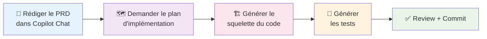
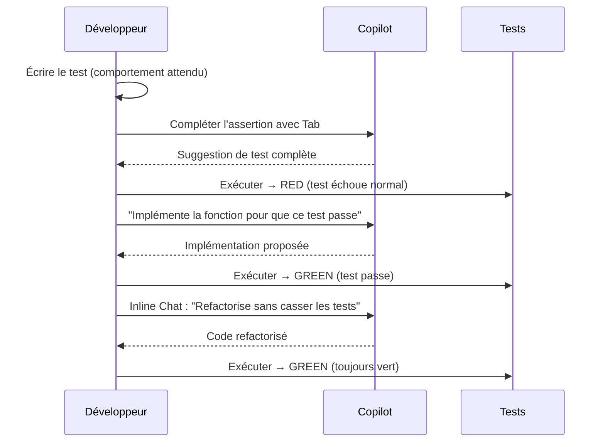
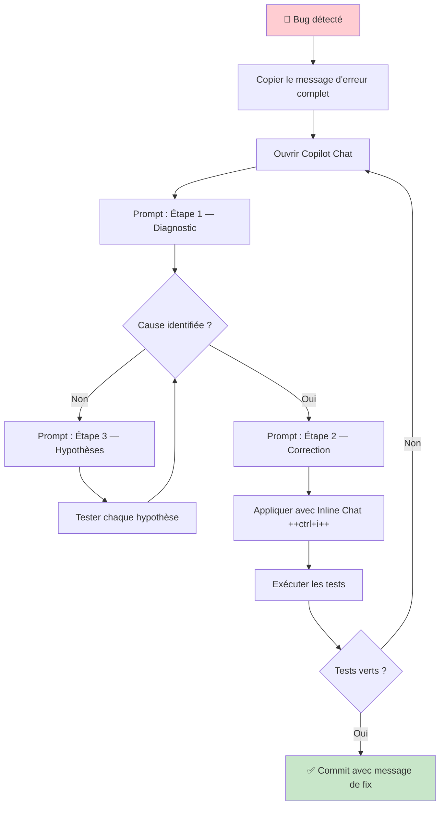

# Workflows IA Complets

<span class="badge-intermediate">Intermédiaire</span>
<span class="badge-expert">Expert</span>

Copilot ne se limite pas à l'autocomplétion ligne par ligne. Utilisé stratégiquement, il peut accompagner **tout le cycle de développement** : de la spécification jusqu'au commit. Cette page présente des workflows bout en bout éprouvés.

---

## Workflow 1 : PRD-Driven Development

Le **PRD-Driven Development** consiste à formaliser un besoin sous forme de Product Requirements Document avant d'écrire la moindre ligne de code, puis à utiliser ce PRD comme point d'entrée pour Copilot.

!!! info "Rappel : C'est quoi un PRD ?"
    Un **PRD** (Product Requirements Document) est un document structuré qui décrit **ce qu'un logiciel doit faire, pour qui, et pourquoi**. Dans le contexte Copilot, il sert de brief de haut niveau qui donne à l'IA les informations nécessaires pour générer du code cohérent et aligné avec vos intentions.

### Le workflow en 5 étapes



### Étape 1 — Rédiger le mini-PRD dans Copilot Chat

Ouvrez Copilot Chat et rédigez votre PRD directement dans la conversation :

```markdown
## PRD — Système de notifications email

**Contexte** : Notre application e-commerce doit envoyer des notifications
automatiques aux clients à chaque changement de statut de commande.

**Utilisateurs cibles** : Clients finaux (B2C), tous niveaux tech

**Fonctionnalités requises** :
- Envoi d'email à chaque transition de statut (PENDING → CONFIRMED → SHIPPED → DELIVERED)
- Template HTML personnalisable par statut
- File d'attente avec retry (max 3 tentatives, backoff exponentiel)
- Logging de chaque envoi dans la table `email_logs`

**Contraintes techniques** :
- Node.js + TypeScript strict
- Redis pour la file d'attente (BullMQ)
- Provider email : Resend API
- Tests Jest, coverage ≥ 80%

**Critères d'acceptation** :
- [ ] Un email est envoyé dans les 30 secondes suivant un changement de statut
- [ ] En cas d'échec, le système retente 3 fois avec backoff exponentiel
- [ ] Chaque email envoyé est tracé dans `email_logs` avec timestamp et statut
- [ ] Les templates sont stockés hors du code (fichiers .html)

**Hors périmètre** : SMS, push notifications, emails marketing
```

### Étape 2 — Demander le plan d'implémentation

Avant tout code, demandez à Copilot de valider et structurer le plan :

```
Sur la base de ce PRD, propose un plan d'implémentation :
1. Liste des fichiers à créer/modifier
2. Dépendances à installer
3. Ordre d'implémentation recommandé
4. Points de risque technique à anticiper

Ne génère pas de code encore — seulement le plan.
```

Copilot va produire quelque chose comme :

```
Fichiers à créer :
├── src/notifications/
│   ├── NotificationService.ts     ← Service principal
│   ├── EmailQueue.ts              ← File BullMQ
│   ├── EmailSender.ts             ← Appels Resend API
│   └── templates/
│       ├── order-confirmed.html
│       ├── order-shipped.html
│       └── order-delivered.html
├── src/models/EmailLog.ts         ← Type du log
└── src/__tests__/
    └── NotificationService.test.ts

Dépendances : bullmq, resend, @types/bullmq

Ordre : EmailSender → EmailQueue → NotificationService → Tests

Risques : Rate limiting Resend (100 emails/s), typage des templates HTML
```

**Validez ce plan avant de continuer.** Modifiez-le si nécessaire.

### Étape 3 — Générer le squelette du code

Une fois le plan validé, générez fichier par fichier :

```
Implémente EmailSender.ts.
Contexte : #file:src/config/resend.ts #file:src/models/EmailLog.ts
Respecte le plan ci-dessus.
Utilise Resend SDK v2.
```

Puis :

```
Implémente EmailQueue.ts.
Utilise BullMQ avec les types de #file:src/notifications/EmailSender.ts
Retry : 3 fois, backoff exponentiel (1s, 4s, 16s)
```

### Étape 4 — Générer les tests

```
/tests #file:src/notifications/NotificationService.ts
Couvre :
- Envoi réussi (mock Resend API)
- Retry après 3 échecs
- Logging dans email_logs
- Statuts : PENDING, CONFIRMED, SHIPPED, DELIVERED
```

### Étape 5 — Review et Commit

```
@workspace Fais une revue de la nouvelle feature notifications.
Vérifie : sécurité (secrets dans le code ?), gestion d'erreurs,
couverture des edge cases, cohérence avec les conventions du projet.
```

---

## Workflow 2 : TDD Assisté par Copilot

Le **TDD (Test-Driven Development)** avec Copilot inverse l'usage classique : vous écrivez les tests d'abord, et Copilot implémente le code qui les satisfait.

### Red → Green → Refactor avec IA



### Exemple concret — Calculateur de remise

**Étape Red : Écrire le test d'abord**

```typescript
// discountCalculator.test.ts
describe('DiscountCalculator', () => {
    it('should apply 10% loyalty discount for gold users', () => {
        // Copilot va suggérer le reste du test ici
        const calculator = new DiscountCalculator();
        const result = calculator.calculate({
            price: 100,
            userTier: 'GOLD',
            couponCode: null
        });
        expect(result.finalPrice).toBe(90);
        expect(result.discountApplied).toBe('LOYALTY_10');
    });

    it('should NOT combine loyalty discount with coupon', () => {
        // Tapez ce commentaire et laissez Copilot compléter
        // Règle métier : loyalty + coupon ne se cumulent pas (utiliser le max)
```

**Étape Green : Demander l'implémentation**

```
Implémente DiscountCalculator pour que ces tests passent.
Règles métier :
- GOLD : remise fidélité 10%
- PLATINUM : remise fidélité 20%
- Coupon et fidélité ne se cumulent pas — on prend le maximum
- Retourne { finalPrice, discountApplied }
```

**Étape Refactor**

```
/fix #selection
Refactorise en extrayant les règles de remise dans une configuration 
séparée (objet ou Map) pour faciliter l'ajout de nouveaux paliers.
Ne modifie pas les tests.
```

---

## Workflow 3 : Sprint Planning Assisté

Utilisez Copilot Chat pour **décomposer une user story** en tâches techniques précises, prêtes à être estimées et assignées.

### Template de découpe

Collez ce prompt dans Copilot Chat :

```
Tu es un tech lead senior. Décompose cette user story en tâches techniques.

USER STORY :
"En tant qu'administrateur, je veux pouvoir désactiver un compte utilisateur
afin de bloquer son accès sans supprimer ses données."

Projet : API REST TypeScript + PostgreSQL + Prisma
Conventions : voir @workspace (controllers, services, repositories)

Pour chaque tâche, fournis :
- Titre court (max 60 chars)
- Description technique (2-3 phrases)
- Estimation en points (1/2/3/5/8)
- Dépendances avec les autres tâches
- Risques techniques potentiels
```

### Résultat type

```
Tâche 1 — Ajouter champ `isActive` au modèle Prisma (1pt)
  → Migration DB, update type User, regen client Prisma
  → Dépend de : rien
  → Risque : vérifier les queries existantes qui ne filtrent pas par isActive

Tâche 2 — Endpoint PATCH /users/:id/deactivate (2pt)
  → Controller + Service + validation (seul ADMIN peut désactiver)
  → Dépend de : Tâche 1
  → Risque : que se passe-t-il si l'admin se désactive lui-même ?

Tâche 3 — Middleware d'authentification : bloquer les comptes inactifs (3pt)
  → Modifier AuthMiddleware pour vérifier isActive après validation JWT
  → Dépend de : Tâche 1
  → Risque : performance (requête DB supplémentaire par request)

Tâche 4 — Tests d'intégration (2pt)
  → Happy path + cas admin désactive autre admin + tentative login compte inactif
  → Dépend de : Tâches 1, 2, 3
```

---

## Workflow 4 : Code Review Assistée

Avant de soumettre une Pull Request, utilisez Copilot Chat pour une **pre-review automatique**.

### Prompts de review par catégorie

**Review sécurité :**
```
@workspace Analyse les fichiers modifiés dans ma branche.
Cherche spécifiquement :
- Injections SQL ou NoSQL potentielles
- Données utilisateur non validées avant utilisation
- Secrets ou valeurs hardcodées
- Expositions de données sensibles dans les logs ou les réponses API
- Dépendances ajoutées non vérifiées

Produis un rapport avec : fichier, ligne, niveau de sévérité (CRITIQUE/MAJEUR/MINEUR), explication.
```

**Review performance :**
```
/explain #file:src/services/OrderService.ts
Cherche les problèmes de performance :
- Requêtes N+1 (boucles avec appels DB)
- Calculs répétés qui pourraient être mis en cache
- Opérations synchrones bloquantes
- Chargement inutile de données (over-fetching)
```

**Review conventions :**
```
@workspace Vérifie que les fichiers modifiés respectent nos conventions.
Conventions définies dans .github/copilot-instructions.md.
Liste les violations avec fichier + ligne + convention violée.
```

**Review exhaustivité des tests :**
```
/explain #file:src/services/PaymentService.ts
Quels cas de test manquent pour une couverture complète ?
Génère la liste des cas non testés avec leur niveau de criticité.
```

### Générer la description de PR

```
J'ai implémenté la fonctionnalité de désactivation de compte.
Fichiers modifiés : [liste depuis git diff --name-only]

Génère une description de Pull Request complète incluant :
- Résumé des changements (2-3 phrases)
- Détail des modifications par fichier
- Instructions de test manuel (étapes précises)
- Risques et points d'attention pour les reviewers
- Screenshots ou exemples de réponse API si pertinent
```

---

## Workflow 5 : Refactoring Progressif

Refactorer un module legacy sans tout casser, en opérant par **tours successifs**.

### Les 4 tours d'un refactoring réussi

```
Tour 1 — Compréhension (ne pas modifier encore)
  Prompt : "Explique ce que fait ce module. Identifie les responsabilités
  mélangées et les problèmes de design. Donne une note de qualité /10
  avec justification."

Tour 2 — Tests de caractérisation
  Prompt : "Génère des tests qui documentent le comportement ACTUEL de ce
  code, même s'il est mauvais. Ces tests doivent tous passer AVANT
  le refactoring. Ils sont notre filet de sécurité."

Tour 3 — Refactoring par petits pas
  Prompt : "Applique UNE seule amélioration à la fois :
  D'abord : extraire la logique de validation dans une fonction séparée.
  Rien d'autre. Les tests du Tour 2 doivent toujours passer."
  
  → Exécuter les tests → ✅ → Continuer
  
  Prompt : "Maintenant : remplacer les callbacks par async/await.
  Les tests du Tour 2 doivent toujours passer."
  
  → Exécuter les tests → ✅ → Continuer

Tour 4 — Tests améliorés
  Prompt : "Maintenant que le code est clean, ajoute les tests manquants
  pour les edge cases identifiés au Tour 1."
```

!!! tip "La règle du tour par tour"
    Ne passez jamais au tour suivant sans que les tests du tour précédent passent. Le refactoring progressif est plus lent qu'un réécriture complète, mais il est **beaucoup moins risqué** — surtout sur du code de production.

---

## Workflow 6 : Documentation en Batch

Documenter tout un module en une seule session.

### Documenter un module entier

```
Je vais te donner plusieurs fonctions d'un même module.
Pour chacune, génère la documentation complète en JSDoc/docstring/Javadoc
selon le langage. Inclus : description, @param, @returns, @throws, @example.

Commence par #file:src/services/PaymentService.ts
```

Puis itérez :

```
Continue avec #file:src/services/OrderService.ts
Reste dans le même style que la documentation générée précédemment.
```

### Générer un CHANGELOG depuis les commits

```
Voici la liste de commits depuis la dernière release :
[git log --oneline v1.2.0..HEAD]

Génère un CHANGELOG au format "Keep a Changelog" (https://keepachangelog.com)
avec les sections : Added, Changed, Fixed, Deprecated, Removed, Security.
Groupe les commits par type et reformule-les en langage utilisateur final.
```

---

## Workflow 7 : Débogage Assisté Systématique

Un workflow structuré pour résoudre les bugs avec Copilot.



### Prompts de débogage par étape

**Étape 1 — Diagnostic :**
```
J'ai cette erreur :
[COLLER LE MESSAGE D'ERREUR COMPLET]

Contexte : #file:src/services/UserService.ts #selection

Questions :
1. Quelle est la cause racine probable ?
2. À quelle ligne exacte le problème se produit-il ?
3. Pourquoi cette erreur se produit-elle dans ce contexte ?
```

**Étape 2 — Correction :**
```
/fix #selection
Corrige le problème identifié : [RÉSUMÉ DE LA CAUSE].
Explique le changement effectué et pourquoi il résout le problème.
```

**Étape 3 — Hypothèses (si Étape 1 insuffisante) :**
```
L'erreur persiste. Voici les 3 dernières requêtes réseau capturées : [LOG]
Et la configuration de l'environnement : [ENV VARS anonymisées]

Liste les 3 hypothèses les plus probables, classées par probabilité.
Pour chaque hypothèse, donne le test de validation (commande ou code)
qui permettrait de la confirmer ou infirmer.
```

**Prévention — Après résolution :**
```
Maintenant que le bug est corrigé, génère un test de régression
qui aurait détecté ce problème avant qu'il arrive en production.
```

---

## En résumé

| Workflow | Quand l'utiliser | Gain principal |
|----------|-----------------|----------------|
| **PRD-Driven Dev** | Nouvelle feature ou module | Code aligné avec les besoins dès le départ |
| **TDD Assisté** | Fonctions critiques ou complexes | Tests solides, design émergeant |
| **Sprint Planning** | Avant un sprint, découpe de stories | Tâches précises et estimables |
| **Code Review** | Avant chaque PR | Détection automatique de problèmes |
| **Refactoring Progressif** | Module legacy à améliorer | Refactoring sûr et contrôlé |
| **Documentation Batch** | Module non documenté | Documentation cohérente et rapide |
| **Débogage Assisté** | Bug difficile à localiser | Résolution structurée et plus rapide |

---

## Chapitres suivants

**[Cas d'Usage par Technologie](../chapitre-9-cas-usage/index.md)** : appliquer toutes ces pratiques sur des exemples concrets par écosystème technologique — Java & Spring Boot, Python & FastAPI, Node.js & TypeScript.

**[Troubleshooting](../chapitre-10-troubleshooting/index.md)** : diagnostiquer et résoudre les dysfonctionnements courants de Copilot dans les deux IDEs — suggestions absentes, authentification, performances dégradées.
