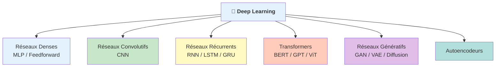
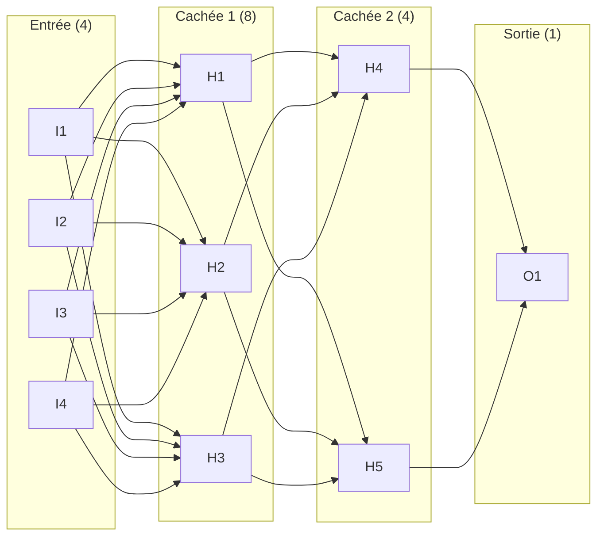
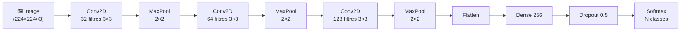
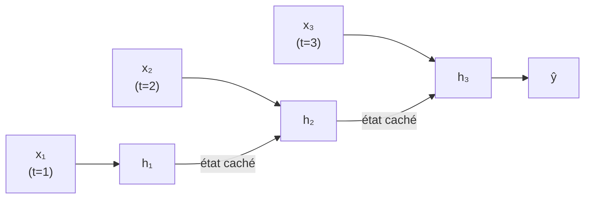
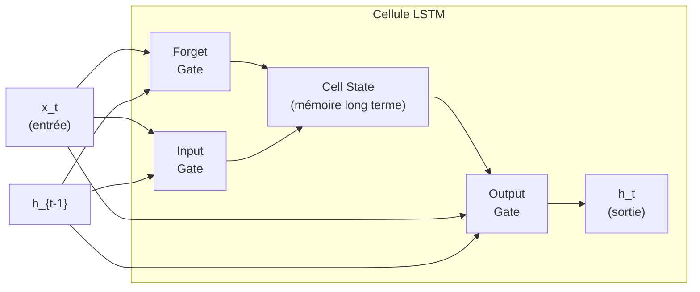
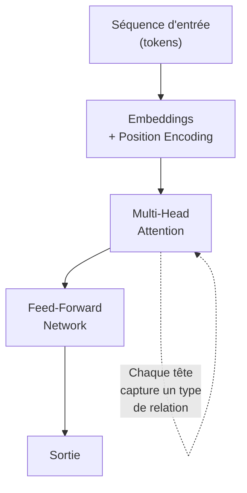
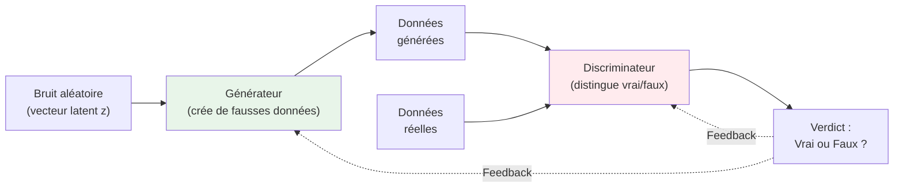
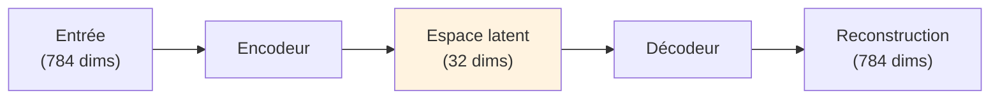
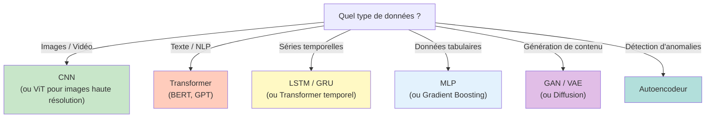

# Architectures de Deep Learning

<span class="badge-intermediate">Intermédiaire</span> <span class="badge-expert">Expert</span>

Le choix d'architecture est **la décision la plus impactante** dans un projet de Deep Learning. Chaque type de réseau a été conçu pour exceller sur un type de données spécifique. Ce guide présente les architectures majeures, leurs mécanismes, et quand les utiliser.

---

## Panorama des architectures



### Tableau de synthèse

| Architecture | Données cibles | Forces | Exemples d'application |
|:-------------|:--------------|:-------|:----------------------|
| **MLP** (Dense) | Données tabulaires | Simple, polyvalent | Prédiction de prix, classification |
| **CNN** | Images, signaux 2D | Extraction de motifs spatiaux | Reconnaissance faciale, imagerie médicale |
| **RNN / LSTM / GRU** | Séquences, séries temporelles | Mémoire du contexte passé | Traduction, prédiction de stocks |
| **Transformer** | Texte, images, multimodal | Attention parallélisable, contexte long | GPT, BERT, Copilot, DALL-E |
| **GAN** | Génération de données | Crée des données réalistes | Génération d'images, augmentation de données |
| **Autoencodeur** | Compression, anomalies | Apprend des représentations compactes | Détection de fraude, débruitage |

---

## Réseaux Denses (MLP — Multi-Layer Perceptron)

Le MLP est l'architecture la plus simple : chaque neurone d'une couche est connecté à tous les neurones de la couche suivante (*fully connected*).

**Comment ça marche** : les données traversent le réseau de gauche à droite (*propagation avant*). À chaque couche, chaque neurone calcule une somme pondérée de toutes ses entrées ($z = \sum w_i x_i + b$), puis applique une fonction d'activation (ReLU, Softmax…) pour introduire de la non-linéarité. Sans cette non-linéarité, empiler des couches n'aurait aucun intérêt — le réseau resterait équivalent à une seule transformation linéaire.

**Les 3 types de couches** :

| Couche | Rôle |
|--------|------|
| **Couche d'entrée** | Reçoit les features brutes (ex. : âge, salaire, taille) |
| **Couches cachées** | Apprennent des représentations intermédiaires de plus en plus abstraites |
| **Couche de sortie** | Produit la prédiction finale (classe ou valeur numérique) |

!!! example "Analogie"
    Imagine une chaîne de transformation : la première couche lit les données brutes, la deuxième identifie des combinaisons intéressantes, la troisième prend la décision finale. Chaque couche affine le travail de la précédente.



**Quand l'utiliser** : données tabulaires (CSV, bases de données), features numériques structurées.

**Limites** : ne capte pas les relations spatiales (images) ni temporelles (séquences).

=== "TensorFlow / Keras"

    ```python
    model = keras.Sequential([
        layers.Input(shape=(n_features,)),
        layers.Dense(128, activation='relu'),
        layers.Dropout(0.3),
        layers.Dense(64, activation='relu'),
        layers.Dropout(0.2),
        layers.Dense(num_classes, activation='softmax')
    ])
    ```

=== "PyTorch"

    ```python
    class MLP(nn.Module):
        def __init__(self, n_features, num_classes):
            super().__init__()
            self.network = nn.Sequential(
                nn.Linear(n_features, 128),
                nn.ReLU(),
                nn.Dropout(0.3),
                nn.Linear(128, 64),
                nn.ReLU(),
                nn.Dropout(0.2),
                nn.Linear(64, num_classes)
            )

        def forward(self, x):
            return self.network(x)
    ```

---

## Réseaux Convolutifs (CNN)

Les **CNN** (*Convolutional Neural Networks*) sont conçus pour traiter des données ayant une **structure spatiale** — principalement les images. Leur innovation : des filtres (*kernels*) qui balaient l'image pour détecter des motifs locaux (bords, textures, formes).

**Pourquoi pas un simple MLP pour les images ?** Une image 224×224 en couleur contient 150 528 pixels. Un MLP connecterait chaque pixel à chaque neurone → des millions de paramètres, ingérable et inefficace. Un CNN partage les mêmes filtres sur toute l'image : bien moins de paramètres, et la capacité à détecter un motif quelle que soit sa position (*invariance à la translation*).

**Comment fonctionne une convolution** : un filtre 3×3 (9 valeurs apprises) glisse pixel par pixel sur l'image. À chaque position, il calcule la somme des pixels multipliés par les poids du filtre. Résultat : une **carte de features** (*feature map*) qui indique où ce motif est présent dans l'image. Un réseau typique applique des dizaines à des centaines de filtres en parallèle, chacun spécialisé dans un type de motif.

!!! example "Analogie"
    C'est comme chercher un visage dans une photo en passant une loupe de gauche à droite, de haut en bas. Chaque filtre est une "loupe" spécialisée : l'un cherche des bords verticaux, l'autre des coins, un troisième des textures. Les couches profondes combinent ces détections simples pour reconnaître des objets complexes.

### Architecture type d'un CNN



### Les 3 opérations clés

| Opération | Rôle | Détails |
|-----------|------|---------|
| **Convolution** | Extraire des motifs | Un filtre 3×3 glisse sur l'image, calcule un produit scalaire local |
| **Pooling** | Réduire les dimensions | Max Pooling prend la valeur maximale dans une fenêtre 2×2 |
| **Flatten** | Convertir en vecteur | Transforme la carte 2D en vecteur 1D pour les couches denses |

!!! info "Hiérarchie des features apprises"
    Les premières couches détectent des **motifs simples** (bords, couleurs). Les couches profondes combinent ces motifs en **concepts abstraits** (visages, objets). C'est la puissance du Deep Learning : apprendre automatiquement cette hiérarchie.

### CNN célèbres

| Modèle | Année | Couches | Innovation |
|--------|:-----:|:-------:|-----------|
| **LeNet-5** | 1998 | 7 | Premier CNN pour chiffres manuscrits (Yann LeCun) |
| **AlexNet** | 2012 | 8 | ReLU + Dropout + GPU — tournant historique |
| **VGG-16** | 2014 | 16 | Empiler des convolutions 3×3 simples |
| **ResNet** | 2015 | 50-152 | Connexions résiduelles (*skip connections*) |
| **EfficientNet** | 2019 | Variable | Scaling automatique (profondeur, largeur, résolution) |

### Exemple complet — Classification d'images

=== "TensorFlow / Keras"

    ```python
    from tensorflow.keras import layers, models

    model = models.Sequential([
        layers.Input(shape=(224, 224, 3)),

        # Bloc 1
        layers.Conv2D(32, (3, 3), activation='relu', padding='same'),
        layers.BatchNormalization(),
        layers.MaxPooling2D((2, 2)),

        # Bloc 2
        layers.Conv2D(64, (3, 3), activation='relu', padding='same'),
        layers.BatchNormalization(),
        layers.MaxPooling2D((2, 2)),

        # Bloc 3
        layers.Conv2D(128, (3, 3), activation='relu', padding='same'),
        layers.BatchNormalization(),
        layers.MaxPooling2D((2, 2)),

        # Classification
        layers.Flatten(),
        layers.Dense(256, activation='relu'),
        layers.Dropout(0.5),
        layers.Dense(10, activation='softmax')
    ])

    model.compile(
        optimizer='adam',
        loss='categorical_crossentropy',
        metrics=['accuracy']
    )
    ```

=== "PyTorch"

    ```python
    import torch.nn as nn

    class CNN(nn.Module):
        def __init__(self, num_classes=10):
            super().__init__()
            self.features = nn.Sequential(
                nn.Conv2d(3, 32, 3, padding=1), nn.ReLU(),
                nn.BatchNorm2d(32),
                nn.MaxPool2d(2),

                nn.Conv2d(32, 64, 3, padding=1), nn.ReLU(),
                nn.BatchNorm2d(64),
                nn.MaxPool2d(2),

                nn.Conv2d(64, 128, 3, padding=1), nn.ReLU(),
                nn.BatchNorm2d(128),
                nn.MaxPool2d(2),
            )
            self.classifier = nn.Sequential(
                nn.Flatten(),
                nn.Linear(128 * 28 * 28, 256),
                nn.ReLU(),
                nn.Dropout(0.5),
                nn.Linear(256, num_classes)
            )

        def forward(self, x):
            x = self.features(x)
            return self.classifier(x)
    ```

---

## Réseaux Récurrents (RNN, LSTM, GRU)

Les **RNN** sont conçus pour des données **séquentielles** où l'ordre compte : texte, séries temporelles, audio. Leur particularité : une **boucle de rétroaction** qui permet au réseau de garder une mémoire des entrées passées.

**Pourquoi pas un MLP pour les séquences ?** Un MLP traite chaque entrée indépendamment — il ne sait pas ce qui précède. Pour prédire le mot suivant dans "Le chat mange la…", il faut se souvenir de tous les mots précédents. Un RNN résout ça avec un **état caché** $h_t$ qui se propage de pas en pas : $h_t = f(W_h \cdot h_{t-1} + W_x \cdot x_t + b)$.

**Ce qu'est l'état caché** : un vecteur (ex. 64 ou 128 valeurs) qui encode tout ce que le réseau a "retenu" jusqu'à l'instant $t$. À chaque nouveau pas de temps, il se met à jour en combinant le nouvel input et la mémoire précédente.

!!! example "Analogie"
    Lis la phrase mot par mot en retenant le contexte. Quand tu arrives à "mange", tu sais déjà que c'est "le chat" qui agit. L'état caché est cette mémoire de travail — il accumule le sens au fil des mots.

### RNN simple



**Problème** : les RNN simples souffrent du **gradient qui disparaît** (*vanishing gradient*) — ils ne peuvent pas retenir d'informations sur de longues séquences.

### LSTM (Long Short-Term Memory)

Le **LSTM** (1997, Hochreiter & Schmidhuber) résout ce problème avec un mécanisme de **portes** qui contrôlent le flux d'information :

| Porte | Rôle |
|-------|------|
| **Porte d'oubli** (*Forget gate*) | Décide quelles informations anciennes jeter |
| **Porte d'entrée** (*Input gate*) | Décide quelles nouvelles informations stocker |
| **Porte de sortie** (*Output gate*) | Décide quelles informations envoyer au pas suivant |



### GRU (Gated Recurrent Unit)

Le **GRU** (2014, Cho et al.) simplifie le LSTM en fusionnant les portes :

| Critère | LSTM | GRU |
|---------|:----:|:---:|
| Portes | 3 | 2 |
| Paramètres | Plus | Moins |
| Performance | Légèrement meilleure sur séquences longues | Comparable, plus rapide à entraîner |
| Cas d'usage | Traduction, texte long | Séries temporelles, prédiction |

### Exemple — Prédiction de séries temporelles

```python
from tensorflow.keras import layers, models

# Données : séquences de 60 pas temporels, 1 feature
model = models.Sequential([
    layers.Input(shape=(60, 1)),
    layers.LSTM(64, return_sequences=True),
    layers.Dropout(0.2),
    layers.LSTM(32),
    layers.Dropout(0.2),
    layers.Dense(1)  # Prédiction d'une valeur
])

model.compile(optimizer='adam', loss='mse')
```

---

## Transformers

L'architecture **Transformer** (2017, "Attention Is All You Need" — Vaswani et al.) a révolutionné le Deep Learning en éliminant la récurrence au profit d'un mécanisme d'**attention** qui traite toute la séquence en parallèle.

**Pourquoi l'attention plutôt que la récurrence ?** Un RNN traite les mots un par un — pour le mot 50, il faut traverser 49 étapes intermédiaires, et l'information se dilue. L'attention calcule en une seule opération les relations entre **tous les mots simultanément**, quel que soit l'écart entre eux.

### Mécanisme d'attention

L'**attention** permet à chaque élément d'une séquence de "regarder" tous les autres pour déterminer lesquels sont les plus pertinents :

$$\text{Attention}(Q, K, V) = \text{softmax}\left(\frac{QK^T}{\sqrt{d_k}}\right)V$$

| Composant | Rôle | Analogie |
|-----------|------|----------|
| **Query (Q)** | "Ce que je cherche" | La question posée |
| **Key (K)** | "Ce que je contiens" | Les étiquettes des éléments |
| **Value (V)** | "Ce que je fournis" | Le contenu utile |

!!! example "Exemple concret — traduction"
    Dans "Le chat mange la souris", quand le modèle traite le mot "mange", il calcule un score d'attention avec **tous** les autres mots. "chat" et "souris" obtiennent un score élevé (sujet et objet de l'action), les articles "Le/la" un score faible. La sortie pour "mange" est alors une combinaison pondérée de tous les mots, enrichie du contexte pertinent.



### Modèles basés sur les Transformers

| Modèle | Type | Tâche principale | Caractéristique |
|--------|------|-------------------|-----------------|
| **BERT** | Encodeur | Compréhension de texte | Bidirectionnel — voit le contexte avant et après |
| **GPT** | Décodeur | Génération de texte | Autorégressif — prédit le token suivant |
| **T5** | Encodeur-Décodeur | Text-to-Text | Toute tâche NLP formulée comme transformation de texte |
| **ViT** | Encodeur (vision) | Classification d'images | Découpe l'image en patches, les traite comme des tokens |
| **Whisper** | Encodeur-Décodeur | Transcription audio | Speech-to-text multilingue |

!!! tip "Pourquoi les Transformers dominent"
    - **Parallélisation** : contrairement aux RNN, tous les tokens sont traités simultanément → entraînement massivement plus rapide sur GPU
    - **Contexte long** : l'attention permet de capturer des dépendances à très longue distance
    - **Transfer Learning** : un modèle pré-entraîné (GPT, BERT) peut être fine-tuné pour des tâches spécifiques avec peu de données

---

## Réseaux Génératifs (GAN)

Les **GAN** (*Generative Adversarial Networks*, 2014 — Ian Goodfellow) mettent en compétition deux réseaux :

**Comment l'entraînement fonctionne** : les deux réseaux jouent un jeu à somme nulle (*minimax*) en alternance :

1. Le **Discriminateur** s'entraîne sur de vraies données (label = 1) et des données fausses du Générateur (label = 0) → il apprend à distinguer
2. Le **Générateur** s'entraîne à tromper le Discriminateur → il reçoit un signal d'erreur quand sa sortie est détectée comme fausse
3. À l'équilibre (*équilibre de Nash*), le Générateur produit des données indiscernables des vraies




| Composant | Rôle | Analogie |
|-----------|------|----------|
| **Générateur** | Crée des données réalistes à partir de bruit | Un faussaire qui fabrique des billets |
| **Discriminateur** | Distingue les données réelles des fausses | Un détective qui vérifie les billets |

**Applications** : génération d'images photo-réalistes, super-résolution, augmentation de données, deepfakes, création artistique.

!!! warning "Difficultés d'entraînement"
    Les GAN sont notoirement instables : le Générateur peut tomber en *mode collapse* (toujours générer la même image), ou les deux réseaux peuvent diverger. Les **Diffusion Models** (Stable Diffusion, DALL-E 3, Midjourney) ont largement supplanté les GAN pour la génération d'images de haute qualité grâce à leur entraînement plus stable.

---

## Autoencodeurs

Un **autoencodeur** compresse les données dans un espace latent réduit, puis les reconstruit. Il apprend une représentation compacte et efficace.

**Comment ça marche** : l'**Encodeur** compresse les données vers un vecteur de petite dimension appelé **espace latent** (ou *code*). Le **Décodeur** tente de reconstruire l'entrée originale depuis ce vecteur compressé. L'entraînement minimise l'erreur de reconstruction — **sans aucune étiquette** (*apprentissage non supervisé*) : le réseau apprend uniquement à partir des données elles-mêmes.

**Qu'est-ce que l'espace latent ?** C'est une représentation compacte qui capture l'**essentiel** de l'information. Un visage en 784 pixels est réduit à 32 valeurs qui encodent implicitement : pose, expression, âge, luminosité… Ce vecteur latent peut alors être utilisé pour :

- **Détecter des anomalies** : une donnée inhabituelle sera mal reconstruite → erreur de reconstruction élevée → signal d'alerte
- **Débruitage** : on entraîne à reconstruire des images propres depuis des images bruitées
- **Génération** (VAE) : on échantillonne un nouveau vecteur latent et on le décode → nouvelle donnée synthétique



| Variante | Usage |
|----------|-------|
| **Autoencodeur simple** | Réduction de dimension, débruitage |
| **VAE** (*Variational AE*) | Génération de nouvelles données (images, molécules) |
| **Autoencodeur convolutif** | Compression d'images, détection d'anomalies visuelles |

---

## Guide de choix : quelle architecture pour quel problème ?



!!! warning "Les données tabulaires n'ont pas toujours besoin de Deep Learning"
    Pour les données structurées (CSV, SQL), les algorithmes de **Gradient Boosting** (XGBoost, LightGBM) surpassent souvent les réseaux de neurones. Le Deep Learning excelle sur les données non structurées : images, texte, audio, vidéo.

---

## Points clés à retenir

!!! success "Résumé"
    - **CNN** pour les images : convolution + pooling → extraction de motifs spatiaux
    - **RNN / LSTM / GRU** pour les séquences : mémoire du passé pour prédire le futur
    - **Transformers** pour le texte (et au-delà) : attention parallèle, contexte long, transfer learning
    - **GAN** pour générer : deux réseaux en compétition créent des données réalistes
    - **Autoencodeurs** pour compresser et détecter des anomalies
    - Le choix d'architecture dépend du **type de données**, pas de la complexité du problème

---

## Prochaine étape

Tu connais maintenant les architectures. Passe à l'étape pratique : **[Concevoir et entraîner un réseau de neurones](concevoir-entrainer.md)** — le guide pas à pas pour construire, entraîner et évaluer ton propre modèle.
