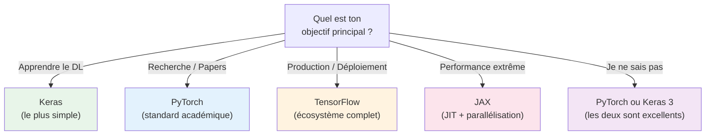

# Comparaison des Frameworks Deep Learning

<span class="badge-intermediate">Intermédiaire</span>

Le choix du framework Deep Learning impacte la productivité, la flexibilité, et les options de déploiement. Ce comparatif couvre les quatre frameworks majeurs : **TensorFlow**, **PyTorch**, **Keras** et **JAX**.

---

## Tableau comparatif complet

| Critère | TensorFlow | PyTorch | Keras | JAX |
|---------|:----------:|:-------:|:-----:|:---:|
| **Développeur** | Google | Meta (Facebook) | François Chollet / Google | Google Research |
| **Année** | 2015 | 2016 | 2015 (standalone) | 2018 |
| **Paradigme** | Graph + Eager | Eager (dynamique) | API haut niveau | Fonctionnel + JIT |
| **Facilité** | Moyenne | Bonne | **Excellente** | Difficile |
| **Flexibilité** | Haute | **Très haute** | Moyenne | **Très haute** |
| **Déploiement** | **Excellent** (TF Serving, TFLite, TF.js) | Bon (TorchServe, ONNX) | Via TensorFlow | Limité |
| **Communauté** | Très large | **La plus active** (recherche) | Large (intégrée à TF) | En croissance |
| **Recherche** | Utilisé | **Standard académique** | Prototypage rapide | Pointe (DeepMind) |
| **Production** | **Standard industrie** | En forte croissance | Via TensorFlow | Niche |
| **Mobile / Edge** | TFLite | PyTorch Mobile | Via TFLite | Non |
| **Multi-GPU** | `tf.distribute` | `DistributedDataParallel` | Via TensorFlow | `pmap` / `pjit` |
| **Mixed Precision** | Natif | Natif (`torch.cuda.amp`) | Via TensorFlow | Natif |
| **Documentation** | Très complète | **Excellente** | Très complète | Bonne |

---

## Différences détaillées

### TensorFlow

=== "Forces"

    - Écosystème **complet** pour la production : TensorFlow Serving, TFLite (mobile), TF.js (web)
    - TensorBoard pour la visualisation des métriques
    - Excellente intégration cloud (Google Cloud, AWS, Azure)
    - Keras intégré comme API haut niveau officielle
    - Large base de modèles pré-entraînés (TF Hub)

=== "Faiblesses"

    - API parfois complexe et verbose
    - Plusieurs façons de faire la même chose (legacy v1 vs v2)
    - Debugging plus difficile qu'en PyTorch (graph mode)

```python
# Style TensorFlow / Keras
import tensorflow as tf

model = tf.keras.Sequential([
    tf.keras.layers.Dense(128, activation='relu'),
    tf.keras.layers.Dense(10, activation='softmax')
])
model.compile(optimizer='adam', loss='categorical_crossentropy')
model.fit(X_train, y_train, epochs=10)
```

### PyTorch

=== "Forces"

    - Mode **eager par défaut** : le code s'exécute ligne par ligne → debugging naturel
    - **Standard en recherche** : la majorité des papers publient en PyTorch
    - API Pythonique et intuitive
    - Excellent pour le prototypage rapide
    - Écosystème de plus en plus complet (TorchServe, TorchVision, TorchAudio)

=== "Faiblesses"

    - Historiquement moins d'outils de déploiement que TensorFlow (en rattrapage)
    - Boucle d'entraînement manuelle (plus de code boilerplate)
    - Pas de Keras-like intégré (mais PyTorch Lightning existe)

```python
# Style PyTorch
import torch
import torch.nn as nn

class Model(nn.Module):
    def __init__(self):
        super().__init__()
        self.fc1 = nn.Linear(784, 128)
        self.fc2 = nn.Linear(128, 10)

    def forward(self, x):
        x = torch.relu(self.fc1(x))
        return self.fc2(x)

model = Model()
optimizer = torch.optim.Adam(model.parameters())
criterion = nn.CrossEntropyLoss()

# Boucle d'entraînement manuelle
for epoch in range(10):
    optimizer.zero_grad()
    output = model(X_train)
    loss = criterion(output, y_train)
    loss.backward()
    optimizer.step()
```

### Keras

=== "Forces"

    - API **la plus simple** et la plus lisible
    - Prototypage ultra-rapide
    - Intégré à TensorFlow (Keras 2) et maintenant multi-backend (Keras 3 : TF, PyTorch, JAX)
    - Documentation pédagogique excellente
    - Idéal pour les débutants et le prototypage

=== "Faiblesses"

    - Moins flexible pour les architectures très custom
    - Dépend d'un backend (TF, PyTorch, ou JAX)
    - Les optimisations avancées nécessitent parfois de "casser l'abstraction"

```python
# Style Keras (depuis Keras 3 — multi-backend)
import keras
from keras import layers

model = keras.Sequential([
    layers.Dense(128, activation='relu'),
    layers.Dense(10, activation='softmax')
])
model.compile(optimizer='adam', loss='categorical_crossentropy')
model.fit(X_train, y_train, epochs=10)
```

### JAX

=== "Forces"

    - **Performance maximale** : compilation JIT (XLA), différentiation automatique, vectorisation
    - Paradigme fonctionnel pur : code composable et testable
    - Excellente parallélisation multi-GPU/TPU (`pmap`)
    - Utilisé par Google DeepMind pour la recherche de pointe
    - Transformations composables : `jit`, `grad`, `vmap`, `pmap`

=== "Faiblesses"

    - Courbe d'apprentissage très raide
    - API bas niveau (nécessite Flax ou Haiku pour les réseaux)
    - Communauté plus petite
    - Moins d'outils de déploiement

```python
# Style JAX + Flax
import jax
import jax.numpy as jnp
from flax import linen as nn

class Model(nn.Module):
    @nn.compact
    def __call__(self, x):
        x = nn.Dense(128)(x)
        x = nn.relu(x)
        x = nn.Dense(10)(x)
        return x

model = Model()
params = model.init(jax.random.PRNGKey(0), jnp.ones((1, 784)))

# JAX est fonctionnel : pas d'état mutable
@jax.jit
def predict(params, x):
    return model.apply(params, x)
```

---

## Guide de choix



### Recommandations par profil

| Profil | Framework recommandé | Raison |
|--------|:--------------------:|--------|
| **Débutant** | Keras | Syntaxe la plus accessible, courbe d'apprentissage douce |
| **Étudiant / Chercheur** | PyTorch | Standard en recherche, debugging intuitif |
| **Ingénieur ML en entreprise** | TensorFlow + Keras | Déploiement solide, écosystème production |
| **Ingénieur performance** | JAX | JIT compilation, parallélisation native |
| **Full-stack ML** | PyTorch + Lightning | Bonne abstraction tout en gardant la flexibilité |

---

## Interopérabilité

Les frameworks ne sont pas des îles — plusieurs outils permettent de passer de l'un à l'autre :

| Outil | Conversion | Usage |
|-------|-----------|-------|
| **ONNX** | TF ↔ PyTorch ↔ Autres | Format d'échange universel |
| **Keras 3** | TF + PyTorch + JAX | Backend interchangeable |
| **Hugging Face** | Modèles dans tous les frameworks | Hub de modèles pré-entraînés |
| **TorchScript** | PyTorch → Optimisé | Export pour production |

```python
# Exporter un modèle PyTorch vers ONNX
import torch

dummy_input = torch.randn(1, 784)
torch.onnx.export(
    model, dummy_input,
    "model.onnx",
    input_names=['input'],
    output_names=['output'],
    dynamic_axes={'input': {0: 'batch'}, 'output': {0: 'batch'}}
)
```

---

## Tendances 2024-2026

| Tendance | Détails |
|----------|---------|
| **PyTorch domine la recherche** | > 80% des publications utilisent PyTorch |
| **Keras 3 multi-backend** | Un seul code, trois backends (TF, PyTorch, JAX) |
| **JAX en croissance** | Adoption par Google DeepMind, performance GPU/TPU |
| **TensorFlow stable en production** | Reste fort pour le déploiement et le mobile |
| **Hugging Face comme hub** | Centralise modèles et datasets pour tous les frameworks |

---

## Points clés à retenir

!!! success "Résumé"
    - **Keras** pour apprendre et prototyper — le plus simple
    - **PyTorch** pour la recherche et la flexibilité — le plus populaire
    - **TensorFlow** pour la production et le déploiement — le plus complet
    - **JAX** pour la performance brute et la recherche avancée — le plus rapide
    - L'interopérabilité (ONNX, Keras 3, Hugging Face) rend le choix moins définitif qu'avant
    - En cas de doute, commence avec **PyTorch** ou **Keras** — tu pourras toujours changer de framework grâce à ONNX
