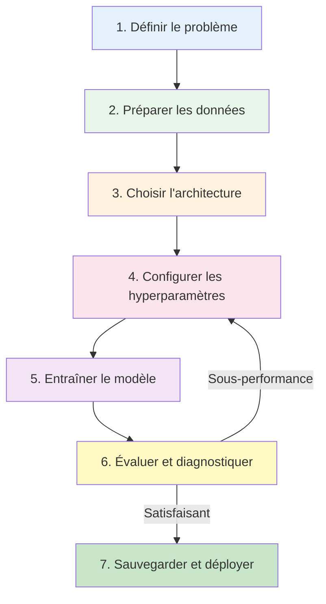
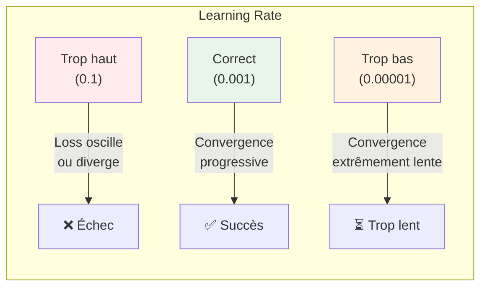
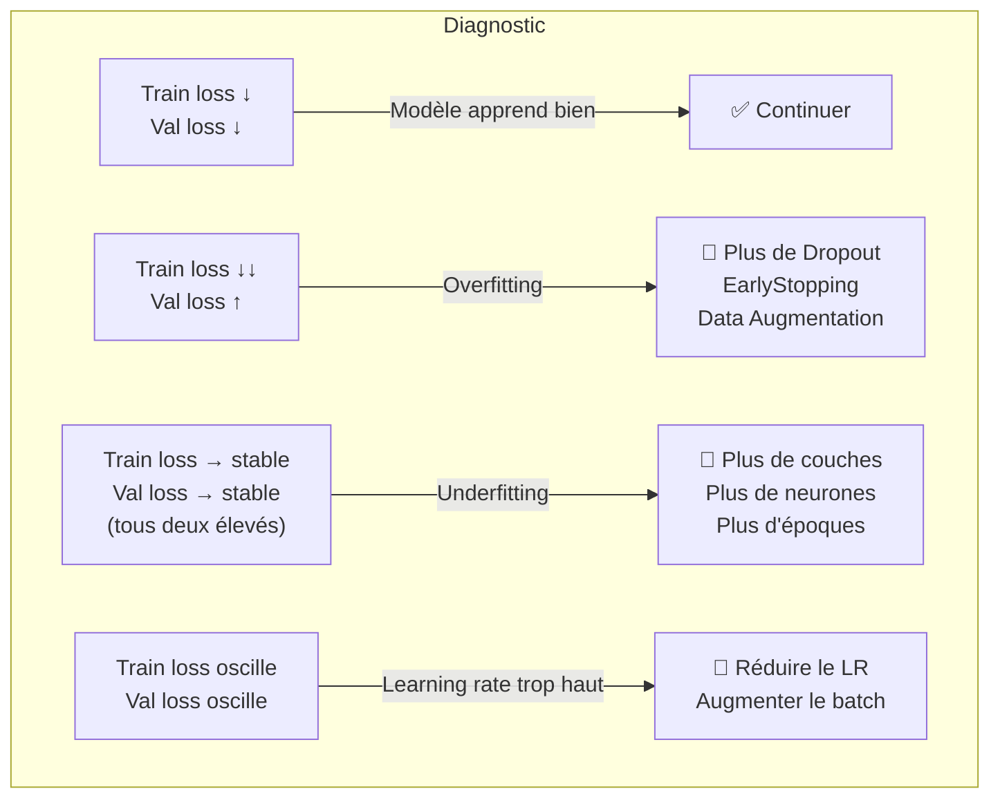

# Concevoir et Entraîner un Réseau de Neurones

<span class="badge-expert">Expert</span>

Ce guide détaille le processus complet pour construire un réseau de neurones performant, de la définition du problème à l'évaluation finale. Chaque étape est accompagnée de code et de bonnes pratiques.

---

## Workflow complet



---

## Étape 1 — Définir le problème

Avant d'écrire une seule ligne de code, clarifie ces points.

**Les 3 types de tâches principales** :

| Type | Ce qu'on prédit | Activation de sortie | Exemple |
|------|----------------|---------------------|---------|
| **Classification** | Une catégorie parmi N | Sigmoid (N=2) / Softmax (N>2) | Chat ou chien ? Spam ou non ? |
| **Régression** | Une valeur numérique continue | Linéaire (aucune) | Prix d'un appartement, température |
| **Génération** | Données synthétiques | Selon l'architecture | Texte, images, audio |

| Question | Réponse typique | Impact sur l'architecture |
|----------|----------------|--------------------------|
| Quel type de tâche ? | Classification, régression, génération | Fonction d'activation de sortie, loss function |
| Quelles données ? | Images, texte, tabulaire, séries temporelles | Architecture (CNN, Transformer, MLP, LSTM) |
| Combien de données ? | Quelques centaines → millions | Transfer learning si peu de données |
| Quelle métrique cible ? | Accuracy, F1, MAE, BLEU | Choix de la loss et des callbacks |
| Contraintes de déploiement ? | Temps réel, edge, serveur | Taille du modèle, latence |

!!! tip "Règle d'or"
    Ne commence **jamais** par un modèle complexe. Commence par un **baseline simple** (régression logistique, petit MLP) puis augmente progressivement la complexité si nécessaire.

    **Pourquoi une baseline ?** Elle te donne un score de référence. Si ton réseau de neurones complexe obtient 78% d'accuracy et qu'une régression logistique en 5 lignes obtient 75%, la valeur ajoutée du deep learning est discutable. La baseline révèle aussi les problèmes dans les données avant d'investir du temps dans l'architecture.

---

## Étape 2 — Préparer les données

La qualité des données est plus importante que la complexité du modèle. Un réseau de neurones ne peut pas compenser des données de mauvaise qualité.

!!! info "Pourquoi normaliser les données ?"
    Un réseau de neurones apprend en ajustant ses poids via la **descente de gradient**. Si une feature vaut entre 0 et 1 et une autre entre 0 et 100 000, les gradients seront de magnitudes très différentes → la convergence est chaotique et lente. En ramenant toutes les features à la même échelle (moyenne 0, écart-type 1 pour `StandardScaler`), on garantit que chaque feature contribue équitablement à l'apprentissage.

### Checklist de préparation

| Tâche | Pourquoi | Outil Python |
|-------|----------|-------------|
| Nettoyer les valeurs manquantes | Le réseau ne gère pas les NaN | `pandas.fillna()`, `SimpleImputer` |
| Encoder les variables catégorielles | Le réseau ne comprend que les nombres | `OneHotEncoder`, `LabelEncoder` |
| Normaliser / Standardiser | Convergence plus rapide et stable | `StandardScaler`, `MinMaxScaler` |
| Séparer train / validation / test | Éviter l'overfitting et biais d'évaluation | `train_test_split` |
| Augmenter les données (images) | Plus de diversité = meilleure généralisation | `ImageDataGenerator`, `albumentations` |

### Séparation des données

```python
from sklearn.model_selection import train_test_split

# Stratégie recommandée : 70% train, 15% validation, 15% test
X_train, X_temp, y_train, y_temp = train_test_split(
    X, y, test_size=0.3, random_state=42, stratify=y
)
X_val, X_test, y_val, y_test = train_test_split(
    X_temp, y_temp, test_size=0.5, random_state=42, stratify=y_temp
)

print(f"Train: {len(X_train)}, Val: {len(X_val)}, Test: {len(X_test)}")
```

!!! warning "Ne jamais toucher au jeu de test"
    Le jeu de **test** est sacré. Il ne sert qu'à l'évaluation finale, une seule fois. Si tu l'utilises pour ajuster ton modèle, tu perds toute garantie de généralisation.

### Normalisation

```python
from sklearn.preprocessing import StandardScaler

scaler = StandardScaler()
X_train_scaled = scaler.fit_transform(X_train)  # fit + transform sur train
X_val_scaled = scaler.transform(X_val)            # transform seul sur val
X_test_scaled = scaler.transform(X_test)          # transform seul sur test
```

!!! danger "Erreur classique — Data Leakage"
    Le `fit_transform` ne doit être appliqué que sur les données d'entraînement. Appliquer `fit` sur l'ensemble complet (train + test) crée une fuite de données : le modèle "voit" indirectement la distribution du test.

---

## Étape 3 — Choisir l'architecture

Consulte le [guide de choix des architectures](architectures-deep-learning.md) pour la décision initiale.

### Dimensionner le réseau

**La logique en entonnoir** : on commence large (beaucoup de neurones) puis on réduit progressivement. Chaque couche extrait une représentation de plus en plus abstraite et compacte. La première couche voit les features brutes ; la dernière couche cachée doit avoir encodé l'essentiel de l'information nécessaire à la décision finale.

**Pourquoi le Dropout ?** Pendant l'entraînement, le Dropout désactive aléatoirement un pourcentage de neurones à chaque passage. Cela force le réseau à ne pas trop dépendre d'un seul neurone, ce qui améliore la généralisation. Un Dropout de 0.3 signifie que 30% des neurones sont masqués aléatoirement à chaque batch — uniquement pendant l'entraînement, jamais à l'inférence.

| Paramètre | Recommandation de départ | Ajustement |
|-----------|-------------------------|------------|
| Nombre de couches cachées | 2-3 pour commencer | Ajouter si sous-apprentissage |
| Neurones par couche | Commencer large puis réduire (128→64→32) | Structure en "entonnoir" |
| Dropout | 0.2-0.5 entre les couches | Augmenter si overfitting |
| BatchNormalization | Après chaque couche convolutive | Stabilise l'entraînement |

### Template de réseau — Classification

```python
import tensorflow as tf
from tensorflow.keras import layers, models, callbacks

def build_classifier(input_shape, num_classes, complexity='medium'):
    """Construire un classifieur avec complexité ajustable."""
    config = {
        'simple':  {'units': [64, 32],       'dropout': 0.2},
        'medium':  {'units': [128, 64, 32],  'dropout': 0.3},
        'complex': {'units': [256, 128, 64], 'dropout': 0.4},
    }
    c = config[complexity]

    model = models.Sequential()
    model.add(layers.Input(shape=input_shape))

    for units in c['units']:
        model.add(layers.Dense(units, activation='relu'))
        model.add(layers.BatchNormalization())
        model.add(layers.Dropout(c['dropout']))

    # Couche de sortie
    if num_classes == 2:
        model.add(layers.Dense(1, activation='sigmoid'))
        loss = 'binary_crossentropy'
    else:
        model.add(layers.Dense(num_classes, activation='softmax'))
        loss = 'sparse_categorical_crossentropy'

    model.compile(
        optimizer='adam',
        loss=loss,
        metrics=['accuracy']
    )
    return model

# Utilisation
model = build_classifier(
    input_shape=(X_train_scaled.shape[1],),
    num_classes=3,
    complexity='medium'
)
model.summary()
```

---

## Étape 4 — Configurer les hyperparamètres

Les **hyperparamètres** sont les paramètres que tu définis avant l'entraînement (contrairement aux poids, qui sont appris).

**Deux notions clés à comprendre** :

- **Époque** (*epoch*) : une passe complète sur **tout** le jeu d'entraînement. Si tu as 1000 exemples et un batch de 32, une époque = 32 itérations (~31 batchs complets). Après chaque époque, le modèle est évalué sur la validation.
- **Batch size** : nombre d'exemples traités simultanément avant de mettre à jour les poids. Un petit batch (8-16) introduit du bruit qui peut aider à échapper aux minima locaux, mais est plus lent. Un grand batch (256-512) est plus stable et rapide sur GPU, mais peut converger vers des minima moins généralisables.

!!! info "Règle pratique batch size"
    Commence à 32 — c'est le meilleur compromis vitesse/qualité dans la grande majorité des cas. Augmente si ta GPU n'est pas saturée, diminue si le modèle ne converge pas.

### Les hyperparamètres essentiels

| Hyperparamètre | Valeur de départ | Effet |
|----------------|:----------------:|-------|
| **Learning rate** | 0.001 | Trop élevé → diverge, trop bas → stagne |
| **Batch size** | 32 | Plus petit → plus bruité, plus grand → plus stable |
| **Epochs** | 100 (avec EarlyStopping) | Nombre de passes sur les données |
| **Optimiseur** | Adam | Le plus polyvalent |
| **Dropout** | 0.3 | Régularisation (désactive des neurones aléatoirement) |
| **Weight decay** | 1e-4 | Pénalise les poids trop grands |

### Learning Rate — le paramètre le plus critique



### Recherche automatique d'hyperparamètres

```python
import keras_tuner as kt

def build_model(hp):
    """Modèle avec hyperparamètres recherchables."""
    model = models.Sequential()
    model.add(layers.Input(shape=(X_train_scaled.shape[1],)))

    # Nombre de couches : 1 à 4
    for i in range(hp.Int('num_layers', 1, 4)):
        model.add(layers.Dense(
            units=hp.Choice(f'units_{i}', [32, 64, 128, 256]),
            activation='relu'
        ))
        model.add(layers.Dropout(
            hp.Float(f'dropout_{i}', 0.1, 0.5, step=0.1)
        ))

    model.add(layers.Dense(3, activation='softmax'))

    model.compile(
        optimizer=tf.keras.optimizers.Adam(
            learning_rate=hp.Choice('lr', [1e-2, 1e-3, 1e-4])
        ),
        loss='sparse_categorical_crossentropy',
        metrics=['accuracy']
    )
    return model

# Lancer la recherche
tuner = kt.BayesianOptimization(
    build_model,
    objective='val_accuracy',
    max_trials=20,
    directory='tuner_results',
    project_name='mon_projet'
)

tuner.search(
    X_train_scaled, y_train,
    epochs=50,
    validation_data=(X_val_scaled, y_val),
    callbacks=[callbacks.EarlyStopping(patience=5)]
)

# Meilleur modèle
best_model = tuner.get_best_models(num_models=1)[0]
best_hp = tuner.get_best_hyperparameters()[0]
print(f"Meilleurs hyperparamètres : {best_hp.values}")
```

---

## Étape 5 — Entraîner le modèle

### Callbacks essentiels

Les **callbacks** automatisent la surveillance de l'entraînement.

**Comment se déroule une époque d'entraînement ?**

1. Les données sont coupées en batchs
2. Pour chaque batch : **propagation avant** (calcul de la prédiction) → **calcul de la loss** → **rétropropagation** (calcul des gradients) → **mise à jour des poids** par l'optimiseur
3. Après tous les batchs : évaluation sur la validation → les callbacks vérifient si on doit stopper, réduire le LR, ou sauvegarder

**Explication des callbacks principaux** :

| Callback | Paramètre clé | Ce qu'il fait concrètement |
|----------|--------------|-----------------------------|
| `EarlyStopping` | `patience=10` | Si la val_loss ne s'améliore pas pendant 10 époques consécutives, on arrête. `restore_best_weights` recharge automatiquement les poids de la meilleure époque. |
| `ReduceLROnPlateau` | `patience=5, factor=0.5` | Si la val_loss stagne 5 époques, divise le learning rate par 2. Permet de "zoomer" vers le minimum quand on est proche. |
| `ModelCheckpoint` | `save_best_only=True` | Sauvegarde le modèle sur disque uniquement quand la val_loss s'améliore — garantit de ne jamais perdre le meilleur état. |

```python
my_callbacks = [
    # Arrêt anticipé si la validation ne s'améliore plus
    callbacks.EarlyStopping(
        monitor='val_loss',
        patience=10,
        restore_best_weights=True,
        verbose=1
    ),
    # Réduire le learning rate si plateau
    callbacks.ReduceLROnPlateau(
        monitor='val_loss',
        factor=0.5,
        patience=5,
        min_lr=1e-7,
        verbose=1
    ),
    # Sauvegarder le meilleur modèle
    callbacks.ModelCheckpoint(
        'best_model.keras',
        monitor='val_loss',
        save_best_only=True,
        verbose=1
    ),
    # Logs pour TensorBoard
    callbacks.TensorBoard(
        log_dir='./logs',
        histogram_freq=1
    )
]
```

### Lancer l'entraînement

```python
history = model.fit(
    X_train_scaled, y_train,
    epochs=100,
    batch_size=32,
    validation_data=(X_val_scaled, y_val),
    callbacks=my_callbacks,
    verbose=1
)
```

### Visualiser l'apprentissage

```python
import matplotlib.pyplot as plt

fig, (ax1, ax2) = plt.subplots(1, 2, figsize=(14, 5))

# Courbe de loss
ax1.plot(history.history['loss'], label='Train')
ax1.plot(history.history['val_loss'], label='Validation')
ax1.set_title('Courbe de Perte')
ax1.set_xlabel('Époque')
ax1.set_ylabel('Loss')
ax1.legend()
ax1.grid(True, alpha=0.3)

# Courbe de précision
ax2.plot(history.history['accuracy'], label='Train')
ax2.plot(history.history['val_accuracy'], label='Validation')
ax2.set_title('Courbe de Précision')
ax2.set_xlabel('Époque')
ax2.set_ylabel('Accuracy')
ax2.legend()
ax2.grid(True, alpha=0.3)

plt.tight_layout()
plt.show()
```

---

## Étape 6 — Évaluer et diagnostiquer

### Interpréter les courbes d'apprentissage



### Matrice de confusion et métriques

**Comment lire la matrice de confusion** : les lignes représentent les vraies classes, les colonnes les classes prédites. Les cases sur la **diagonale** sont les prédictions correctes. Les cases hors diagonale sont les erreurs.

- **Ligne i, colonne j** (avec i ≠ j) : les exemples de la classe i prédits comme classe j — plus ce chiffre est élevé, plus ces deux classes sont confondues
- Un bon modèle a des valeurs élevées sur la diagonale et proches de zéro ailleurs

**Trois métriques clés issues de la matrice** :

| Métrique | Formule | Quand l'utiliser |
|----------|---------|------------------|
| **Precision** | VP / (VP + FP) | Quand un faux positif est coûteux (ex : spam filter) |
| **Recall** | VP / (VP + FN) | Quand un faux négatif est coûteux (ex : détection de cancer) |
| **F1-score** | 2 × P × R / (P + R) | Compromis quand les classes sont déséquilibrées |

### Code d'évaluation

```python
from sklearn.metrics import classification_report, confusion_matrix
import seaborn as sns

# Prédictions
y_pred = model.predict(X_test_scaled).argmax(axis=1)

# Rapport détaillé : precision, recall, F1 par classe
print(classification_report(y_test, y_pred, target_names=class_names))

# Matrice de confusion visuelle
cm = confusion_matrix(y_test, y_pred)
plt.figure(figsize=(8, 6))
sns.heatmap(cm, annot=True, fmt='d', cmap='Blues',
            xticklabels=class_names, yticklabels=class_names)
plt.xlabel('Prédit')
plt.ylabel('Réel')
plt.title('Matrice de Confusion')
plt.show()
```

### Tableau de diagnostic

| Symptôme | Diagnostic | Solution |
|----------|-----------|----------|
| Val loss augmente alors que train loss diminue | **Overfitting** | Dropout, Data Augmentation, Early Stopping, Weight Decay |
| Train et Val loss élevées et stables | **Underfitting** | Architecture plus profonde, plus d'époques, features supplémentaires |
| Loss oscille fortement | **Learning rate trop élevé** | Diviser le LR par 10, augmenter le batch size |
| Loss ne diminue pas du tout | **Bug ou données mal préparées** | Vérifier la normalisation, les labels, les NaN |
| Accuracy élevée mais F1 faible | **Classes déséquilibrées** | Class weights, oversampling (SMOTE), focal loss |

---

## Étape 7 — Sauvegarder et exporter

### Sauvegarder le modèle complet

=== "TensorFlow / Keras"

    ```python
    # Format Keras natif (recommandé)
    model.save('models/mon_modele.keras')

    # Rechargement
    loaded_model = tf.keras.models.load_model('models/mon_modele.keras')
    ```

=== "PyTorch"

    ```python
    import torch

    # Sauvegarder poids + architecture
    torch.save(model.state_dict(), 'models/mon_modele.pth')

    # Rechargement
    loaded_model = MonModele()  # Recréer l'architecture
    loaded_model.load_state_dict(torch.load('models/mon_modele.pth'))
    loaded_model.eval()
    ```

### Exporter pour le déploiement

| Format | Usage | Commande |
|--------|-------|----------|
| **ONNX** | Interopérabilité (TF ↔ PyTorch) | `tf2onnx`, `torch.onnx.export()` |
| **TensorFlow Lite** | Mobile / Edge | `tf.lite.TFLiteConverter` |
| **TorchScript** | Production PyTorch | `torch.jit.trace()` |
| **SavedModel** | TensorFlow Serving | `model.save('path/')` |

---

## Exemple complet — De A à Z

??? example "Projet complet : classification de données tabulaires"

    ```python
    import numpy as np
    import tensorflow as tf
    from tensorflow.keras import layers, models, callbacks
    from sklearn.datasets import load_wine
    from sklearn.model_selection import train_test_split
    from sklearn.preprocessing import StandardScaler
    from sklearn.metrics import classification_report

    # 1. Charger les données
    wine = load_wine()
    X, y = wine.data, wine.target

    # 2. Séparer les données
    X_train, X_temp, y_train, y_temp = train_test_split(
        X, y, test_size=0.3, random_state=42, stratify=y
    )
    X_val, X_test, y_val, y_test = train_test_split(
        X_temp, y_temp, test_size=0.5, random_state=42, stratify=y_temp
    )

    # 3. Normaliser
    scaler = StandardScaler()
    X_train = scaler.fit_transform(X_train)
    X_val = scaler.transform(X_val)
    X_test = scaler.transform(X_test)

    # 4. Construire le modèle
    model = models.Sequential([
        layers.Input(shape=(X_train.shape[1],)),
        layers.Dense(64, activation='relu'),
        layers.BatchNormalization(),
        layers.Dropout(0.3),
        layers.Dense(32, activation='relu'),
        layers.BatchNormalization(),
        layers.Dropout(0.2),
        layers.Dense(3, activation='softmax')
    ])

    model.compile(
        optimizer='adam',
        loss='sparse_categorical_crossentropy',
        metrics=['accuracy']
    )

    # 5. Entraîner
    history = model.fit(
        X_train, y_train,
        epochs=100,
        batch_size=16,
        validation_data=(X_val, y_val),
        callbacks=[
            callbacks.EarlyStopping(patience=10, restore_best_weights=True),
            callbacks.ReduceLROnPlateau(patience=5, factor=0.5)
        ],
        verbose=1
    )

    # 6. Évaluer
    test_loss, test_acc = model.evaluate(X_test, y_test)
    y_pred = model.predict(X_test).argmax(axis=1)
    print(f"\nPrécision test : {test_acc:.2%}")
    print(classification_report(y_test, y_pred, target_names=wine.target_names))

    # 7. Sauvegarder
    model.save('models/wine_classifier.keras')
    print("Modèle sauvegardé.")
    ```

---

## Points clés à retenir

!!! success "Résumé"
    - Commence **simple** (baseline), puis augmente la complexité
    - Les **données** comptent plus que l'architecture : nettoie, normalise, sépare correctement
    - Le **learning rate** est le paramètre le plus important — utilise Adam à 0.001 par défaut
    - **EarlyStopping + ReduceLROnPlateau** : deux callbacks indispensables
    - Diagnostique avec les **courbes d'apprentissage** : overfitting vs underfitting
    - Ne touche au **jeu de test** qu'une seule fois, à la fin

---

## Prochaine étape

Ton modèle fonctionne, mais tu veux le rendre **plus rapide et plus performant** ? Passe à **[Optimisation et performance](optimisation-performance.md)** pour les techniques avancées de régularisation, accélération GPU, et optimisation de modèle.
