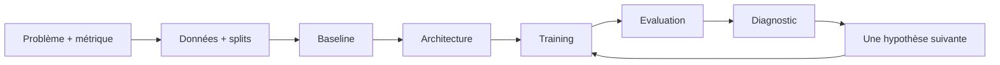

# Concevoir et entraîner un réseau de neurones

<span class="badge-expert">Expert</span>

La conception d'un réseau de neurones est une démarche expérimentale. Cette page évite les anciennes règles du type « batch 32 est le meilleur compromis », « 2-3 couches » ou « dropout 0.3 par défaut » : ces valeurs dépendent des données, de l'architecture, du matériel et de l'objectif.

---

## Workflow


```mermaid
graph LR
    P["Problème + métrique"] --> D["Données + splits"]
    D --> B["Baseline"]
    B --> A["Architecture"]
    A --> T["Training"]
    T --> E["Evaluation"]
    E --> X["Diagnostic"]
    X --> H["Une hypothèse suivante"]
    H --> T
```

Chaque itération doit pouvoir être reproduite depuis une configuration versionnée.

---

## 1. Définir le problème

Documentez :

- type de tâche ;
- variable cible ;
- population ;
- métrique principale et métriques de garde-fou ;
- coût des faux positifs/négatifs si pertinent ;
- contraintes de latence/mémoire ;
- disponibilité du ground truth.

Une accuracy élevée peut être inutile sur une classe très déséquilibrée. Choisissez les métriques avant d'optimiser le modèle.

---

## 2. Séparer les données

Les splits doivent refléter le mode réel de généralisation :

- aléatoire si les observations sont réellement iid ;
- temporel si le futur doit être prédit à partir du passé ;
- groupé si plusieurs lignes appartiennent au même individu/objet ;
- stratifié lorsque la distribution de classes le justifie.

Le test final reste hors de la boucle de tuning.

```python
X_train, X_test, y_train, y_test = train_test_split(
    X,
    y,
    test_size=test_fraction,
    random_state=seed,
    stratify=y if stratification_is_valid else None,
)
```

`test_fraction` et `seed` doivent être définis dans la configuration du projet, pas copiés comme constantes universelles.

---

## 3. Préprocessing sans fuite

Apprenez les transformations uniquement sur le train :

```python
scaler.fit(X_train)
X_train_scaled = scaler.transform(X_train)
X_val_scaled = scaler.transform(X_val)
X_test_scaled = scaler.transform(X_test)
```

Mais la fuite peut aussi venir :

- d'une feature calculée avec des données futures ;
- d'un agrégat global ;
- d'une sélection de features faite avec le test ;
- d'une normalisation préalable au split.

Demandez une revue de provenance des features, pas seulement du code de preprocessing.

---

## 4. Baseline avant deep learning

Comparez le réseau à une baseline raisonnable :

- heuristique métier ;
- régression/logistic regression ;
- arbre/boosting pour du tabulaire ;
- modèle pré-entraîné simple selon le domaine.

Le deep learning doit justifier sa complexité par un gain mesuré ou une capacité que la baseline ne peut pas fournir.

---

## 5. Architecture : partir du besoin

Évitez les règles « entonnoir obligatoire » ou nombres de couches fixes.

Décidez selon :

- nature des données ;
- invariances connues ;
- taille/qualité du dataset ;
- contrainte de calcul ;
- besoin de pré-entraînement ;
- target runtime.

Un MLP, CNN, Transformer ou modèle pré-entraîné est un choix d'hypothèse, pas une progression automatique de complexité.

---

## 6. Hyperparamètres

Versionnez les paramètres :

```yaml
seed: 42
optimizer: adamw
learning_rate: 0.0003
batch_size: 64
epochs: 50
```

Ces valeurs sont des **exemples de configuration**, pas des recommandations universelles.

Pour chaque tuning :

1. définir l'espace de recherche ;
2. utiliser uniquement train/validation ;
3. conserver chaque run ;
4. comparer au protocole identique ;
5. ne regarder le test final qu'à la fin.

---

## 7. Learning rate

Le learning rate est important mais ne possède pas de valeur universelle.

Utilisez :

- valeurs recommandées par l'architecture/optimizer comme point de départ ;
- scheduler ou warmup si le modèle le nécessite ;
- courbes train/validation ;
- recherche contrôlée.

Un run qui diverge, stagne ou sur-apprend fournit un diagnostic ; ne changez pas simultanément cinq hyperparamètres.

---

## 8. Batch size

Le batch size dépend de :

- mémoire du matériel ;
- architecture ;
- stabilité de l'optimisation ;
- throughput ;
- stratégie distributed ;
- batch effectif avec gradient accumulation.

Mesurez throughput et qualité. « 32 » n'est pas une règle générale.

---

## 9. Early stopping et checkpointing

Sauvegardez le meilleur checkpoint selon une métrique de validation adaptée.

```python
from keras.callbacks import EarlyStopping, ModelCheckpoint

callbacks = [
    ModelCheckpoint("best.keras", monitor="val_loss", save_best_only=True),
    EarlyStopping(monitor="val_loss", patience=patience, restore_best_weights=True),
]
```

`patience` doit être choisi selon la dynamique du run.

---

Avec Keras 3, sauvegardez un modèle rechargeable avec `model.save("modele.keras")` ; utilisez `model.export(...)` pour un artefact de serving. Une sauvegarde des seuls poids n’inclut pas tout l’état nécessaire à la reprise d’entraînement. Vérifiez aussi optimizer, scheduler et RNG selon le framework. [Export Keras](https://keras.io/api/models/model_saving_apis/export/), revérifié le 3 octobre 2026.

## 10. Diagnostiquer

| Symptôme | Hypothèses à tester |
|---|---|
| train mauvais + val mauvais | capacité, optimisation, données, labels |
| train bon + val mauvais | overfit, shift, leakage inverse, régularisation |
| métriques instables | split trop petit, seed, learning rate, données bruitées |
| score très élevé inattendu | leakage, doublons, proxy de target |

Ne concluez pas uniquement depuis la loss globale : inspectez les erreurs par segments/catégories.

---

## 11. Reproductibilité

Conservez :

```text
commit
config
seed
dataset version
framework/runtime
hardware si pertinent
metrics
checkpoint
logs
```

La reproductibilité parfaite sur GPU distribué n'est pas toujours garantie, mais le protocole doit permettre d'expliquer le run.

---

## 12. Workflow Claude Code

```text
Lis le training pipeline et la dernière config.
Exécute un smoke run court.
Vérifie splits, leakage évident et métriques.
Propose UNE hypothèse d'amélioration et son critère de succès.
Modifie uniquement ce qui teste cette hypothèse.
Relance le même protocole et compare au baseline.
```

Pour un tuning massif, utilisez le scheduler/outil d'expérimentation du projet ; Claude peut préparer et analyser les runs mais ne doit pas remplacer l'orchestrateur de jobs.

---

## Sources

- [PyTorch — recipes/tutorials](https://pytorch.org/tutorials/) — vérifier la version utilisée
- [TensorFlow — guide](https://www.tensorflow.org/guide) — vérifier la version utilisée
- [Keras — guides](https://keras.io/guides/) — vérifier la version utilisée

## Prochaine étape

Poursuivez avec **[Optimisation et Performance](optimisation-performance.md)**, la page suivante dans le menu.
