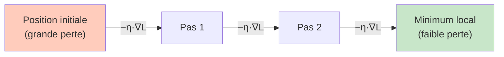
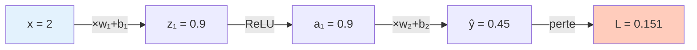

# Fondations Mathématiques du Deep Learning

<span class="badge-beginner">Débutant</span> <span class="badge-intermediate">Intermédiaire</span>

Cette page pose les bases mathématiques indispensables pour comprendre le Deep Learning : probabilités, calcul vectoriel, produits matriciels, gradients et dérivées partielles.

**Objectif** : te permettre de lire une formule de réseau de neurones, de refaire les calculs à la main, de comprendre **pourquoi** chaque règle fonctionne, puis de vérifier le résultat avec ton IDE.

Pas besoin d'un niveau universitaire en mathématiques. Tout est introduit depuis zéro, avec des analogies, des démonstrations commentées et des exemples numériques concrets.

---

## Pourquoi ces maths sont essentielles

Un réseau de neurones apprend en ajustant ses paramètres pour minimiser une erreur. Cette idée repose sur trois piliers :

- les **probabilités** (incertitude, classification, vraisemblance) ;
- l'**algèbre linéaire** (vecteurs, matrices, transformations) ;
- l'**analyse** (dérivées, gradients, optimisation).

!!! info "Ce que tu sauras faire à la fin"
    - Calculer la prédiction d'un neurone à la main
    - Calculer une perte (cross-entropy, erreur quadratique)
    - Calculer les gradients et mettre à jour les poids
    - Reconnaître les notations mathématiques utilisées dans les papers et librairies

---

## Notations à connaître avant de calculer

Avant de lire une formule, il faut connaître le dictionnaire de symboles. Voici les notations du Deep Learning.

| Symbole | Signification | Lecture à voix haute | Exemple |
|---|---|---|---|
| $x$ | vecteur d'entrée (features) | "x" | $x = [x_1, x_2, x_3]^T$ |
| $x_i$ | $i$-ème composante de $x$ | "x indice i" | $x_2 =$ 2ème feature |
| $W$ | matrice de poids | "W" | $W \in \mathbb{R}^{m \times n}$ |
| $W_{ij}$ | poids de la colonne $j$ vers la ligne $i$ | "W i j" | connexion j→i |
| $b$ | biais | "b" | $b \in \mathbb{R}^{m}$ |
| $z$ | pré-activation | "z" | $z = Wx + b$ |
| $\hat{y}$ | prédiction du modèle | "y chapeau" | probabilité ou valeur |
| $y$ | vraie valeur cible | "y" | label réel |
| $L$ | fonction de perte | "L" | erreur à minimiser |
| $\nabla L$ | gradient de la perte | "nabla L" | direction de mise à jour |
| $\mathbb{R}^n$ | espace de vecteurs à $n$ dimensions réelles | "R n" | $[2.1, -0.5]^T \in \mathbb{R}^2$ |
| $^T$ | transposée (lignes↔colonnes) | "transposé" | $[a,b]^T$ = colonne |
| $\sum$ | somme sur un ensemble | "sigma" | $\sum_{i=1}^{3} i = 6$ |

!!! tip "Transposée : pourquoi écrire $x^T$ ?"
    Par convention, un vecteur $x$ est une **colonne** (vertical). Écrire $[x_1, x_2, x_3]^T$ signifie : "prends la liste horizontale et redresse-la en colonne". Cela permet les multiplications matricielles.

---

## Partie 1 — Probabilités

### 1.1 Qu'est-ce qu'une probabilité ?

Une probabilité est un nombre entre 0 et 1 qui mesure la certitude d'un événement.

- $P = 0$ : impossible
- $P = 1$ : certain
- $P = 0.7$ : 70 chances sur 100

**Règle fondamentale** : la somme des probabilités de tous les événements possibles vaut 1.

$$\sum_{i} P(E_i) = 1$$

Exemple : une image peut être un "chat" ($P = 0.8$) ou un "chien" ($P = 0.2$). Total $= 1$.

### 1.2 Probabilité conditionnelle

$P(A \mid B)$ se lit "probabilité de A sachant que B est vrai".

**Définition** :

$$P(A \mid B) = \frac{P(A \cap B)}{P(B)}$$

$P(A \cap B)$ est la probabilité que A et B arrivent ensemble. On la divise par $P(B)$ pour restreindre l'univers à "B est déjà vrai".

**Exemple concret** :

- $P(\text{mail est spam}) = 0.3$
- $P(\text{mail contient "argent"} \mid \text{spam}) = 0.8$
- $P(\text{mail contient "argent"}) = 0.35$

$$P(\text{spam} \mid \text{"argent"}) = \frac{0.8 \times 0.3}{0.35} \approx 0.69$$

Ce calcul, c'est Bayes en action (cf. section suivante).

### 1.3 Théorème de Bayes — Démonstration complète

Le théorème de Bayes est le pont entre ce qu'on observe ($x$) et ce qu'on veut prédire ($y$).

**Théorème** :

$$P(y \mid x) = \frac{P(x \mid y) \cdot P(y)}{P(x)}$$

**Démonstration** :

On part de la définition de la probabilité conditionnelle appliquée deux fois :

$$P(y \mid x) = \frac{P(y \cap x)}{P(x)} \quad \text{(définition 1)}$$

$$P(x \mid y) = \frac{P(x \cap y)}{P(y)} \quad \text{(définition 2)}$$

Or $P(y \cap x) = P(x \cap y)$ (l'intersection est symétrique). On isole ce terme depuis la définition 2 :

$$P(x \cap y) = P(x \mid y) \cdot P(y)$$

On substitue dans la définition 1 :

$$\boxed{P(y \mid x) = \frac{P(x \mid y) \cdot P(y)}{P(x)}}$$

**Ce que chaque terme signifie** :

| Terme | Nom | Sens |
|---|---|---|
| $P(y \mid x)$ | **Postérieur** | Ce qu'on veut : probabilité de la classe après avoir vu $x$ |
| $P(x \mid y)$ | **Vraisemblance** | À quel point cette entrée est typique de la classe $y$ |
| $P(y)$ | **Prior** | Fréquence naturelle de la classe (avant de voir les données) |
| $P(x)$ | **Evidence** | Constante de normalisation |

!!! example "Application en Deep Learning"
    Quand un réseau de neurones prédit la classe d'une image, il approxime $P(y \mid x)$ implicitement. La perte cross-entropy l'y entraîne directement.

### 1.4 Espérance et variance

#### Espérance $\mathbb{E}[X]$ — Qu'est-ce qu'une moyenne pondérée ?

**D'abord : la moyenne ordinaire.**

Si tu as les notes $[8, 12, 16]$ sur 20, la moyenne est :

$$\text{moyenne} = \frac{8 + 12 + 16}{3} = 12$$

Chaque note compte autant. Chacune a un poids de $\frac{1}{3}$, soit environ 33%.

**Maintenant : la moyenne pondérée.**

Si les matières n'ont pas le même coefficient (poids), on multiplie chaque note par son importance **avant** de sommer. Exemple avec coefficients 1, 2, 3 :

$$\text{moy. pondérée} = \frac{8 \times 1\ +\ 12 \times 2\ +\ 16 \times 3}{1 + 2 + 3} = \frac{8 + 24 + 48}{6} = \frac{80}{6} \approx 13.3$$

La note 16, plus importante (coeff 3), tire la moyenne vers le haut par rapport à la moyenne ordinaire (12).

**L'espérance, c'est exactement ce mécanisme** : on fait la moyenne pondérée de toutes les valeurs possibles d'une variable, où le poids de chaque valeur est sa probabilité d'apparaître.

$$\mathbb{E}[X] = \sum_{i} \underbrace{x_i}_{\text{valeur}} \times \underbrace{P(X = x_i)}_{\text{poids = probabilité}}$$

!!! tip "Lecture de la formule"
    Lis-la mot à mot : « pour chaque valeur possible $x_i$, multiplie-la par la probabilité qu'elle arrive, puis additionne tout ». Le résultat est la valeur **qu'on s'attend à obtenir en moyenne** sur de très nombreuses répétitions.

**Exemple équiprobable** : lancer un dé à 6 faces. Chaque face a une probabilité $\frac{1}{6}$.

$$\mathbb{E}[X] = 1 \times \frac{1}{6} + 2 \times \frac{1}{6} + 3 \times \frac{1}{6} + 4 \times \frac{1}{6} + 5 \times \frac{1}{6} + 6 \times \frac{1}{6} = \frac{1+2+3+4+5+6}{6} = \frac{21}{6} = 3.5$$

On ne lancera jamais un dé et on obtiendra 3.5 — ce n'est pas une valeur possible. Mais sur 1 000 lancers, la moyenne des résultats s'approchera de 3.5.

**Exemple non uniforme** : une pièce truquée donne Pile 80% du temps ($x = 1$) et Face 20% ($x = 0$) :

$$\mathbb{E}[X] = 1 \times 0.8 + 0 \times 0.2 = 0.8$$

La probabilité plus haute pour Pile fait peser cette valeur davantage dans la moyenne — c'est le principe du pondéré.

#### Variance $\mathrm{Var}(X)$ — Mesurer la dispersion

**Intuition : deux élèves, même moyenne, comportements très différents.**

- Élève A : notes $[10, 10, 10, 10]$ — toujours régulier.
- Élève B : notes $[2, 4, 18, 16]$ — très irrégulier.

Les deux ont une **moyenne de 10**. Pourtant ils sont très différents. La variance capture cette différence en mesurant à quelle distance les valeurs s'éloignent de la moyenne.

**Étape 1 : calculer les écarts à la moyenne.**

Pour l'élève B ($\mu = 10$) :

$$\text{écarts} = [2-10,\ 4-10,\ 18-10,\ 16-10] = [-8,\ -6,\ +8,\ +6]$$

**Étape 2 : problème — les écarts s'annulent.**

$$\text{somme des écarts} = -8 - 6 + 8 + 6 = 0$$

Si on fait la moyenne brute des écarts, on obtient 0. Inutile.

**Étape 3 : solution — mettre les écarts au carré.**

Le carré rend tout positif, les grands écarts sont amplifiés :

$$\text{écarts}^2 = [(-8)^2,\ (-6)^2,\ 8^2,\ 6^2] = [64,\ 36,\ 64,\ 36]$$

$$\text{variance} = \frac{64 + 36 + 64 + 36}{4} = \frac{200}{4} = 50$$

L'élève A aurait une variance de $0$ (tous les écarts valent $0$, donc les carrés aussi).

!!! tip "Résumé intuitif"
    - Variance $= 0$ → toutes les valeurs sont identiques (aucune dispersion).
    - Variance élevée → les valeurs sont très étalées autour de la moyenne.
    - Variance faible → les valeurs se serrent autour de la moyenne.

**Formule générale** (pour une variable aléatoire) :

$$\mathrm{Var}(X) = \mathbb{E}\left[(X - \mu)^2\right]$$

avec $\mu = \mathbb{E}[X]$. C'est la même idée : on calcule $(X - \mu)^2$ pour chaque valeur, puis on fait la moyenne pondérée.

**Forme alternative utile en calcul** : $\mathrm{Var}(X) = \mathbb{E}[X^2] - \mu^2$

**Démonstration** :

$$\mathrm{Var}(X) = \mathbb{E}[(X - \mu)^2]$$

On développe le carré $(X - \mu)^2 = X^2 - 2\mu X + \mu^2$ :

$$= \mathbb{E}[X^2 - 2\mu X + \mu^2]$$

On distribue l'espérance (propriété de **linéarité** : $\mathbb{E}[A + B] = \mathbb{E}[A] + \mathbb{E}[B]$) :

$$= \mathbb{E}[X^2] - 2\mu\, \mathbb{E}[X] + \mathbb{E}[\mu^2]$$

$\mu$ est une constante, donc $\mathbb{E}[\mu^2] = \mu^2$ et $\mathbb{E}[X] = \mu$ par définition :

$$= \mathbb{E}[X^2] - 2\mu^2 + \mu^2 = \boxed{\mathbb{E}[X^2] - \mu^2}$$

**Note : écart-type vs variance.**

La variance est en unités au carré (notes², euros², etc.). Pour revenir aux unités d'origine, on prend la racine carrée :

$$\sigma = \sqrt{\mathrm{Var}(X)} \quad \text{(écart-type, même unité que les données)}$$

!!! info "Pourquoi en Deep Learning ?"
    Les features d'un dataset peuvent avoir des échelles très différentes : l'âge varie entre 0 et 100, un salaire entre 0 et 100 000. La feature au plus grand écart-type va dominer les calculs et rendre les gradients déséquilibrés. **Normaliser** (soustraire la moyenne, diviser par l'écart-type) ramène tout à une échelle comparable :

    ```
    Avant : âge ∈ [18, 65],    salaire ∈ [20 000, 80 000]
    Après : âge ∈ [-1.2, 1.4], salaire ∈ [-1.1, 1.3]
    ```

    C'est le principe de la **Batch Normalization** appliqué aux activations d'une couche.

### 1.5 Entropie de Shannon

#### Étape 1 — L'idée de surprise

**Commence par une question simple** : quelle information apporte un événement quand il se produit ?

- Tu apprends que le soleil s'est levé ce matin → **pas surprenant**, tu le savais déjà.
- Tu apprends qu'il neige en juillet à Paris → **très surprenant**, c'est une vraie information.

On formalise cette idée : la **surprise** d'un événement de probabilité $p$ est définie comme :

$$\text{surprise}(p) = -\log(p)$$

**Pourquoi $-\log(p)$ capture bien la surprise ?**

| $p$ | $-\log(p)$ | Interprétation |
|---|---|---|
| $p = 1.0$ (certain) | $-\log(1) = 0$ | Aucune surprise : on savait que ça arriverait |
| $p = 0.5$ (50/50) | $-\log(0.5) \approx 0.69$ | Surprise modérée |
| $p = 0.1$ (rare) | $-\log(0.1) \approx 2.3$ | Assez surprenant |
| $p = 0.01$ (très rare) | $-\log(0.01) \approx 4.6$ | Très surprenant |

La courbe de $-\log(p)$ monte très vite quand $p$ est petit : les événements rares apportent beaucoup d'information.

!!! tip "Pourquoi le $-$ ?"
    Pour $p \in (0, 1]$, $\log(p) \leq 0$ (le log d'un nombre entre 0 et 1 est négatif). Le $-$ devant rend la surprise **positive** — ce serait bizarre d'avoir une surprise négative.

#### Étape 2 — L'entropie : surprise moyenne

**L'entropie** est la **surprise moyenne** qu'on s'attend à recevoir si on tire un événement au hasard dans cette distribution. C'est l'espérance (moyenne pondérée) de la surprise :

$$H(p) = \mathbb{E}[\text{surprise}] = \sum_{i=1}^{n} p_i \cdot (-\log p_i) = -\sum_{i=1}^{n} p_i \log(p_i)$$

**Lecture mot à mot** : pour chaque issue $i$, multiplie sa surprise ($-\log p_i$) par sa probabilité d'arriver ($p_i$), puis additionne tout.

**Cas limites expliqués** :

- **Distribution certaine** $[1.0, 0.0]$ : on sait d'avance ce qui va arriver. La surprise attendue est 0 — on n'apprendra rien de nouveau.
- **Distribution uniforme** $[0.5, 0.5]$ : on ne sait pas du tout ce qui va arriver. L'incertitude est maximale, donc l'entropie est maximale.

**Calcul détaillé de chaque cas** :

| Distribution | Calcul détaillé | Valeur |
|---|---|---|
| $[1.0, 0.0]$ (certaine) | $-(1.0 \times \log 1.0 + 0.0 \times \log 0.0)$ → $-(0 + 0) $ | $H = 0$ |
| $[0.5, 0.5]$ (uniforme) | $-(0.5 \times \log 0.5 + 0.5 \times \log 0.5) = -(2 \times 0.5 \times (-0.693))$ | $H \approx 0.693$ |
| $[0.9, 0.1]$ (presque sûre) | $-(0.9 \times (-0.105) + 0.1 \times (-2.303)) = -(- 0.095 - 0.230)$ | $H \approx 0.325$ |

!!! note "Convention pour $0 \times \log 0$"
    $\log(0) = -\infty$, mais $\lim_{p \to 0} p \log p = 0$. Par convention, on pose $0 \times \log 0 = 0$ dans les calculs d'entropie.

!!! tip "Interprétation concrète en Deep Learning"
    L'entropie répond à la question : « Combien d'incertitude mon modèle a-t-il sur cette prédiction ? »

    - **Entropie élevée** sur la sortie → le modèle est très incertain, il n'a pas encore bien appris.
    - **Entropie faible** → le modèle est confiant sur sa prédiction.

    La **perte cross-entropy** entraîne le modèle à réduire l'entropie de ses prédictions en les rapprochant de la vraie distribution.

!!! warning "Convention log en Deep Learning"
    On utilise le logarithme naturel $\ln$ (base $e$) dans les formules. En pratique, `torch.log` (PyTorch) et `tf.math.log` (TensorFlow) utilisent la base $e$. Le choix de la base change l'unité (nats vs bits) mais pas le comportement relatif.

### 1.6 Cross-entropy — Perte de classification

La cross-entropy entre la vraie distribution $y$ et la distribution prédite $\hat{y}$ est :

$$L = -\sum_{i=1}^{n} y_i \log(\hat{y}_i)$$

**Pourquoi cette formule punit les mauvaises prédictions ?**

Si la vraie classe est $i=2$ (donc $y_2 = 1$, les autres $y_i = 0$), la formule se simplifie à :

$$L = -\log(\hat{y}_2)$$

Or $-\log(p)$ est une fonction décroissante : plus $\hat{y}_2$ est proche de 1 (bonne prédiction), plus $L$ est proche de 0. Plus $\hat{y}_2$ est proche de 0 (mauvaise prédiction), plus $L \to +\infty$.

| Prédiction $\hat{y}_2$ | $-\log(\hat{y}_2)$ | Interprétation |
|---|---|---|
| 0.99 | 0.01 | Excellente prédiction, faible pénalité |
| 0.5 | 0.69 | Incertain |
| 0.1 | 2.30 | Mauvaise prédiction, forte pénalité |
| 0.01 | 4.61 | Catastrophique |

### 1.7 Fonction Softmax : transformer un score en probabilité

Un réseau de neurones produit des scores bruts $z_i$ (appelés logits), qui peuvent être négatifs ou supérieurs à 1. Pour les convertir en probabilités valides, on utilise Softmax :

$$\text{Softmax}(z_i) = \frac{e^{z_i}}{\sum_{j=1}^{n} e^{z_j}}$$

**Preuve que Softmax produit bien des probabilités** :

1. **Positivité** : $e^{z_i} > 0$ pour tout $z_i$, donc $\text{Softmax}(z_i) > 0$. ✓
2. **Somme à 1** :

$$\sum_{i=1}^{n} \text{Softmax}(z_i) = \sum_{i=1}^{n} \frac{e^{z_i}}{\sum_{j} e^{z_j}} = \frac{\sum_{i} e^{z_i}}{\sum_{j} e^{z_j}} = 1 \checkmark$$

**Exemple numérique** avec 3 classes, scores $z = [2.0, 1.0, 0.1]$ :

$$e^{2.0} = 7.39,\quad e^{1.0} = 2.72,\quad e^{0.1} = 1.11 \quad\Rightarrow\quad \text{Somme} = 11.22$$

$$\hat{y} = \left[\frac{7.39}{11.22},\ \frac{2.72}{11.22},\ \frac{1.11}{11.22}\right] = [0.659,\ 0.242,\ 0.099]$$

La somme vaut bien $1$.

---

## Partie 2 — Algèbre Linéaire

### 2.1 Vecteurs : définition et intuition

Un **vecteur** est une liste ordonnée de nombres, qui peut représenter :

- un point dans l'espace ($[x, y, z]$)
- un objet avec plusieurs caractéristiques (ex. : $[\text{âge}, \text{salaire}, \text{taille}]$)
- les poids d'une couche de neurones

**Notation** : un vecteur de dimension $n$ s'écrit :

$$x = \begin{bmatrix} x_1 \\ x_2 \\ \vdots \\ x_n \end{bmatrix} \in \mathbb{R}^n$$

Chaque $x_i$ est un nombre réel. L'ensemble $\mathbb{R}^n$ est l'espace de tous les vecteurs à $n$ dimensions.

### 2.2 Opérations élémentaires sur les vecteurs

#### Addition de vecteurs

Deux vecteurs de même dimension s'additionnent composante par composante :

$$a + b = \begin{bmatrix} a_1 + b_1 \\ a_2 + b_2 \\ \vdots \end{bmatrix}$$

Exemple :

$$\begin{bmatrix} 1 \\ 3 \end{bmatrix} + \begin{bmatrix} 2 \\ -1 \end{bmatrix} = \begin{bmatrix} 3 \\ 2 \end{bmatrix}$$

**En Deep Learning** : ajouter le biais $b$ au résultat $Wx$ est une addition de vecteurs.

#### Multiplication par un scalaire

Multiplier un vecteur par un nombre $\lambda$ multiplie chaque composante :

$$\lambda \cdot x = \begin{bmatrix} \lambda x_1 \\ \lambda x_2 \\ \vdots \end{bmatrix}$$

**En Deep Learning** : le taux d'apprentissage $\eta$ multiplie le gradient vecteur lors de la mise à jour des poids.

### 2.3 Produit scalaire (dot product) — Définition et propriétés

**Définition** : le produit scalaire de deux vecteurs $a, b \in \mathbb{R}^n$ est :

$$a \cdot b = \sum_{i=1}^{n} a_i b_i = a_1 b_1 + a_2 b_2 + \cdots + a_n b_n$$

Le résultat est un **scalaire** (un seul nombre), pas un vecteur.

**Exemple** :

$$[2, -1, 3] \cdot [4, 0, 5] = 2 \times 4 + (-1) \times 0 + 3 \times 5 = 8 + 0 + 15 = 23$$

#### Interprétation géométrique et démonstration

Le produit scalaire est aussi égal à :

$$a \cdot b = \|a\| \cdot \|b\| \cdot \cos(\theta)$$

où $\theta$ est l'angle entre les deux vecteurs.

**Démonstration via la loi des cosinus** :

Considère un triangle de côtés $\|a\|$, $\|b\|$, $\|a - b\|$. La loi des cosinus donne :

$$\|a - b\|^2 = \|a\|^2 + \|b\|^2 - 2\|a\|\|b\|\cos\theta$$

Or on peut développer $\|a - b\|^2 = (a-b)\cdot(a-b)$ :

$$(a-b)\cdot(a-b) = a\cdot a - 2(a\cdot b) + b\cdot b = \|a\|^2 - 2(a\cdot b) + \|b\|^2$$

En égalisant les deux expressions :

$$\|a\|^2 - 2(a\cdot b) + \|b\|^2 = \|a\|^2 + \|b\|^2 - 2\|a\|\|b\|\cos\theta$$

On simplifie :

$$\boxed{a \cdot b = \|a\|\|b\|\cos\theta}$$

**Conséquences importantes** :

| Situation | $\theta$ | Produit scalaire |
|---|---|---|
| Vecteurs dans la même direction | $0°$ | $\|a\|\|b\|$ (maximum positif) |
| Vecteurs perpendiculaires | $90°$ | $0$ |
| Vecteurs opposés | $180°$ | $-\|a\|\|b\|$ (maximum négatif) |

!!! example "Application en Deep Learning : similarité cosinus"
    En NLP et en recherche de similarité (RAG, embeddings), on compare des vecteurs en calculant $\cos\theta = \frac{a \cdot b}{\|a\|\|b\|}$. Plus cette valeur est proche de 1, plus les textes sont sémantiquement proches.

### 2.4 Norme d'un vecteur — Démonstration

La **norme** est la longueur d'un vecteur. La plus utilisée est la norme $L_2$ (euclidienne) :

$$\|x\|_2 = \sqrt{\sum_{i=1}^{n} x_i^2} = \sqrt{x \cdot x}$$

**Démonstration** (théorème de Pythagore généralisé) :

- En 2D : $\|[a, b]\|_2 = \sqrt{a^2 + b^2}$ par Pythagore classique.
- En 3D : on applique Pythagore deux fois sur les projections : $\|[a, b, c]\|_2 = \sqrt{a^2 + b^2 + c^2}$.
- En $n$ dimensions : par récurrence sur les coordonnées, on obtient $\|x\|_2 = \sqrt{\sum_{i=1}^{n} x_i^2}$.

**Exemple** : $x = [3, 4]$, $\|x\|_2 = \sqrt{9 + 16} = \sqrt{25} = 5$.

Il existe aussi la norme $L_1$ :

$$\|x\|_1 = \sum_{i=1}^{n} |x_i|$$

| Norme | Formule | Usage en Deep Learning |
|---|---|---|
| $L_1$ | $\sum |x_i|$ | Régularisation Lasso, robuste aux outliers |
| $L_2$ | $\sqrt{\sum x_i^2}$ | Régularisation Ridge, gradient, similarité |
| $L_\infty$ | $\max_i |x_i|$ | Robustesse adversariale |

### 2.5 Matrices : définition et opérations

Une **matrice** $W \in \mathbb{R}^{m \times n}$ est un tableau de $m$ lignes et $n$ colonnes :

$$W = \begin{bmatrix}
w_{11} & w_{12} & \cdots & w_{1n} \\
w_{21} & w_{22} & \cdots & w_{2n} \\
\vdots  & \vdots  & \ddots & \vdots  \\
w_{m1} & w_{m2} & \cdots & w_{mn}
\end{bmatrix}$$

**Interprétation en Deep Learning** : dans une couche linéaire, $W$ encode toutes les connexions entre les $n$ entrées et les $m$ neurones de la couche.

### 2.6 Produit matrice-vecteur — Démonstration complète

Le produit $z = Wx$ avec $W \in \mathbb{R}^{m \times n}$ et $x \in \mathbb{R}^{n}$ produit $z \in \mathbb{R}^{m}$.

**Règle de calcul** : chaque composante $z_i$ est le produit scalaire de la $i$-ème ligne de $W$ avec $x$.

$$z_i = \sum_{j=1}^{n} W_{ij} \cdot x_j = W_{i,1} x_1 + W_{i,2} x_2 + \cdots + W_{i,n} x_n$$

**Exemple complet avec 3 entrées → 2 neurones** :

$$W = \begin{bmatrix}
1 & 2 & 0 \\
3 & 0 & -1
\end{bmatrix} \in \mathbb{R}^{2\times3},\quad
x = \begin{bmatrix}
5 \\ 6 \\ 2
\end{bmatrix} \in \mathbb{R}^3$$

Calcul ligne par ligne :

$$z_1 = 1 \times 5 + 2 \times 6 + 0 \times 2 = 5 + 12 + 0 = 17$$

$$z_2 = 3 \times 5 + 0 \times 6 + (-1) \times 2 = 15 + 0 - 2 = 13$$

Résultat : $z = \begin{bmatrix} 17 \\ 13 \end{bmatrix} \in \mathbb{R}^2$

On ajoute le biais $b = \begin{bmatrix} 1 \\ -1 \end{bmatrix}$ :

$$z + b = \begin{bmatrix} 18 \\ 12 \end{bmatrix}$$

**Ce que cela représente** : $W$ transforme un vecteur de 3 features en 2 neurones. C'est exactement ce que fait une couche `Dense(2)` avec 3 inputs.

### 2.7 Produit matriciel et règle des dimensions

Le produit $A \cdot B$ de deux matrices est défini si **le nombre de colonnes de $A$ égale le nombre de lignes de $B$**.

$$A \in \mathbb{R}^{m \times k},\quad B \in \mathbb{R}^{k \times n} \quad\Rightarrow\quad AB \in \mathbb{R}^{m \times n}$$

**Règle mnémotechnique** : $(m \times \underline{k})(\underline{k} \times n) \to (m \times n)$. Les dimensions intérieures doivent correspondre.

**Exemple** : propagation d'un mini-batch de 4 exemples.

$$W \in \mathbb{R}^{3 \times 2},\quad X \in \mathbb{R}^{2 \times 4} \quad\Rightarrow\quad WX \in \mathbb{R}^{3 \times 4}$$

4 exemples passent simultanément dans une couche de 3 neurones.

!!! warning "Non-commutativité : $AB \neq BA$ en général"
    Contrairement aux nombres, l'ordre compte pour les matrices. Intervertir les matrices produit (souvent) un résultat différent, voire un calcul invalide si les dimensions ne coïncident pas dans l'autre sens.

### 2.8 Transposée et propriété $(AB)^T = B^T A^T$

La transposée $W^T$ de $W \in \mathbb{R}^{m \times n}$ est la matrice $\in \mathbb{R}^{n \times m}$ obtenue en échangeant lignes et colonnes :

$$(W^T)_{ij} = W_{ji}$$

**Exemple** :

$$W = \begin{bmatrix} 1 & 2 & 3 \\ 4 & 5 & 6 \end{bmatrix} \in \mathbb{R}^{2 \times 3}
\quad\Rightarrow\quad
W^T = \begin{bmatrix} 1 & 4 \\ 2 & 5 \\ 3 & 6 \end{bmatrix} \in \mathbb{R}^{3 \times 2}$$

**Théorème** : $(AB)^T = B^T A^T$

**Démonstration** : l'élément en position $(i,j)$ de $(AB)^T$ est, par définition, l'élément $(j,i)$ de $AB$ :

$$[(AB)^T]_{ij} = [AB]_{ji} = \sum_k A_{jk} B_{ki}$$

Or $A_{jk} = [A^T]_{kj}$ et $B_{ki} = [B^T]_{ik}$, donc :

$$\sum_k A_{jk} B_{ki} = \sum_k [B^T]_{ik} [A^T]_{kj} = [B^T A^T]_{ij}$$

Ce qui démontre que $[(AB)^T]_{ij} = [B^T A^T]_{ij}$ pour tous $i,j$, donc $\boxed{(AB)^T = B^T A^T}$.

!!! info "Pourquoi c'est utile en rétropropagation"
    Pour remonter les gradients d'une couche vers la précédente, on calcule $W^T \delta$ (transposée des poids fois l'erreur propagée). Cette formule vient directement de ce théorème appliqué à la chain rule.

---

## Partie 3 — Analyse et Optimisation

### 3.1 Dérivée d'une fonction d'une variable

**Intuition** : la dérivée mesure le **taux de variation instantanée** d'une fonction. Si $f(x)$ représente la perte d'un modèle en fonction d'un seul poids $x$, la dérivée indique si augmenter $x$ fait monter ou descendre la perte.

**Définition formelle** :

$$f'(x) = \frac{df}{dx} = \lim_{h \to 0} \frac{f(x+h) - f(x)}{h}$$

**Interprétation géométrique** : c'est la pente de la tangente au graphe de $f$ en $x$.

#### Règles de dérivation fondamentales

| Fonction | Dérivée | Exemple d'usage |
|---|---|---|
| $f(x) = c$ (constante) | $0$ | Le biais seul (biais constant, gradient nul) |
| $f(x) = x^n$ | $nx^{n-1}$ | Perte quadratique $(x^2)' = 2x$ |
| $f(x) = e^x$ | $e^x$ | Softmax, exponentielle |
| $f(x) = \ln(x)$ | $\frac{1}{x}$ | Dérivée de la cross-entropy |
| $f(x) = ax + b$ | $a$ | Couche linéaire |

#### Règle de la chaîne (chain rule) — Démonstration

C'est la règle **la plus importante pour la rétropropagation**. Si $f = g(h(x))$, alors :

$$\frac{df}{dx} = \frac{dg}{dh} \cdot \frac{dh}{dx}$$

**Démonstration** :

Par définition des dérivées, si $u = h(x)$ :

$$\frac{dg}{dx} = \lim_{\Delta x \to 0} \frac{g(h(x+\Delta x)) - g(h(x))}{\Delta x}$$

On multiplie et divise par $h(x+\Delta x) - h(x) = \Delta u$ (en supposant $\Delta u \neq 0$) :

$$= \lim_{\Delta x \to 0} \frac{g(u + \Delta u) - g(u)}{\Delta u} \cdot \frac{\Delta u}{\Delta x}$$

Quand $\Delta x \to 0$, $\Delta u \to 0$ aussi (car $h$ est continue), donc chaque limite converge séparément :

$$\boxed{\frac{df}{dx} = \frac{dg}{du} \cdot \frac{du}{dx}}$$

**Exemple concret** : dériver $f(x) = (2x + 1)^2$.

On pose $u = h(x) = 2x+1$ et $g(u) = u^2$.

$$\frac{df}{dx} = \frac{d(u^2)}{du} \cdot \frac{d(2x+1)}{dx} = 2u \cdot 2 = 2(2x+1) \cdot 2 = 4(2x+1)$$

**Pourquoi c'est crucial en Deep Learning** : calculer le gradient de la perte par rapport aux poids de la première couche nécessite de composer des dizaines de dérivées via la chain rule. C'est exactement ce que fait la rétropropagation automatiquement.

### 3.2 Dérivée partielle et gradient

#### Dérivée partielle

Si la fonction $L$ dépend de plusieurs variables $w_1, w_2, \ldots, w_n$, la **dérivée partielle** $\frac{\partial L}{\partial w_j}$ mesure comment $L$ varie quand on ne bouge que $w_j$, les autres étant fixés.

**Règle de calcul** : on dérive $L$ par rapport à $w_j$ exactement comme une dérivée ordinaire, en traitant toutes les autres variables comme des constantes.

**Exemple** : $L(w_1, w_2) = w_1^2 + 3w_1 w_2 + w_2^2$

$$\frac{\partial L}{\partial w_1} = 2w_1 + 3w_2 \quad \text{($w_2$ traité comme constante)}$$

$$\frac{\partial L}{\partial w_2} = 3w_1 + 2w_2 \quad \text{($w_1$ traité comme constante)}$$

#### Gradient — Théorème de direction de montée maximale

Le **gradient** regroupe toutes les dérivées partielles dans un vecteur :

$$\nabla_w L = \begin{bmatrix}
\frac{\partial L}{\partial w_1} \\
\frac{\partial L}{\partial w_2} \\
\vdots \\
\frac{\partial L}{\partial w_n}
\end{bmatrix}$$

**Théorème** : le gradient pointe dans la direction de **plus forte croissance** de $L$.

**Démonstration** :

La variation de $L$ dans une direction quelconque $v$ (vecteur unitaire $\|v\|=1$) est la dérivée directionnelle :

$$D_v L = \nabla L \cdot v$$

En appliquant la relation produit scalaire–angle :

$$D_v L = \|\nabla L\| \cdot \|v\| \cdot \cos\theta = \|\nabla L\| \cos\theta$$

(car $\|v\| = 1$). Cette quantité est **maximale** quand $\cos\theta = 1$, soit $\theta = 0°$ : quand $v$ est exactement dans la même direction que $\nabla L$.

Donc le gradient est bien la direction de montée maximale. **Pour minimiser**, on part dans la direction opposée : $-\nabla L$.

### 3.3 Descente de gradient — Algorithme, intuition et convergence

#### L'algorithme

Mise à jour d'un paramètre à chaque itération :

$$w \leftarrow w - \eta \cdot \frac{\partial L}{\partial w}$$

Pour tous les paramètres simultanément (notation vectorielle) :

$$\theta \leftarrow \theta - \eta \cdot \nabla_\theta L$$

avec $\eta > 0$ le **taux d'apprentissage** (*learning rate*).

#### Intuition géométrique



Imagine une vallée (le minimum de perte) et une bille placée sur le flanc d'une montagne :

- La pente locale (gradient) indique quelle direction monte.
- La bille descend dans la direction opposée à la pente.
- Elle avance d'un pas proportionnel à $\eta$.

#### Rôle crucial du learning rate $\eta$

| Valeur de $\eta$ | Comportement | Problème |
|---|---|---|
| Trop grand | Pas énorme, saute par-dessus le minimum | Divergence : la perte augmente |
| Trop petit | Pas minuscule | Convergence très lente, coûteux |
| Bien choisi | Convergence progressive | Optimisation réussie |

!!! tip "Valeur de départ recommandée"
    Commencer avec $\eta = 0.001$ (valeur par défaut de l'optimiseur `Adam`). Diviser par 10 si le modèle n'apprend pas, multiplier par 10 si c'est trop lent.

#### Preuve que la descente de gradient réduit la perte

**Théorème** : pour $\eta$ suffisamment petit et $\nabla L \neq 0$, on a $L(w - \eta \nabla L) < L(w)$.

**Démonstration par développement de Taylor au premier ordre** :

L'approximation de Taylor dit que pour $\eta$ petit :

$$L(w - \eta \nabla L) \approx L(w) + \nabla L \cdot (-\eta \nabla L) + O(\eta^2)$$

Le terme $\nabla L \cdot (-\eta \nabla L)$ est le produit scalaire du gradient avec la direction de mise à jour :

$$\nabla L \cdot (-\eta \nabla L) = -\eta \|\nabla L\|^2$$

Donc :

$$L(w - \eta \nabla L) \approx L(w) - \eta \|\nabla L\|^2 + O(\eta^2)$$

Pour $\eta$ suffisamment petit, $O(\eta^2) \ll \eta \|\nabla L\|^2$, d'où :

$$L(w - \eta \nabla L) < L(w) \quad \text{si } \|\nabla L\|^2 > 0$$

La perte **diminue strictement** à chaque pas, tant qu'on n'est pas au minimum ($\nabla L = 0$).

### 3.4 Chain rule vectorielle : la rétropropagation expliquée

Dans un réseau de neurones, la perte $L$ dépend des poids de la dernière couche, qui dépendent des couches précédentes, etc. La chain rule s'applique en cascade.

Soit un réseau à deux couches (simplifié) :

$$z^{(1)} = W^{(1)} x + b^{(1)}, \quad a^{(1)} = f(z^{(1)}), \quad z^{(2)} = W^{(2)} a^{(1)} + b^{(2)}, \quad L = \text{perte}(z^{(2)}, y)$$

Gradient de $L$ par rapport à $W^{(1)}$ (chain rule vectorielle, de droite à gauche) :

$$\frac{\partial L}{\partial W^{(1)}} = \underbrace{\frac{\partial L}{\partial z^{(2)}}}_{\delta^{(2)}} \cdot \underbrace{\frac{\partial z^{(2)}}{\partial a^{(1)}}}_{W^{(2)}} \cdot \underbrace{\frac{\partial a^{(1)}}{\partial z^{(1)}}}_{f'(z^{(1)})} \cdot \underbrace{\frac{\partial z^{(1)}}{\partial W^{(1)}}}_{x^T}$$

Chaque terme est calculable avec les formules précédentes. On les calcule dans l'ordre inverse des couches (de la sortie vers l'entrée), d'où le nom **rétropropagation** (*backpropagation*).

---

## Partie 4 — Exemple guidé complet, étape par étape

On va suivre un mini-réseau de bout en bout, **uniquement avec des calculs à la main**.

**Architecture** : 1 neurone caché, activation ReLU, sortie linéaire, perte quadratique (MSE).

**Données** : $x = 2$, $y = 1$ (on prédit $1$ depuis l'entrée $2$).

**Paramètres initiaux** : $w_1 = 0.4$, $b_1 = 0.1$, $w_2 = 0.5$, $b_2 = 0$.

**Taux d'apprentissage** : $\eta = 0.1$.



### Étape 1 — Propagation avant (Forward pass)

**Couche 1** :

$$z_1 = w_1 \cdot x + b_1 = 0.4 \times 2 + 0.1 = 0.9$$

**Activation ReLU** : $\text{ReLU}(x) = \max(0, x)$

$$a_1 = \text{ReLU}(0.9) = 0.9 \quad (\text{positif, donc inchangé})$$

**Couche 2** (sortie linéaire) :

$$\hat{y} = w_2 \cdot a_1 + b_2 = 0.5 \times 0.9 + 0 = 0.45$$

**Perte** (MSE : $\frac{1}{2}(\hat{y}-y)^2$) :

$$L = \frac{1}{2}(0.45 - 1)^2 = \frac{1}{2}(-0.55)^2 = \frac{1}{2} \times 0.3025 = 0.151$$

### Étape 2 — Rétropropagation (Backward pass)

On calcule les gradients en appliquant la chain rule **de la sortie vers l'entrée**.

**Gradient de la perte par rapport à $\hat{y}$** (dérivée de $\frac{1}{2}(\hat{y}-y)^2$ par rapport à $\hat{y}$) :

$$\frac{\partial L}{\partial \hat{y}} = \hat{y} - y = 0.45 - 1 = -0.55$$

**Gradient par rapport à $w_2$** (chain rule : $\hat{y} = w_2 a_1$) :

$$\frac{\partial L}{\partial w_2} = \frac{\partial L}{\partial \hat{y}} \cdot \frac{\partial \hat{y}}{\partial w_2} = (-0.55) \times a_1 = (-0.55) \times 0.9 = -0.495$$

**Gradient par rapport à $b_2$** ($\frac{\partial \hat{y}}{\partial b_2} = 1$) :

$$\frac{\partial L}{\partial b_2} = \frac{\partial L}{\partial \hat{y}} \cdot 1 = -0.55$$

**Gradient remontant vers la couche 1** (signal propagé à travers $w_2$) :

$$\frac{\partial L}{\partial a_1} = \frac{\partial L}{\partial \hat{y}} \cdot w_2 = (-0.55) \times 0.5 = -0.275$$

**Gradient à travers ReLU** : la dérivée de ReLU est $1$ si l'entrée $> 0$, $0$ sinon.

$$\frac{\partial L}{\partial z_1} = \frac{\partial L}{\partial a_1} \cdot \underbrace{\mathbf{1}[z_1 > 0]}_{=1 \text{ car } z_1=0.9>0} = -0.275 \times 1 = -0.275$$

**Gradient par rapport à $w_1$** ($z_1 = w_1 x$, donc $\frac{\partial z_1}{\partial w_1} = x$) :

$$\frac{\partial L}{\partial w_1} = \frac{\partial L}{\partial z_1} \cdot x = -0.275 \times 2 = -0.55$$

**Gradient par rapport à $b_1$** ($\frac{\partial z_1}{\partial b_1} = 1$) :

$$\frac{\partial L}{\partial b_1} = \frac{\partial L}{\partial z_1} \cdot 1 = -0.275$$

### Étape 3 — Mise à jour des poids

$$w_1 \leftarrow 0.4 - 0.1 \times (-0.55) = 0.455$$

$$b_1 \leftarrow 0.1 - 0.1 \times (-0.275) = 0.1275$$

$$w_2 \leftarrow 0.5 - 0.1 \times (-0.495) = 0.5495$$

$$b_2 \leftarrow 0 - 0.1 \times (-0.55) = 0.055$$

Tous les poids ont augmenté car les gradients étaient négatifs (la prédiction $0.45$ était inférieure à la cible $1$, il fallait "pousser" les paramètres vers le haut).

### Vérification : la perte a-t-elle baissé ?

$$z_1' = 0.455 \times 2 + 0.1275 = 1.0375 \quad\Rightarrow\quad a_1' = 1.0375$$

$$\hat{y}' = 0.5495 \times 1.0375 + 0.055 = 0.625$$

$$L' = \frac{1}{2}(0.625 - 1)^2 = \frac{1}{2}(0.375)^2 = 0.0703$$

La perte est passée de $0.151$ à $0.070$ : **divisée par 2 en un seul pas de gradient**, conformément au théorème de convergence.

---

## Refaire ces calculs dans les IDE avec Copilot

=== "IntelliJ IDEA"
    1. Crée un fichier `test_gradients.py` dans ton projet Python.
    2. Demande à Copilot Chat : *"Implémente pas à pas le forward pass et le backward pass pour ce réseau à un neurone caché : w1=0.4, b1=0.1, w2=0.5, b2=0, x=2, y=1. Calcule la perte MSE et les gradients sans utiliser PyTorch autograd."*
    3. Compare les valeurs avec les calculs de cette page.
    4. Ensuite demande : *"Ajoute une version PyTorch avec `autograd` et vérifie que les gradients correspondent."*

=== "Visual Studio Code"
    1. Ouvre un notebook Jupyter (`Ctrl+Shift+P` → "New Jupyter Notebook").
    2. Dans la première cellule, demande à Copilot : *"Génère une cellule NumPy qui vérifie le produit matrice-vecteur, la norme L2 et une étape de descente de gradient pour l'exemple de cette page."*
    3. Ajoute une deuxième cellule : *"Trace la courbe de la perte en fonction du learning rate η entre 0.001 et 1 pour cet exemple."*
    4. Lance cellule par cellule.

!!! example "Objectif pratique"
    Faire tourner ces calculs dans un notebook avec des `print()` à chaque étape est la meilleure façon de s'assurer que la compréhension est solide avant d'utiliser PyTorch ou TensorFlow.

---

## Récapitulatif des théorèmes démontrés

| Théorème | Formule clé | Usage en Deep Learning |
|---|---|---|
| Bayes | $P(y\mid x) = \frac{P(x\mid y)P(y)}{P(x)}$ | Classification probabiliste |
| Variance (forme alternative) | $\mathrm{Var}(X) = \mathbb{E}[X^2] - \mu^2$ | Normalisation des données |
| Produit scalaire et angle | $a \cdot b = \|a\|\|b\|\cos\theta$ | Similarité cosinus |
| Softmax = probabilité valide | $\sum_i \text{Softmax}(z_i) = 1$ | Sortie de classification |
| Transposée d'un produit | $(AB)^T = B^T A^T$ | Rétropropagation couche→couche |
| Gradient = direction de montée | $D_v L = \|\nabla L\|\cos\theta$ | Justification de la descente de gradient |
| Descente réduit la perte | $L(w - \eta\nabla L) < L(w)$ | Convergence de l'entraînement |
| Chain rule | $\frac{df}{dx} = \frac{dg}{dh}\cdot\frac{dh}{dx}$ | Rétropropagation en cascade |

---

## Sources officielles pour approfondir

- [MIT OpenCourseWare — 18.06 Linear Algebra (Gilbert Strang)](https://ocw.mit.edu/courses/18-06-linear-algebra-spring-2010/) — Le cours d'algèbre linéaire de référence mondiale
- [MIT OpenCourseWare — 6.041SC Probabilistic Systems Analysis](https://ocw.mit.edu/courses/6-041sc-probabilistic-systems-analysis-and-applied-probability-fall-2013/) — Probabilités appliquées
- [Stanford CS229 — Lecture Notes (Supervised Learning, Probability, Optimization)](https://cs229.stanford.edu/materials.html) — Notes de cours de Andrew Ng
- [DeepLearning.AI — Mathematics for Machine Learning and Data Science](https://www.deeplearning.ai/courses/mathematics-for-machine-learning-and-data-science-specialization/) — Spécialisation complète en 3 cours
- [3Blue1Brown — Essence of Linear Algebra (YouTube)](https://www.youtube.com/playlist?list=PLZHQObOWTQDPD3MizzM2xVFitgF8hE_ab) — Visualisations géométriques animées (en anglais)
- [3Blue1Brown — Calculus series (YouTube)](https://www.youtube.com/playlist?list=PLZHQObOWTQDMsr9K-rj53DwVRMYO3t5Yr) — Intuitions sur les dérivées (en anglais)
- [NumPy — Référence officielle de l'algèbre linéaire](https://numpy.org/doc/stable/reference/routines.linalg.html)
- [PyTorch — Documentation officielle des tenseurs et autograd](https://pytorch.org/docs/stable/index.html)
- [TensorFlow — Documentation officielle (Tensor, GradientTape)](https://www.tensorflow.org/guide)
- [The Matrix Calculus You Need For Deep Learning (Parr & Howard)](https://explained.ai/matrix-calculus/) — Dérivées matricielles expliquées pour le DL

---

## Résumé

- Les **probabilités** (Bayes, entropie, cross-entropy) quantifient l'incertitude et guident le choix de la fonction de perte.
- Les **vecteurs et matrices** sont le langage des couches de neurones : tout calcul d'activation est un produit $Wx + b$.
- Le **gradient** pointe vers la montée, la descente de gradient vers la baisse — la preuve par Taylor garantit la convergence.
- La **chain rule** est le moteur de la rétropropagation : les gradients se multiplient de la sortie vers l'entrée.
- Refaire un mini-réseau à la main confirme la compréhension avant de déléguer à PyTorch/TensorFlow.

---

## Prochaine étape

**[Réseaux de neurones : fondamentaux](reseaux-neurones.md)** : passer des bases mathématiques au fonctionnement complet d'un réseau de neurones (neurones, activations, propagation avant et entraînement).

Concepts clés couverts :

- **Perceptron** — neurone artificiel et somme pondérée
- **Propagation avant** — calcul de sortie couche par couche
- **Fonctions d'activation** — non-linéarité et capacité de modélisation
- **Fonction de perte** — mesure d'erreur à minimiser
